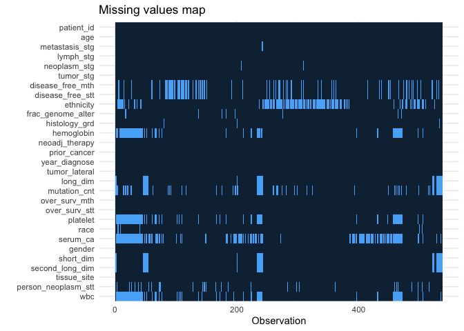
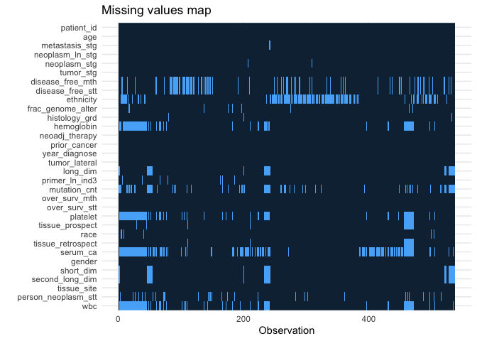
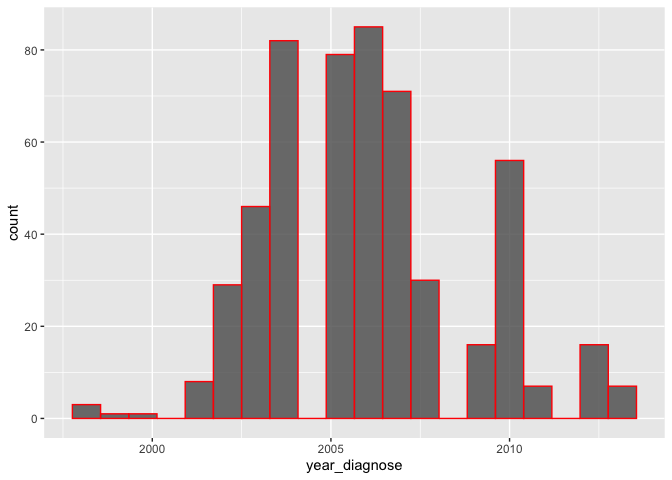
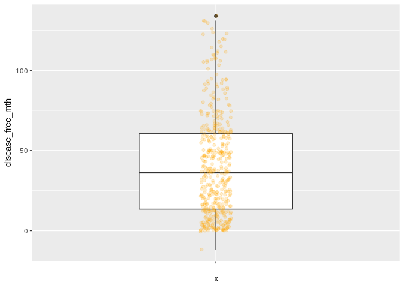
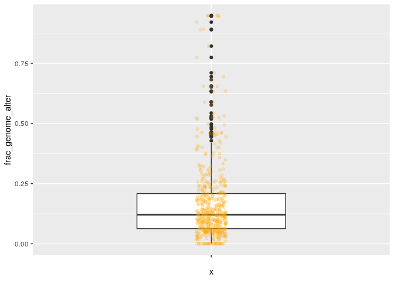
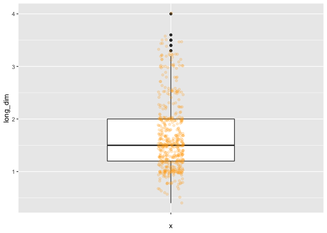
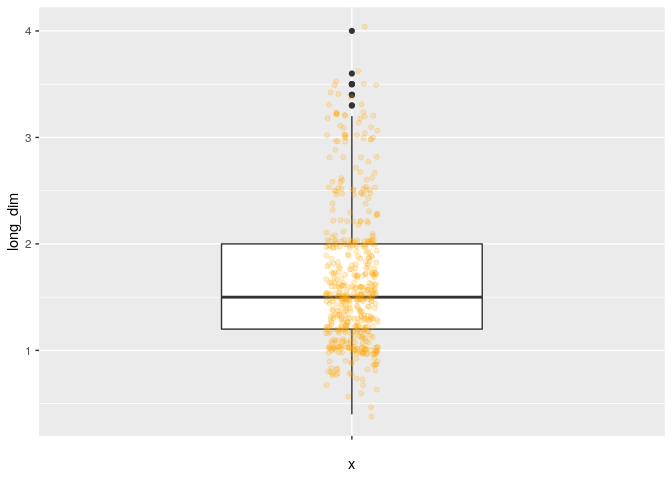
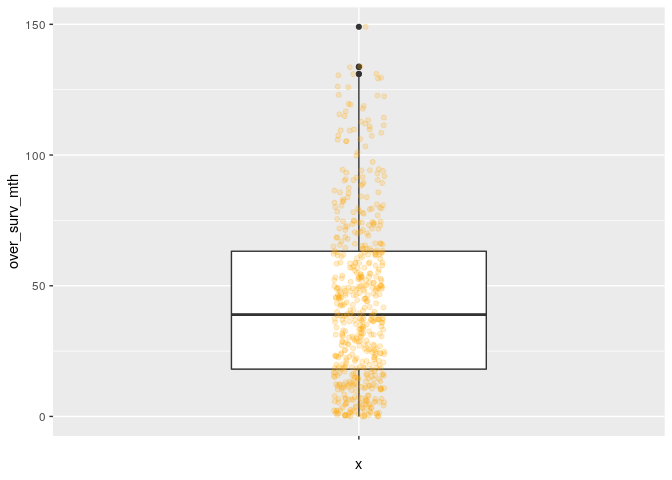
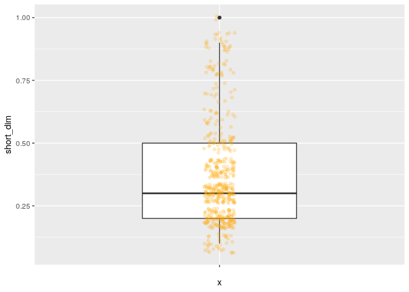
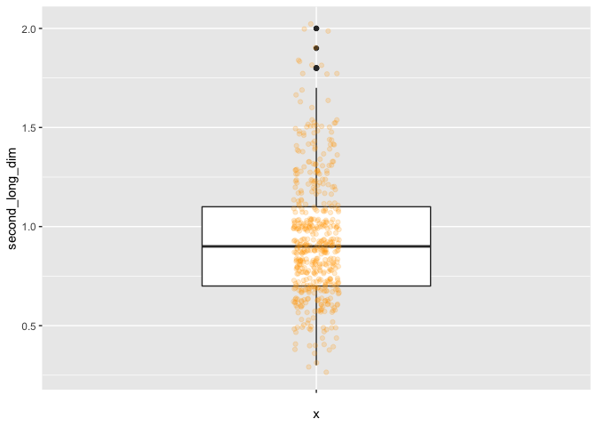

A Preprocessing analysis of clinical data of TCGA-KIRC patients
================

This project contains a pipeline for analysis of The Cancer Genome Atlas Kidney - Renal Clear Cell Carcinoma (TCGA-KIRC) clinical data, from [Genomic Data Commons Data Portal](https://portal.gdc.cancer.gov/exploration?filters=%7B%22op%22%3A%22and%22%2C%22content%22%3A%5B%7B%22op%22%3A%22in%22%2C%22content%22%3A%7B%22field%22%3A%22cases.project.project_id%22%2C%22value%22%3A%5B%22TCGA-KIRC%22%5D%7D%7D%5D%7D) and [cBioPortal](https://www.cbioportal.org/study/summary?id=kirp_tcga).

In this section, the initial preprocessing is applied to clean the data and arrange following the Tidyverse philosophy. Exploratory Data Analysis summarizes their main characteristics.

``` r
## This chunk automatically generates a text .R version of this script when running within knitr.
input  = knitr::current_input()  # filename of input document
output = paste(tools::file_path_sans_ext(input), 'R', sep = '.')
knitr::purl(input,output,documentation=2,quiet=T)
# Avoid duplicate label error of knitr::purl
options(knitr.duplicate.label = 'allow')
# Code to browse the markdown file with renderized images.
knitr::opts_chunk$set(
  fig.path = "figs/render-"
)
```

1. Data importing and visualizing
---------------------------------

``` r
kirc_clin_raw <- read_delim("data/kirc_tcga_clinical_data.tsv", "\t", 
                            escape_double = FALSE, 
                            trim_ws = TRUE)
```

2. Cleaning data
----------------

Select variables based on NA count (&gt; 50% complete is a good choice!). <!-- # TO DO @PATRICK: simplify code NA_sum? --> <!-- # kirc_clean <- kirc_clin_raw %>% --> <!-- #     summarise_all(~ sum(is.na(.)))  -->

``` r
NA_fifty <- dim(kirc_clin_raw)[1]/2

NA_sum <- colSums(is.na(kirc_clin_raw))
NA_sum <- as.data.frame(NA_sum)
NA_sum <- tibble::rownames_to_column(NA_sum, "variables")
NA_sum <- NA_sum %>%
     filter(NA_sum < NA_fifty)

kirc_clean <- kirc_clin_raw %>%
     select(one_of(NA_sum$variables))
```

Remove duplicate observations:

``` r
kirc_clean0 <- kirc_clean %>%
     distinct_at('Patient ID', .keep_all = TRUE)
```

Remove nuneric variables with unique observations:
<!-- # TO DO @PATRICK: function to select variables with unique observations? 
<!-- # kirc_cleanX <- kirc_clean1 %>% --> <!-- #     summarise_if(is.numeric, ~ n=unique(.)) -->

``` r
kirc_clean0 %>%
     select_if(is.numeric) %>%
     skim()
```

|                                                  |            |
|:-------------------------------------------------|:-----------|
| Name                                             | Piped data |
| Number of rows                                   | 537        |
| Number of columns                                | 12         |
| \_\_\_\_\_\_\_\_\_\_\_\_\_\_\_\_\_\_\_\_\_\_\_   |            |
| Column type frequency:                           |            |
| numeric                                          | 12         |
| \_\_\_\_\_\_\_\_\_\_\_\_\_\_\_\_\_\_\_\_\_\_\_\_ |            |
| Group variables                                  | None       |

**Variable type: numeric**

| skim\_variable                                                         |  n\_missing|  complete\_rate|     mean|      sd|       p0|      p25|      p50|      p75|     p100| hist  |
|:-----------------------------------------------------------------------|-----------:|---------------:|--------:|-------:|--------:|--------:|--------:|--------:|--------:|:------|
| Diagnosis Age                                                          |           0|            1.00|    60.59|   12.15|    26.00|    52.00|    61.00|    70.00|    90.00| ▁▅▇▆▂ |
| Last Alive Less Initial Pathologic Diagnosis Date Calculated Day Value |           0|            1.00|     0.00|    0.00|     0.00|     0.00|     0.00|     0.00|     0.00| ▁▁▇▁▁ |
| Disease Free (Months)                                                  |          99|            0.82|    40.24|   31.66|   -11.79|    13.43|    36.20|    60.51|   133.84| ▇▇▇▂▂ |
| Fraction Genome Altered                                                |           9|            0.98|     0.17|    0.17|     0.00|     0.06|     0.12|     0.21|     0.95| ▇▂▁▁▁ |
| Year Cancer Initial Diagnosis                                          |           0|            1.00|  2006.02|    2.76|  1998.00|  2004.00|  2006.00|  2007.00|  2013.00| ▁▆▇▃▁ |
| Longest Dimension                                                      |          35|            0.93|     1.66|    0.66|     0.40|     1.20|     1.50|     2.00|     4.00| ▃▇▃▂▁ |
| Mutation Count                                                         |          86|            0.84|    73.85|  127.76|     1.00|    34.00|    48.00|    65.50|  1392.00| ▇▁▁▁▁ |
| Overall Survival (Months)                                              |           0|            1.00|    44.26|   32.25|     0.00|    18.10|    38.96|    63.21|   149.05| ▇▇▃▂▁ |
| Number of Samples Per Patient                                          |           0|            1.00|     1.00|    0.04|     1.00|     1.00|     1.00|     1.00|     2.00| ▇▁▁▁▁ |
| Sample type id                                                         |           0|            1.00|     1.00|    0.00|     1.00|     1.00|     1.00|     1.00|     1.00| ▁▁▇▁▁ |
| Shortest Dimension                                                     |          35|            0.93|     0.38|    0.21|     0.10|     0.20|     0.30|     0.50|     1.00| ▆▇▂▁▁ |
| Specimen Second Longest Dimension                                      |          35|            0.93|     0.94|    0.31|     0.30|     0.70|     0.90|     1.10|     2.00| ▃▇▆▂▁ |

``` r
kirc_clean1 <-  kirc_clean0  %>%
     select(!c('Last Alive Less Initial Pathologic Diagnosis Date Calculated Day Value', 
               'Number of Samples Per Patient', 
               'Sample type id'))
```

Remove character variables with unique observations:

``` r
kirc_clean1 %>%
  select_if(is.character) %>%
  skim()
```

|                                                  |            |
|:-------------------------------------------------|:-----------|
| Name                                             | Piped data |
| Number of rows                                   | 537        |
| Number of columns                                | 43         |
| \_\_\_\_\_\_\_\_\_\_\_\_\_\_\_\_\_\_\_\_\_\_\_   |            |
| Column type frequency:                           |            |
| character                                        | 43         |
| \_\_\_\_\_\_\_\_\_\_\_\_\_\_\_\_\_\_\_\_\_\_\_\_ |            |
| Group variables                                  | None       |

**Variable type: character**

| skim\_variable                                                                              |  n\_missing|  complete\_rate|  min|  max|  empty|  n\_unique|  whitespace|
|:--------------------------------------------------------------------------------------------|-----------:|---------------:|----:|----:|------:|----------:|-----------:|
| Study ID                                                                                    |           0|            1.00|    9|    9|      0|          1|           0|
| Patient ID                                                                                  |           0|            1.00|   12|   12|      0|        537|           0|
| Sample ID                                                                                   |           0|            1.00|   15|   15|      0|        537|           0|
| American Joint Committee on Cancer Metastasis Stage Code                                    |           2|            1.00|    2|    2|      0|          3|           0|
| Neoplasm Disease Lymph Node Stage American Joint Committee on Cancer Code                   |           0|            1.00|    2|    2|      0|          3|           0|
| Neoplasm Disease Stage American Joint Committee on Cancer Code                              |           3|            0.99|    7|    9|      0|          4|           0|
| American Joint Committee on Cancer Tumor Stage Code                                         |           0|            1.00|    2|    3|      0|         11|           0|
| Cancer Type                                                                                 |           0|            1.00|   20|   20|      0|          1|           0|
| Cancer Type Detailed                                                                        |           0|            1.00|   26|   26|      0|          1|           0|
| Disease Free Status                                                                         |          99|            0.82|   11|   19|      0|          2|           0|
| Ethnicity Category                                                                          |         152|            0.72|   18|   22|      0|          2|           0|
| Form completion date                                                                        |           0|            1.00|    6|   10|      0|        114|           0|
| Neoplasm Histologic Grade                                                                   |           3|            0.99|    2|    2|      0|          5|           0|
| Hemoglobin level                                                                            |          83|            0.85|    3|    8|      0|          3|           0|
| Neoplasm Histologic Type Name                                                               |           0|            1.00|   33|   33|      0|          1|           0|
| Neoadjuvant Therapy Type Administered Prior To Resection Text                               |           0|            1.00|    2|    3|      0|          2|           0|
| Prior Cancer Diagnosis Occurence                                                            |           0|            1.00|    2|   48|      0|          4|           0|
| ICD-10 Classification                                                                       |           0|            1.00|    5|    5|      0|          1|           0|
| International Classification of Diseases for Oncology, Third Edition ICD-O-3 Histology Code |           0|            1.00|    6|    6|      0|          2|           0|
| International Classification of Diseases for Oncology, Third Edition ICD-O-3 Site Code      |           0|            1.00|    5|    5|      0|          1|           0|
| Informed consent verified                                                                   |           0|            1.00|    3|    3|      0|          1|           0|
| Is FFPE                                                                                     |           0|            1.00|    2|    2|      0|          1|           0|
| Primary Tumor Laterality                                                                    |           0|            1.00|    4|    9|      0|          3|           0|
| Primary Lymph Node Presentation Assessment Ind-3                                            |           7|            0.99|    2|    3|      0|          2|           0|
| Oncotree Code                                                                               |           0|            1.00|    5|    5|      0|          1|           0|
| Overall Survival Status                                                                     |           0|            1.00|    6|    8|      0|          2|           0|
| Other Patient ID                                                                            |           0|            1.00|   36|   36|      0|        537|           0|
| Other Sample ID                                                                             |           0|            1.00|   36|   36|      0|        537|           0|
| Pathology Report File Name                                                                  |           0|            1.00|   53|   53|      0|        537|           0|
| Pathology report uuid                                                                       |           0|            1.00|   36|   36|      0|        537|           0|
| Platelet count                                                                              |          93|            0.83|    3|    8|      0|          3|           0|
| Tissue Prospective Collection Indicator                                                     |          20|            0.96|    2|    3|      0|          2|           0|
| Race Category                                                                               |           7|            0.99|    5|   25|      0|          3|           0|
| Tissue Retrospective Collection Indicator                                                   |          18|            0.97|    2|    3|      0|          2|           0|
| Sample Type                                                                                 |           0|            1.00|    7|    7|      0|          1|           0|
| Serum calcium level                                                                         |         172|            0.68|    3|    8|      0|          3|           0|
| Sex                                                                                         |           0|            1.00|    4|    6|      0|          3|           0|
| Tumor Tissue Site                                                                           |           0|            1.00|    6|    6|      0|          1|           0|
| Tissue Source Site                                                                          |           0|            1.00|    2|    2|      0|         20|           0|
| Person Neoplasm Status                                                                      |          35|            0.93|   10|   10|      0|          2|           0|
| Vial number                                                                                 |           0|            1.00|    1|    1|      0|          2|           0|
| Patient's Vital Status                                                                      |           3|            0.99|    4|    5|      0|          2|           0|
| WBC                                                                                         |          96|            0.82|    3|    8|      0|          3|           0|

``` r
kirc_clean2 <- kirc_clean1  %>%
     select(!c('Study ID', 'Cancer Type', 'Cancer Type Detailed', 
               'Neoplasm Histologic Type Name', 'ICD-10 Classification', 
               'International Classification of Diseases for Oncology, Third Edition ICD-O-3 Site Code', 
               'Informed consent verified', 'Is FFPE', 'Oncotree Code', 'Sample Type', 'Tumor Tissue Site'))
```

Remove character variables with similar information - check each one!

``` r
# kirc_clean2 %>%
#      select_if(is.character) %>%
#      skim()

table(kirc_clean2$`Overall Survival Status`, exclude = NULL)
```

    ## 
    ## DECEASED   LIVING 
    ##      177      360

``` r
table(kirc_clean2$`Patient's Vital Status`, exclude = NULL)
```

    ## 
    ## Alive  Dead  <NA> 
    ##   360   174     3

``` r
kirc_clean3 <- kirc_clean2  %>%
     select(!c('Sample ID', 'Other Patient ID', 'Other Sample ID', 'Pathology Report File Name', 'Pathology report uuid', "Patient's Vital Status"))
```

Remove other variables not directly related to patient - check each one!

``` r
# kirc_clean3 %>%
#      select_if(is.character) %>%
#      skim()

kirc_clean4 <- kirc_clean3  %>%
     select(!c('Form completion date','International Classification of Diseases for Oncology, Third Edition ICD-O-3 Histology Code','Vial number'))
```

3. Changing variables names
---------------------------

Using snake\_style

``` r
kirc_clean4 <- kirc_clean4 %>%
     rename(patient_id = 'Patient ID',
            age = 'Diagnosis Age',
            metastasis_stg = 'American Joint Committee on Cancer Metastasis Stage Code',
            neoplasm_ln_stg = 'Neoplasm Disease Lymph Node Stage American Joint Committee on Cancer Code',
            neoplasm_stg = 'Neoplasm Disease Stage American Joint Committee on Cancer Code',
            tumor_stg = 'American Joint Committee on Cancer Tumor Stage Code',
            disease_free_mth = 'Disease Free (Months)',
            disease_free_stt = 'Disease Free Status',
            ethnicity = 'Ethnicity Category', 
            frac_genome_alter = 'Fraction Genome Altered',
            histology_grd = 'Neoplasm Histologic Grade',
            hemoglobin = 'Hemoglobin level',
            neoadj_therapy = 'Neoadjuvant Therapy Type Administered Prior To Resection Text',
            prior_cancer = 'Prior Cancer Diagnosis Occurence',
            year_diagnose = 'Year Cancer Initial Diagnosis',
            tumor_lateral = 'Primary Tumor Laterality',
            long_dim = 'Longest Dimension',
            primer_ln_ind3 = 'Primary Lymph Node Presentation Assessment Ind-3',
            mutation_cnt = 'Mutation Count',
            over_surv_mth = 'Overall Survival (Months)',
            over_surv_stt = 'Overall Survival Status',
            platelet = 'Platelet count',
            tissue_prospect = 'Tissue Prospective Collection Indicator',
            race = 'Race Category',
            tissue_retrospect = 'Tissue Retrospective Collection Indicator',
            serum_ca = 'Serum calcium level',
            gender = 'Sex',
            short_dim = 'Shortest Dimension',
            second_long_dim = 'Specimen Second Longest Dimension',
            tissue_site = 'Tissue Source Site',
            person_neoplasm_stt = 'Person Neoplasm Status',
            wbc = 'WBC')
```

4. Taming data
--------------

Use lubridate for dates

``` r
kirc_clean4 <- kirc_clean4 %>%
     mutate_if(is.character, as.factor) %>%
     mutate(patient_id = as.character(patient_id))
```

5. Checking NA patterns
-----------------------

Check distincts types of NAs: MCAR, MAR, MNAR

``` r
kirc_clean4  %>%
     missing_plot()
```



``` r
missing_glimpse(kirc_clean4)
```

<script data-pagedtable-source type="application/json">
{"columns":[{"label":[""],"name":["_rn_"],"type":[""],"align":["left"]},{"label":["label"],"name":[1],"type":["fctr"],"align":["left"]},{"label":["var_type"],"name":[2],"type":["chr"],"align":["left"]},{"label":["n"],"name":[3],"type":["int"],"align":["right"]},{"label":["missing_n"],"name":[4],"type":["int"],"align":["right"]},{"label":["missing_percent"],"name":[5],"type":["chr"],"align":["left"]}],"data":[{"1":"patient_id","2":"<chr>","3":"537","4":"0","5":"0.0","_rn_":"patient_id"},{"1":"age","2":"<dbl>","3":"537","4":"0","5":"0.0","_rn_":"age"},{"1":"metastasis_stg","2":"<fct>","3":"535","4":"2","5":"0.4","_rn_":"metastasis_stg"},{"1":"neoplasm_ln_stg","2":"<fct>","3":"537","4":"0","5":"0.0","_rn_":"neoplasm_ln_stg"},{"1":"neoplasm_stg","2":"<fct>","3":"534","4":"3","5":"0.6","_rn_":"neoplasm_stg"},{"1":"tumor_stg","2":"<fct>","3":"537","4":"0","5":"0.0","_rn_":"tumor_stg"},{"1":"disease_free_mth","2":"<dbl>","3":"438","4":"99","5":"18.4","_rn_":"disease_free_mth"},{"1":"disease_free_stt","2":"<fct>","3":"438","4":"99","5":"18.4","_rn_":"disease_free_stt"},{"1":"ethnicity","2":"<fct>","3":"385","4":"152","5":"28.3","_rn_":"ethnicity"},{"1":"frac_genome_alter","2":"<dbl>","3":"528","4":"9","5":"1.7","_rn_":"frac_genome_alter"},{"1":"histology_grd","2":"<fct>","3":"534","4":"3","5":"0.6","_rn_":"histology_grd"},{"1":"hemoglobin","2":"<fct>","3":"454","4":"83","5":"15.5","_rn_":"hemoglobin"},{"1":"neoadj_therapy","2":"<fct>","3":"537","4":"0","5":"0.0","_rn_":"neoadj_therapy"},{"1":"prior_cancer","2":"<fct>","3":"537","4":"0","5":"0.0","_rn_":"prior_cancer"},{"1":"year_diagnose","2":"<dbl>","3":"537","4":"0","5":"0.0","_rn_":"year_diagnose"},{"1":"tumor_lateral","2":"<fct>","3":"537","4":"0","5":"0.0","_rn_":"tumor_lateral"},{"1":"long_dim","2":"<dbl>","3":"502","4":"35","5":"6.5","_rn_":"long_dim"},{"1":"primer_ln_ind3","2":"<fct>","3":"530","4":"7","5":"1.3","_rn_":"primer_ln_ind3"},{"1":"mutation_cnt","2":"<dbl>","3":"451","4":"86","5":"16.0","_rn_":"mutation_cnt"},{"1":"over_surv_mth","2":"<dbl>","3":"537","4":"0","5":"0.0","_rn_":"over_surv_mth"},{"1":"over_surv_stt","2":"<fct>","3":"537","4":"0","5":"0.0","_rn_":"over_surv_stt"},{"1":"platelet","2":"<fct>","3":"444","4":"93","5":"17.3","_rn_":"platelet"},{"1":"tissue_prospect","2":"<fct>","3":"517","4":"20","5":"3.7","_rn_":"tissue_prospect"},{"1":"race","2":"<fct>","3":"530","4":"7","5":"1.3","_rn_":"race"},{"1":"tissue_retrospect","2":"<fct>","3":"519","4":"18","5":"3.4","_rn_":"tissue_retrospect"},{"1":"serum_ca","2":"<fct>","3":"365","4":"172","5":"32.0","_rn_":"serum_ca"},{"1":"gender","2":"<fct>","3":"537","4":"0","5":"0.0","_rn_":"gender"},{"1":"short_dim","2":"<dbl>","3":"502","4":"35","5":"6.5","_rn_":"short_dim"},{"1":"second_long_dim","2":"<dbl>","3":"502","4":"35","5":"6.5","_rn_":"second_long_dim"},{"1":"tissue_site","2":"<fct>","3":"537","4":"0","5":"0.0","_rn_":"tissue_site"},{"1":"person_neoplasm_stt","2":"<fct>","3":"502","4":"35","5":"6.5","_rn_":"person_neoplasm_stt"},{"1":"wbc","2":"<fct>","3":"441","4":"96","5":"17.9","_rn_":"wbc"}],"options":{"columns":{"min":{},"max":[10]},"rows":{"min":[10],"max":[10]},"pages":{}}}
  </script>

6. Checking numeric variables
-----------------------------

Check data distribution, plausible ranges, outliers; Thinking about deleting outliers from dataset? Need to evaluate carefully each one!

<!-- # TO DO @PATRICK: codigo para analizar todas as variaveis numericas? -->
<!-- # kirc_clean6 <-  kirc_clean4 %>% -->
<!-- #      select_if(is.numeric) %>% -->
<!-- #      ggplot(aes(funs(.)) + -->
<!-- #      geom_boxplot(width = .5) + -->
<!-- #      geom_jitter(width = 0.05, alpha = 0.2, color = "orange")om_boxplot(width = .5) + -->
<!-- #      geom_jitter(width = 0.05, alpha = 0.2, color = "orange") -->
``` r
kirc_clean4 %>%
     select_if(is.numeric) %>%
     summary()
```

    ##       age        disease_free_mth frac_genome_alter year_diagnose 
    ##  Min.   :26.00   Min.   :-11.79   Min.   :0.00000   Min.   :1998  
    ##  1st Qu.:52.00   1st Qu.: 13.43   1st Qu.:0.06295   1st Qu.:2004  
    ##  Median :61.00   Median : 36.20   Median :0.12065   Median :2006  
    ##  Mean   :60.59   Mean   : 40.24   Mean   :0.17016   Mean   :2006  
    ##  3rd Qu.:70.00   3rd Qu.: 60.51   3rd Qu.:0.20885   3rd Qu.:2007  
    ##  Max.   :90.00   Max.   :133.84   Max.   :0.94770   Max.   :2013  
    ##                  NA's   :99       NA's   :9                       
    ##     long_dim      mutation_cnt     over_surv_mth      short_dim     
    ##  Min.   :0.400   Min.   :   1.00   Min.   :  0.00   Min.   :0.1000  
    ##  1st Qu.:1.200   1st Qu.:  34.00   1st Qu.: 18.10   1st Qu.:0.2000  
    ##  Median :1.500   Median :  48.00   Median : 38.96   Median :0.3000  
    ##  Mean   :1.662   Mean   :  73.85   Mean   : 44.26   Mean   :0.3759  
    ##  3rd Qu.:2.000   3rd Qu.:  65.50   3rd Qu.: 63.21   3rd Qu.:0.5000  
    ##  Max.   :4.000   Max.   :1392.00   Max.   :149.05   Max.   :1.0000  
    ##  NA's   :35      NA's   :86                         NA's   :35      
    ##  second_long_dim 
    ##  Min.   :0.3000  
    ##  1st Qu.:0.7000  
    ##  Median :0.9000  
    ##  Mean   :0.9368  
    ##  3rd Qu.:1.1000  
    ##  Max.   :2.0000  
    ##  NA's   :35

``` r
ggplot(kirc_clean4, aes(age)) +
     geom_histogram(bins = 20, alpha = 0.8, color = "red")
```



``` r
ggplot(kirc_clean4, aes(year_diagnose)) +
     geom_histogram(bins = 20, alpha = 0.8, color = "red")
```



``` r
ggplot(kirc_clean4, aes(x ='', y=disease_free_mth)) +
     geom_boxplot(width = .5) +
     geom_jitter(width = 0.05, alpha = 0.2, color = "orange")
```

    ## Warning: Removed 99 rows containing non-finite values (stat_boxplot).

    ## Warning: Removed 99 rows containing missing values (geom_point).



``` r
boxplot.stats(kirc_clean4$disease_free_mth)
```

    ## $stats
    ## [1] -11.79  13.40  36.20  60.55 130.98
    ## 
    ## $n
    ## [1] 438
    ## 
    ## $conf
    ## [1] 32.6404 39.7596
    ## 
    ## $out
    ## [1] 133.84

``` r
# filter(disease_free_mth >= 0) 
```

``` r
ggplot(kirc_clean4, aes(x ='', y=frac_genome_alter)) +
     geom_boxplot(width = .5) +
     geom_jitter(width = 0.05, alpha = 0.2, color = "orange")
```

    ## Warning: Removed 9 rows containing non-finite values (stat_boxplot).

    ## Warning: Removed 9 rows containing missing values (geom_point).



``` r
boxplot.stats(kirc_clean4$frac_genome_alter)
```

    ## $stats
    ## [1] 0.00000 0.06290 0.12065 0.20920 0.42800
    ## 
    ## $n
    ## [1] 528
    ## 
    ## $conf
    ## [1] 0.1105903 0.1307097
    ## 
    ## $out
    ##  [1] 0.8213 0.6552 0.4608 0.9477 0.5888 0.9208 0.7741 0.4837 0.9477 0.4610
    ## [11] 0.6549 0.6511 0.5180 0.8910 0.8893 0.9477 0.5246 0.4568 0.4937 0.9477
    ## [21] 0.4438 0.6947 0.5218 0.4768 0.4593 0.4447 0.9452 0.6347 0.5311 0.4562
    ## [31] 0.4617 0.5256 0.6318 0.5430 0.4506 0.5764 0.7102 0.4641 0.5894 0.4976
    ## [41] 0.4513 0.6818

``` r
ggplot(kirc_clean4, aes(x ='', y=long_dim)) +
     geom_boxplot(width = .5) +
     geom_jitter(width = 0.05, alpha = 0.2, color = "orange")
```

    ## Warning: Removed 35 rows containing non-finite values (stat_boxplot).

    ## Warning: Removed 35 rows containing missing values (geom_point).



``` r
boxplot.stats(kirc_clean4$long_dim)
```

    ## $stats
    ## [1] 0.4 1.2 1.5 2.0 3.2
    ## 
    ## $n
    ## [1] 502
    ## 
    ## $conf
    ## [1] 1.443585 1.556415
    ## 
    ## $out
    ##  [1] 3.3 4.0 3.3 3.5 3.4 3.5 3.5 3.4 3.4 3.5 3.6

``` r
ggplot(kirc_clean4, aes(x ='', y=mutation_cnt)) +
     geom_boxplot(width = .5) +
     geom_jitter(width = 0.05, alpha = 0.2, color = "orange")
```

    ## Warning: Removed 86 rows containing non-finite values (stat_boxplot).

    ## Warning: Removed 86 rows containing missing values (geom_point).



``` r
boxplot.stats(kirc_clean4$mutation_cnt)
```

    ## $stats
    ## [1]   1.0  34.0  48.0  65.5 109.0
    ## 
    ## $n
    ## [1] 451
    ## 
    ## $conf
    ## [1] 45.65642 50.34358
    ## 
    ## $out
    ##  [1]  514  656  577  537  477  150  137  708 1392  460  327  934  409  383  804
    ## [16]  319  524  426  227  553  400  350  410  430  708  649  126  116  115

``` r
ggplot(kirc_clean4, aes(x ='', y=over_surv_mth)) +
     geom_boxplot(width = .5) +
     geom_jitter(width = 0.05, alpha = 0.2, color = "orange")
```



``` r
boxplot.stats(kirc_clean4$over_surv_mth)
```

    ## $stats
    ## [1]   0.00  18.10  38.96  63.21 130.55
    ## 
    ## $n
    ## [1] 537
    ## 
    ## $conf
    ## [1] 35.88431 42.03569
    ## 
    ## $out
    ## [1] 133.84 149.05 131.04 130.98 133.61

``` r
ggplot(kirc_clean4, aes(x ='', y=short_dim)) +
     geom_boxplot(width = .5) +
     geom_jitter(width = 0.05, alpha = 0.2, color = "orange")
```

    ## Warning: Removed 35 rows containing non-finite values (stat_boxplot).

    ## Warning: Removed 35 rows containing missing values (geom_point).



``` r
boxplot.stats(kirc_clean4$short_dim)
```

    ## $stats
    ## [1] 0.1 0.2 0.3 0.5 0.9
    ## 
    ## $n
    ## [1] 502
    ## 
    ## $conf
    ## [1] 0.2788443 0.3211557
    ## 
    ## $out
    ## [1] 1 1

``` r
ggplot(kirc_clean4, aes(x ='', y=second_long_dim)) +
     geom_boxplot(width = .5) +
     geom_jitter(width = 0.05, alpha = 0.2, color = "orange")
```

    ## Warning: Removed 35 rows containing non-finite values (stat_boxplot).

    ## Warning: Removed 35 rows containing missing values (geom_point).



``` r
boxplot.stats(kirc_clean4$second_long_dim)
```

    ## $stats
    ## [1] 0.3 0.7 0.9 1.1 1.7
    ## 
    ## $n
    ## [1] 502
    ## 
    ## $conf
    ## [1] 0.8717925 0.9282075
    ## 
    ## $out
    ##  [1] 1.8 2.0 1.8 1.9 1.8 2.0 2.0 1.8 1.8 1.8 1.8

7. Checking categorical variables
---------------------------------

Check frequency, lables and levels

``` r
kirc_clean4 %>%
     select_if(is.factor) %>%
     summary() 
```

    ##  metastasis_stg neoplasm_ln_stg    neoplasm_stg   tumor_stg  
    ##  M0  :426       N0:240          Stage I  :269   T1a    :142  
    ##  M1  : 79       N1: 17          Stage II : 57   T3a    :122  
    ##  MX  : 30       NX:280          Stage III:125   T1b    :111  
    ##  NA's:  2                       Stage IV : 83   T2     : 55  
    ##                                 NA's     :  3   T3b    : 53  
    ##                                                 T1     : 22  
    ##                                                 (Other): 32  
    ##             disease_free_stt                  ethnicity   histology_grd
    ##  DiseaseFree        :311     HISPANIC OR LATINO    : 26   G1  : 14     
    ##  Recurred/Progressed:127     NOT HISPANIC OR LATINO:359   G2  :230     
    ##  NA's               : 99     NA's                  :152   G3  :207     
    ##                                                           G4  : 78     
    ##                                                           GX  :  5     
    ##                                                           NA's:  3     
    ##                                                                        
    ##     hemoglobin  neoadj_therapy
    ##  Elevated:  5   No :519       
    ##  Low     :263   Yes: 18       
    ##  Normal  :186                 
    ##  NA's    : 83                 
    ##                               
    ##                               
    ##                               
    ##                                            prior_cancer   tumor_lateral
    ##  No                                              :459   Bilateral:  1  
    ##  Yes                                             : 72   Left     :253  
    ##  Yes, History of Prior Malignancy                :  2   Right    :283  
    ##  Yes, History of Synchronous/Bilateral Malignancy:  4                  
    ##                                                                        
    ##                                                                        
    ##                                                                        
    ##  primer_ln_ind3  over_surv_stt     platelet   tissue_prospect
    ##  NO  :395       DECEASED:177   Elevated: 38   NO  :465       
    ##  YES :135       LIVING  :360   Low     : 46   YES : 52       
    ##  NA's:  7                      Normal  :360   NA's: 20       
    ##                                NA's    : 93                  
    ##                                                              
    ##                                                              
    ##                                                              
    ##                         race     tissue_retrospect     serum_ca      gender   
    ##  ASIAN                    :  8   NO  : 53          Elevated: 10   Female:191  
    ##  BLACK OR AFRICAN AMERICAN: 56   YES :466          Low     :204   Male  :345  
    ##  WHITE                    :466   NA's: 18          Normal  :151   MALE  :  1  
    ##  NA's                     :  7                     NA's    :172               
    ##                                                                               
    ##                                                                               
    ##                                                                               
    ##   tissue_site  person_neoplasm_stt       wbc     
    ##  BP     :142   TUMOR FREE:361      Elevated:164  
    ##  B0     :107   WITH TUMOR:141      Low     :  9  
    ##  CJ     : 71   NA's      : 35      Normal  :268  
    ##  A3     : 52                       NA's    : 96  
    ##  CZ     : 40                                     
    ##  B8     : 33                                     
    ##  (Other): 92

``` r
# agregating levels
kirc_clinic <- kirc_clean4 %>%
     mutate(tumor_stg = fct_collapse(tumor_stg,
                             T1 = c('T1', 'T1a', 'T1b'),
                             T2 = c('T2', 'T2a', 'T2b'),
                             T3 = c('T3', 'T3a', 'T3b', 'T3c')))

kirc_clinic <- kirc_clinic %>%
     mutate(prior_cancer = fct_collapse(prior_cancer, 
               Yes = c('Yes', 'Yes, History of Prior Malignancy', 'Yes, History of Synchronous/Bilateral Malignancy')))

kirc_clinic <- kirc_clinic %>%
     mutate(gender = fct_collapse(gender, Male = c('MALE', 'Male')))
                                        
kirc_clinic <- kirc_clinic %>%
     mutate(tissue_site = fct_collapse(tissue_site,
                         A = c('A3', 'AK', 'AS'),
                         B = c('B0', 'B2', 'B4', 'B8', 'BP'),
                         C = c('CJ', 'CW', 'CZ'),
                         OTHERS = c('G6', 'GK', 'MM', 'MW',
                                    '3Z', '6D', 'DV', 'EU', 'T7')))

kirc_clinic %>%
     select_if(is.factor) %>%
     summary()
```

    ##  metastasis_stg neoplasm_ln_stg    neoplasm_stg tumor_stg
    ##  M0  :426       N0:240          Stage I  :269   T1:275   
    ##  M1  : 79       N1: 17          Stage II : 57   T2: 69   
    ##  MX  : 30       NX:280          Stage III:125   T3:182   
    ##  NA's:  2                       Stage IV : 83   T4: 11   
    ##                                 NA's     :  3            
    ##                                                          
    ##             disease_free_stt                  ethnicity   histology_grd
    ##  DiseaseFree        :311     HISPANIC OR LATINO    : 26   G1  : 14     
    ##  Recurred/Progressed:127     NOT HISPANIC OR LATINO:359   G2  :230     
    ##  NA's               : 99     NA's                  :152   G3  :207     
    ##                                                           G4  : 78     
    ##                                                           GX  :  5     
    ##                                                           NA's:  3     
    ##     hemoglobin  neoadj_therapy prior_cancer   tumor_lateral primer_ln_ind3
    ##  Elevated:  5   No :519        No :459      Bilateral:  1   NO  :395      
    ##  Low     :263   Yes: 18        Yes: 78      Left     :253   YES :135      
    ##  Normal  :186                               Right    :283   NA's:  7      
    ##  NA's    : 83                                                             
    ##                                                                           
    ##                                                                           
    ##   over_surv_stt     platelet   tissue_prospect                        race    
    ##  DECEASED:177   Elevated: 38   NO  :465        ASIAN                    :  8  
    ##  LIVING  :360   Low     : 46   YES : 52        BLACK OR AFRICAN AMERICAN: 56  
    ##                 Normal  :360   NA's: 20        WHITE                    :466  
    ##                 NA's    : 93                   NA's                     :  7  
    ##                                                                               
    ##                                                                               
    ##  tissue_retrospect     serum_ca      gender    tissue_site  person_neoplasm_stt
    ##  NO  : 53          Elevated: 10   Female:191   OTHERS: 28   TUMOR FREE:361     
    ##  YES :466          Low     :204   Male  :346   A     : 79   WITH TUMOR:141     
    ##  NA's: 18          Normal  :151                B     :303   NA's      : 35     
    ##                    NA's    :172                C     :127                      
    ##                                                                                
    ##                                                                                
    ##        wbc     
    ##  Elevated:164  
    ##  Low     :  9  
    ##  Normal  :268  
    ##  NA's    : 96  
    ##                
    ## 

``` r
# recoding levels ??
# 
# kirc_clinic <- kirc_clinic %>%
#      mutate(gender = fct_recode(gender, '1'='Male', '2'='Female'))
# 
# kirc_clinic <- kirc_clinic %>%
#      mutate(gender = if_else(gender %in% c('Male', 'Female'), 1, 0))
```

8. Correcting and checking again
--------------------------------

``` r
kirc_clinic2 <- kirc_clinic %>%
  filter(disease_free_mth >= 0) %>%
  mutate(year_diagnose = as.integer(year_diagnose))

skim(kirc_clinic)
```

|                                                  |              |
|:-------------------------------------------------|:-------------|
| Name                                             | kirc\_clinic |
| Number of rows                                   | 537          |
| Number of columns                                | 32           |
| \_\_\_\_\_\_\_\_\_\_\_\_\_\_\_\_\_\_\_\_\_\_\_   |              |
| Column type frequency:                           |              |
| character                                        | 1            |
| factor                                           | 22           |
| numeric                                          | 9            |
| \_\_\_\_\_\_\_\_\_\_\_\_\_\_\_\_\_\_\_\_\_\_\_\_ |              |
| Group variables                                  | None         |

**Variable type: character**

| skim\_variable |  n\_missing|  complete\_rate|  min|  max|  empty|  n\_unique|  whitespace|
|:---------------|-----------:|---------------:|----:|----:|------:|----------:|-----------:|
| patient\_id    |           0|               1|   12|   12|      0|        537|           0|

**Variable type: factor**

| skim\_variable        |  n\_missing|  complete\_rate| ordered |  n\_unique| top\_counts                          |
|:----------------------|-----------:|---------------:|:--------|----------:|:-------------------------------------|
| metastasis\_stg       |           2|            1.00| FALSE   |          3| M0: 426, M1: 79, MX: 30              |
| neoplasm\_ln\_stg     |           0|            1.00| FALSE   |          3| NX: 280, N0: 240, N1: 17             |
| neoplasm\_stg         |           3|            0.99| FALSE   |          4| Sta: 269, Sta: 125, Sta: 83, Sta: 57 |
| tumor\_stg            |           0|            1.00| FALSE   |          4| T1: 275, T3: 182, T2: 69, T4: 11     |
| disease\_free\_stt    |          99|            0.82| FALSE   |          2| Dis: 311, Rec: 127                   |
| ethnicity             |         152|            0.72| FALSE   |          2| NOT: 359, HIS: 26                    |
| histology\_grd        |           3|            0.99| FALSE   |          5| G2: 230, G3: 207, G4: 78, G1: 14     |
| hemoglobin            |          83|            0.85| FALSE   |          3| Low: 263, Nor: 186, Ele: 5           |
| neoadj\_therapy       |           0|            1.00| FALSE   |          2| No: 519, Yes: 18                     |
| prior\_cancer         |           0|            1.00| FALSE   |          2| No: 459, Yes: 78                     |
| tumor\_lateral        |           0|            1.00| FALSE   |          3| Rig: 283, Lef: 253, Bil: 1           |
| primer\_ln\_ind3      |           7|            0.99| FALSE   |          2| NO: 395, YES: 135                    |
| over\_surv\_stt       |           0|            1.00| FALSE   |          2| LIV: 360, DEC: 177                   |
| platelet              |          93|            0.83| FALSE   |          3| Nor: 360, Low: 46, Ele: 38           |
| tissue\_prospect      |          20|            0.96| FALSE   |          2| NO: 465, YES: 52                     |
| race                  |           7|            0.99| FALSE   |          3| WHI: 466, BLA: 56, ASI: 8            |
| tissue\_retrospect    |          18|            0.97| FALSE   |          2| YES: 466, NO: 53                     |
| serum\_ca             |         172|            0.68| FALSE   |          3| Low: 204, Nor: 151, Ele: 10          |
| gender                |           0|            1.00| FALSE   |          2| Mal: 346, Fem: 191                   |
| tissue\_site          |           0|            1.00| FALSE   |          4| B: 303, C: 127, A: 79, OTH: 28       |
| person\_neoplasm\_stt |          35|            0.93| FALSE   |          2| TUM: 361, WIT: 141                   |
| wbc                   |          96|            0.82| FALSE   |          3| Nor: 268, Ele: 164, Low: 9           |

**Variable type: numeric**

| skim\_variable      |  n\_missing|  complete\_rate|     mean|      sd|       p0|      p25|      p50|      p75|     p100| hist  |
|:--------------------|-----------:|---------------:|--------:|-------:|--------:|--------:|--------:|--------:|--------:|:------|
| age                 |           0|            1.00|    60.59|   12.15|    26.00|    52.00|    61.00|    70.00|    90.00| ▁▅▇▆▂ |
| disease\_free\_mth  |          99|            0.82|    40.24|   31.66|   -11.79|    13.43|    36.20|    60.51|   133.84| ▇▇▇▂▂ |
| frac\_genome\_alter |           9|            0.98|     0.17|    0.17|     0.00|     0.06|     0.12|     0.21|     0.95| ▇▂▁▁▁ |
| year\_diagnose      |           0|            1.00|  2006.02|    2.76|  1998.00|  2004.00|  2006.00|  2007.00|  2013.00| ▁▆▇▃▁ |
| long\_dim           |          35|            0.93|     1.66|    0.66|     0.40|     1.20|     1.50|     2.00|     4.00| ▃▇▃▂▁ |
| mutation\_cnt       |          86|            0.84|    73.85|  127.76|     1.00|    34.00|    48.00|    65.50|  1392.00| ▇▁▁▁▁ |
| over\_surv\_mth     |           0|            1.00|    44.26|   32.25|     0.00|    18.10|    38.96|    63.21|   149.05| ▇▇▃▂▁ |
| short\_dim          |          35|            0.93|     0.38|    0.21|     0.10|     0.20|     0.30|     0.50|     1.00| ▆▇▂▁▁ |
| second\_long\_dim   |          35|            0.93|     0.94|    0.31|     0.30|     0.70|     0.90|     1.10|     2.00| ▃▇▆▂▁ |

9. Saving dataset
-----------------

``` r
write_csv(kirc_clinic, path = "data/kirc_clinic.csv")

rm(kirc_clean4, kirc_clean3, kirc_clean2, kirc_clean1, kirc_clean0, kirc_clean, NA_sum, NA_fifty)
```

Further analysis
----------------

-   [Comparison and Hyphotesis test](2.correlation.md)
-   [Logistic Regression Model](3.logistic_regression.md)

``` r
sessionInfo()
```

    ## R version 3.6.3 (2020-02-29)
    ## Platform: x86_64-apple-darwin15.6.0 (64-bit)
    ## Running under: macOS Mojave 10.14.6
    ## 
    ## Matrix products: default
    ## BLAS:   /Library/Frameworks/R.framework/Versions/3.6/Resources/lib/libRblas.0.dylib
    ## LAPACK: /Library/Frameworks/R.framework/Versions/3.6/Resources/lib/libRlapack.dylib
    ## 
    ## locale:
    ## [1] pt_BR.UTF-8/pt_BR.UTF-8/pt_BR.UTF-8/C/pt_BR.UTF-8/pt_BR.UTF-8
    ## 
    ## attached base packages:
    ## [1] stats     graphics  grDevices utils     datasets  methods   base     
    ## 
    ## other attached packages:
    ##  [1] finalfit_1.0.1  skimr_2.1.1     forcats_0.5.0   stringr_1.4.0  
    ##  [5] dplyr_0.8.5     purrr_0.3.3     readr_1.3.1     tidyr_1.0.2    
    ##  [9] tibble_3.0.0    ggplot2_3.3.0   tidyverse_1.3.0
    ## 
    ## loaded via a namespace (and not attached):
    ##  [1] Rcpp_1.0.4       lubridate_1.7.8  lattice_0.20-41  assertthat_0.2.1
    ##  [5] digest_0.6.25    utf8_1.1.4       R6_2.4.1         cellranger_1.1.0
    ##  [9] repr_1.1.0       backports_1.1.6  reprex_0.3.0     evaluate_0.14   
    ## [13] highr_0.8        httr_1.4.1       pillar_1.4.3     rlang_0.4.5     
    ## [17] readxl_1.3.1     rstudioapi_0.11  Matrix_1.2-18    rmarkdown_2.1   
    ## [21] labeling_0.3     splines_3.6.3    munsell_0.5.0    broom_0.7.0     
    ## [25] compiler_3.6.3   modelr_0.1.6     xfun_0.12        pkgconfig_2.0.3 
    ## [29] base64enc_0.1-3  htmltools_0.4.0  tidyselect_1.0.0 fansi_0.4.1     
    ## [33] crayon_1.3.4     dbplyr_1.4.2     withr_2.1.2      grid_3.6.3      
    ## [37] jsonlite_1.6.1   gtable_0.3.0     lifecycle_0.2.0  DBI_1.1.0       
    ## [41] magrittr_1.5     scales_1.1.0     cli_2.0.2        stringi_1.4.6   
    ## [45] farver_2.0.3     fs_1.4.1         mice_3.8.0       xml2_1.3.0      
    ## [49] ellipsis_0.3.0   generics_0.0.2   vctrs_0.2.4      boot_1.3-24     
    ## [53] tools_3.6.3      glue_1.4.0       hms_0.5.3        survival_3.1-11 
    ## [57] yaml_2.2.1       colorspace_1.4-1 rvest_0.3.5      knitr_1.28      
    ## [61] haven_2.2.0
