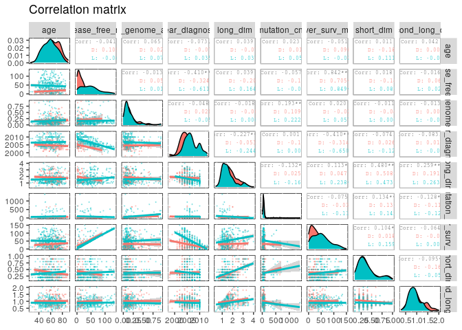

A correlation analysis of clinical variables of TCGA-KIRC patients
================

This project contains a pipeline of clinical analysis of the Cancer
Genome Atlas Kidney Renal Clear Cell Carcinoma (TCGA-KIRC) data of
patients, from [Genomic Data Commons Data
Portal](https://portal.gdc.cancer.gov/exploration?filters=%7B%22op%22%3A%22and%22%2C%22content%22%3A%5B%7B%22op%22%3A%22in%22%2C%22content%22%3A%7B%22field%22%3A%22cases.project.project_id%22%2C%22value%22%3A%5B%22TCGA-KIRC%22%5D%7D%7D%5D%7D)
and [cBioPortal](https://www.cbioportal.org/study/summary?id=kirp_tcga).

Previously, we presented [an exploratory preprocessing
analysis](1.preprocessing.md). In this section, Chi-squared test is
applied to compare two or more proportions of categorical variables and
T-student test to compare the means of numeric ones regardind the levels
of ‘Overall\_Survival\_Status’. The Hypoteis test is performed and
p-value indicates the strength of evidence in supportting the null
hypothesis.

    # Set the packages of interest
    packages = c("tidyverse","skimr","finalfit","rstatix", "ggpubr","GGally", "plotly")

    # if a package is installed, it will be loaded
    # otherwise, the missing package(s) will be installed and loaded
    package.check <- lapply(packages, FUN = function(x) {
      if (!require(x, character.only = TRUE)) {
        install.packages(x, dependencies = TRUE)
        library(x, character.only = TRUE)
      }
    })

    suppressMessages(library("tidyverse"))
    rm(packages)
    setwd(".")

1. Importing data
-----------------

    kirc_clin <- read_csv("data/kirc_clin.csv")

2. Taming data
--------------

    kirc_clin <- kirc_clin %>%
      mutate_if(is.character, as.factor) %>%
      mutate(patient_id = as.character(patient_id),
             age = as.integer(age),
             year_diagnose = as.integer(year_diagnose))

    # check 
    glimpse(kirc_clin) 

    ## Rows: 537
    ## Columns: 29
    ## $ patient_id          <chr> "TCGA-3Z-A93Z", "TCGA-6D-AA2E", "TCGA-A3-3306", "…
    ## $ age                 <int> 69, 68, 67, 66, 77, 57, 59, 57, 67, 70, 52, 51, 5…
    ## $ metastasis_stg      <fct> M0, MX, M0, M0, M0, M0, M0, M0, M0, M0, M0, M0, M…
    ## $ lymph_stg           <fct> N0, NX, N0, N0, N0, NX, N0, NX, N0, NX, NX, NX, N…
    ## $ neoplasm_stg        <fct> Stage I, Stage I, Stage I, Stage III, Stage III, …
    ## $ tumor_stg           <fct> T1, T1, T1, T3, T3, T1, T1, T2, T2, T1, T1, T1, T…
    ## $ disease_free_mth    <dbl> 12.65, 11.89, 36.79, 47.17, 0.53, NA, NA, 49.05, …
    ## $ disease_free_stt    <fct> DiseaseFree, DiseaseFree, DiseaseFree, DiseaseFre…
    ## $ ethnicity           <fct> not hispanic/latino, not hispanic/latino, not his…
    ## $ frac_genome_alter   <dbl> 0.2240, 0.0000, 0.2316, 0.0494, 0.0844, 0.0883, 0…
    ## $ histology_grd       <fct> G2, G2, G3, G3, G2, G2, G3, G3, G2, G2, G1, G2, G…
    ## $ hemoglobin          <fct> Normal, NA, NA, NA, Normal, Low, Low, NA, NA, NA,…
    ## $ neoadj_therapy      <fct> No, No, No, No, No, No, No, No, No, No, No, No, N…
    ## $ prior_cancer        <fct> No, No, No, Yes, No, No, No, No, No, No, No, No, …
    ## $ year_diagnose       <int> 2013, 2013, 2005, 2005, 2006, 2005, 2005, 2005, 2…
    ## $ tumor_lateral       <fct> Right, Right, Left, Right, Right, Right, Right, L…
    ## $ long_dim            <dbl> NA, NA, 0.9, 1.0, 1.2, 1.7, 2.0, 1.7, 1.5, 1.5, 1…
    ## $ mutation_cnt        <dbl> NA, NA, NA, NA, 514, 56, 656, 577, 62, 537, 477, …
    ## $ over_surv_mth       <dbl> 12.65, 11.89, 36.79, 47.17, 0.53, 39.13, 24.15, 4…
    ## $ over_surv_stt       <fct> LIVING, LIVING, LIVING, LIVING, LIVING, DECEASED,…
    ## $ platelet            <fct> Normal, NA, NA, NA, Normal, NA, NA, NA, NA, NA, N…
    ## $ race                <fct> Black/African.american, Black/African.american, W…
    ## $ serum_ca            <fct> Normal, NA, NA, NA, Normal, NA, NA, NA, NA, NA, N…
    ## $ gender              <fct> Male, Female, Male, Male, Female, Male, Male, Mal…
    ## $ short_dim           <dbl> NA, NA, 0.4, 0.6, 0.4, 0.4, 0.8, 0.8, 0.3, 0.4, 0…
    ## $ second_long_dim     <dbl> NA, NA, 0.7, 0.8, 1.0, 1.0, 0.9, 0.8, 1.0, 1.1, 0…
    ## $ tissue_site         <fct> OTHERS, OTHERS, A, A, A, A, A, A, A, A, A, A, A, …
    ## $ person_neoplasm_stt <fct> Tumor.Free, Tumor.Free, NA, With.Tumor, Tumor.Fre…
    ## $ wbc                 <fct> Normal, NA, NA, NA, Normal, NA, NA, NA, NA, NA, N…

3.The dependent variable
------------------------

    # Check the number of levels. If greater than 2, it thas to run a simple logistic regression presents only two levels (otherwise, it has to run a ordinal logistic regression)
    table(kirc_clin$over_surv_stt, exclude = NULL) 

    ## 
    ## DECEASED   LIVING 
    ##      177      360

4. Numeric variables vs. over\_surv\_stt
----------------------------------------

Correlation matrix - graphic visualization

    cols_numeric <- kirc_clin %>% 
      select_if(is.numeric) %>%
      names

    kirc_clin_numeric <- kirc_clin %>%
                          select(one_of(c(cols_numeric, "over_surv_stt")))  

    levels(kirc_clin_numeric$over_surv_stt) <- c("D","L")

    ggpairs(kirc_clin_numeric, columns = cols_numeric, 
            title="Correlation matrix",               
            mapping= aes(colour = over_surv_stt), 
            upper = list(combo = wrap("box_no_facet", alpha=0.1), 
                         continuous = wrap("cor", size = 2, alignPercent = 0.8)),
            lower = list(continuous = wrap("smooth", alpha = 0.3, size=0.2) )) +
            theme(panel.background = element_rect(color = "black", size=0.5, fill="white"),
              panel.grid.major = element_blank()) 

<!-- -->

Run multiple T-tests on over\_surv\_stt

Transform the data into long format

    # Put all variables in the same column except `over_surv_stt`, the grouping variable

    levels(kirc_clin_numeric$over_surv_stt) <- c("DECEASED","LIVING")

    # Convert to Tidyverse
    kirc_clin_numeric.long <- kirc_clin_numeric %>%
      pivot_longer(-over_surv_stt, names_to = "variables", values_to = "value")
    kirc_clin_numeric.long <- kirc_clin_numeric.long[!is.na(kirc_clin_numeric.long$value), ]
    kirc_clin_numeric.long$value.log <- log2(kirc_clin_numeric.long$value+1)

    # OR
    # kirc_clin_numeric.long <- kirc_clin_numeric %>% 
    #   gather(key = 'variables', value = 'value', -over_surv_stt, na.rm = TRUE) %>%
    #     mutate(value.log = log2(kirc_clin_numeric.long$value+1))

    kirc_clin_numeric.long %>% sample_n(6) %>% knitr::kable(.)

| over\_surv\_stt | variables         |  value |  value.log |
|:----------------|:------------------|-------:|-----------:|
| DECEASED        | long\_dim         |    1.7 |  1.4329594 |
| LIVING          | year\_diagnose    | 2007.0 | 10.9715436 |
| DECEASED        | second\_long\_dim |    1.5 |  1.3219281 |
| DECEASED        | year\_diagnose    | 2002.0 | 10.9679467 |
| LIVING          | short\_dim        |    0.3 |  0.3785116 |
| LIVING          | mutation\_cnt     |   17.0 |  4.1699250 |

Group the data by variables and compare over\_surv\_stt groups

Adjust the p-values and add significance levels

    stat.test <- kirc_clin_numeric.long %>%
      group_by(variables) %>%
      t_test(value ~ over_surv_stt) %>%
      adjust_pvalue(method = "BH") %>%
      add_significance()
    stat.test %>% knitr::kable(.)

| variables           | .y.   | group1   | group2 |  n1 |  n2 |   statistic |       df |        p |     p.adj | p.adj.signif |
|:--------------------|:------|:---------|:-------|----:|----:|------------:|---------:|---------:|----------:|:-------------|
| age                 | value | DECEASED | LIVING | 177 | 360 |   4.8869626 | 348.1670 | 1.60e-06 | 0.0000035 | \*\*\*\*     |
| disease\_free\_mth  | value | DECEASED | LIVING |  78 | 360 | -10.9719698 | 191.6452 | 0.00e+00 | 0.0000000 | \*\*\*\*     |
| frac\_genome\_alter | value | DECEASED | LIVING | 175 | 353 |   1.1960301 | 343.6013 | 2.33e-01 | 0.2621250 | ns           |
| long\_dim           | value | DECEASED | LIVING | 173 | 329 |   4.1297313 | 363.4507 | 4.51e-05 | 0.0000812 | \*\*\*\*     |
| mutation\_cnt       | value | DECEASED | LIVING | 153 | 298 |  -1.8305701 | 428.8339 | 6.79e-02 | 0.0873000 | ns           |
| over\_surv\_mth     | value | DECEASED | LIVING | 177 | 360 |  -7.3171956 | 450.9227 | 0.00e+00 | 0.0000000 | \*\*\*\*     |
| second\_long\_dim   | value | DECEASED | LIVING | 173 | 329 |   4.0638742 | 287.9183 | 6.23e-05 | 0.0000934 | \*\*\*\*     |
| short\_dim          | value | DECEASED | LIVING | 173 | 329 |   0.4784069 | 344.6781 | 6.33e-01 | 0.6330000 | ns           |
| year\_diagnose      | value | DECEASED | LIVING | 177 | 360 |  -8.8979681 | 377.0943 | 0.00e+00 | 0.0000000 | \*\*\*\*     |

    # Create the plot on logscale
    myplot <- ggboxplot(
      kirc_clin_numeric.long, x = "over_surv_stt", y = "value.log",
      fill = "over_surv_stt", palette = "npg", legend = "none", 
      ggtheme = theme_pubr(border = TRUE)
      ) +
      facet_wrap(~variables)

    # Add statistical test p-values
    # OBS: different p-values over vaule vs. log.value!! 
    stat.test <- stat.test %>% add_xy_position(x = "over_surv_stt")
    myplot + stat_pvalue_manual(stat.test, label = "p.adj.signif")

<!-- -->

    # Group the data by variables and do a graph for each variable
    graphs <- kirc_clin_numeric.long %>%
      group_by(variables) %>%
      doo(
        ~ggboxplot(
          data =., x = "over_surv_stt", y = "value",
          fill = "over_surv_stt", palette = "npg", legend = "none",
          ggtheme = theme_pubr()
          )  +
          geom_jitter(width = 0.05, alpha = 0.2, color = "orange"), 
        result = "plots"
      )
    graphs %>% knitr::kable(.)

| variables           | plots                                                                                                                                                                                                                                                                                                                                                                                                                                                                                                                                                                                                                                                                                                                                                                                                                                                                                                                                                                                                                                                                                                                                                                                                                                                                                                                                                                                                                                                                                                                                                                                                                                                                                                                                                                                                                                                                                                                                                                                                                                                                                                                                                                                                                                                                                                                                                                                                                                                                                                                                                                                                                                                                                                                                                                                                                                                                                                                                                                                                                                                                                                                                                                                                                                                                                                                                                                                                                                                                                                                                                                                                                                                                                                                                                                                                                                                                                                                                                                                                                                                                                                                                                                                                                                                                                                                                                                                                                                                                                                                                                                                                                                                                                                                                                                                                                                                                                                                                                                                                                                                                                                                                                                                                                                                                                                                                                                                                                                                                                                                                                                                                                                                                                                                                                                                                                                                                                                                                                                                                                                                                                                                                                                                                                                                                                                                                                                                                                                                                                                                                                                                                                                                                                                                                                                                                                                                                                                                                                                                                                                                                                                                                                                                                                                                                                                                                                                                                                                                                                                                                                                                                                                                                                                                                                                                                                                                                                                                                                                                                                                                                                                                                                                                                                                                                                                                                                                                                                                                                                                                                                                                                                                                                                                                                                                                                                                                                                                                                                                                                                                                                                                                                                                                                                                                                                                                                                                                                                                                                                                                                                                                                                                                                                                                                                                                                                                                                                                                                                                                                                                                                                                                                                                                                                                                                                                                                                                                                                                                                                                                                                                                                                                                                                                                                                                                                                                                                                                                                                                                                                                                                                                                                                                                                                                                                                                                                                                                                                                                                                                                                                                                                                                                                                                                                                                                                                                                                                                                                                                                                                                                                                                                                                                                                                                                                                                                                                                                                                                                                                                                                                                                                                                                                                                                                                                                                                                                                                                                                                                                                                                                                          |
|:--------------------|:-------------------------------------------------------------------------------------------------------------------------------------------------------------------------------------------------------------------------------------------------------------------------------------------------------------------------------------------------------------------------------------------------------------------------------------------------------------------------------------------------------------------------------------------------------------------------------------------------------------------------------------------------------------------------------------------------------------------------------------------------------------------------------------------------------------------------------------------------------------------------------------------------------------------------------------------------------------------------------------------------------------------------------------------------------------------------------------------------------------------------------------------------------------------------------------------------------------------------------------------------------------------------------------------------------------------------------------------------------------------------------------------------------------------------------------------------------------------------------------------------------------------------------------------------------------------------------------------------------------------------------------------------------------------------------------------------------------------------------------------------------------------------------------------------------------------------------------------------------------------------------------------------------------------------------------------------------------------------------------------------------------------------------------------------------------------------------------------------------------------------------------------------------------------------------------------------------------------------------------------------------------------------------------------------------------------------------------------------------------------------------------------------------------------------------------------------------------------------------------------------------------------------------------------------------------------------------------------------------------------------------------------------------------------------------------------------------------------------------------------------------------------------------------------------------------------------------------------------------------------------------------------------------------------------------------------------------------------------------------------------------------------------------------------------------------------------------------------------------------------------------------------------------------------------------------------------------------------------------------------------------------------------------------------------------------------------------------------------------------------------------------------------------------------------------------------------------------------------------------------------------------------------------------------------------------------------------------------------------------------------------------------------------------------------------------------------------------------------------------------------------------------------------------------------------------------------------------------------------------------------------------------------------------------------------------------------------------------------------------------------------------------------------------------------------------------------------------------------------------------------------------------------------------------------------------------------------------------------------------------------------------------------------------------------------------------------------------------------------------------------------------------------------------------------------------------------------------------------------------------------------------------------------------------------------------------------------------------------------------------------------------------------------------------------------------------------------------------------------------------------------------------------------------------------------------------------------------------------------------------------------------------------------------------------------------------------------------------------------------------------------------------------------------------------------------------------------------------------------------------------------------------------------------------------------------------------------------------------------------------------------------------------------------------------------------------------------------------------------------------------------------------------------------------------------------------------------------------------------------------------------------------------------------------------------------------------------------------------------------------------------------------------------------------------------------------------------------------------------------------------------------------------------------------------------------------------------------------------------------------------------------------------------------------------------------------------------------------------------------------------------------------------------------------------------------------------------------------------------------------------------------------------------------------------------------------------------------------------------------------------------------------------------------------------------------------------------------------------------------------------------------------------------------------------------------------------------------------------------------------------------------------------------------------------------------------------------------------------------------------------------------------------------------------------------------------------------------------------------------------------------------------------------------------------------------------------------------------------------------------------------------------------------------------------------------------------------------------------------------------------------------------------------------------------------------------------------------------------------------------------------------------------------------------------------------------------------------------------------------------------------------------------------------------------------------------------------------------------------------------------------------------------------------------------------------------------------------------------------------------------------------------------------------------------------------------------------------------------------------------------------------------------------------------------------------------------------------------------------------------------------------------------------------------------------------------------------------------------------------------------------------------------------------------------------------------------------------------------------------------------------------------------------------------------------------------------------------------------------------------------------------------------------------------------------------------------------------------------------------------------------------------------------------------------------------------------------------------------------------------------------------------------------------------------------------------------------------------------------------------------------------------------------------------------------------------------------------------------------------------------------------------------------------------------------------------------------------------------------------------------------------------------------------------------------------------------------------------------------------------------------------------------------------------------------------------------------------------------------------------------------------------------------------------------------------------------------------------------------------------------------------------------------------------------------------------------------------------------------------------------------------------------------------------------------------------------------------------------------------------------------------------------------------------------------------------------------------------------------------------------------------------------------------------------------------------------------------------------------------------------------------------------------------------------------------------------------------------------------------------------------------------------------------------------------------------------------------------------------------------------------------------------------------------------------------------------------------------------------------------------------------------------------------------------------------------------------------------------------------------------------------------------------------------------------------------------------------------------------------------------------------------------------------------------------------------------------------------------------------------------------------------------------------------------------------------------------------------------------------------------------------------------------------------------------------------------------------------------------------------------------------------------------------------------------------------------------------------------------------------------------------------------------------------------------------------------------------------------------------------------------------------------------------------------------------------------------------------------------------------------------------------------------------------------------------------------------------------------------------------------------------------------------------------------------------------------------------------------------------------------------------------------------------------------------------------------------------------------------------------------------------------------------------------------------------------------------------------------------------------------------------------------------------------------------------------------------------------------------------------------------------------------------------------------------------------------------------------------------------------------------------------------------------------------------------------------------------------------------------------------------------------------------------------------------------------------------------------------------------------------------------------------------------------------------------------------------------------------------------------------------------------------------------------------------------------------------------------------------------------------------------------------------------------------------------------------------------------------------------------------------------------------------------------------------------------------------------------------------------------------------------------------------------------------------------------------------------------------------------------------------------------------------------------------------------------------------------------------------------------------------------------------------------------------------------------------------------------------------------------------------------------------------------------------------------------------------------------------------------------------------------------------------------------------------------------------------|
| age                 | 2, 2, 2, 2, 2, 1, 1, 2, 2, 2, 2, 2, 2, 2, 1, 2, 2, 2, 2, 2, 2, 2, 1, 1, 2, 2, 1, 2, 2, 2, 2, 2, 2, 2, 2, 2, 2, 2, 1, 2, 2, 2, 2, 2, 2, 2, 2, 2, 2, 2, 2, 2, 2, 2, 2, 1, 2, 2, 2, 1, 1, 2, 2, 2, 2, 2, 2, 2, 2, 2, 2, 2, 2, 1, 2, 2, 2, 2, 2, 2, 2, 1, 1, 1, 1, 1, 1, 1, 1, 1, 1, 1, 1, 1, 1, 2, 1, 1, 1, 2, 1, 1, 1, 1, 1, 1, 1, 1, 1, 1, 1, 1, 1, 1, 1, 1, 1, 1, 1, 1, 1, 1, 1, 1, 1, 1, 1, 1, 1, 1, 1, 1, 1, 1, 1, 1, 1, 1, 1, 1, 1, 1, 1, 1, 2, 1, 1, 1, 1, 1, 1, 1, 2, 1, 2, 2, 2, 2, 2, 2, 2, 2, 2, 2, 2, 2, 2, 2, 2, 1, 2, 2, 2, 2, 2, 2, 2, 2, 2, 2, 2, 2, 2, 2, 2, 2, 2, 2, 2, 2, 1, 2, 2, 2, 2, 2, 2, 1, 2, 2, 2, 2, 2, 2, 2, 2, 2, 2, 2, 1, 2, 2, 2, 2, 2, 2, 2, 2, 2, 2, 2, 2, 2, 2, 2, 2, 2, 2, 2, 2, 2, 2, 2, 2, 2, 2, 2, 2, 2, 2, 2, 2, 2, 1, 2, 2, 2, 2, 1, 2, 2, 2, 1, 1, 2, 2, 2, 2, 2, 1, 1, 1, 2, 1, 2, 1, 1, 1, 2, 1, 1, 1, 1, 2, 2, 1, 2, 2, 2, 1, 1, 1, 1, 2, 2, 2, 2, 2, 1, 1, 2, 2, 2, 2, 1, 1, 2, 2, 2, 2, 2, 2, 2, 1, 2, 1, 2, 2, 1, 1, 2, 2, 2, 2, 2, 2, 2, 2, 2, 2, 2, 2, 2, 2, 2, 2, 2, 2, 1, 2, 2, 2, 1, 2, 2, 1, 2, 2, 1, 2, 2, 2, 2, 2, 2, 2, 2, 2, 2, 2, 2, 2, 2, 1, 1, 1, 2, 2, 1, 2, 2, 1, 2, 1, 2, 2, 2, 2, 2, 2, 2, 2, 1, 2, 2, 2, 2, 2, 2, 2, 2, 2, 2, 2, 2, 2, 2, 1, 1, 2, 2, 1, 2, 2, 1, 1, 2, 2, 2, 2, 2, 2, 1, 2, 2, 2, 2, 2, 2, 2, 1, 1, 2, 2, 1, 2, 2, 1, 1, 2, 2, 1, 2, 2, 2, 2, 2, 2, 2, 2, 1, 2, 1, 1, 1, 2, 1, 2, 2, 1, 1, 1, 1, 1, 2, 2, 2, 2, 1, 1, 1, 1, 2, 2, 1, 1, 2, 2, 1, 2, 2, 2, 2, 1, 2, 1, 2, 2, 2, 2, 1, 2, 1, 2, 1, 1, 2, 1, 1, 2, 2, 1, 1, 2, 2, 2, 1, 1, 1, 2, 2, 2, 2, 2, 1, 1, 2, 2, 1, 2, 1, 1, 1, 2, 2, 2, 2, 2, 1, 2, 2, 2, 2, 2, 2, 2, 2, 2, 2, 1, 1, 2, 2, 2, 2, 2, 2, 1, 1, 2, 1, 2, 2, 2, 2, 2, 2, 69, 68, 67, 66, 77, 57, 59, 57, 67, 70, 52, 51, 53, 51, 52, 47, 79, 75, 86, 41, 75, 79, 68, 76, 34, 42, 74, 62, 57, 82, 60, 50, 46, 72, 48, 64, 54, 51, 51, 60, 54, 69, 52, 46, 49, 47, 57, 49, 78, 59, 74, 75, 37, 65, 68, 37, 65, 62, 54, 61, 62, 48, 72, 40, 58, 45, 80, 69, 83, 85, 48, 58, 84, 71, 48, 48, 58, 72, 71, 63, 35, 46, 65, 55, 72, 72, 58, 46, 75, 74, 60, 66, 51, 61, 63, 75, 76, 76, 81, 57, 47, 48, 68, 58, 65, 49, 81, 68, 60, 68, 78, 88, 49, 77, 79, 82, 49, 61, 63, 69, 80, 63, 73, 57, 60, 70, 52, 60, 54, 51, 78, 75, 77, 77, 63, 79, 63, 33, 76, 53, 53, 62, 81, 72, 59, 53, 88, 72, 74, 90, 64, 65, 54, 69, 71, 69, 43, 52, 40, 61, 72, 56, 46, 59, 64, 53, 66, 66, 47, 71, 61, 69, 50, 77, 53, 77, 65, 71, 73, 65, 45, 39, 62, 57, 50, 68, 75, 53, 59, 73, 72, 83, 52, 61, 56, 74, 79, 46, 79, 61, 68, 62, 65, 59, 64, 61, 52, 45, 61, 66, 41, 63, 51, 74, 73, 58, 70, 63, 57, 56, 61, 62, 63, 65, 43, 42, 38, 53, 71, 65, 41, 67, 69, 62, 49, 50, 69, 48, 60, 61, 54, 60, 69, 70, 67, 74, 65, 60, 51, 64, 69, 59, 76, 72, 47, 49, 64, 65, 64, 53, 75, 75, 60, 52, 36, 56, 65, 76, 43, 70, 67, 79, 64, 75, 62, 57, 74, 68, 51, 74, 61, 40, 59, 62, 40, 50, 69, 57, 42, 79, 43, 43, 72, 63, 73, 62, 57, 55, 52, 46, 78, 55, 67, 59, 48, 76, 74, 34, 74, 70, 57, 79, 59, 42, 49, 46, 47, 58, 63, 54, 46, 76, 40, 63, 44, 40, 43, 47, 58, 40, 77, 57, 75, 42, 67, 72, 75, 41, 72, 58, 54, 66, 58, 54, 68, 49, 56, 40, 43, 53, 61, 45, 46, 52, 63, 75, 70, 55, 75, 45, 60, 78, 46, 71, 53, 58, 56, 57, 54, 56, 50, 54, 60, 61, 79, 59, 39, 75, 53, 72, 58, 44, 63, 75, 60, 48, 51, 52, 46, 49, 49, 55, 47, 67, 48, 42, 49, 58, 63, 51, 85, 73, 67, 57, 71, 41, 57, 72, 64, 42, 48, 59, 63, 72, 57, 65, 76, 58, 62, 79, 42, 69, 47, 61, 50, 60, 62, 58, 38, 61, 45, 69, 64, 64, 63, 51, 84, 70, 47, 54, 62, 73, 65, 44, 60, 78, 61, 59, 90, 77, 58, 65, 54, 63, 54, 73, 44, 51, 74, 51, 62, 78, 52, 51, 56, 61, 60, 68, 73, 44, 32, 82, 68, 62, 56, 39, 59, 60, 63, 46, 51, 86, 70, 79, 74, 69, 67, 63, 63, 57, 62, 43, 63, 55, 52, 83, 76, 69, 76, 67, 86, 84, 41, 72, 59, 51, 58, 61, 60, 38, 60, 59, 67, 40, 26, 29, 41, 37, 52, 55, 59, 53, 55, 47, 67, 55, 81, 54, 55, 81, 62, 76, 41, 68, 58, 72, 47, 6.129283, 6.108524, 6.087463, 6.066089, 6.285402, 5.857981, 5.906891, 5.857981, 6.087463, 6.149747, 5.72792, 5.70044, 5.754888, 5.70044, 5.72792, 5.584963, 6.321928, 6.247928, 6.442943, 5.392317, 6.247928, 6.321928, 6.108524, 6.266787, 5.129283, 5.426265, 6.228819, 5.97728, 5.857981, 6.375039, 5.930737, 5.672425, 5.554589, 6.189825, 5.61471, 6.022368, 5.78136, 5.70044, 5.70044, 5.930737, 5.78136, 6.129283, 5.72792, 5.554589, 5.643856, 5.584963, 5.857981, 5.643856, 6.303781, 5.906891, 6.228819, 6.247928, 5.247928, 6.044394, 6.108524, 5.247928, 6.044394, 5.97728, 5.78136, 5.954196, 5.97728, 5.61471, 6.189825, 5.357552, 5.882643, 5.523562, 6.33985, 6.129283, 6.392317, 6.426265, 5.61471, 5.882643, 6.409391, 6.169925, 5.61471, 5.61471, 5.882643, 6.189825, 6.169925, 6, 5.169925, 5.554589, 6.044394, 5.807355, 6.189825, 6.189825, 5.882643, 5.554589, 6.247928, 6.228819, 5.930737, 6.066089, 5.70044, 5.954196, 6, 6.247928, 6.266787, 6.266787, 6.357552, 5.857981, 5.584963, 5.61471, 6.108524, 5.882643, 6.044394, 5.643856, 6.357552, 6.108524, 5.930737, 6.108524, 6.303781, 6.475733, 5.643856, 6.285402, 6.321928, 6.375039, 5.643856, 5.954196, 6, 6.129283, 6.33985, 6, 6.209453, 5.857981, 5.930737, 6.149747, 5.72792, 5.930737, 5.78136, 5.70044, 6.303781, 6.247928, 6.285402, 6.285402, 6, 6.321928, 6, 5.087463, 6.266787, 5.754888, 5.754888, 5.97728, 6.357552, 6.189825, 5.906891, 5.754888, 6.475733, 6.189825, 6.228819, 6.507795, 6.022368, 6.044394, 5.78136, 6.129283, 6.169925, 6.129283, 5.459432, 5.72792, 5.357552, 5.954196, 6.189825, 5.83289, 5.554589, 5.906891, 6.022368, 5.754888, 6.066089, 6.066089, 5.584963, 6.169925, 5.954196, 6.129283, 5.672425, 6.285402, 5.754888, 6.285402, 6.044394, 6.169925, 6.209453, 6.044394, 5.523562, 5.321928, 5.97728, 5.857981, 5.672425, 6.108524, 6.247928, 5.754888, 5.906891, 6.209453, 6.189825, 6.392317, 5.72792, 5.954196, 5.83289, 6.228819, 6.321928, 5.554589, 6.321928, 5.954196, 6.108524, 5.97728, 6.044394, 5.906891, 6.022368, 5.954196, 5.72792, 5.523562, 5.954196, 6.066089, 5.392317, 6, 5.70044, 6.228819, 6.209453, 5.882643, 6.149747, 6, 5.857981, 5.83289, 5.954196, 5.97728, 6, 6.044394, 5.459432, 5.426265, 5.285402, 5.754888, 6.169925, 6.044394, 5.392317, 6.087463, 6.129283, 5.97728, 5.643856, 5.672425, 6.129283, 5.61471, 5.930737, 5.954196, 5.78136, 5.930737, 6.129283, 6.149747, 6.087463, 6.228819, 6.044394, 5.930737, 5.70044, 6.022368, 6.129283, 5.906891, 6.266787, 6.189825, 5.584963, 5.643856, 6.022368, 6.044394, 6.022368, 5.754888, 6.247928, 6.247928, 5.930737, 5.72792, 5.209453, 5.83289, 6.044394, 6.266787, 5.459432, 6.149747, 6.087463, 6.321928, 6.022368, 6.247928, 5.97728, 5.857981, 6.228819, 6.108524, 5.70044, 6.228819, 5.954196, 5.357552, 5.906891, 5.97728, 5.357552, 5.672425, 6.129283, 5.857981, 5.426265, 6.321928, 5.459432, 5.459432, 6.189825, 6, 6.209453, 5.97728, 5.857981, 5.807355, 5.72792, 5.554589, 6.303781, 5.807355, 6.087463, 5.906891, 5.61471, 6.266787, 6.228819, 5.129283, 6.228819, 6.149747, 5.857981, 6.321928, 5.906891, 5.426265, 5.643856, 5.554589, 5.584963, 5.882643, 6, 5.78136, 5.554589, 6.266787, 5.357552, 6, 5.491853, 5.357552, 5.459432, 5.584963, 5.882643, 5.357552, 6.285402, 5.857981, 6.247928, 5.426265, 6.087463, 6.189825, 6.247928, 5.392317, 6.189825, 5.882643, 5.78136, 6.066089, 5.882643, 5.78136, 6.108524, 5.643856, 5.83289, 5.357552, 5.459432, 5.754888, 5.954196, 5.523562, 5.554589, 5.72792, 6, 6.247928, 6.149747, 5.807355, 6.247928, 5.523562, 5.930737, 6.303781, 5.554589, 6.169925, 5.754888, 5.882643, 5.83289, 5.857981, 5.78136, 5.83289, 5.672425, 5.78136, 5.930737, 5.954196, 6.321928, 5.906891, 5.321928, 6.247928, 5.754888, 6.189825, 5.882643, 5.491853, 6, 6.247928, 5.930737, 5.61471, 5.70044, 5.72792, 5.554589, 5.643856, 5.643856, 5.807355, 5.584963, 6.087463, 5.61471, 5.426265, 5.643856, 5.882643, 6, 5.70044, 6.426265, 6.209453, 6.087463, 5.857981, 6.169925, 5.392317, 5.857981, 6.189825, 6.022368, 5.426265, 5.61471, 5.906891, 6, 6.189825, 5.857981, 6.044394, 6.266787, 5.882643, 5.97728, 6.321928, 5.426265, 6.129283, 5.584963, 5.954196, 5.672425, 5.930737, 5.97728, 5.882643, 5.285402, 5.954196, 5.523562, 6.129283, 6.022368, 6.022368, 6, 5.70044, 6.409391, 6.149747, 5.584963, 5.78136, 5.97728, 6.209453, 6.044394, 5.491853, 5.930737, 6.303781, 5.954196, 5.906891, 6.507795, 6.285402, 5.882643, 6.044394, 5.78136, 6, 5.78136, 6.209453, 5.491853, 5.70044, 6.228819, 5.70044, 5.97728, 6.303781, 5.72792, 5.70044, 5.83289, 5.954196, 5.930737, 6.108524, 6.209453, 5.491853, 5.044394, 6.375039, 6.108524, 5.97728, 5.83289, 5.321928, 5.906891, 5.930737, 6, 5.554589, 5.70044, 6.442943, 6.149747, 6.321928, 6.228819, 6.129283, 6.087463, 6, 6, 5.857981, 5.97728, 5.459432, 6, 5.807355, 5.72792, 6.392317, 6.266787, 6.129283, 6.266787, 6.087463, 6.442943, 6.409391, 5.392317, 6.189825, 5.906891, 5.70044, 5.882643, 5.954196, 5.930737, 5.285402, 5.930737, 5.906891, 6.087463, 5.357552, 4.754888, 4.906891, 5.392317, 5.247928, 5.72792, 5.807355, 5.906891, 5.754888, 5.807355, 5.584963, 6.087463, 5.807355, 6.357552, 5.78136, 5.807355, 6.357552, 5.97728, 6.266787, 5.392317, 6.108524, 5.882643, 6.189825, 5.584963, &lt;environment: 0x5648fd3bd4a0&gt;, &lt;environment: 0x56490b9db2d8&gt;, &lt;environment: 0x56490bd25de0&gt;, \~over\_surv\_stt, \~value, black, 0.5454545, 1, butt, FALSE, TRUE, white, black, 0.5454545, 1, TRUE, , plain, black, 12, 0.5, 0.5, 0, 0.9, 0, 0, 0, 0, FALSE, TRUE, 1, 3, 0, 0, 0, TRUE, 0, 0, 0, 3, 0, TRUE, 1, 90, 0, 3, 0, 0, TRUE, 0, -90, 0, 0, 0, 3, TRUE, black, TRUE, 1, 2.4, 0, 0, 0, FALSE, 0, 0, 0, 2.4, 0, TRUE, 1, 0, 2.4, 0, 0, FALSE, 0, 0, 0, 0, 2.4, TRUE, black, FALSE, FALSE, 3, black, 0.5, FALSE, TRUE, NA, TRUE, 6, 6, 6, 6, 12, 1.2, 0.8, TRUE, 0, TRUE, none, center, 0, 0, 0, 0, 12, white, NA, TRUE, 6, grey92, FALSE, TRUE, FALSE, white, TRUE, 1.2, 0, 1, 0, 0, 6, 0, TRUE, panel, 0, 1, 0, 0, 6, 0, TRUE, 0.8, 1, 1, 6, 0, 0, 0, TRUE, panel, 1.2, 0.5, 0.5, TRUE, topleft, 6, 6, 6, 6, \#F2F2F2, black, 0.7, TRUE, inside, grey10, 0.8, 4.8, 4.8, 4.8, 4.8, TRUE, -90, TRUE, 3, 3, 90, TRUE, &lt;environment: 0x5648fd9700f0&gt;, &lt;environment: 0x5648fd96d2d8&gt;, &lt;environment: 0x5648fd9ca6c8&gt;, over\_surv\_stt, value, over\_surv\_stt                                                                                                                                                                                                                                                                                                                                                                                                                                                                                                                                                                                                                                                                                                                                                                                                                                                                                                                                                                                                                                                                                                                                                                                                                                                                                                                                                                                                                                                                                                                                                                                                                                                                                                                                                                                                                                                                                                                                                                                                                                                                                                                                                                                                                                                                                                                                                                                                                                                                                                                                                                                                                                                                                                                     |
| disease\_free\_mth  | 2, 2, 2, 2, 2, 2, 2, 2, 2, 2, 2, 2, 2, 2, 2, 2, 2, 2, 2, 1, 1, 2, 2, 2, 2, 2, 2, 2, 2, 2, 2, 2, 2, 2, 2, 2, 2, 2, 2, 2, 2, 2, 2, 2, 2, 2, 2, 2, 2, 2, 1, 2, 2, 2, 2, 2, 2, 2, 2, 2, 2, 2, 2, 2, 2, 2, 2, 2, 2, 2, 2, 2, 2, 1, 2, 2, 1, 1, 1, 1, 1, 1, 1, 1, 1, 1, 1, 1, 1, 1, 1, 1, 1, 2, 1, 1, 1, 2, 1, 2, 2, 2, 2, 2, 2, 2, 2, 2, 2, 2, 2, 2, 2, 2, 1, 2, 2, 2, 2, 2, 2, 2, 2, 2, 2, 2, 2, 2, 2, 2, 2, 2, 2, 2, 2, 2, 2, 2, 2, 2, 2, 1, 2, 2, 2, 2, 2, 2, 2, 2, 2, 2, 2, 2, 2, 2, 2, 2, 2, 2, 2, 2, 2, 2, 2, 2, 2, 2, 2, 2, 2, 2, 2, 2, 2, 2, 2, 2, 2, 2, 2, 2, 2, 2, 2, 2, 1, 2, 2, 2, 2, 2, 2, 2, 1, 2, 2, 2, 2, 2, 1, 1, 2, 2, 1, 1, 2, 1, 1, 2, 2, 2, 2, 2, 1, 1, 2, 2, 2, 2, 2, 2, 2, 2, 2, 1, 1, 2, 2, 2, 2, 2, 2, 2, 1, 2, 2, 2, 1, 2, 2, 2, 2, 2, 2, 2, 2, 2, 2, 2, 2, 2, 2, 2, 2, 2, 2, 1, 2, 2, 2, 2, 2, 1, 2, 2, 2, 2, 2, 2, 2, 2, 2, 2, 2, 2, 2, 2, 2, 2, 1, 1, 2, 2, 2, 2, 2, 1, 2, 2, 2, 2, 2, 2, 2, 2, 1, 2, 2, 2, 2, 2, 2, 2, 2, 2, 2, 2, 2, 2, 2, 1, 1, 2, 2, 1, 2, 2, 1, 1, 2, 2, 2, 2, 2, 2, 1, 2, 2, 2, 2, 2, 2, 2, 1, 1, 2, 2, 2, 2, 1, 1, 2, 2, 2, 2, 2, 2, 2, 2, 2, 2, 1, 2, 1, 1, 2, 2, 2, 1, 1, 1, 1, 1, 2, 2, 2, 2, 1, 2, 2, 1, 2, 2, 1, 2, 2, 2, 2, 1, 2, 2, 2, 2, 2, 1, 2, 2, 1, 1, 2, 2, 2, 2, 2, 2, 1, 2, 2, 2, 2, 2, 1, 2, 2, 2, 1, 1, 2, 2, 2, 2, 2, 1, 2, 2, 2, 2, 2, 2, 2, 2, 2, 2, 2, 2, 2, 2, 2, 2, 1, 2, 2, 2, 2, 2, 2, 2, 12.65, 11.89, 36.79, 47.17, 0.53, 49.05, 31.27, 37.12, 49.54, 48.55, 36.33, 38.96, 37.35, 45.5, 53.35, 48.78, 36.07, 34.26, 31.04, 3.75, 20.04, 45.5, 29.89, 88.3, 42.94, 82.26, 51.22, 10.48, 28.68, 74.57, 74.7, 24.15, 53.25, 43.17, 20.7, 18.63, 16.89, 28.29, 65.47, 20.27, 33.44, 15.37, 22.63, 0.1, 0.1, 0, 11.17, 10.61, 0, 109.82, 8.41, 117.71, 122.47, 109.33, 111.99, 53.88, 39.06, 94.12, 46.75, 48.32, 78.58, 39.98, 58.44, 94.22, 83.15, 28.71, 37.55, 38.37, 82.39, 72.83, 12.12, 40.67, 1.41, 26.08, 57.65, 25.23, 6.73, 15.05, 4.17, 21.94, 39.68, 3.55, 8.21, 2.04, 24.57, 5.35, 16.23, 0.13, 28.25, 3.38, 7, 2.14, 2.46, 11.79, 46.85, 89.82, 18.04, 58.54, 2.3, 66, 38.6, 2.46, 37.09, 52.83, 50.99, 38.4, 48.78, 46.35, 56.93, 14.75, 111.43, 106.77, 129.57, 133.84, 9.46, 70.63, 56.73, 86.4, 119.28, 3.09, 58.8, 7.36, 71.35, 73.78, 27.66, 105.29, 123, 130.55, 47.54, 123.72, 23.82, 91.39, 125.95, 32.59, 35.87, 31.93, 21.29, 31.27, 31.64, 24.8, 30.19, 27.96, 21.55, 8.74, 11.99, 5.75, 5.09, 1.25, 0.53, 4.63, 5.45, 0.36, 0.23, 16.79, 49.93, 42.67, 7.33, 45.34, 17.18, 19.84, 25.89, 40.31, 40.01, 23.72, 1.18, 27, 0.85, 24.21, 50.1, 16.59, 6.37, 22.8, 0.53, 34.36, 14.29, 27.27, 29.86, 17.05, 1.74, 8.41, 4.93, 17.35, 15.41, 16.26, 14.16, 110.94, 77.27, 94.65, 88.21, 100.99, 93.27, 60.38, 0.43, 89.29, 2.56, 62.19, 61.73, 64.22, 54.86, 97.37, 31.47, 23, 62.02, 37.22, 14.52, 14.91, 84.49, 7.88, 61.63, 54.73, 49.8, 44.91, 12.22, 28.68, 8.71, 22.5, 12.29, 72.54, 77.92, 47.86, 5.98, 71.75, 48.03, 13.14, 61.63, 6.83, 3.61, 61.93, 60.55, 13.5, 56.87, 68.33, 11.63, 60.91, 14.49, 48.92, 20.37, 36.37, 11.56, 36.93, 6.7, 41.72, 6.93, 87.39, 71.35, 63.57, 58.64, 60.25, 61.17, 61.47, 6.73, 57.36, 58.94, 14.22, 48.85, 49.34, 45.47, 1.15, 47.08, 53.61, 14.91, 33.31, 46.42, 21.58, 25.79, 36.93, 3.88, 46.42, 16.46, 5.81, 42.97, 45.04, 30.62, 41.59, 18.5, 38.67, 36.99, 27.6, 37.45, 35.18, 16.16, 25.66, 6.34, 79.24, 74.15, 30.62, 9.63, 56.14, 74.34, 49.11, 38.27, 15.93, 37.22, 24.18, 22.77, 13.34, 25.66, 33.21, 31.77, 23.46, 13.4, 24.61, 33.44, 19.81, 44.51, 34.92, 0.62, 0.95, 114.91, 46.52, 63.21, 59.82, 2.3, 106.08, 114.32, 11.79, 105.29, 58.9, 3.06, 1.22, 57.62, 49.21, 5.55, 47.14, 74.21, 75, 17.44, 64.22, 71.81, 61.79, 61.86, 57.79, 67.05, 64.13, 10.58, 19.97, 63.93, 48.52, 49.97, 24.64, 5.19, 2, 46.75, 50.2, 47.63, 49.93, 51.25, 9.13, 49.15, 49.24, 50.3, 54.43, 17.67, 45.11, 1.08, 0.82, 130.98, 29.57, 72.9, 9.46, 13.11, 19.55, 5.03, 0.56, 1.81, 62.06, 73.29, 66.95, 4.5, 62.61, 119.55, 4.73, 91.95, 81.77, 3.35, 85.71, 65.8, 66.26, 78.12, 22.08, 74.61, 105.85, 91.33, 103.35, 88.73, 15.01, 25.43, 0.59, 32.52, 62.81, 58.71, 107.46, 63.34, 107.33, 63.37, 58.77, 13.9, 31.24, 5.72, 91.62, 55.29, 94.38, 1.58, 21.75, 69.91, 22.5, 2.04, 3.61, 12.68, 80.12, 67.9, 65.6, 12.25, 12.39, 22.77, 62.58, 43.66, 45.93, 65.83, 12.16, 11.66, 37.12, 11.73, 56.8, 11.99, 65.97, 18.1, 3.91, 6.77, 4.17, 9.99, 70.07, 2, 19.42, 19.94, 23, 16.36, 11.7, 3.770829, 3.68818, 5.239933, 5.590063, 0.6135317, 5.645298, 5.012122, 5.252476, 5.659354, 5.630813, 5.222264, 5.320485, 5.261155, 5.539159, 5.764208, 5.637494, 5.21218, 5.139961, 5.001802, 2.247928, 4.395063, 5.539159, 4.949068, 6.480588, 5.457463, 6.379552, 5.706531, 3.521051, 4.891419, 6.239742, 6.242221, 4.652486, 5.761551, 5.464995, 4.439623, 4.294988, 4.161081, 4.872336, 6.054631, 4.410748, 5.106013, 4.032982, 4.562548, 0.1375035, 0.1375035, 0, 3.605257, 3.537296, 0, 6.792074, 3.234195, 6.891298, 6.948017, 6.785681, 6.820051, 5.778209, 5.324091, 6.571677, 5.577429, 5.624101, 6.314334, 5.356848, 5.893362, 6.573193, 6.394891, 4.892877, 5.268659, 5.299025, 6.381802, 6.206135, 3.713696, 5.380937, 1.269033, 4.759156, 5.874059, 4.713146, 2.950468, 4.004501, 2.370164, 4.519793, 5.346248, 2.185867, 3.203201, 1.604071, 4.67638, 2.666757, 4.106851, 0.1763228, 4.870365, 2.130931, 3, 1.650765, 1.790772, 3.676944, 5.580447, 6.504938, 4.250962, 5.895787, 1.722466, 6.066089, 5.307429, 1.790772, 5.25134, 5.750339, 5.700162, 5.300124, 5.637494, 5.565293, 5.856239, 3.97728, 6.812883, 6.751812, 7.02868, 7.075105, 3.386811, 6.162492, 5.851249, 6.449561, 6.910253, 2.032101, 5.902074, 3.063503, 6.176921, 6.224581, 4.840967, 6.731862, 6.954196, 7.039467, 5.601102, 6.962549, 4.633431, 6.529665, 6.988117, 5.06996, 5.204376, 5.041331, 4.478325, 5.012122, 5.028569, 4.689299, 4.963012, 4.85599, 4.495056, 3.283922, 3.69933, 2.754888, 2.606442, 1.169925, 0.6135317, 2.493135, 2.689299, 0.4436067, 0.2986583, 4.152995, 5.670444, 5.448571, 3.058316, 5.534186, 4.18428, 4.381283, 4.748998, 5.368419, 5.357904, 4.627607, 1.124328, 4.807355, 0.8875253, 4.655924, 5.675251, 4.136684, 2.881665, 4.57289, 0.6135317, 5.144046, 3.934517, 4.8212, 4.947666, 4.173927, 1.454176, 3.234195, 2.568032, 4.197708, 4.036503, 4.109361, 3.922198, 6.806582, 6.290388, 6.579693, 6.479134, 6.672284, 6.558727, 5.939697, 0.5160151, 6.496494, 1.831877, 5.981624, 5.971084, 6.027243, 5.803744, 6.620146, 5.021035, 4.584963, 5.977738, 5.256256, 3.956057, 3.991862, 6.417684, 3.15056, 5.968782, 5.800382, 5.666757, 5.520737, 3.72465, 4.891419, 3.279471, 4.554589, 3.732269, 6.200457, 6.302319, 5.610582, 2.803227, 6.184875, 5.615593, 3.82171, 5.968782, 2.969012, 2.204767, 5.975676, 5.943687, 3.857981, 5.854744, 6.115408, 3.658783, 5.952101, 3.953265, 5.641546, 4.417515, 5.223809, 3.650765, 5.245267, 2.944858, 5.41684, 2.987321, 6.465811, 6.176921, 6.012792, 5.898208, 5.936638, 5.958147, 5.965092, 2.950468, 5.866908, 5.905447, 3.927896, 5.639522, 5.653633, 5.538228, 1.104337, 5.587365, 5.771093, 3.991862, 5.100557, 5.567424, 4.496974, 4.743623, 5.245267, 2.286881, 5.567424, 4.125982, 2.767655, 5.458448, 5.524816, 4.982765, 5.412443, 4.285402, 5.309976, 5.247548, 4.837943, 5.264912, 5.177121, 4.100978, 4.736605, 2.87578, 6.32625, 6.231701, 4.982765, 3.41007, 5.836429, 6.235344, 5.647027, 5.295356, 4.08151, 5.256256, 4.654206, 4.57107, 3.841973, 4.736605, 5.096346, 5.034304, 4.612352, 3.847997, 4.678635, 5.106013, 4.379205, 5.508112, 5.166715, 0.6959938, 0.9634741, 6.856861, 5.570463, 6.004726, 5.926474, 1.722466, 6.742545, 6.849499, 3.676944, 6.731862, 5.904484, 2.02148, 1.15056, 5.873321, 5.649903, 2.711495, 5.589164, 6.232853, 6.247928, 4.204767, 6.027243, 6.186065, 5.972463, 5.97407, 5.877499, 6.088523, 6.02525, 3.533563, 4.390255, 6.020813, 5.629939, 5.671576, 4.680324, 2.629939, 1.584963, 5.577429, 5.678072, 5.603775, 5.670444, 5.707359, 3.340562, 5.648178, 5.650765, 5.680887, 5.792595, 4.22265, 5.527008, 1.056584, 0.8639385, 7.044176, 4.934045, 6.207502, 3.386811, 3.818646, 4.361066, 2.592158, 0.641546, 1.49057, 5.978653, 6.215096, 6.086402, 2.459432, 5.991182, 6.913488, 2.518535, 6.538383, 6.371036, 2.121015, 6.438126, 6.061776, 6.071677, 6.305971, 4.528571, 6.240505, 6.739443, 6.528728, 6.705287, 6.487519, 4.000901, 4.724105, 0.6690268, 5.06695, 5.995711, 5.899901, 6.761019, 6.007644, 6.759289, 6.008317, 5.90135, 3.89724, 5.01078, 2.748461, 6.533252, 5.814807, 6.575615, 1.367371, 4.507795, 6.147917, 4.554589, 1.604071, 2.204767, 3.773996, 6.341986, 6.106432, 6.05745, 3.72792, 3.743084, 4.57107, 5.990501, 5.480911, 5.552439, 6.062424, 3.718088, 3.662205, 5.252476, 3.670161, 5.852998, 3.69933, 6.065443, 4.255501, 2.295723, 2.957915, 2.370164, 3.458119, 6.151169, 1.584963, 4.351911, 4.38819, 4.584963, 4.117695, 3.666757, &lt;environment: 0x56490acaf088&gt;, &lt;environment: 0x56490d0b58a0&gt;, &lt;environment: 0x564908049508&gt;, \~over\_surv\_stt, \~value, black, 0.5454545, 1, butt, FALSE, TRUE, white, black, 0.5454545, 1, TRUE, , plain, black, 12, 0.5, 0.5, 0, 0.9, 0, 0, 0, 0, FALSE, TRUE, 1, 3, 0, 0, 0, TRUE, 0, 0, 0, 3, 0, TRUE, 1, 90, 0, 3, 0, 0, TRUE, 0, -90, 0, 0, 0, 3, TRUE, black, TRUE, 1, 2.4, 0, 0, 0, FALSE, 0, 0, 0, 2.4, 0, TRUE, 1, 0, 2.4, 0, 0, FALSE, 0, 0, 0, 0, 2.4, TRUE, black, FALSE, FALSE, 3, black, 0.5, FALSE, TRUE, NA, TRUE, 6, 6, 6, 6, 12, 1.2, 0.8, TRUE, 0, TRUE, none, center, 0, 0, 0, 0, 12, white, NA, TRUE, 6, grey92, FALSE, TRUE, FALSE, white, TRUE, 1.2, 0, 1, 0, 0, 6, 0, TRUE, panel, 0, 1, 0, 0, 6, 0, TRUE, 0.8, 1, 1, 6, 0, 0, 0, TRUE, panel, 1.2, 0.5, 0.5, TRUE, topleft, 6, 6, 6, 6, \#F2F2F2, black, 0.7, TRUE, inside, grey10, 0.8, 4.8, 4.8, 4.8, 4.8, TRUE, -90, TRUE, 3, 3, 90, TRUE, &lt;environment: 0x564907b46738&gt;, &lt;environment: 0x5649077984d0&gt;, &lt;environment: 0x56490ba0ccc8&gt;, over\_surv\_stt, value, over\_surv\_stt                                                                                                                                                                                                                                                                                                                                                                                                                                                                                                                                                                                                                                                                                                                                                                                                                                                                                                                                                                                                                                                                                                                                                                                                                                                                                                                                                                                                                                                                                                                                                                                                                                                                                                                                                                                                                                                                                                                                                                                                                                                                                                                                                                                                                                                                                                                                                                                                                                                                                                                                                                                                                                                                                                                                                                                                                                                                                                                                                                                                                                |
| frac\_genome\_alter | 2, 2, 2, 2, 2, 1, 1, 2, 2, 2, 2, 2, 2, 2, 1, 2, 2, 2, 2, 2, 1, 1, 2, 2, 1, 2, 2, 2, 2, 2, 2, 2, 2, 2, 2, 2, 1, 2, 2, 2, 2, 2, 2, 2, 2, 2, 2, 2, 2, 2, 2, 2, 2, 1, 2, 2, 2, 1, 1, 2, 2, 2, 2, 2, 2, 2, 2, 2, 2, 2, 2, 1, 2, 2, 2, 2, 2, 2, 2, 1, 1, 1, 1, 1, 1, 1, 1, 1, 1, 1, 1, 1, 1, 2, 1, 1, 1, 2, 1, 1, 1, 1, 1, 1, 1, 1, 1, 1, 1, 1, 1, 1, 1, 1, 1, 1, 1, 1, 1, 1, 1, 1, 1, 1, 1, 1, 1, 1, 1, 1, 1, 1, 1, 1, 1, 1, 1, 1, 1, 1, 1, 2, 1, 1, 1, 1, 1, 1, 1, 2, 1, 2, 2, 2, 2, 2, 2, 2, 2, 2, 2, 2, 2, 2, 2, 2, 1, 2, 2, 2, 2, 2, 2, 2, 2, 2, 2, 2, 2, 2, 2, 2, 2, 2, 2, 1, 2, 2, 2, 2, 2, 1, 2, 2, 2, 2, 2, 2, 2, 2, 2, 2, 2, 1, 2, 2, 2, 2, 2, 2, 2, 2, 2, 2, 2, 2, 2, 2, 2, 2, 2, 2, 2, 2, 2, 2, 2, 2, 2, 2, 2, 2, 2, 2, 2, 2, 2, 1, 2, 2, 2, 2, 1, 2, 2, 2, 1, 1, 2, 2, 2, 2, 2, 1, 1, 1, 2, 1, 2, 1, 1, 1, 2, 1, 1, 1, 1, 2, 1, 2, 2, 2, 1, 1, 1, 1, 2, 2, 2, 2, 2, 1, 1, 2, 2, 2, 2, 1, 1, 2, 2, 2, 2, 2, 2, 2, 1, 2, 1, 2, 2, 1, 1, 2, 2, 2, 2, 2, 2, 2, 2, 2, 2, 2, 2, 2, 2, 2, 2, 2, 2, 1, 2, 2, 2, 1, 2, 2, 1, 2, 2, 1, 2, 2, 2, 2, 2, 2, 2, 2, 2, 2, 2, 2, 2, 2, 1, 1, 1, 2, 2, 1, 2, 2, 1, 2, 1, 2, 2, 2, 2, 2, 2, 2, 2, 1, 2, 2, 2, 2, 2, 2, 2, 2, 2, 2, 2, 2, 2, 2, 1, 1, 2, 2, 1, 2, 2, 1, 1, 2, 2, 2, 2, 2, 2, 1, 2, 2, 2, 2, 2, 2, 2, 1, 1, 2, 2, 1, 2, 2, 1, 1, 2, 2, 1, 2, 2, 2, 2, 2, 2, 2, 2, 1, 2, 1, 1, 1, 2, 1, 2, 2, 1, 1, 1, 1, 1, 2, 2, 2, 2, 1, 1, 1, 1, 2, 2, 1, 1, 2, 2, 1, 2, 2, 2, 2, 2, 1, 2, 2, 2, 1, 2, 1, 2, 1, 1, 2, 1, 1, 2, 2, 1, 1, 2, 2, 2, 1, 1, 1, 2, 2, 2, 2, 2, 1, 1, 2, 2, 1, 2, 1, 1, 1, 2, 2, 2, 2, 2, 1, 2, 2, 2, 2, 2, 2, 2, 2, 2, 2, 1, 1, 2, 2, 2, 2, 2, 2, 1, 1, 2, 1, 2, 2, 2, 2, 2, 2, 0.224, 0, 0.2316, 0.0494, 0.0844, 0.0883, 0.2078, 0.184, 0.2776, 0.3654, 0.1083, 0.1946, 0.0513, 0.2139, 0.1117, 0.0419, 0.1404, 0.1461, 0.2565, 0.0515, 0.3117, 0.2437, 0.0363, 0.0935, 0.0617, 0.1493, 0.0899, 0.0863, 0.0468, 0.051, 0.1171, 0.0662, 0.1005, 0.2658, 0.1364, 0.8213, 0.0466, 0.0631, 0.0861, 0.6552, 0.0803, 0.1597, 0.117, 0.1259, 0.0513, 0.0967, 0.1865, 0.2085, 0.0225, 0.1135, 0.059, 2e-04, 0.2803, 0, 0.2009, 0.0727, 0.3487, 0.4608, 0.0426, 0.9477, 0.1743, 0.5888, 0.9208, 0.0464, 0.1913, 0.3192, 0.2099, 0.1528, 0.0838, 0.7741, 0.12, 0.1006, 0.0084, 0.0585, 0.1291, 0.1789, 0.4837, 0.9477, 0.0283, 0.3912, 0.1441, 0.2561, 0.1038, 0.1187, 0.461, 2e-04, 0.1198, 0.6549, 5e-04, 0.0364, 0.142, 0.0575, 0.6511, 0.518, 0.3704, 0.2564, 0.1265, 0.1229, 0.0869, 0.4052, 0.2881, 0.1996, 0.2199, 0.0376, 1e-04, 0.0416, 8e-04, 0.3274, 0.1287, 0.1747, 0.0623, 0.0633, 0.1263, 0.1218, 0.0954, 0.2684, 0.113, 0.259, 0.1823, 0.1648, 0.1212, 0.0598, 0.3744, 0.1019, 0.0271, 0.0581, 0.205, 0.1101, 0.1363, 0.1597, 0.1622, 0.1783, 0.023, 9e-04, 0.891, 0.0446, 0.0421, 0.1185, 0.3932, 0.1661, 0.2001, 0.0549, 0.222, 0.2579, 0.0485, 0.4024, 0.055, 0.1544, 0.1862, 0.1636, 0.0283, 0.0724, 0.238, 0.0981, 0.3755, 0.8893, 0.0653, 0.119, 0.0748, 0.0724, 0, 0.1992, 0.0818, 0.0812, 0.1019, 0.0873, 0.1634, 0.0619, 0.1906, 0.1658, 0.1021, 0.0463, 0.2712, 0, 0.1884, 0.0938, 0.0844, 0.0623, 0.1418, 0.0832, 0.1398, 0.1621, 0.0475, 0.9477, 0.1581, 0.1165, 0.0525, 0.0492, 0.0818, 0.2307, 0.0914, 0.1715, 0.1612, 0.0645, 0.1053, 0, 0.268, 0.084, 0.2862, 0.0564, 0.1174, 0.2384, 0.0316, 0.1454, 0.1082, 0.0822, 0.0321, 0.0189, 0.0328, 0.1792, 0.5246, 0.2346, 0.1911, 0.0455, 0.2017, 0.1605, 0.1888, 0.1297, 0.0193, 0.0498, 3e-04, 0.1663, 0.3067, 0.0111, 0.0571, 0.091, 0.1187, 0.011, 0.1164, 0.1427, 0.0712, 0.2021, 0.0595, 1e-04, 0.0322, 0, 0.1837, 0.1136, 0.1011, 0.0825, 0.2961, 0.1774, 0.0901, 0.0212, 0.2422, 0.0359, 0.0281, 0.119, 0.0199, 0.4568, 0.4937, 0.1427, 0.1309, 0.0355, 0.1067, 0.1345, 0.0513, 0.1327, 0.1352, 0.9477, 0.1003, 0.034, 0.4438, 0.2059, 0.0454, 0.6947, 0.1779, 0.1291, 0.0525, 0.2917, 0.0497, 0.21, 0.5218, 0.1775, 4e-04, 0.0496, 0.2568, 0.0823, 0.1094, 1e-04, 0.3761, 0.0555, 0.3063, 0.0646, 0.1618, 0.4768, 0, 0.4006, 0.1248, 0.0429, 0.4593, 0.0481, 0.1246, 0.415, 0.1408, 0, 0.4447, 0.0795, 0.0953, 0.0196, 0.1265, 0.1788, 0.1476, 0.0982, 0.1699, 1e-04, 0.0504, 0.1502, 0.1043, 2e-04, 0.1219, 0.2573, 0.066, 0.1189, 0.2378, 0.0451, 0.1911, 0.0676, 0.1422, 0.0809, 0.1332, 0.0323, 0.0892, 0.0617, 0.2421, 0.1052, 0.0461, 0.0961, 0.3326, 0.3102, 0.117, 0, 0.2318, 0.1005, 0.1889, 0.0628, 0.9452, 0.1103, 0.0267, 0.1293, 0.2107, 0.0921, 0.2322, 0.0545, 0.057, 0.0966, 0.2558, 0.0977, 0.0989, 0.2372, 0.1229, 0.6347, 0.0937, 0.3587, 0.058, 0.2108, 0.2998, 0.2702, 0.0956, 0.0874, 0.2026, 0.0357, 0.5311, 0.0205, 0.1293, 0.1389, 0.0761, 0.3991, 0.0724, 0.0427, 0.0606, 0.104, 0.4562, 0.0724, 0.2323, 0.2418, 0.0571, 0.0637, 0.4617, 0.3063, 0.0695, 0.1388, 0.0945, 0.2609, 0.061, 0.1369, 0.0435, 0.2599, 0.0801, 0.0886, 0.0993, 0.048, 0.039, 0.2392, 0.0547, 0.2368, 0.3255, 0.1083, 0.3212, 0.0342, 0.0908, 0.3073, 0.059, 0.1827, 0, 0, 1e-04, 0, 0.1175, 0.2439, 0.1573, 0.1114, 0.0651, 0.1447, 0.0838, 0.1365, 0.0782, 0.5256, 0.1291, 0.096, 0.0548, 0.0597, 0.321, 0.093, 0.1049, 0.0535, 0.0172, 0.1256, 0.1876, 0.2468, 0.1657, 0.1674, 0.2119, 0.1758, 0.6318, 0.1212, 0.0706, 0.543, 0.1735, 0.0882, 0.061, 0.1564, 0.4192, 0.131, 0.185, 0.084, 0.2197, 0.1488, 0.1201, 0.0973, 0.0848, 0.0946, 0.1503, 0.2393, 0.2486, 0.0905, 0.2146, 0.0666, 0.0996, 0.0864, 0.0731, 0.0349, 0.1154, 0.428, 0.113, 0.2858, 0.4506, 0.1984, 0.5764, 0.071, 0.0505, 0.0295, 0.1849, 0.0595, 0.1233, 0.1292, 0.0345, 0.1316, 0.1398, 0.1168, 0.4057, 0.7102, 0.1042, 0.0677, 0.0988, 0.1716, 0.2515, 0.2084, 0.0919, 0.2859, 0.202, 0.1297, 0.4641, 0.5894, 0.1784, 0.063, 0.4976, 0.2187, 0.1794, 0.2524, 0.1477, 0.1323, 0.1872, 0.078, 3e-04, 0.1092, 0.0528, 0.2081, 0.0543, 0.0947, 0.0487, 0.4513, 1e-04, 0.1593, 0.0438, 0.6818, 0.0472, 0.2854, 0.1304, 0.0294, 0.2636, 0.188, 0.1292, 0.2177, 0.1992, 0.1853, 0.1407, 0.0504, 0.2916036, 0, 0.3005338, 0.0695647, 0.116897, 0.1220763, 0.2723816, 0.2436691, 0.3534362, 0.4493237, 0.1483484, 0.2565276, 0.07217442, 0.2796496, 0.1527675, 0.05921682, 0.1895399, 0.1967329, 0.3294107, 0.07244885, 0.3914378, 0.3146385, 0.05144171, 0.1289532, 0.08637617, 0.2007554, 0.1241958, 0.1194226, 0.06598583, 0.07176267, 0.1597583, 0.09247809, 0.1381591, 0.3400495, 0.1844707, 0.8649686, 0.06571016, 0.08827731, 0.1191569, 0.7270056, 0.111432, 0.2137516, 0.1596292, 0.1710787, 0.07217442, 0.1331689, 0.2467121, 0.2732175, 0.03210084, 0.1551016, 0.08270259, 0.0002885102, 0.3564819, 0, 0.264116, 0.1012467, 0.4315695, 0.5467587, 0.06018577, 0.9617715, 0.231801, 0.6679375, 0.9417073, 0.06543445, 0.2525368, 0.3996633, 0.2748878, 0.2051422, 0.1160986, 0.8270873, 0.1634987, 0.1382902, 0.01206802, 0.08202127, 0.1751733, 0.2374413, 0.5691994, 0.9617715, 0.04026122, 0.4763298, 0.1942132, 0.3289513, 0.1424788, 0.1618232, 0.5469562, 0.0002885102, 0.1632411, 0.726744, 0.0007211672, 0.05158092, 0.1915627, 0.08065766, 0.7234275, 0.6021718, 0.4545971, 0.3292958, 0.1718473, 0.1672295, 0.1202192, 0.4907755, 0.3652446, 0.2625534, 0.2867629, 0.05325038, 0.0001442623, 0.05880135, 0.001153695, 0.4086032, 0.1746621, 0.2322924, 0.08719125, 0.0885487, 0.1715912, 0.1658155, 0.1314578, 0.3430098, 0.1544536, 0.3322783, 0.2415962, 0.2200823, 0.1650436, 0.08379203, 0.4588019, 0.1399933, 0.03857665, 0.08147598, 0.2690331, 0.1506896, 0.1843438, 0.2137516, 0.2168584, 0.2367069, 0.03280615, 0.001297842, 0.9191494, 0.06295061, 0.05949373, 0.1615653, 0.4784024, 0.2216915, 0.2631546, 0.07710624, 0.2892443, 0.3310172, 0.06832686, 0.4878979, 0.077243, 0.2071432, 0.2463473, 0.2185952, 0.04026122, 0.1008431, 0.3080113, 0.1350094, 0.4599561, 0.9178518, 0.09125977, 0.16221, 0.1040682, 0.1008431, 0, 0.2620723, 0.1134338, 0.1126334, 0.1399933, 0.1207501, 0.2183472, 0.08664791, 0.2516888, 0.2213203, 0.1402551, 0.06529657, 0.346191, 0, 0.2490205, 0.129349, 0.116897, 0.08719125, 0.19131, 0.1152996, 0.1887807, 0.2167342, 0.06695024, 0.9617715, 0.2117598, 0.1589833, 0.07382023, 0.06928971, 0.1134338, 0.2994791, 0.1261799, 0.228357, 0.2156165, 0.09017595, 0.144438, 0, 0.3425547, 0.1163648, 0.363115, 0.07915621, 0.1601457, 0.3084774, 0.04488368, 0.1958515, 0.1482183, 0.1139671, 0.04558276, 0.02701247, 0.04656091, 0.2378084, 0.6084308, 0.3040437, 0.2522945, 0.06419306, 0.2650768, 0.2147465, 0.249506, 0.1759397, 0.02757873, 0.0701145, 0.0004327436, 0.2219389, 0.385928, 0.01592569, 0.08011186, 0.1256511, 0.1618232, 0.015783, 0.158854, 0.1924467, 0.09922787, 0.2655569, 0.08338359, 0.0001442623, 0.04572254, 0, 0.2433035, 0.1552311, 0.1389455, 0.114367, 0.374177, 0.2356045, 0.1244605, 0.03026544, 0.3128975, 0.05088474, 0.0399806, 0.16221, 0.0284277, 0.5428028, 0.5788904, 0.1924467, 0.1774714, 0.05032755, 0.1462642, 0.1820566, 0.07217442, 0.1797658, 0.1829465, 0.9617715, 0.1378969, 0.04823619, 0.5298709, 0.2701103, 0.06405506, 0.7610299, 0.2362171, 0.1751733, 0.07382023, 0.369271, 0.06997707, 0.275007, 0.6057788, 0.2357271, 0.0005769626, 0.06983963, 0.3297551, 0.1141005, 0.1497796, 0.0001442623, 0.4605853, 0.07792658, 0.3854863, 0.09031147, 0.2163617, 0.5624745, 0, 0.486045, 0.1696685, 0.06060083, 0.5452765, 0.06777637, 0.169412, 0.5008021, 0.1900459, 0, 0.5307699, 0.1103632, 0.1313261, 0.02800328, 0.1718473, 0.237319, 0.1986199, 0.1351408, 0.2263852, 0.0001442623, 0.07093882, 0.2018847, 0.1431322, 0.0002885102, 0.1659441, 0.3303289, 0.09220744, 0.1620811, 0.3077782, 0.06364099, 0.2522945, 0.09437121, 0.1918153, 0.1122331, 0.1804025, 0.0458623, 0.1232689, 0.08637617, 0.3127813, 0.1443075, 0.06502077, 0.1323794, 0.4142438, 0.3897871, 0.1596292, 0, 0.300768, 0.1381591, 0.2496274, 0.08787013, 0.9599185, 0.1509495, 0.03801469, 0.1754288, 0.2758414, 0.127105, 0.3012364, 0.0765591, 0.07997538, 0.1330374, 0.3286067, 0.1344838, 0.1360601, 0.3070787, 0.1672295, 0.7090259, 0.1292171, 0.4422269, 0.08133963, 0.2759606, 0.3782897, 0.3450557, 0.1317212, 0.1208827, 0.2661569, 0.05060617, 0.6145685, 0.02927618, 0.1754288, 0.1876411, 0.1058122, 0.4844991, 0.1008431, 0.06032413, 0.08488065, 0.1427402, 0.5422085, 0.1008431, 0.3013535, 0.3124328, 0.08011186, 0.08909132, 0.5476472, 0.3854863, 0.09693648, 0.1875144, 0.130272, 0.3344539, 0.08542466, 0.1851054, 0.0614306, 0.3333092, 0.1111649, 0.1224739, 0.1365852, 0.06763872, 0.05519565, 0.309409, 0.0768327, 0.3066122, 0.4065367, 0.1483484, 0.4018489, 0.04851521, 0.1253866, 0.3865902, 0.08270259, 0.2420842, 0, 0, 0.0001442623, 0, 0.1602748, 0.3148705, 0.2107629, 0.1523781, 0.09098889, 0.1949696, 0.1160986, 0.1845977, 0.1086248, 0.6093767, 0.1751733, 0.1322478, 0.07696948, 0.0836559, 0.4016305, 0.1282934, 0.1439158, 0.07519031, 0.02460337, 0.1706942, 0.248049, 0.3182301, 0.2211965, 0.223299, 0.2772707, 0.2336427, 0.7064642, 0.1650436, 0.09841956, 0.6257381, 0.2308178, 0.1219437, 0.08542466, 0.2096405, 0.5050779, 0.1775989, 0.2448871, 0.1163648, 0.2865263, 0.2001277, 0.1636275, 0.133958, 0.1174291, 0.1304038, 0.2020102, 0.3095255, 0.3203114, 0.1249898, 0.2804813, 0.09301923, 0.1369788, 0.1195554, 0.1017845, 0.04949137, 0.1575612, 0.513996, 0.1544536, 0.3626663, 0.5366498, 0.2611095, 0.6566337, 0.09895848, 0.07107616, 0.04194383, 0.2447653, 0.08338359, 0.1677433, 0.175301, 0.04893365, 0.1783641, 0.1887807, 0.1593708, 0.4912887, 0.7741651, 0.1430015, 0.09450634, 0.1359288, 0.2284801, 0.3236583, 0.2730981, 0.1268407, 0.3627785, 0.2654369, 0.1759397, 0.5500141, 0.6684822, 0.2368293, 0.0881416, 0.5826523, 0.285343, 0.2380531, 0.3246954, 0.1987456, 0.1792562, 0.247563, 0.1083572, 0.0004327436, 0.1495195, 0.07423139, 0.2727399, 0.07628544, 0.1305356, 0.06860203, 0.5373458, 0.0001442623, 0.213254, 0.06184531, 0.7500062, 0.066537, 0.3622174, 0.1768334, 0.04180369, 0.3375398, 0.2485348, 0.175301, 0.2841587, 0.2620723, 0.2452523, 0.1899194, 0.07093882, &lt;environment: 0x56490c11e640&gt;, &lt;environment: 0x56490828ce30&gt;, &lt;environment: 0x56490c44c1d8&gt;, \~over\_surv\_stt, \~value, black, 0.5454545, 1, butt, FALSE, TRUE, white, black, 0.5454545, 1, TRUE, , plain, black, 12, 0.5, 0.5, 0, 0.9, 0, 0, 0, 0, FALSE, TRUE, 1, 3, 0, 0, 0, TRUE, 0, 0, 0, 3, 0, TRUE, 1, 90, 0, 3, 0, 0, TRUE, 0, -90, 0, 0, 0, 3, TRUE, black, TRUE, 1, 2.4, 0, 0, 0, FALSE, 0, 0, 0, 2.4, 0, TRUE, 1, 0, 2.4, 0, 0, FALSE, 0, 0, 0, 0, 2.4, TRUE, black, FALSE, FALSE, 3, black, 0.5, FALSE, TRUE, NA, TRUE, 6, 6, 6, 6, 12, 1.2, 0.8, TRUE, 0, TRUE, none, center, 0, 0, 0, 0, 12, white, NA, TRUE, 6, grey92, FALSE, TRUE, FALSE, white, TRUE, 1.2, 0, 1, 0, 0, 6, 0, TRUE, panel, 0, 1, 0, 0, 6, 0, TRUE, 0.8, 1, 1, 6, 0, 0, 0, TRUE, panel, 1.2, 0.5, 0.5, TRUE, topleft, 6, 6, 6, 6, \#F2F2F2, black, 0.7, TRUE, inside, grey10, 0.8, 4.8, 4.8, 4.8, 4.8, TRUE, -90, TRUE, 3, 3, 90, TRUE, &lt;environment: 0x5649067bde38&gt;, &lt;environment: 0x564906f79d80&gt;, &lt;environment: 0x56490bc99ab0&gt;, over\_surv\_stt, value, over\_surv\_stt |
| long\_dim           | 2, 2, 2, 1, 1, 2, 2, 2, 2, 2, 2, 2, 1, 2, 2, 2, 2, 2, 2, 2, 1, 1, 2, 2, 1, 2, 2, 2, 2, 2, 2, 2, 2, 2, 2, 2, 1, 2, 2, 2, 2, 2, 2, 2, 1, 2, 2, 2, 1, 1, 2, 2, 2, 2, 2, 2, 2, 2, 2, 2, 2, 2, 1, 2, 2, 2, 2, 2, 2, 2, 1, 1, 1, 1, 1, 1, 1, 1, 1, 1, 1, 1, 1, 1, 2, 1, 1, 1, 2, 1, 1, 1, 1, 1, 1, 1, 1, 1, 1, 1, 1, 1, 1, 1, 1, 1, 1, 1, 1, 1, 1, 1, 1, 1, 1, 1, 1, 1, 1, 1, 1, 1, 1, 1, 1, 1, 1, 1, 1, 1, 1, 1, 1, 2, 1, 1, 1, 1, 1, 1, 1, 2, 1, 2, 2, 2, 2, 2, 2, 2, 2, 2, 2, 2, 2, 2, 2, 2, 1, 2, 2, 2, 2, 2, 2, 2, 2, 2, 2, 2, 2, 2, 2, 2, 2, 2, 2, 2, 2, 1, 2, 2, 2, 2, 2, 2, 1, 2, 2, 2, 2, 2, 2, 2, 2, 2, 2, 1, 2, 2, 2, 2, 2, 2, 2, 2, 2, 2, 2, 2, 2, 2, 2, 2, 2, 2, 2, 2, 2, 2, 2, 1, 2, 2, 2, 2, 1, 2, 2, 2, 1, 1, 2, 2, 2, 2, 2, 1, 1, 1, 2, 1, 2, 1, 1, 1, 2, 1, 1, 1, 1, 2, 2, 1, 2, 2, 2, 1, 1, 1, 1, 2, 2, 2, 2, 2, 1, 1, 2, 2, 2, 2, 1, 1, 2, 2, 2, 2, 2, 2, 2, 1, 2, 1, 2, 2, 1, 1, 2, 2, 2, 2, 2, 2, 2, 2, 2, 2, 2, 2, 2, 2, 2, 2, 2, 2, 1, 2, 2, 2, 1, 2, 2, 1, 2, 2, 1, 2, 2, 2, 2, 2, 2, 2, 2, 2, 2, 2, 2, 2, 2, 1, 1, 1, 2, 2, 1, 2, 2, 1, 2, 1, 2, 2, 2, 2, 2, 2, 2, 2, 1, 2, 2, 2, 2, 2, 2, 2, 2, 2, 2, 2, 2, 2, 2, 1, 1, 2, 2, 1, 2, 2, 1, 1, 2, 2, 2, 2, 2, 2, 1, 2, 2, 2, 2, 2, 2, 2, 1, 1, 2, 2, 1, 2, 2, 1, 1, 2, 2, 1, 2, 2, 2, 2, 2, 2, 2, 2, 1, 2, 1, 1, 1, 2, 1, 2, 2, 1, 1, 1, 1, 1, 2, 2, 2, 2, 1, 1, 1, 1, 2, 2, 1, 1, 2, 2, 1, 2, 2, 2, 2, 1, 2, 1, 2, 2, 2, 2, 1, 2, 1, 2, 1, 1, 2, 1, 1, 2, 2, 1, 1, 2, 2, 2, 1, 1, 1, 2, 2, 2, 2, 2, 1, 1, 2, 2, 1, 2, 1, 1, 1, 2, 2, 2, 2, 2, 1, 2, 2, 2, 2, 2, 2, 2, 2, 2, 2, 1, 2, 2, 2, 2, 0.9, 1, 1.2, 1.7, 2, 1.7, 1.5, 1.5, 1.5, 2, 1.5, 1.9, 2, 1.3, 1.5, 2, 1, 1.1, 0.8, 1.3, 1.7, 1.2, 1.3, 1.6, 0.7, 1.2, 1, 1, 1.2, 1, 1.7, 1, 1, 1.1, 0.6, 1.2, 1.4, 1.3, 1, 1.1, 1.4, 1.4, 0.9, 1.4, 1, 1, 1.2, 1, 1.2, 0.9, 1, 1, 1, 1.2, 1, 0.8, 1.2, 0.8, 0.9, 1, 1, 1, 0.8, 1, 1, 1, 1, 1.2, 0.8, 0.5, 1.7, 1.6, 1.8, 1.6, 1.4, 2.5, 2, 1.5, 2.7, 3.3, 2.2, 2.4, 3, 2.2, 2, 2, 1.4, 1.5, 1.2, 1.5, 1.7, 2.5, 2.5, 1.6, 2.7, 2.6, 1.6, 1.8, 1.5, 2.5, 2, 1.7, 2.2, 1.2, 1.5, 2.5, 1.7, 1.5, 2, 1.9, 0.7, 2, 1.5, 1.9, 1.5, 1.5, 1.6, 1.4, 1, 2, 2, 2, 1.1, 1.3, 1.2, 1.4, 1.3, 1.5, 1.6, 2, 1.3, 1.7, 1.5, 1.9, 2, 2.5, 1.2, 1.5, 1.8, 2, 1.5, 2, 1.7, 1.6, 2.3, 1.2, 1.3, 1, 1.2, 0.7, 1.2, 2.1, 1.5, 1.6, 1.5, 1.4, 1.2, 2.3, 2.5, 2.5, 1.2, 1.6, 1.8, 1.2, 1.7, 1.4, 0.8, 1.8, 2.1, 1, 2, 1.6, 1.3, 2.5, 1.7, 2.5, 1, 2, 2.9, 2.3, 1.7, 2, 1.7, 1.3, 1.6, 1.3, 2, 1, 1.3, 1.3, 1.3, 1.2, 1.4, 1.7, 1, 1, 1.1, 1, 1.1, 0.8, 1.1, 1, 1, 1, 0.8, 1.1, 1.5, 1.4, 1, 1.2, 1.3, 1.5, 1.2, 0.9, 1.3, 0.9, 0.7, 1, 1.2, 1.1, 1.6, 1.4, 2, 2.1, 2, 1.5, 1.3, 1.1, 1.6, 1.3, 2.5, 1.7, 1, 1.4, 1.2, 1.2, 1.2, 2, 1.8, 1.2, 1.3, 1.3, 1.9, 1.6, 1.6, 1.9, 1.5, 2.1, 1.6, 1.9, 1.6, 1.3, 1.5, 2, 1.5, 1.5, 1.5, 1.6, 1.2, 2.3, 2.2, 1.5, 1.9, 1.1, 1.3, 1.3, 1.4, 1, 1.6, 1.5, 1, 1.4, 1.5, 1.3, 2, 0.8, 1.5, 1, 1.5, 1.1, 1.1, 2.4, 0.9, 1.3, 0.9, 1.2, 1.1, 1, 2, 1, 1.6, 1.3, 1.7, 1.4, 1.6, 1.9, 1.2, 1.6, 1, 1.7, 1.5, 1.5, 1.2, 1.5, 1.6, 1.5, 2, 1.6, 1.1, 1.5, 1.9, 1.3, 2, 1.2, 1.1, 2, 1.5, 1.8, 1.3, 1.5, 1.6, 1.5, 1.3, 1.6, 1, 0.9, 1.5, 1.4, 0.8, 1.7, 1.1, 1.1, 1.5, 1.9, 1.8, 1.8, 0.6, 1, 1.6, 1.6, 1.3, 1.5, 1.6, 1.8, 1.2, 1.2, 0.9, 1.8, 1, 1.8, 1.5, 1.3, 1, 1, 1.9, 1.4, 2.1, 2.5, 1.5, 2.2, 1.6, 0.9, 3.2, 4, 3, 2, 2, 3.2, 2.7, 2.5, 3, 2.5, 2.8, 3, 3, 3, 3.3, 2.2, 3.2, 3.2, 3.2, 3, 2.5, 3.1, 3.5, 3.4, 3.5, 2.2, 2.3, 2.8, 1.2, 2.6, 3.2, 3.1, 3.2, 2.8, 3.5, 3.4, 2.3, 3, 3.2, 3.4, 3, 3, 3.1, 2.2, 2.6, 3.1, 3.2, 2.6, 3.2, 2.5, 3, 1.7, 3, 2.6, 1.8, 2.5, 2.5, 2.6, 3.1, 2.8, 2, 2.5, 3, 1.5, 2.8, 1, 2, 3.5, 3.6, 3.2, 3, 1.3, 1, 1.8, 1.3, 1.8, 2.2, 1.2, 1.1, 1.2, 1.2, 0.8, 1.4, 0.8, 1.3, 1, 1, 2, 1.7, 1.5, 1.1, 1.5, 1.5, 1.3, 0.8, 1.5, 1, 1.2, 2, 1.9, 1.5, 2, 1.4, 2, 1.4, 1.6, 1.5, 2.1, 0.4, 1.1, 1.1, 1.7, 1.4, 1.5, 1.8, 1.6, 1.7, 1.7, 1.8, 1.6, 1.2, 1.4, 1.8, 1.5, 1.5, 1.5, 1.9, 1.7, 1, 0.6, 1, 1.1, 1.4, 1.5, 2, 1.3, 1.5, 2.4, 1.3, 2, 0.9259994, 1, 1.137504, 1.432959, 1.584963, 1.432959, 1.321928, 1.321928, 1.321928, 1.584963, 1.321928, 1.536053, 1.584963, 1.201634, 1.321928, 1.584963, 1, 1.070389, 0.8479969, 1.201634, 1.432959, 1.137504, 1.201634, 1.378512, 0.7655347, 1.137504, 1, 1, 1.137504, 1, 1.432959, 1, 1, 1.070389, 0.6780719, 1.137504, 1.263034, 1.201634, 1, 1.070389, 1.263034, 1.263034, 0.9259994, 1.263034, 1, 1, 1.137504, 1, 1.137504, 0.9259994, 1, 1, 1, 1.137504, 1, 0.8479969, 1.137504, 0.8479969, 0.9259994, 1, 1, 1, 0.8479969, 1, 1, 1, 1, 1.137504, 0.8479969, 0.5849625, 1.432959, 1.378512, 1.485427, 1.378512, 1.263034, 1.807355, 1.584963, 1.321928, 1.887525, 2.104337, 1.678072, 1.765535, 2, 1.678072, 1.584963, 1.584963, 1.263034, 1.321928, 1.137504, 1.321928, 1.432959, 1.807355, 1.807355, 1.378512, 1.887525, 1.847997, 1.378512, 1.485427, 1.321928, 1.807355, 1.584963, 1.432959, 1.678072, 1.137504, 1.321928, 1.807355, 1.432959, 1.321928, 1.584963, 1.536053, 0.7655347, 1.584963, 1.321928, 1.536053, 1.321928, 1.321928, 1.378512, 1.263034, 1, 1.584963, 1.584963, 1.584963, 1.070389, 1.201634, 1.137504, 1.263034, 1.201634, 1.321928, 1.378512, 1.584963, 1.201634, 1.432959, 1.321928, 1.536053, 1.584963, 1.807355, 1.137504, 1.321928, 1.485427, 1.584963, 1.321928, 1.584963, 1.432959, 1.378512, 1.722466, 1.137504, 1.201634, 1, 1.137504, 0.7655347, 1.137504, 1.632268, 1.321928, 1.378512, 1.321928, 1.263034, 1.137504, 1.722466, 1.807355, 1.807355, 1.137504, 1.378512, 1.485427, 1.137504, 1.432959, 1.263034, 0.8479969, 1.485427, 1.632268, 1, 1.584963, 1.378512, 1.201634, 1.807355, 1.432959, 1.807355, 1, 1.584963, 1.963474, 1.722466, 1.432959, 1.584963, 1.432959, 1.201634, 1.378512, 1.201634, 1.584963, 1, 1.201634, 1.201634, 1.201634, 1.137504, 1.263034, 1.432959, 1, 1, 1.070389, 1, 1.070389, 0.8479969, 1.070389, 1, 1, 1, 0.8479969, 1.070389, 1.321928, 1.263034, 1, 1.137504, 1.201634, 1.321928, 1.137504, 0.9259994, 1.201634, 0.9259994, 0.7655347, 1, 1.137504, 1.070389, 1.378512, 1.263034, 1.584963, 1.632268, 1.584963, 1.321928, 1.201634, 1.070389, 1.378512, 1.201634, 1.807355, 1.432959, 1, 1.263034, 1.137504, 1.137504, 1.137504, 1.584963, 1.485427, 1.137504, 1.201634, 1.201634, 1.536053, 1.378512, 1.378512, 1.536053, 1.321928, 1.632268, 1.378512, 1.536053, 1.378512, 1.201634, 1.321928, 1.584963, 1.321928, 1.321928, 1.321928, 1.378512, 1.137504, 1.722466, 1.678072, 1.321928, 1.536053, 1.070389, 1.201634, 1.201634, 1.263034, 1, 1.378512, 1.321928, 1, 1.263034, 1.321928, 1.201634, 1.584963, 0.8479969, 1.321928, 1, 1.321928, 1.070389, 1.070389, 1.765535, 0.9259994, 1.201634, 0.9259994, 1.137504, 1.070389, 1, 1.584963, 1, 1.378512, 1.201634, 1.432959, 1.263034, 1.378512, 1.536053, 1.137504, 1.378512, 1, 1.432959, 1.321928, 1.321928, 1.137504, 1.321928, 1.378512, 1.321928, 1.584963, 1.378512, 1.070389, 1.321928, 1.536053, 1.201634, 1.584963, 1.137504, 1.070389, 1.584963, 1.321928, 1.485427, 1.201634, 1.321928, 1.378512, 1.321928, 1.201634, 1.378512, 1, 0.9259994, 1.321928, 1.263034, 0.8479969, 1.432959, 1.070389, 1.070389, 1.321928, 1.536053, 1.485427, 1.485427, 0.6780719, 1, 1.378512, 1.378512, 1.201634, 1.321928, 1.378512, 1.485427, 1.137504, 1.137504, 0.9259994, 1.485427, 1, 1.485427, 1.321928, 1.201634, 1, 1, 1.536053, 1.263034, 1.632268, 1.807355, 1.321928, 1.678072, 1.378512, 0.9259994, 2.070389, 2.321928, 2, 1.584963, 1.584963, 2.070389, 1.887525, 1.807355, 2, 1.807355, 1.925999, 2, 2, 2, 2.104337, 1.678072, 2.070389, 2.070389, 2.070389, 2, 1.807355, 2.035624, 2.169925, 2.137504, 2.169925, 1.678072, 1.722466, 1.925999, 1.137504, 1.847997, 2.070389, 2.035624, 2.070389, 1.925999, 2.169925, 2.137504, 1.722466, 2, 2.070389, 2.137504, 2, 2, 2.035624, 1.678072, 1.847997, 2.035624, 2.070389, 1.847997, 2.070389, 1.807355, 2, 1.432959, 2, 1.847997, 1.485427, 1.807355, 1.807355, 1.847997, 2.035624, 1.925999, 1.584963, 1.807355, 2, 1.321928, 1.925999, 1, 1.584963, 2.169925, 2.201634, 2.070389, 2, 1.201634, 1, 1.485427, 1.201634, 1.485427, 1.678072, 1.137504, 1.070389, 1.137504, 1.137504, 0.8479969, 1.263034, 0.8479969, 1.201634, 1, 1, 1.584963, 1.432959, 1.321928, 1.070389, 1.321928, 1.321928, 1.201634, 0.8479969, 1.321928, 1, 1.137504, 1.584963, 1.536053, 1.321928, 1.584963, 1.263034, 1.584963, 1.263034, 1.378512, 1.321928, 1.632268, 0.4854268, 1.070389, 1.070389, 1.432959, 1.263034, 1.321928, 1.485427, 1.378512, 1.432959, 1.432959, 1.485427, 1.378512, 1.137504, 1.263034, 1.485427, 1.321928, 1.321928, 1.321928, 1.536053, 1.432959, 1, 0.6780719, 1, 1.070389, 1.263034, 1.321928, 1.584963, 1.201634, 1.321928, 1.765535, 1.201634, 1.584963, &lt;environment: 0x564902b83e88&gt;, &lt;environment: 0x56490b4b63d8&gt;, &lt;environment: 0x56490b7f3118&gt;, \~over\_surv\_stt, \~value, black, 0.5454545, 1, butt, FALSE, TRUE, white, black, 0.5454545, 1, TRUE, , plain, black, 12, 0.5, 0.5, 0, 0.9, 0, 0, 0, 0, FALSE, TRUE, 1, 3, 0, 0, 0, TRUE, 0, 0, 0, 3, 0, TRUE, 1, 90, 0, 3, 0, 0, TRUE, 0, -90, 0, 0, 0, 3, TRUE, black, TRUE, 1, 2.4, 0, 0, 0, FALSE, 0, 0, 0, 2.4, 0, TRUE, 1, 0, 2.4, 0, 0, FALSE, 0, 0, 0, 0, 2.4, TRUE, black, FALSE, FALSE, 3, black, 0.5, FALSE, TRUE, NA, TRUE, 6, 6, 6, 6, 12, 1.2, 0.8, TRUE, 0, TRUE, none, center, 0, 0, 0, 0, 12, white, NA, TRUE, 6, grey92, FALSE, TRUE, FALSE, white, TRUE, 1.2, 0, 1, 0, 0, 6, 0, TRUE, panel, 0, 1, 0, 0, 6, 0, TRUE, 0.8, 1, 1, 6, 0, 0, 0, TRUE, panel, 1.2, 0.5, 0.5, TRUE, topleft, 6, 6, 6, 6, \#F2F2F2, black, 0.7, TRUE, inside, grey10, 0.8, 4.8, 4.8, 4.8, 4.8, TRUE, -90, TRUE, 3, 3, 90, TRUE, &lt;environment: 0x56490ae82a70&gt;, &lt;environment: 0x56490ae846a8&gt;, &lt;environment: 0x56490c731f08&gt;, over\_surv\_stt, value, over\_surv\_stt                                                                                                                                                                                                                                                                                                                                                                                                                                                                                                                                                                                                                                                                                                                                                                                                                                                                                                                                                                                                                                                                                                                                                                                                                                                                                                                                                                                                                                                                                                                                                                                                                                                                                                                                                                                                                                                                                                                                                                                                                                                                                                                                                                                                                                                                                                                                                                                                                                                                                                                                                                                                                                                                                                                                                                                                                                                                                                                                                                                                                                                                                                                                                                                                                                                       |
| mutation\_cnt       | 2, 1, 1, 2, 2, 2, 2, 2, 2, 2, 2, 1, 1, 2, 2, 2, 2, 2, 2, 2, 2, 2, 2, 2, 1, 2, 2, 2, 2, 2, 2, 2, 2, 2, 2, 1, 1, 2, 2, 2, 2, 2, 2, 2, 2, 2, 2, 2, 1, 2, 2, 2, 2, 2, 2, 2, 1, 1, 1, 1, 1, 1, 1, 1, 1, 2, 1, 1, 1, 2, 1, 1, 1, 1, 1, 1, 1, 1, 1, 1, 1, 1, 1, 1, 1, 1, 1, 1, 1, 1, 1, 1, 1, 1, 1, 1, 1, 1, 1, 1, 1, 1, 1, 1, 1, 1, 1, 1, 1, 1, 1, 1, 2, 1, 1, 1, 1, 1, 1, 1, 2, 1, 2, 2, 2, 2, 2, 2, 2, 2, 2, 2, 2, 2, 2, 2, 1, 2, 2, 2, 2, 2, 2, 2, 2, 2, 2, 2, 2, 2, 2, 2, 2, 2, 2, 2, 1, 2, 2, 2, 2, 2, 2, 2, 2, 2, 2, 2, 2, 2, 1, 2, 2, 2, 2, 2, 2, 2, 2, 2, 2, 2, 2, 2, 2, 2, 2, 2, 2, 2, 2, 2, 2, 2, 1, 2, 2, 2, 2, 1, 2, 2, 2, 1, 1, 2, 2, 2, 2, 1, 1, 2, 1, 1, 2, 1, 1, 1, 1, 2, 1, 2, 2, 2, 1, 1, 1, 2, 2, 2, 2, 2, 1, 1, 2, 2, 2, 1, 1, 2, 2, 2, 2, 2, 1, 2, 1, 2, 2, 1, 1, 2, 2, 2, 2, 2, 2, 2, 2, 2, 2, 2, 2, 2, 2, 2, 2, 1, 2, 2, 2, 1, 2, 2, 1, 2, 2, 1, 2, 2, 2, 2, 2, 2, 2, 2, 2, 2, 2, 2, 2, 2, 1, 1, 1, 2, 2, 1, 2, 2, 1, 2, 1, 2, 2, 2, 2, 2, 2, 2, 2, 1, 2, 2, 2, 2, 2, 2, 2, 2, 2, 2, 2, 2, 2, 2, 1, 1, 2, 2, 1, 2, 1, 1, 2, 2, 2, 2, 2, 2, 1, 2, 2, 2, 2, 2, 2, 2, 1, 1, 2, 2, 1, 2, 2, 1, 1, 2, 2, 1, 2, 2, 2, 2, 2, 2, 2, 2, 1, 2, 1, 1, 1, 2, 1, 2, 2, 1, 1, 1, 1, 1, 2, 2, 2, 2, 1, 1, 1, 2, 2, 1, 1, 2, 2, 2, 2, 2, 2, 1, 2, 2, 1, 2, 1, 2, 1, 1, 2, 1, 2, 2, 1, 2, 2, 2, 1, 1, 1, 2, 2, 2, 2, 2, 1, 1, 2, 1, 2, 1, 1, 1, 2, 2, 2, 2, 2, 1, 2, 2, 2, 2, 2, 2, 2, 2, 1, 2, 2, 2, 2, 514, 56, 656, 577, 62, 537, 477, 150, 46, 40, 137, 708, 25, 42, 80, 55, 42, 1392, 460, 60, 37, 327, 53, 934, 45, 409, 383, 804, 319, 58, 70, 62, 524, 58, 29, 70, 62, 58, 51, 426, 227, 553, 1, 400, 1, 81, 350, 51, 57, 38, 33, 62, 40, 410, 430, 708, 1, 79, 77, 54, 24, 21, 1, 43, 1, 84, 94, 1, 1, 61, 59, 98, 49, 52, 57, 56, 47, 60, 33, 1, 94, 1, 78, 80, 1, 19, 37, 43, 52, 70, 53, 58, 36, 1, 30, 41, 1, 20, 65, 39, 85, 48, 52, 36, 49, 48, 63, 54, 61, 72, 67, 75, 52, 649, 67, 30, 48, 50, 74, 53, 44, 46, 62, 31, 57, 52, 34, 82, 43, 41, 41, 30, 56, 55, 60, 37, 59, 57, 53, 52, 64, 41, 94, 55, 74, 68, 49, 33, 60, 33, 32, 99, 93, 37, 19, 79, 71, 68, 34, 41, 47, 57, 39, 71, 25, 77, 81, 68, 52, 72, 68, 36, 40, 64, 55, 48, 23, 68, 85, 32, 51, 52, 90, 62, 75, 16, 20, 15, 57, 76, 43, 31, 41, 35, 56, 48, 62, 41, 46, 70, 2, 1, 54, 40, 41, 11, 31, 85, 17, 49, 45, 34, 38, 32, 53, 1, 41, 1, 20, 17, 34, 34, 1, 52, 82, 22, 1, 36, 1, 1, 27, 64, 1, 1, 1, 37, 45, 58, 19, 37, 37, 12, 30, 77, 46, 1, 21, 25, 17, 1, 19, 57, 1, 22, 48, 62, 32, 33, 68, 77, 50, 58, 45, 30, 36, 36, 34, 25, 17, 85, 38, 42, 33, 59, 75, 38, 19, 35, 66, 38, 35, 65, 22, 37, 32, 43, 33, 31, 42, 38, 32, 36, 43, 53, 103, 52, 34, 68, 37, 38, 109, 34, 49, 41, 61, 51, 43, 23, 69, 33, 54, 42, 40, 47, 46, 18, 52, 48, 68, 70, 36, 37, 36, 74, 42, 54, 31, 64, 58, 46, 42, 96, 82, 19, 76, 38, 38, 1, 54, 46, 81, 40, 27, 37, 53, 1, 1, 19, 36, 9, 20, 17, 8, 1, 27, 55, 38, 52, 30, 72, 50, 57, 45, 35, 47, 54, 26, 68, 46, 40, 70, 126, 38, 53, 77, 60, 54, 67, 43, 89, 40, 33, 71, 58, 46, 55, 66, 46, 99, 52, 42, 66, 72, 64, 34, 41, 65, 58, 38, 46, 83, 98, 30, 90, 70, 49, 80, 2, 94, 80, 56, 34, 65, 68, 71, 26, 73, 20, 25, 66, 75, 28, 88, 52, 68, 60, 48, 116, 60, 47, 115, 43, 43, 40, 36, 52, 50, 47, 34, 32, 47, 29, 11, 23, 31, 39, 35, 37, 56, 51, 43, 9.008429, 5.83289, 9.35975, 9.174926, 5.97728, 9.071462, 8.900867, 7.238405, 5.554589, 5.357552, 7.108524, 9.469642, 4.70044, 5.426265, 6.33985, 5.807355, 5.426265, 10.44398, 8.848623, 5.930737, 5.247928, 8.357552, 5.754888, 9.868823, 5.523562, 8.67948, 8.584963, 9.652845, 8.321928, 5.882643, 6.149747, 5.97728, 9.036174, 5.882643, 4.906891, 6.149747, 5.97728, 5.882643, 5.70044, 8.738092, 7.83289, 9.113742, 1, 8.647458, 1, 6.357552, 8.455327, 5.70044, 5.857981, 5.285402, 5.087463, 5.97728, 5.357552, 8.682995, 8.751544, 9.469642, 1, 6.321928, 6.285402, 5.78136, 4.643856, 4.459432, 1, 5.459432, 1, 6.409391, 6.569856, 1, 1, 5.954196, 5.906891, 6.629357, 5.643856, 5.72792, 5.857981, 5.83289, 5.584963, 5.930737, 5.087463, 1, 6.569856, 1, 6.303781, 6.33985, 1, 4.321928, 5.247928, 5.459432, 5.72792, 6.149747, 5.754888, 5.882643, 5.209453, 1, 4.954196, 5.392317, 1, 4.392317, 6.044394, 5.321928, 6.426265, 5.61471, 5.72792, 5.209453, 5.643856, 5.61471, 6, 5.78136, 5.954196, 6.189825, 6.087463, 6.247928, 5.72792, 9.344296, 6.087463, 4.954196, 5.61471, 5.672425, 6.228819, 5.754888, 5.491853, 5.554589, 5.97728, 5, 5.857981, 5.72792, 5.129283, 6.375039, 5.459432, 5.392317, 5.392317, 4.954196, 5.83289, 5.807355, 5.930737, 5.247928, 5.906891, 5.857981, 5.754888, 5.72792, 6.022368, 5.392317, 6.569856, 5.807355, 6.228819, 6.108524, 5.643856, 5.087463, 5.930737, 5.087463, 5.044394, 6.643856, 6.554589, 5.247928, 4.321928, 6.321928, 6.169925, 6.108524, 5.129283, 5.392317, 5.584963, 5.857981, 5.321928, 6.169925, 4.70044, 6.285402, 6.357552, 6.108524, 5.72792, 6.189825, 6.108524, 5.209453, 5.357552, 6.022368, 5.807355, 5.61471, 4.584963, 6.108524, 6.426265, 5.044394, 5.70044, 5.72792, 6.507795, 5.97728, 6.247928, 4.087463, 4.392317, 4, 5.857981, 6.266787, 5.459432, 5, 5.392317, 5.169925, 5.83289, 5.61471, 5.97728, 5.392317, 5.554589, 6.149747, 1.584963, 1, 5.78136, 5.357552, 5.392317, 3.584963, 5, 6.426265, 4.169925, 5.643856, 5.523562, 5.129283, 5.285402, 5.044394, 5.754888, 1, 5.392317, 1, 4.392317, 4.169925, 5.129283, 5.129283, 1, 5.72792, 6.375039, 4.523562, 1, 5.209453, 1, 1, 4.807355, 6.022368, 1, 1, 1, 5.247928, 5.523562, 5.882643, 4.321928, 5.247928, 5.247928, 3.70044, 4.954196, 6.285402, 5.554589, 1, 4.459432, 4.70044, 4.169925, 1, 4.321928, 5.857981, 1, 4.523562, 5.61471, 5.97728, 5.044394, 5.087463, 6.108524, 6.285402, 5.672425, 5.882643, 5.523562, 4.954196, 5.209453, 5.209453, 5.129283, 4.70044, 4.169925, 6.426265, 5.285402, 5.426265, 5.087463, 5.906891, 6.247928, 5.285402, 4.321928, 5.169925, 6.066089, 5.285402, 5.169925, 6.044394, 4.523562, 5.247928, 5.044394, 5.459432, 5.087463, 5, 5.426265, 5.285402, 5.044394, 5.209453, 5.459432, 5.754888, 6.70044, 5.72792, 5.129283, 6.108524, 5.247928, 5.285402, 6.78136, 5.129283, 5.643856, 5.392317, 5.954196, 5.70044, 5.459432, 4.584963, 6.129283, 5.087463, 5.78136, 5.426265, 5.357552, 5.584963, 5.554589, 4.247928, 5.72792, 5.61471, 6.108524, 6.149747, 5.209453, 5.247928, 5.209453, 6.228819, 5.426265, 5.78136, 5, 6.022368, 5.882643, 5.554589, 5.426265, 6.599913, 6.375039, 4.321928, 6.266787, 5.285402, 5.285402, 1, 5.78136, 5.554589, 6.357552, 5.357552, 4.807355, 5.247928, 5.754888, 1, 1, 4.321928, 5.209453, 3.321928, 4.392317, 4.169925, 3.169925, 1, 4.807355, 5.807355, 5.285402, 5.72792, 4.954196, 6.189825, 5.672425, 5.857981, 5.523562, 5.169925, 5.584963, 5.78136, 4.754888, 6.108524, 5.554589, 5.357552, 6.149747, 6.988685, 5.285402, 5.754888, 6.285402, 5.930737, 5.78136, 6.087463, 5.459432, 6.491853, 5.357552, 5.087463, 6.169925, 5.882643, 5.554589, 5.807355, 6.066089, 5.554589, 6.643856, 5.72792, 5.426265, 6.066089, 6.189825, 6.022368, 5.129283, 5.392317, 6.044394, 5.882643, 5.285402, 5.554589, 6.392317, 6.629357, 4.954196, 6.507795, 6.149747, 5.643856, 6.33985, 1.584963, 6.569856, 6.33985, 5.83289, 5.129283, 6.044394, 6.108524, 6.169925, 4.754888, 6.209453, 4.392317, 4.70044, 6.066089, 6.247928, 4.857981, 6.475733, 5.72792, 6.108524, 5.930737, 5.61471, 6.870365, 5.930737, 5.584963, 6.857981, 5.459432, 5.459432, 5.357552, 5.209453, 5.72792, 5.672425, 5.584963, 5.129283, 5.044394, 5.584963, 4.906891, 3.584963, 4.584963, 5, 5.321928, 5.169925, 5.247928, 5.83289, 5.70044, 5.459432, &lt;environment: 0x5649095d52b0&gt;, &lt;environment: 0x56490748f230&gt;, &lt;environment: 0x5649073e5d88&gt;, \~over\_surv\_stt, \~value, black, 0.5454545, 1, butt, FALSE, TRUE, white, black, 0.5454545, 1, TRUE, , plain, black, 12, 0.5, 0.5, 0, 0.9, 0, 0, 0, 0, FALSE, TRUE, 1, 3, 0, 0, 0, TRUE, 0, 0, 0, 3, 0, TRUE, 1, 90, 0, 3, 0, 0, TRUE, 0, -90, 0, 0, 0, 3, TRUE, black, TRUE, 1, 2.4, 0, 0, 0, FALSE, 0, 0, 0, 2.4, 0, TRUE, 1, 0, 2.4, 0, 0, FALSE, 0, 0, 0, 0, 2.4, TRUE, black, FALSE, FALSE, 3, black, 0.5, FALSE, TRUE, NA, TRUE, 6, 6, 6, 6, 12, 1.2, 0.8, TRUE, 0, TRUE, none, center, 0, 0, 0, 0, 12, white, NA, TRUE, 6, grey92, FALSE, TRUE, FALSE, white, TRUE, 1.2, 0, 1, 0, 0, 6, 0, TRUE, panel, 0, 1, 0, 0, 6, 0, TRUE, 0.8, 1, 1, 6, 0, 0, 0, TRUE, panel, 1.2, 0.5, 0.5, TRUE, topleft, 6, 6, 6, 6, \#F2F2F2, black, 0.7, TRUE, inside, grey10, 0.8, 4.8, 4.8, 4.8, 4.8, TRUE, -90, TRUE, 3, 3, 90, TRUE, &lt;environment: 0x5649098618a0&gt;, &lt;environment: 0x564909854f70&gt;, &lt;environment: 0x56490992c218&gt;, over\_surv\_stt, value, over\_surv\_stt                                                                                                                                                                                                                                                                                                                                                                                                                                                                                                                                                                                                                                                                                                                                                                                                                                                                                                                                                                                                                                                                                                                                                                                                                                                                                                                                                                                                                                                                                                                                                                                                                                                                                                                                                                                                                                                                                                                                                                                                                                                                                                                                                                                                                                                                                                                                                                                                                                                                                                                                                                                                                                                                                                                                                                                                                                                                                                                                                                                                                                                                                                                                                                                                                                                                                                                                                                                                                                                                                                                                                                                                                                                                                                                                                                                                                                                                                                                                                                                                                                                                                                                                                                                                                                                                                                                                |
| over\_surv\_mth     | 2, 2, 2, 2, 2, 1, 1, 2, 2, 2, 2, 2, 2, 2, 1, 2, 2, 2, 2, 2, 2, 2, 1, 1, 2, 2, 1, 2, 2, 2, 2, 2, 2, 2, 2, 2, 2, 2, 1, 2, 2, 2, 2, 2, 2, 2, 2, 2, 2, 2, 2, 2, 2, 2, 2, 1, 2, 2, 2, 1, 1, 2, 2, 2, 2, 2, 2, 2, 2, 2, 2, 2, 2, 1, 2, 2, 2, 2, 2, 2, 2, 1, 1, 1, 1, 1, 1, 1, 1, 1, 1, 1, 1, 1, 1, 2, 1, 1, 1, 2, 1, 1, 1, 1, 1, 1, 1, 1, 1, 1, 1, 1, 1, 1, 1, 1, 1, 1, 1, 1, 1, 1, 1, 1, 1, 1, 1, 1, 1, 1, 1, 1, 1, 1, 1, 1, 1, 1, 1, 1, 1, 1, 1, 1, 2, 1, 1, 1, 1, 1, 1, 1, 2, 1, 2, 2, 2, 2, 2, 2, 2, 2, 2, 2, 2, 2, 2, 2, 2, 1, 2, 2, 2, 2, 2, 2, 2, 2, 2, 2, 2, 2, 2, 2, 2, 2, 2, 2, 2, 2, 1, 2, 2, 2, 2, 2, 2, 1, 2, 2, 2, 2, 2, 2, 2, 2, 2, 2, 2, 1, 2, 2, 2, 2, 2, 2, 2, 2, 2, 2, 2, 2, 2, 2, 2, 2, 2, 2, 2, 2, 2, 2, 2, 2, 2, 2, 2, 2, 2, 2, 2, 2, 2, 1, 2, 2, 2, 2, 1, 2, 2, 2, 1, 1, 2, 2, 2, 2, 2, 1, 1, 1, 2, 1, 2, 1, 1, 1, 2, 1, 1, 1, 1, 2, 2, 1, 2, 2, 2, 1, 1, 1, 1, 2, 2, 2, 2, 2, 1, 1, 2, 2, 2, 2, 1, 1, 2, 2, 2, 2, 2, 2, 2, 1, 2, 1, 2, 2, 1, 1, 2, 2, 2, 2, 2, 2, 2, 2, 2, 2, 2, 2, 2, 2, 2, 2, 2, 2, 1, 2, 2, 2, 1, 2, 2, 1, 2, 2, 1, 2, 2, 2, 2, 2, 2, 2, 2, 2, 2, 2, 2, 2, 2, 1, 1, 1, 2, 2, 1, 2, 2, 1, 2, 1, 2, 2, 2, 2, 2, 2, 2, 2, 1, 2, 2, 2, 2, 2, 2, 2, 2, 2, 2, 2, 2, 2, 2, 1, 1, 2, 2, 1, 2, 2, 1, 1, 2, 2, 2, 2, 2, 2, 1, 2, 2, 2, 2, 2, 2, 2, 1, 1, 2, 2, 1, 2, 2, 1, 1, 2, 2, 1, 2, 2, 2, 2, 2, 2, 2, 2, 1, 2, 1, 1, 1, 2, 1, 2, 2, 1, 1, 1, 1, 1, 2, 2, 2, 2, 1, 1, 1, 1, 2, 2, 1, 1, 2, 2, 1, 2, 2, 2, 2, 1, 2, 1, 2, 2, 2, 2, 1, 2, 1, 2, 1, 1, 2, 1, 1, 2, 2, 1, 1, 2, 2, 2, 1, 1, 1, 2, 2, 2, 2, 2, 1, 1, 2, 2, 1, 2, 1, 1, 1, 2, 2, 2, 2, 2, 1, 2, 2, 2, 2, 2, 2, 2, 2, 2, 2, 1, 1, 2, 2, 2, 2, 2, 2, 1, 1, 2, 1, 2, 2, 2, 2, 2, 2, 12.65, 11.89, 36.79, 47.17, 0.53, 39.13, 24.15, 49.05, 48.98, 37.12, 49.54, 48.55, 36.33, 38.96, 38.44, 37.35, 45.5, 53.35, 48.78, 61.96, 34.26, 31.04, 4.5, 52.89, 45.5, 29.89, 18.43, 88.3, 42.94, 82.26, 51.22, 10.48, 28.68, 74.57, 74.7, 24.15, 53.25, 43.17, 55.72, 20.7, 18.63, 18.86, 28.29, 65.47, 20.27, 33.44, 15.37, 22.63, 0.1, 0.1, 0, 11.17, 10.61, 0, 109.82, 29.07, 117.71, 122.47, 109.33, 15.77, 73.62, 111.99, 68.56, 109.43, 94.12, 46.75, 48.32, 78.58, 39.98, 58.44, 94.22, 83.15, 28.71, 22.44, 37.55, 38.37, 82.39, 72.83, 12.12, 40.67, 1.41, 3.32, 1.41, 4.57, 2.53, 3.48, 28.45, 18.99, 1.38, 3.61, 65.05, 7.82, 5.98, 2.14, 19.71, 57.65, 43.92, 6.64, 3.25, 58.41, 15.7, 46.55, 0.59, 5.52, 52.17, 45.04, 33.48, 16.75, 6.01, 40.41, 36.5, 14.91, 54.43, 29.07, 10.09, 78.38, 68.66, 40.67, 45.27, 27.4, 53.84, 6.7, 56.64, 10.51, 10.28, 65.24, 39.42, 26.05, 29.01, 2.27, 36.83, 70.47, 20.93, 43.27, 11.24, 11.89, 34.33, 7.29, 25.3, 18.5, 15.08, 10.94, 8.05, 2.23, 21.85, 52.04, 15.93, 62.84, 90.8, 90.41, 52.5, 30.45, 58.54, 19.28, 66, 38.6, 52.69, 41.85, 52.83, 50.99, 38.4, 48.78, 46.35, 56.93, 42.38, 111.43, 112.71, 129.57, 133.84, 15.77, 70.63, 85.71, 86.4, 119.28, 126.18, 58.8, 80.85, 71.35, 73.78, 149.05, 105.29, 123, 130.55, 79.83, 131.04, 89.42, 91.39, 125.95, 32.59, 35.87, 1.68, 31.93, 21.29, 31.27, 31.64, 24.8, 30.19, 32.95, 21.55, 16.66, 11.99, 5.75, 5.09, 1.25, 0.53, 4.63, 5.45, 0.36, 0.23, 23.29, 16.79, 49.93, 42.67, 25.03, 45.34, 17.18, 25.53, 25.89, 50.1, 40.01, 23.72, 1.18, 27, 0.85, 24.21, 50.1, 16.59, 6.37, 48.49, 0.53, 34.36, 14.29, 27.27, 29.86, 17.05, 1.74, 8.41, 4.93, 17.35, 15.41, 16.26, 14.16, 110.94, 85.45, 94.65, 90.21, 100.99, 93.27, 32.59, 99.77, 0.43, 89.29, 23.03, 76.97, 62.19, 61.73, 64.22, 54.86, 97.37, 53.38, 3.58, 27.76, 62.02, 80.62, 37.22, 21.19, 15.6, 0.07, 93.92, 18.46, 52.2, 74.11, 62.81, 54.73, 49.8, 49.05, 44.91, 12.22, 31.87, 11.3, 12.32, 33.97, 31.31, 12.29, 72.54, 77.92, 77.56, 5.98, 44.12, 41.72, 71.75, 48.03, 13.14, 61.63, 10.81, 5.32, 61.93, 60.55, 13.5, 56.87, 68.33, 11.63, 60.91, 15.77, 48.92, 36.5, 20.37, 36.37, 10.97, 37.22, 36.93, 6.7, 47.93, 6.93, 87.39, 71.35, 63.57, 58.64, 60.25, 61.17, 61.47, 6.73, 57.36, 58.94, 14.22, 48.85, 49.34, 45.47, 6.93, 47.08, 53.61, 14.91, 36.04, 33.31, 46.42, 31.27, 25.79, 36.93, 27.2, 3.88, 46.42, 16.46, 5.81, 42.97, 45.04, 30.62, 41.59, 18.5, 38.67, 36.99, 27.6, 37.45, 35.18, 35.87, 28.84, 48.06, 6.34, 79.24, 2.04, 74.15, 30.62, 52.23, 9.63, 62.81, 74.34, 49.11, 38.27, 42.41, 37.22, 37.19, 22.77, 13.34, 27, 33.21, 31.77, 23.46, 13.4, 24.61, 33.44, 19.81, 44.51, 34.92, 31.24, 0.95, 114.91, 46.52, 63.21, 73.16, 14.16, 106.08, 114.32, 54.57, 105.29, 58.9, 11.04, 21.22, 83.9, 49.21, 79.6, 47.14, 74.21, 75, 116.75, 64.22, 71.81, 66.16, 61.86, 57.79, 113.37, 64.13, 30.62, 51.48, 63.93, 115.6, 26.91, 49.97, 24.64, 27.63, 39.42, 109.76, 50.2, 56.31, 47.63, 49.93, 51.25, 108.48, 49.15, 49.24, 50.3, 54.43, 38.53, 45.11, 3.06, 4.57, 18.79, 130.98, 71.94, 129.3, 133.61, 25.69, 18.86, 22.31, 25.23, 18.13, 122.73, 62.06, 73.29, 66.95, 53.22, 118.76, 53.38, 75.53, 62.61, 119.55, 7.36, 64.52, 91.95, 81.77, 5.39, 85.71, 73.13, 66.26, 78.12, 35.32, 74.61, 1.35, 105.85, 83.84, 103.35, 88.73, 18.76, 25.43, 46.12, 0.59, 47.04, 69.15, 58.71, 6.77, 14.65, 107.46, 63.34, 92.97, 5.45, 107.33, 63.37, 58.77, 79.47, 23.72, 18.43, 79.57, 90.47, 91.62, 55.29, 94.38, 10.84, 10.22, 21.75, 69.91, 84.23, 22.5, 2.4, 1.94, 31.08, 12.68, 80.12, 67.9, 65.6, 12.25, 14.62, 22.77, 62.58, 43.66, 45.93, 65.83, 12.16, 11.66, 37.12, 66.23, 56.8, 23.88, 53.42, 11.99, 81.14, 18.1, 3.91, 6.77, 4.17, 7.95, 10.28, 70.07, 35.84, 2, 19.42, 19.94, 23, 16.36, 11.7, 3.770829, 3.68818, 5.239933, 5.590063, 0.6135317, 5.326609, 4.652486, 5.645298, 5.643279, 5.252476, 5.659354, 5.630813, 5.222264, 5.320485, 5.301588, 5.261155, 5.539159, 5.764208, 5.637494, 5.976364, 5.139961, 5.001802, 2.459432, 5.751946, 5.539159, 4.949068, 4.280214, 6.480588, 5.457463, 6.379552, 5.706531, 3.521051, 4.891419, 6.239742, 6.242221, 4.652486, 5.761551, 5.464995, 5.825786, 4.439623, 4.294988, 4.311794, 4.872336, 6.054631, 4.410748, 5.106013, 4.032982, 4.562548, 0.1375035, 0.1375035, 0, 3.605257, 3.537296, 0, 6.792074, 4.910253, 6.891298, 6.948017, 6.785681, 4.067811, 6.22149, 6.820051, 6.120186, 6.786988, 6.571677, 5.577429, 5.624101, 6.314334, 5.356848, 5.893362, 6.573193, 6.394891, 4.892877, 4.550901, 5.268659, 5.299025, 6.381802, 6.206135, 3.713696, 5.380937, 1.269033, 2.111031, 1.269033, 2.477677, 1.819668, 2.163499, 4.880196, 4.321207, 1.250962, 2.204767, 6.045487, 3.140779, 2.803227, 1.650765, 4.372256, 5.874059, 5.489286, 2.933573, 2.087463, 5.892634, 4.061776, 5.571373, 0.6690268, 2.704872, 5.732541, 5.524816, 5.107688, 4.149747, 2.809414, 5.371907, 5.228819, 3.991862, 5.792595, 4.910253, 3.471187, 6.310704, 6.122259, 5.380937, 5.532005, 4.827819, 5.777157, 2.944858, 5.848998, 3.524816, 3.495695, 6.049631, 5.336997, 4.757557, 4.907371, 1.709291, 5.241459, 6.159266, 4.454834, 5.468257, 3.613532, 3.68818, 5.142822, 3.051372, 4.716991, 4.285402, 4.007196, 3.577731, 3.177918, 1.691534, 4.514122, 5.729009, 4.08151, 5.996389, 6.520422, 6.51428, 5.741467, 4.974988, 5.895787, 4.341986, 6.066089, 5.307429, 5.746581, 5.421223, 5.750339, 5.700162, 5.300124, 5.637494, 5.565293, 5.856239, 5.438958, 6.812883, 6.829215, 7.02868, 7.075105, 4.067811, 6.162492, 6.438126, 6.449561, 6.910253, 6.990728, 5.902074, 6.354911, 6.176921, 6.224581, 7.2293, 6.731862, 6.954196, 7.039467, 6.336819, 7.044831, 6.49857, 6.529665, 6.988117, 5.06996, 5.204376, 1.422233, 5.041331, 4.478325, 5.012122, 5.028569, 4.689299, 4.963012, 5.08534, 4.495056, 4.142413, 3.69933, 2.754888, 2.606442, 1.169925, 0.6135317, 2.493135, 2.689299, 0.4436067, 0.2986583, 4.602291, 4.152995, 5.670444, 5.448571, 4.702103, 5.534186, 4.18428, 4.729553, 4.748998, 5.675251, 5.357904, 4.627607, 1.124328, 4.807355, 0.8875253, 4.655924, 5.675251, 4.136684, 2.881665, 5.629065, 0.6135317, 5.144046, 3.934517, 4.8212, 4.947666, 4.173927, 1.454176, 3.234195, 2.568032, 4.197708, 4.036503, 4.109361, 3.922198, 6.806582, 6.433794, 6.579693, 6.51112, 6.672284, 6.558727, 5.06996, 6.654922, 0.5160151, 6.496494, 4.586765, 6.284847, 5.981624, 5.971084, 6.027243, 5.803744, 6.620146, 5.765004, 2.195348, 4.845992, 5.977738, 6.350851, 5.256256, 4.471838, 4.053111, 0.0976108, 6.56864, 4.28244, 5.733354, 6.230933, 5.995711, 5.800382, 5.666757, 5.645298, 5.520737, 3.72465, 5.0387, 3.620586, 3.735522, 5.128046, 5.013909, 3.732269, 6.200457, 6.302319, 6.295723, 2.803227, 5.495695, 5.41684, 6.184875, 5.615593, 3.82171, 5.968782, 3.561937, 2.659925, 5.975676, 5.943687, 3.857981, 5.854744, 6.115408, 3.658783, 5.952101, 4.067811, 5.641546, 5.228819, 4.417515, 5.223809, 3.581351, 5.256256, 5.245267, 2.944858, 5.612647, 2.987321, 6.465811, 6.176921, 6.012792, 5.898208, 5.936638, 5.958147, 5.965092, 2.950468, 5.866908, 5.905447, 3.927896, 5.639522, 5.653633, 5.538228, 2.987321, 5.587365, 5.771093, 3.991862, 5.211012, 5.100557, 5.567424, 5.012122, 4.743623, 5.245267, 4.817623, 2.286881, 5.567424, 4.125982, 2.767655, 5.458448, 5.524816, 4.982765, 5.412443, 4.285402, 5.309976, 5.247548, 4.837943, 5.264912, 5.177121, 5.204376, 4.899176, 5.616475, 2.87578, 6.32625, 1.604071, 6.231701, 4.982765, 5.734168, 3.41007, 5.995711, 6.235344, 5.647027, 5.295356, 5.439956, 5.256256, 5.255123, 4.57107, 3.841973, 4.807355, 5.096346, 5.034304, 4.612352, 3.847997, 4.678635, 5.106013, 4.379205, 5.508112, 5.166715, 5.01078, 0.9634741, 6.856861, 5.570463, 6.004726, 6.212569, 3.922198, 6.742545, 6.849499, 5.796234, 6.731862, 5.904484, 3.589763, 4.473787, 6.407693, 5.649903, 6.332708, 5.589164, 6.232853, 6.247928, 6.879583, 6.027243, 6.186065, 6.06953, 5.97407, 5.877499, 6.837565, 6.02525, 4.982765, 5.713696, 6.020813, 6.865424, 4.80271, 5.671576, 4.680324, 4.839456, 5.336997, 6.791293, 5.678072, 5.840715, 5.603775, 5.670444, 5.707359, 6.774524, 5.648178, 5.650765, 5.680887, 5.792595, 5.304876, 5.527008, 2.02148, 2.477677, 4.3067, 7.044176, 6.188638, 7.025693, 7.072642, 4.738227, 4.311794, 4.542877, 4.713146, 4.257765, 6.951052, 5.978653, 6.215096, 6.086402, 5.760753, 6.904002, 5.765004, 6.257953, 5.991182, 6.913488, 3.063503, 6.033863, 6.538383, 6.371036, 2.675816, 6.438126, 6.211986, 6.071677, 6.305971, 5.182692, 6.240505, 1.232661, 6.739443, 6.406673, 6.705287, 6.487519, 4.304511, 4.724105, 5.558268, 0.6690268, 5.586164, 6.132371, 5.899901, 2.957915, 3.968091, 6.761019, 6.007644, 6.554128, 2.689299, 6.759289, 6.008317, 5.90135, 6.330379, 4.627607, 4.280214, 6.332171, 6.515227, 6.533252, 5.814807, 6.575615, 3.565597, 3.488001, 4.507795, 6.147917, 6.413289, 4.554589, 1.765535, 1.555816, 5.003602, 3.773996, 6.341986, 6.106432, 6.05745, 3.72792, 3.965323, 4.57107, 5.990501, 5.480911, 5.552439, 6.062424, 3.718088, 3.662205, 5.252476, 6.071033, 5.852998, 4.636915, 5.766065, 3.69933, 6.360013, 4.255501, 2.295723, 2.957915, 2.370164, 3.161888, 3.495695, 6.151169, 5.203201, 1.584963, 4.351911, 4.38819, 4.584963, 4.117695, 3.666757, &lt;environment: 0x56490dc79d08&gt;, &lt;environment: 0x56490c0d3580&gt;, &lt;environment: 0x56490c355028&gt;, \~over\_surv\_stt, \~value, black, 0.5454545, 1, butt, FALSE, TRUE, white, black, 0.5454545, 1, TRUE, , plain, black, 12, 0.5, 0.5, 0, 0.9, 0, 0, 0, 0, FALSE, TRUE, 1, 3, 0, 0, 0, TRUE, 0, 0, 0, 3, 0, TRUE, 1, 90, 0, 3, 0, 0, TRUE, 0, -90, 0, 0, 0, 3, TRUE, black, TRUE, 1, 2.4, 0, 0, 0, FALSE, 0, 0, 0, 2.4, 0, TRUE, 1, 0, 2.4, 0, 0, FALSE, 0, 0, 0, 0, 2.4, TRUE, black, FALSE, FALSE, 3, black, 0.5, FALSE, TRUE, NA, TRUE, 6, 6, 6, 6, 12, 1.2, 0.8, TRUE, 0, TRUE, none, center, 0, 0, 0, 0, 12, white, NA, TRUE, 6, grey92, FALSE, TRUE, FALSE, white, TRUE, 1.2, 0, 1, 0, 0, 6, 0, TRUE, panel, 0, 1, 0, 0, 6, 0, TRUE, 0.8, 1, 1, 6, 0, 0, 0, TRUE, panel, 1.2, 0.5, 0.5, TRUE, topleft, 6, 6, 6, 6, \#F2F2F2, black, 0.7, TRUE, inside, grey10, 0.8, 4.8, 4.8, 4.8, 4.8, TRUE, -90, TRUE, 3, 3, 90, TRUE, &lt;environment: 0x564908488960&gt;, &lt;environment: 0x5649084872a0&gt;, &lt;environment: 0x56490b5affa8&gt;, over\_surv\_stt, value, over\_surv\_stt                                                                                                                                                                                                                                                                                                                                                                                                                                                                                                                                                                                                                                                                                                                                                                                                                                                                                                                                                  |
| second\_long\_dim   | 2, 2, 2, 1, 1, 2, 2, 2, 2, 2, 2, 2, 1, 2, 2, 2, 2, 2, 2, 2, 1, 1, 2, 2, 1, 2, 2, 2, 2, 2, 2, 2, 2, 2, 2, 2, 1, 2, 2, 2, 2, 2, 2, 2, 1, 2, 2, 2, 1, 1, 2, 2, 2, 2, 2, 2, 2, 2, 2, 2, 2, 2, 1, 2, 2, 2, 2, 2, 2, 2, 1, 1, 1, 1, 1, 1, 1, 1, 1, 1, 1, 1, 1, 1, 2, 1, 1, 1, 2, 1, 1, 1, 1, 1, 1, 1, 1, 1, 1, 1, 1, 1, 1, 1, 1, 1, 1, 1, 1, 1, 1, 1, 1, 1, 1, 1, 1, 1, 1, 1, 1, 1, 1, 1, 1, 1, 1, 1, 1, 1, 1, 1, 1, 2, 1, 1, 1, 1, 1, 1, 1, 2, 1, 2, 2, 2, 2, 2, 2, 2, 2, 2, 2, 2, 2, 2, 2, 2, 1, 2, 2, 2, 2, 2, 2, 2, 2, 2, 2, 2, 2, 2, 2, 2, 2, 2, 2, 2, 2, 1, 2, 2, 2, 2, 2, 2, 1, 2, 2, 2, 2, 2, 2, 2, 2, 2, 2, 1, 2, 2, 2, 2, 2, 2, 2, 2, 2, 2, 2, 2, 2, 2, 2, 2, 2, 2, 2, 2, 2, 2, 2, 1, 2, 2, 2, 2, 1, 2, 2, 2, 1, 1, 2, 2, 2, 2, 2, 1, 1, 1, 2, 1, 2, 1, 1, 1, 2, 1, 1, 1, 1, 2, 2, 1, 2, 2, 2, 1, 1, 1, 1, 2, 2, 2, 2, 2, 1, 1, 2, 2, 2, 2, 1, 1, 2, 2, 2, 2, 2, 2, 2, 1, 2, 1, 2, 2, 1, 1, 2, 2, 2, 2, 2, 2, 2, 2, 2, 2, 2, 2, 2, 2, 2, 2, 2, 2, 1, 2, 2, 2, 1, 2, 2, 1, 2, 2, 1, 2, 2, 2, 2, 2, 2, 2, 2, 2, 2, 2, 2, 2, 2, 1, 1, 1, 2, 2, 1, 2, 2, 1, 2, 1, 2, 2, 2, 2, 2, 2, 2, 2, 1, 2, 2, 2, 2, 2, 2, 2, 2, 2, 2, 2, 2, 2, 2, 1, 1, 2, 2, 1, 2, 2, 1, 1, 2, 2, 2, 2, 2, 2, 1, 2, 2, 2, 2, 2, 2, 2, 1, 1, 2, 2, 1, 2, 2, 1, 1, 2, 2, 1, 2, 2, 2, 2, 2, 2, 2, 2, 1, 2, 1, 1, 1, 2, 1, 2, 2, 1, 1, 1, 1, 1, 2, 2, 2, 2, 1, 1, 1, 1, 2, 2, 1, 1, 2, 2, 1, 2, 2, 2, 2, 1, 2, 1, 2, 2, 2, 2, 1, 2, 1, 2, 1, 1, 2, 1, 1, 2, 2, 1, 1, 2, 2, 2, 1, 1, 1, 2, 2, 2, 2, 2, 1, 1, 2, 2, 1, 2, 1, 1, 1, 2, 2, 2, 2, 2, 1, 2, 2, 2, 2, 2, 2, 2, 2, 2, 2, 1, 2, 2, 2, 2, 0.7, 0.8, 1, 1, 0.9, 0.8, 1, 1.1, 0.7, 1, 0.8, 1, 0.8, 0.7, 1, 1, 0.7, 0.9, 0.5, 0.8, 0.5, 0.8, 0.8, 0.9, 0.6, 0.8, 0.6, 0.9, 0.8, 0.9, 0.5, 1, 1, 0.9, 0.6, 0.8, 0.9, 0.9, 1, 0.7, 0.6, 1, 0.6, 1.4, 0.8, 0.7, 0.8, 0.6, 0.4, 0.7, 0.9, 0.9, 0.7, 0.9, 0.7, 0.7, 0.6, 0.5, 0.6, 0.6, 0.7, 0.9, 0.5, 1, 0.6, 0.6, 0.6, 1, 0.4, 0.4, 1, 1, 1.5, 1.4, 0.7, 1.1, 1.4, 1.5, 1, 1.8, 2, 0.8, 1.8, 1.5, 1, 1.2, 0.9, 1.4, 1.1, 1.2, 1.4, 1, 1.7, 1.4, 1, 1, 1.5, 1, 1.5, 1.2, 0.6, 1.1, 1, 0.9, 1.4, 1, 0.9, 1.2, 0.5, 1.5, 0.7, 1.9, 1, 1.5, 1.2, 0.5, 1, 0.8, 0.9, 0.4, 1.3, 1.2, 1, 1, 0.6, 1, 0.4, 1.3, 1.6, 1, 0.8, 0.8, 0.9, 1.8, 0.9, 1, 1, 0.5, 0.9, 1.5, 0.9, 1.5, 0.5, 1.5, 1.1, 0.7, 0.8, 0.6, 0.7, 0.6, 0.9, 2, 1.2, 1.1, 0.9, 0.6, 1, 1.5, 1.5, 2, 1, 0.7, 1.2, 1, 1, 1.3, 0.8, 0.8, 0.8, 0.7, 1.2, 1, 1.1, 1.4, 0.5, 0.5, 0.7, 0.9, 0.7, 0.8, 0.9, 0.7, 0.9, 0.8, 0.9, 0.6, 0.9, 0.9, 1.1, 0.9, 0.6, 0.8, 0.9, 0.7, 0.9, 0.6, 0.6, 1, 0.7, 0.6, 0.6, 0.6, 0.6, 0.7, 0.8, 0.9, 0.9, 1, 0.5, 0.4, 0.8, 0.9, 1, 0.8, 0.8, 0.7, 0.5, 0.5, 0.9, 1, 1.1, 1.3, 1.2, 1.3, 1.3, 0.8, 1.2, 0.9, 0.7, 0.9, 1.2, 1.2, 1, 1.1, 0.9, 1, 0.9, 1.8, 1.1, 1, 0.7, 0.9, 1.1, 1.2, 1.3, 0.9, 0.6, 1.5, 0.9, 1.1, 1.5, 0.8, 1.3, 1.1, 1.4, 1.3, 1.4, 1.5, 1.1, 1.4, 1.8, 1.3, 1.2, 0.9, 0.6, 1.1, 0.8, 0.8, 1.3, 0.7, 0.5, 1.3, 0.4, 0.8, 1.2, 0.7, 0.6, 0.8, 0.6, 0.6, 0.8, 1.8, 0.8, 0.6, 0.9, 0.8, 0.6, 0.7, 1, 1, 1.1, 0.7, 0.9, 1.3, 1, 1.4, 0.8, 0.9, 0.8, 1, 1.3, 1.2, 1.2, 1, 1, 1, 1.2, 1, 1.1, 1.3, 1.5, 1.1, 1.2, 0.8, 0.7, 1.3, 1.1, 1.5, 0.8, 1.2, 1.2, 1.3, 0.8, 1, 0.8, 0.8, 0.8, 0.8, 0.6, 0.7, 1, 0.8, 1, 1.1, 1.2, 1.1, 0.5, 0.6, 1.2, 0.7, 0.9, 0.7, 0.8, 1.4, 0.3, 0.7, 0.6, 0.7, 0.9, 1.3, 0.6, 1.2, 0.7, 0.8, 1.5, 1.2, 1.3, 1.8, 1.3, 1.6, 1.2, 0.7, 1.1, 0.8, 0.8, 0.8, 0.7, 1.1, 0.7, 0.6, 0.8, 0.8, 0.9, 0.8, 0.9, 0.7, 0.9, 0.7, 0.7, 0.9, 0.7, 0.7, 0.9, 0.8, 0.7, 0.7, 0.8, 0.6, 0.9, 0.7, 0.9, 0.7, 0.7, 0.8, 0.9, 0.8, 0.9, 0.9, 0.7, 0.9, 0.9, 1, 0.9, 0.9, 0.9, 1, 0.9, 0.9, 0.9, 0.9, 0.9, 0.9, 0.9, 0.8, 0.8, 0.8, 0.7, 0.8, 0.7, 0.8, 0.9, 0.9, 0.8, 0.9, 0.8, 0.8, 0.8, 1, 1.1, 0.9, 1.4, 1.3, 0.9, 0.7, 0.3, 0.6, 0.7, 0.4, 0.4, 0.8, 0.6, 1, 0.7, 0.6, 0.7, 0.4, 0.7, 1, 0.6, 0.8, 1.7, 1.3, 0.8, 1.4, 1.3, 1, 0.6, 1, 0.6, 0.6, 1.4, 0.9, 1.4, 1.1, 0.7, 1.3, 1, 1, 0.7, 0.5, 0.3, 0.9, 1, 1.3, 0.7, 1, 1.2, 1.2, 1.5, 1.5, 1.6, 0.8, 1.1, 1.3, 1, 1.3, 0.6, 1, 1.1, 0.8, 0.9, 0.5, 0.7, 0.6, 0.6, 1, 0.8, 1, 0.9, 1, 0.8, 0.7, 0.7655347, 0.8479969, 1, 1, 0.9259994, 0.8479969, 1, 1.070389, 0.7655347, 1, 0.8479969, 1, 0.8479969, 0.7655347, 1, 1, 0.7655347, 0.9259994, 0.5849625, 0.8479969, 0.5849625, 0.8479969, 0.8479969, 0.9259994, 0.6780719, 0.8479969, 0.6780719, 0.9259994, 0.8479969, 0.9259994, 0.5849625, 1, 1, 0.9259994, 0.6780719, 0.8479969, 0.9259994, 0.9259994, 1, 0.7655347, 0.6780719, 1, 0.6780719, 1.263034, 0.8479969, 0.7655347, 0.8479969, 0.6780719, 0.4854268, 0.7655347, 0.9259994, 0.9259994, 0.7655347, 0.9259994, 0.7655347, 0.7655347, 0.6780719, 0.5849625, 0.6780719, 0.6780719, 0.7655347, 0.9259994, 0.5849625, 1, 0.6780719, 0.6780719, 0.6780719, 1, 0.4854268, 0.4854268, 1, 1, 1.321928, 1.263034, 0.7655347, 1.070389, 1.263034, 1.321928, 1, 1.485427, 1.584963, 0.8479969, 1.485427, 1.321928, 1, 1.137504, 0.9259994, 1.263034, 1.070389, 1.137504, 1.263034, 1, 1.432959, 1.263034, 1, 1, 1.321928, 1, 1.321928, 1.137504, 0.6780719, 1.070389, 1, 0.9259994, 1.263034, 1, 0.9259994, 1.137504, 0.5849625, 1.321928, 0.7655347, 1.536053, 1, 1.321928, 1.137504, 0.5849625, 1, 0.8479969, 0.9259994, 0.4854268, 1.201634, 1.137504, 1, 1, 0.6780719, 1, 0.4854268, 1.201634, 1.378512, 1, 0.8479969, 0.8479969, 0.9259994, 1.485427, 0.9259994, 1, 1, 0.5849625, 0.9259994, 1.321928, 0.9259994, 1.321928, 0.5849625, 1.321928, 1.070389, 0.7655347, 0.8479969, 0.6780719, 0.7655347, 0.6780719, 0.9259994, 1.584963, 1.137504, 1.070389, 0.9259994, 0.6780719, 1, 1.321928, 1.321928, 1.584963, 1, 0.7655347, 1.137504, 1, 1, 1.201634, 0.8479969, 0.8479969, 0.8479969, 0.7655347, 1.137504, 1, 1.070389, 1.263034, 0.5849625, 0.5849625, 0.7655347, 0.9259994, 0.7655347, 0.8479969, 0.9259994, 0.7655347, 0.9259994, 0.8479969, 0.9259994, 0.6780719, 0.9259994, 0.9259994, 1.070389, 0.9259994, 0.6780719, 0.8479969, 0.9259994, 0.7655347, 0.9259994, 0.6780719, 0.6780719, 1, 0.7655347, 0.6780719, 0.6780719, 0.6780719, 0.6780719, 0.7655347, 0.8479969, 0.9259994, 0.9259994, 1, 0.5849625, 0.4854268, 0.8479969, 0.9259994, 1, 0.8479969, 0.8479969, 0.7655347, 0.5849625, 0.5849625, 0.9259994, 1, 1.070389, 1.201634, 1.137504, 1.201634, 1.201634, 0.8479969, 1.137504, 0.9259994, 0.7655347, 0.9259994, 1.137504, 1.137504, 1, 1.070389, 0.9259994, 1, 0.9259994, 1.485427, 1.070389, 1, 0.7655347, 0.9259994, 1.070389, 1.137504, 1.201634, 0.9259994, 0.6780719, 1.321928, 0.9259994, 1.070389, 1.321928, 0.8479969, 1.201634, 1.070389, 1.263034, 1.201634, 1.263034, 1.321928, 1.070389, 1.263034, 1.485427, 1.201634, 1.137504, 0.9259994, 0.6780719, 1.070389, 0.8479969, 0.8479969, 1.201634, 0.7655347, 0.5849625, 1.201634, 0.4854268, 0.8479969, 1.137504, 0.7655347, 0.6780719, 0.8479969, 0.6780719, 0.6780719, 0.8479969, 1.485427, 0.8479969, 0.6780719, 0.9259994, 0.8479969, 0.6780719, 0.7655347, 1, 1, 1.070389, 0.7655347, 0.9259994, 1.201634, 1, 1.263034, 0.8479969, 0.9259994, 0.8479969, 1, 1.201634, 1.137504, 1.137504, 1, 1, 1, 1.137504, 1, 1.070389, 1.201634, 1.321928, 1.070389, 1.137504, 0.8479969, 0.7655347, 1.201634, 1.070389, 1.321928, 0.8479969, 1.137504, 1.137504, 1.201634, 0.8479969, 1, 0.8479969, 0.8479969, 0.8479969, 0.8479969, 0.6780719, 0.7655347, 1, 0.8479969, 1, 1.070389, 1.137504, 1.070389, 0.5849625, 0.6780719, 1.137504, 0.7655347, 0.9259994, 0.7655347, 0.8479969, 1.263034, 0.3785116, 0.7655347, 0.6780719, 0.7655347, 0.9259994, 1.201634, 0.6780719, 1.137504, 0.7655347, 0.8479969, 1.321928, 1.137504, 1.201634, 1.485427, 1.201634, 1.378512, 1.137504, 0.7655347, 1.070389, 0.8479969, 0.8479969, 0.8479969, 0.7655347, 1.070389, 0.7655347, 0.6780719, 0.8479969, 0.8479969, 0.9259994, 0.8479969, 0.9259994, 0.7655347, 0.9259994, 0.7655347, 0.7655347, 0.9259994, 0.7655347, 0.7655347, 0.9259994, 0.8479969, 0.7655347, 0.7655347, 0.8479969, 0.6780719, 0.9259994, 0.7655347, 0.9259994, 0.7655347, 0.7655347, 0.8479969, 0.9259994, 0.8479969, 0.9259994, 0.9259994, 0.7655347, 0.9259994, 0.9259994, 1, 0.9259994, 0.9259994, 0.9259994, 1, 0.9259994, 0.9259994, 0.9259994, 0.9259994, 0.9259994, 0.9259994, 0.9259994, 0.8479969, 0.8479969, 0.8479969, 0.7655347, 0.8479969, 0.7655347, 0.8479969, 0.9259994, 0.9259994, 0.8479969, 0.9259994, 0.8479969, 0.8479969, 0.8479969, 1, 1.070389, 0.9259994, 1.263034, 1.201634, 0.9259994, 0.7655347, 0.3785116, 0.6780719, 0.7655347, 0.4854268, 0.4854268, 0.8479969, 0.6780719, 1, 0.7655347, 0.6780719, 0.7655347, 0.4854268, 0.7655347, 1, 0.6780719, 0.8479969, 1.432959, 1.201634, 0.8479969, 1.263034, 1.201634, 1, 0.6780719, 1, 0.6780719, 0.6780719, 1.263034, 0.9259994, 1.263034, 1.070389, 0.7655347, 1.201634, 1, 1, 0.7655347, 0.5849625, 0.3785116, 0.9259994, 1, 1.201634, 0.7655347, 1, 1.137504, 1.137504, 1.321928, 1.321928, 1.378512, 0.8479969, 1.070389, 1.201634, 1, 1.201634, 0.6780719, 1, 1.070389, 0.8479969, 0.9259994, 0.5849625, 0.7655347, 0.6780719, 0.6780719, 1, 0.8479969, 1, 0.9259994, 1, 0.8479969, 0.7655347, &lt;environment: 0x5649082eb780&gt;, &lt;environment: 0x56490af61e70&gt;, &lt;environment: 0x56490aef9078&gt;, \~over\_surv\_stt, \~value, black, 0.5454545, 1, butt, FALSE, TRUE, white, black, 0.5454545, 1, TRUE, , plain, black, 12, 0.5, 0.5, 0, 0.9, 0, 0, 0, 0, FALSE, TRUE, 1, 3, 0, 0, 0, TRUE, 0, 0, 0, 3, 0, TRUE, 1, 90, 0, 3, 0, 0, TRUE, 0, -90, 0, 0, 0, 3, TRUE, black, TRUE, 1, 2.4, 0, 0, 0, FALSE, 0, 0, 0, 2.4, 0, TRUE, 1, 0, 2.4, 0, 0, FALSE, 0, 0, 0, 0, 2.4, TRUE, black, FALSE, FALSE, 3, black, 0.5, FALSE, TRUE, NA, TRUE, 6, 6, 6, 6, 12, 1.2, 0.8, TRUE, 0, TRUE, none, center, 0, 0, 0, 0, 12, white, NA, TRUE, 6, grey92, FALSE, TRUE, FALSE, white, TRUE, 1.2, 0, 1, 0, 0, 6, 0, TRUE, panel, 0, 1, 0, 0, 6, 0, TRUE, 0.8, 1, 1, 6, 0, 0, 0, TRUE, panel, 1.2, 0.5, 0.5, TRUE, topleft, 6, 6, 6, 6, \#F2F2F2, black, 0.7, TRUE, inside, grey10, 0.8, 4.8, 4.8, 4.8, 4.8, TRUE, -90, TRUE, 3, 3, 90, TRUE, &lt;environment: 0x5649063d69d8&gt;, &lt;environment: 0x5649063fdb88&gt;, &lt;environment: 0x56490594a0a0&gt;, over\_surv\_stt, value, over\_surv\_stt                                                                                                                                                                                                                                                                                                                                                                                                                                                                                                                                                                                                                                                                                                                                                                                                                                                                                                                                                                                                                                                                                                                                                                                                                                                                                                                                                                                                                                                                                                                                                                                                                                                                                                                                                                                                                                                                                                                                                                                                                                                                                                                                                                                                                                                                                                                                                                                                                                                                                                                                                                                                                                                                                                                                                                                                                                                                                                                       |
| short\_dim          | 2, 2, 2, 1, 1, 2, 2, 2, 2, 2, 2, 2, 1, 2, 2, 2, 2, 2, 2, 2, 1, 1, 2, 2, 1, 2, 2, 2, 2, 2, 2, 2, 2, 2, 2, 2, 1, 2, 2, 2, 2, 2, 2, 2, 1, 2, 2, 2, 1, 1, 2, 2, 2, 2, 2, 2, 2, 2, 2, 2, 2, 2, 1, 2, 2, 2, 2, 2, 2, 2, 1, 1, 1, 1, 1, 1, 1, 1, 1, 1, 1, 1, 1, 1, 2, 1, 1, 1, 2, 1, 1, 1, 1, 1, 1, 1, 1, 1, 1, 1, 1, 1, 1, 1, 1, 1, 1, 1, 1, 1, 1, 1, 1, 1, 1, 1, 1, 1, 1, 1, 1, 1, 1, 1, 1, 1, 1, 1, 1, 1, 1, 1, 1, 2, 1, 1, 1, 1, 1, 1, 1, 2, 1, 2, 2, 2, 2, 2, 2, 2, 2, 2, 2, 2, 2, 2, 2, 2, 1, 2, 2, 2, 2, 2, 2, 2, 2, 2, 2, 2, 2, 2, 2, 2, 2, 2, 2, 2, 2, 1, 2, 2, 2, 2, 2, 2, 1, 2, 2, 2, 2, 2, 2, 2, 2, 2, 2, 1, 2, 2, 2, 2, 2, 2, 2, 2, 2, 2, 2, 2, 2, 2, 2, 2, 2, 2, 2, 2, 2, 2, 2, 1, 2, 2, 2, 2, 1, 2, 2, 2, 1, 1, 2, 2, 2, 2, 2, 1, 1, 1, 2, 1, 2, 1, 1, 1, 2, 1, 1, 1, 1, 2, 2, 1, 2, 2, 2, 1, 1, 1, 1, 2, 2, 2, 2, 2, 1, 1, 2, 2, 2, 2, 1, 1, 2, 2, 2, 2, 2, 2, 2, 1, 2, 1, 2, 2, 1, 1, 2, 2, 2, 2, 2, 2, 2, 2, 2, 2, 2, 2, 2, 2, 2, 2, 2, 2, 1, 2, 2, 2, 1, 2, 2, 1, 2, 2, 1, 2, 2, 2, 2, 2, 2, 2, 2, 2, 2, 2, 2, 2, 2, 1, 1, 1, 2, 2, 1, 2, 2, 1, 2, 1, 2, 2, 2, 2, 2, 2, 2, 2, 1, 2, 2, 2, 2, 2, 2, 2, 2, 2, 2, 2, 2, 2, 2, 1, 1, 2, 2, 1, 2, 2, 1, 1, 2, 2, 2, 2, 2, 2, 1, 2, 2, 2, 2, 2, 2, 2, 1, 1, 2, 2, 1, 2, 2, 1, 1, 2, 2, 1, 2, 2, 2, 2, 2, 2, 2, 2, 1, 2, 1, 1, 1, 2, 1, 2, 2, 1, 1, 1, 1, 1, 2, 2, 2, 2, 1, 1, 1, 1, 2, 2, 1, 1, 2, 2, 1, 2, 2, 2, 2, 1, 2, 1, 2, 2, 2, 2, 1, 2, 1, 2, 1, 1, 2, 1, 1, 2, 2, 1, 1, 2, 2, 2, 1, 1, 1, 2, 2, 2, 2, 2, 1, 1, 2, 2, 1, 2, 1, 1, 1, 2, 2, 2, 2, 2, 1, 2, 2, 2, 2, 2, 2, 2, 2, 2, 2, 1, 2, 2, 2, 2, 0.4, 0.6, 0.4, 0.4, 0.8, 0.8, 0.3, 0.4, 0.7, 0.4, 0.8, 0.4, 0.8, 0.7, 0.8, 0.4, 0.5, 0.3, 0.5, 0.6, 0.5, 0.6, 0.8, 0.8, 0.4, 0.8, 0.4, 0.9, 0.8, 0.5, 0.5, 0.4, 0.5, 0.3, 0.5, 0.8, 0.4, 0.9, 0.5, 0.5, 0.4, 0.3, 0.2, 0.4, 0.3, 0.5, 0.5, 0.3, 0.3, 0.4, 0.3, 0.4, 0.5, 0.3, 0.4, 0.3, 0.3, 0.2, 0.3, 0.3, 0.3, 0.3, 0.2, 0.5, 0.3, 0.4, 0.4, 0.3, 0.2, 0.4, 0.4, 0.6, 0.3, 0.2, 0.4, 0.5, 0.6, 0.5, 0.4, 0.2, 0.6, 0.3, 0.3, 0.3, 0.2, 0.4, 0.3, 0.2, 0.3, 0.4, 0.1, 0.3, 0.2, 0.5, 0.3, 0.4, 0.1, 0.2, 0.3, 0.3, 0.3, 0.3, 0.3, 0.4, 0.2, 0.3, 0.3, 0.2, 0.4, 0.2, 0.3, 0.2, 0.3, 0.2, 0.2, 0.2, 0.3, 0.2, 0.4, 0.3, 0.2, 0.3, 0.1, 0.4, 0.3, 0.2, 0.4, 0.3, 0.2, 0.2, 0.3, 0.3, 0.2, 0.3, 0.3, 0.2, 0.3, 0.4, 0.3, 0.2, 0.2, 0.2, 0.2, 0.4, 0.3, 0.2, 0.4, 0.3, 0.3, 0.2, 0.3, 0.3, 0.3, 0.1, 0.3, 0.4, 0.8, 0.2, 0.3, 0.4, 0.5, 0.3, 0.4, 0.3, 0.3, 0.3, 0.3, 0.4, 0.3, 0.2, 0.3, 0.4, 0.4, 0.3, 0.2, 0.3, 0.3, 0.7, 0.5, 0.8, 0.3, 0.5, 0.7, 0.4, 0.7, 0.4, 0.9, 0.4, 0.5, 0.3, 0.2, 0.3, 0.6, 0.4, 0.3, 0.3, 0.3, 0.6, 0.3, 0.3, 0.2, 0.5, 0.3, 0.4, 0.2, 0.2, 0.5, 0.5, 0.1, 0.3, 0.2, 0.3, 0.2, 0.2, 0.2, 0.2, 0.4, 0.4, 0.4, 0.4, 0.3, 0.3, 0.4, 0.3, 0.4, 0.4, 0.4, 0.4, 0.4, 0.3, 0.4, 0.3, 0.3, 0.4, 0.4, 0.3, 0.3, 0.4, 0.4, 0.3, 0.5, 0.3, 0.4, 0.3, 0.4, 0.5, 0.2, 0.3, 0.2, 0.3, 0.3, 0.2, 0.4, 0.3, 0.4, 0.3, 0.4, 0.4, 0.3, 0.4, 0.3, 0.2, 0.2, 0.3, 0.2, 0.3, 0.2, 0.2, 0.2, 0.2, 0.3, 0.2, 0.4, 0.1, 0.2, 0.2, 0.2, 0.2, 0.2, 0.1, 0.3, 0.4, 0.1, 0.3, 0.1, 0.2, 0.3, 0.2, 0.1, 0.3, 0.3, 0.2, 0.3, 0.2, 0.2, 0.2, 0.1, 0.3, 0.1, 0.2, 0.3, 0.2, 0.2, 0.2, 0.2, 0.2, 0.2, 0.2, 0.3, 0.3, 0.1, 0.2, 0.3, 0.1, 0.2, 0.3, 0.3, 0.1, 0.2, 0.2, 0.2, 0.3, 0.1, 0.2, 0.1, 0.2, 0.2, 0.1, 0.1, 0.2, 0.1, 0.3, 0.2, 0.3, 0.1, 0.2, 0.2, 0.1, 0.3, 0.1, 0.2, 0.2, 0.3, 0.2, 0.2, 0.2, 0.2, 0.2, 0.2, 0.2, 0.2, 0.3, 0.2, 0.2, 0.1, 0.3, 0.1, 0.1, 0.3, 0.3, 0.1, 0.2, 0.4, 0.8, 0.5, 0.6, 0.5, 0.6, 0.5, 0.5, 0.8, 0.5, 0.5, 0.6, 0.9, 0.7, 0.9, 0.4, 0.7, 0.9, 0.5, 0.6, 0.6, 0.6, 0.6, 0.5, 0.6, 0.4, 0.9, 0.7, 0.9, 0.5, 0.5, 0.7, 0.9, 0.7, 0.9, 0.9, 0.5, 0.9, 0.9, 0.5, 0.5, 0.9, 0.9, 1, 0.9, 0.9, 0.9, 0.9, 0.9, 0.9, 0.9, 0.5, 0.8, 0.8, 0.5, 0.8, 0.6, 0.8, 0.7, 0.5, 0.8, 0.6, 0.8, 0.4, 0.6, 0.8, 1, 0.9, 0.7, 0.6, 0.9, 0.2, 0.1, 0.2, 0.3, 0.4, 0.2, 0.2, 0.4, 0.5, 0.3, 0.4, 0.3, 0.3, 0.6, 0.4, 0.5, 0.3, 0.4, 0.5, 0.2, 0.3, 0.4, 0.2, 0.1, 0.3, 0.3, 0.2, 0.2, 0.3, 0.2, 0.3, 0.2, 0.3, 0.2, 0.3, 0.2, 0.2, 0.1, 0.2, 0.2, 0.4, 0.3, 0.4, 0.3, 0.3, 0.2, 0.2, 0.3, 0.2, 0.1, 0.2, 0.2, 0.2, 0.4, 0.2, 0.2, 0.3, 0.3, 0.1, 0.5, 0.2, 0.4, 0.3, 0.7, 0.7, 0.4, 0.9, 0.8, 0.3, 0.4854268, 0.6780719, 0.4854268, 0.4854268, 0.8479969, 0.8479969, 0.3785116, 0.4854268, 0.7655347, 0.4854268, 0.8479969, 0.4854268, 0.8479969, 0.7655347, 0.8479969, 0.4854268, 0.5849625, 0.3785116, 0.5849625, 0.6780719, 0.5849625, 0.6780719, 0.8479969, 0.8479969, 0.4854268, 0.8479969, 0.4854268, 0.9259994, 0.8479969, 0.5849625, 0.5849625, 0.4854268, 0.5849625, 0.3785116, 0.5849625, 0.8479969, 0.4854268, 0.9259994, 0.5849625, 0.5849625, 0.4854268, 0.3785116, 0.2630344, 0.4854268, 0.3785116, 0.5849625, 0.5849625, 0.3785116, 0.3785116, 0.4854268, 0.3785116, 0.4854268, 0.5849625, 0.3785116, 0.4854268, 0.3785116, 0.3785116, 0.2630344, 0.3785116, 0.3785116, 0.3785116, 0.3785116, 0.2630344, 0.5849625, 0.3785116, 0.4854268, 0.4854268, 0.3785116, 0.2630344, 0.4854268, 0.4854268, 0.6780719, 0.3785116, 0.2630344, 0.4854268, 0.5849625, 0.6780719, 0.5849625, 0.4854268, 0.2630344, 0.6780719, 0.3785116, 0.3785116, 0.3785116, 0.2630344, 0.4854268, 0.3785116, 0.2630344, 0.3785116, 0.4854268, 0.1375035, 0.3785116, 0.2630344, 0.5849625, 0.3785116, 0.4854268, 0.1375035, 0.2630344, 0.3785116, 0.3785116, 0.3785116, 0.3785116, 0.3785116, 0.4854268, 0.2630344, 0.3785116, 0.3785116, 0.2630344, 0.4854268, 0.2630344, 0.3785116, 0.2630344, 0.3785116, 0.2630344, 0.2630344, 0.2630344, 0.3785116, 0.2630344, 0.4854268, 0.3785116, 0.2630344, 0.3785116, 0.1375035, 0.4854268, 0.3785116, 0.2630344, 0.4854268, 0.3785116, 0.2630344, 0.2630344, 0.3785116, 0.3785116, 0.2630344, 0.3785116, 0.3785116, 0.2630344, 0.3785116, 0.4854268, 0.3785116, 0.2630344, 0.2630344, 0.2630344, 0.2630344, 0.4854268, 0.3785116, 0.2630344, 0.4854268, 0.3785116, 0.3785116, 0.2630344, 0.3785116, 0.3785116, 0.3785116, 0.1375035, 0.3785116, 0.4854268, 0.8479969, 0.2630344, 0.3785116, 0.4854268, 0.5849625, 0.3785116, 0.4854268, 0.3785116, 0.3785116, 0.3785116, 0.3785116, 0.4854268, 0.3785116, 0.2630344, 0.3785116, 0.4854268, 0.4854268, 0.3785116, 0.2630344, 0.3785116, 0.3785116, 0.7655347, 0.5849625, 0.8479969, 0.3785116, 0.5849625, 0.7655347, 0.4854268, 0.7655347, 0.4854268, 0.9259994, 0.4854268, 0.5849625, 0.3785116, 0.2630344, 0.3785116, 0.6780719, 0.4854268, 0.3785116, 0.3785116, 0.3785116, 0.6780719, 0.3785116, 0.3785116, 0.2630344, 0.5849625, 0.3785116, 0.4854268, 0.2630344, 0.2630344, 0.5849625, 0.5849625, 0.1375035, 0.3785116, 0.2630344, 0.3785116, 0.2630344, 0.2630344, 0.2630344, 0.2630344, 0.4854268, 0.4854268, 0.4854268, 0.4854268, 0.3785116, 0.3785116, 0.4854268, 0.3785116, 0.4854268, 0.4854268, 0.4854268, 0.4854268, 0.4854268, 0.3785116, 0.4854268, 0.3785116, 0.3785116, 0.4854268, 0.4854268, 0.3785116, 0.3785116, 0.4854268, 0.4854268, 0.3785116, 0.5849625, 0.3785116, 0.4854268, 0.3785116, 0.4854268, 0.5849625, 0.2630344, 0.3785116, 0.2630344, 0.3785116, 0.3785116, 0.2630344, 0.4854268, 0.3785116, 0.4854268, 0.3785116, 0.4854268, 0.4854268, 0.3785116, 0.4854268, 0.3785116, 0.2630344, 0.2630344, 0.3785116, 0.2630344, 0.3785116, 0.2630344, 0.2630344, 0.2630344, 0.2630344, 0.3785116, 0.2630344, 0.4854268, 0.1375035, 0.2630344, 0.2630344, 0.2630344, 0.2630344, 0.2630344, 0.1375035, 0.3785116, 0.4854268, 0.1375035, 0.3785116, 0.1375035, 0.2630344, 0.3785116, 0.2630344, 0.1375035, 0.3785116, 0.3785116, 0.2630344, 0.3785116, 0.2630344, 0.2630344, 0.2630344, 0.1375035, 0.3785116, 0.1375035, 0.2630344, 0.3785116, 0.2630344, 0.2630344, 0.2630344, 0.2630344, 0.2630344, 0.2630344, 0.2630344, 0.3785116, 0.3785116, 0.1375035, 0.2630344, 0.3785116, 0.1375035, 0.2630344, 0.3785116, 0.3785116, 0.1375035, 0.2630344, 0.2630344, 0.2630344, 0.3785116, 0.1375035, 0.2630344, 0.1375035, 0.2630344, 0.2630344, 0.1375035, 0.1375035, 0.2630344, 0.1375035, 0.3785116, 0.2630344, 0.3785116, 0.1375035, 0.2630344, 0.2630344, 0.1375035, 0.3785116, 0.1375035, 0.2630344, 0.2630344, 0.3785116, 0.2630344, 0.2630344, 0.2630344, 0.2630344, 0.2630344, 0.2630344, 0.2630344, 0.2630344, 0.3785116, 0.2630344, 0.2630344, 0.1375035, 0.3785116, 0.1375035, 0.1375035, 0.3785116, 0.3785116, 0.1375035, 0.2630344, 0.4854268, 0.8479969, 0.5849625, 0.6780719, 0.5849625, 0.6780719, 0.5849625, 0.5849625, 0.8479969, 0.5849625, 0.5849625, 0.6780719, 0.9259994, 0.7655347, 0.9259994, 0.4854268, 0.7655347, 0.9259994, 0.5849625, 0.6780719, 0.6780719, 0.6780719, 0.6780719, 0.5849625, 0.6780719, 0.4854268, 0.9259994, 0.7655347, 0.9259994, 0.5849625, 0.5849625, 0.7655347, 0.9259994, 0.7655347, 0.9259994, 0.9259994, 0.5849625, 0.9259994, 0.9259994, 0.5849625, 0.5849625, 0.9259994, 0.9259994, 1, 0.9259994, 0.9259994, 0.9259994, 0.9259994, 0.9259994, 0.9259994, 0.9259994, 0.5849625, 0.8479969, 0.8479969, 0.5849625, 0.8479969, 0.6780719, 0.8479969, 0.7655347, 0.5849625, 0.8479969, 0.6780719, 0.8479969, 0.4854268, 0.6780719, 0.8479969, 1, 0.9259994, 0.7655347, 0.6780719, 0.9259994, 0.2630344, 0.1375035, 0.2630344, 0.3785116, 0.4854268, 0.2630344, 0.2630344, 0.4854268, 0.5849625, 0.3785116, 0.4854268, 0.3785116, 0.3785116, 0.6780719, 0.4854268, 0.5849625, 0.3785116, 0.4854268, 0.5849625, 0.2630344, 0.3785116, 0.4854268, 0.2630344, 0.1375035, 0.3785116, 0.3785116, 0.2630344, 0.2630344, 0.3785116, 0.2630344, 0.3785116, 0.2630344, 0.3785116, 0.2630344, 0.3785116, 0.2630344, 0.2630344, 0.1375035, 0.2630344, 0.2630344, 0.4854268, 0.3785116, 0.4854268, 0.3785116, 0.3785116, 0.2630344, 0.2630344, 0.3785116, 0.2630344, 0.1375035, 0.2630344, 0.2630344, 0.2630344, 0.4854268, 0.2630344, 0.2630344, 0.3785116, 0.3785116, 0.1375035, 0.5849625, 0.2630344, 0.4854268, 0.3785116, 0.7655347, 0.7655347, 0.4854268, 0.9259994, 0.8479969, 0.3785116, &lt;environment: 0x5649079167f0&gt;, &lt;environment: 0x56490baa6530&gt;, &lt;environment: 0x56490bb7c560&gt;, \~over\_surv\_stt, \~value, black, 0.5454545, 1, butt, FALSE, TRUE, white, black, 0.5454545, 1, TRUE, , plain, black, 12, 0.5, 0.5, 0, 0.9, 0, 0, 0, 0, FALSE, TRUE, 1, 3, 0, 0, 0, TRUE, 0, 0, 0, 3, 0, TRUE, 1, 90, 0, 3, 0, 0, TRUE, 0, -90, 0, 0, 0, 3, TRUE, black, TRUE, 1, 2.4, 0, 0, 0, FALSE, 0, 0, 0, 2.4, 0, TRUE, 1, 0, 2.4, 0, 0, FALSE, 0, 0, 0, 0, 2.4, TRUE, black, FALSE, FALSE, 3, black, 0.5, FALSE, TRUE, NA, TRUE, 6, 6, 6, 6, 12, 1.2, 0.8, TRUE, 0, TRUE, none, center, 0, 0, 0, 0, 12, white, NA, TRUE, 6, grey92, FALSE, TRUE, FALSE, white, TRUE, 1.2, 0, 1, 0, 0, 6, 0, TRUE, panel, 0, 1, 0, 0, 6, 0, TRUE, 0.8, 1, 1, 6, 0, 0, 0, TRUE, panel, 1.2, 0.5, 0.5, TRUE, topleft, 6, 6, 6, 6, \#F2F2F2, black, 0.7, TRUE, inside, grey10, 0.8, 4.8, 4.8, 4.8, 4.8, TRUE, -90, TRUE, 3, 3, 90, TRUE, &lt;environment: 0x56490d5a6cb8&gt;, &lt;environment: 0x56490d2eca20&gt;, &lt;environment: 0x56490be5d2f8&gt;, over\_surv\_stt, value, over\_surv\_stt                                                                                                                                                                                                                                                                                                                                                                                                                                                                                                                                                                                                                                                                                                                                                                                                                                                                                                                                                                                                                                                                                                                                                                                                                                                                                                                                                                                                                                                                                                                                                                                                                                                                                                                                                                                                                                                                                                                                                                                                                                                                |
| year\_diagnose      | 2, 2, 2, 2, 2, 1, 1, 2, 2, 2, 2, 2, 2, 2, 1, 2, 2, 2, 2, 2, 2, 2, 1, 1, 2, 2, 1, 2, 2, 2, 2, 2, 2, 2, 2, 2, 2, 2, 1, 2, 2, 2, 2, 2, 2, 2, 2, 2, 2, 2, 2, 2, 2, 2, 2, 1, 2, 2, 2, 1, 1, 2, 2, 2, 2, 2, 2, 2, 2, 2, 2, 2, 2, 1, 2, 2, 2, 2, 2, 2, 2, 1, 1, 1, 1, 1, 1, 1, 1, 1, 1, 1, 1, 1, 1, 2, 1, 1, 1, 2, 1, 1, 1, 1, 1, 1, 1, 1, 1, 1, 1, 1, 1, 1, 1, 1, 1, 1, 1, 1, 1, 1, 1, 1, 1, 1, 1, 1, 1, 1, 1, 1, 1, 1, 1, 1, 1, 1, 1, 1, 1, 1, 1, 1, 2, 1, 1, 1, 1, 1, 1, 1, 2, 1, 2, 2, 2, 2, 2, 2, 2, 2, 2, 2, 2, 2, 2, 2, 2, 1, 2, 2, 2, 2, 2, 2, 2, 2, 2, 2, 2, 2, 2, 2, 2, 2, 2, 2, 2, 2, 1, 2, 2, 2, 2, 2, 2, 1, 2, 2, 2, 2, 2, 2, 2, 2, 2, 2, 2, 1, 2, 2, 2, 2, 2, 2, 2, 2, 2, 2, 2, 2, 2, 2, 2, 2, 2, 2, 2, 2, 2, 2, 2, 2, 2, 2, 2, 2, 2, 2, 2, 2, 2, 1, 2, 2, 2, 2, 1, 2, 2, 2, 1, 1, 2, 2, 2, 2, 2, 1, 1, 1, 2, 1, 2, 1, 1, 1, 2, 1, 1, 1, 1, 2, 2, 1, 2, 2, 2, 1, 1, 1, 1, 2, 2, 2, 2, 2, 1, 1, 2, 2, 2, 2, 1, 1, 2, 2, 2, 2, 2, 2, 2, 1, 2, 1, 2, 2, 1, 1, 2, 2, 2, 2, 2, 2, 2, 2, 2, 2, 2, 2, 2, 2, 2, 2, 2, 2, 1, 2, 2, 2, 1, 2, 2, 1, 2, 2, 1, 2, 2, 2, 2, 2, 2, 2, 2, 2, 2, 2, 2, 2, 2, 1, 1, 1, 2, 2, 1, 2, 2, 1, 2, 1, 2, 2, 2, 2, 2, 2, 2, 2, 1, 2, 2, 2, 2, 2, 2, 2, 2, 2, 2, 2, 2, 2, 2, 1, 1, 2, 2, 1, 2, 2, 1, 1, 2, 2, 2, 2, 2, 2, 1, 2, 2, 2, 2, 2, 2, 2, 1, 1, 2, 2, 1, 2, 2, 1, 1, 2, 2, 1, 2, 2, 2, 2, 2, 2, 2, 2, 1, 2, 1, 1, 1, 2, 1, 2, 2, 1, 1, 1, 1, 1, 2, 2, 2, 2, 1, 1, 1, 1, 2, 2, 1, 1, 2, 2, 1, 2, 2, 2, 2, 1, 2, 1, 2, 2, 2, 2, 1, 2, 1, 2, 1, 1, 2, 1, 1, 2, 2, 1, 1, 2, 2, 2, 1, 1, 1, 2, 2, 2, 2, 2, 1, 1, 2, 2, 1, 2, 1, 1, 1, 2, 2, 2, 2, 2, 1, 2, 2, 2, 2, 2, 2, 2, 2, 2, 2, 1, 1, 2, 2, 2, 2, 2, 2, 1, 1, 2, 1, 2, 2, 2, 2, 2, 2, 2013, 2013, 2005, 2005, 2006, 2005, 2005, 2005, 2005, 2006, 2005, 2006, 2006, 2006, 2006, 2006, 2007, 2007, 2005, 2006, 2007, 2005, 2005, 2005, 2006, 2007, 2005, 2005, 2005, 2005, 2005, 2006, 2006, 2006, 2006, 2007, 2007, 2005, 2006, 2006, 2007, 2007, 2006, 2007, 2006, 2011, 2012, 2012, 2012, 2011, 2011, 2011, 2011, 2012, 2000, 2004, 2004, 2004, 2004, 2004, 2004, 2004, 2004, 2005, 2005, 2006, 2006, 2006, 2006, 2006, 2006, 2006, 2006, 2007, 2007, 2007, 2007, 2007, 2008, 2009, 2010, 2008, 2008, 2009, 2009, 2009, 2001, 2003, 2003, 2004, 2004, 2005, 2005, 2007, 2008, 2010, 2006, 2010, 2010, 2010, 2001, 2001, 2001, 2001, 2001, 2002, 2002, 2002, 2002, 2002, 2002, 2002, 2002, 2002, 2003, 2003, 2003, 2003, 2003, 2003, 2003, 2004, 2004, 2004, 2004, 2003, 2004, 2004, 2004, 2004, 2004, 2003, 2005, 2005, 2005, 2005, 2005, 2006, 2005, 2006, 2008, 2008, 2008, 1998, 2010, 1998, 2002, 1998, 1999, 2002, 2004, 2007, 2009, 2009, 2009, 2010, 2009, 2010, 2010, 2010, 2010, 2010, 2010, 2008, 2010, 2004, 2002, 2004, 2003, 2008, 2007, 2007, 2007, 2005, 2003, 2009, 2007, 2007, 2009, 2002, 2004, 2004, 2003, 2008, 2004, 2004, 2006, 2003, 2010, 2010, 2010, 2010, 2010, 2010, 2010, 2010, 2010, 2010, 2010, 2012, 2010, 2010, 2010, 2010, 2010, 2010, 2010, 2010, 2010, 2002, 2009, 2009, 2009, 2010, 2010, 2010, 2010, 2010, 2010, 2010, 2010, 2010, 2010, 2010, 2010, 2010, 2010, 2010, 2010, 2010, 2010, 2010, 2011, 2011, 2012, 2012, 2012, 2012, 2012, 2012, 2013, 2013, 2001, 2002, 2002, 2002, 2002, 2002, 2002, 2002, 2003, 2003, 2003, 2003, 2004, 2004, 2005, 2005, 2001, 2002, 2002, 2002, 2002, 2002, 2002, 2003, 2003, 2003, 2003, 2003, 2003, 2003, 2003, 2006, 2006, 2006, 2006, 2006, 2006, 2007, 2007, 2006, 2008, 2003, 2004, 2004, 2004, 2004, 2004, 2004, 2004, 2004, 2005, 2005, 2005, 2005, 2005, 2005, 2005, 2005, 2005, 2005, 2005, 2007, 2007, 2007, 2007, 2007, 2007, 2007, 2007, 2008, 2008, 2008, 2003, 2004, 2005, 2005, 2005, 2005, 2005, 2005, 2006, 2006, 2006, 2006, 2006, 2006, 2006, 2006, 2006, 2006, 2006, 2006, 2006, 2006, 2006, 2006, 2007, 2007, 2007, 2007, 2007, 2007, 2007, 2007, 2007, 2007, 2007, 2007, 2007, 2007, 2007, 2007, 2007, 2002, 2004, 2004, 2004, 2004, 2004, 2004, 2004, 2004, 2004, 2006, 2007, 2007, 2007, 2007, 2007, 2007, 2007, 2007, 2007, 2007, 2008, 2008, 2008, 2008, 2006, 2008, 2008, 2008, 2004, 2004, 2004, 2004, 2004, 2004, 2004, 2005, 2005, 2005, 2004, 2005, 2004, 2004, 2004, 2004, 2004, 2004, 2004, 2004, 2004, 2004, 2005, 2005, 2005, 2005, 2005, 2005, 2005, 2005, 2005, 2005, 2005, 2005, 2005, 2005, 2006, 2006, 2006, 2006, 2006, 2006, 2006, 2006, 2006, 2006, 2006, 2007, 2005, 2004, 2004, 2004, 2004, 2004, 2004, 2004, 2003, 2003, 2003, 2003, 2004, 2004, 2005, 2005, 2005, 2003, 2003, 2003, 2003, 2004, 2004, 2003, 2003, 2003, 2003, 2003, 2003, 2004, 2004, 2004, 2004, 2003, 2003, 2003, 2004, 2004, 2004, 2005, 2005, 2005, 2005, 2005, 2005, 2005, 2005, 2006, 2006, 2002, 2006, 2006, 2006, 2006, 2006, 2006, 2006, 2006, 2006, 2006, 2006, 2006, 2006, 2007, 2007, 2007, 2007, 2007, 2007, 2007, 2007, 2008, 2005, 2005, 2006, 2006, 2006, 2006, 2006, 2007, 2007, 2008, 2009, 2009, 2008, 2008, 2007, 2008, 2008, 2007, 2008, 2009, 2010, 2010, 2010, 2012, 2013, 2008, 2008, 2012, 2012, 2012, 2013, 2012, 2013, 10.97585, 10.97585, 10.97011, 10.97011, 10.97082, 10.97011, 10.97011, 10.97011, 10.97011, 10.97082, 10.97011, 10.97082, 10.97082, 10.97082, 10.97082, 10.97082, 10.97154, 10.97154, 10.97011, 10.97082, 10.97154, 10.97011, 10.97011, 10.97011, 10.97082, 10.97154, 10.97011, 10.97011, 10.97011, 10.97011, 10.97011, 10.97082, 10.97082, 10.97082, 10.97082, 10.97154, 10.97154, 10.97011, 10.97082, 10.97082, 10.97154, 10.97154, 10.97082, 10.97154, 10.97082, 10.97441, 10.97513, 10.97513, 10.97513, 10.97441, 10.97441, 10.97441, 10.97441, 10.97513, 10.96651, 10.96939, 10.96939, 10.96939, 10.96939, 10.96939, 10.96939, 10.96939, 10.96939, 10.97011, 10.97011, 10.97082, 10.97082, 10.97082, 10.97082, 10.97082, 10.97082, 10.97082, 10.97082, 10.97154, 10.97154, 10.97154, 10.97154, 10.97154, 10.97226, 10.97298, 10.9737, 10.97226, 10.97226, 10.97298, 10.97298, 10.97298, 10.96723, 10.96867, 10.96867, 10.96939, 10.96939, 10.97011, 10.97011, 10.97154, 10.97226, 10.9737, 10.97082, 10.9737, 10.9737, 10.9737, 10.96723, 10.96723, 10.96723, 10.96723, 10.96723, 10.96795, 10.96795, 10.96795, 10.96795, 10.96795, 10.96795, 10.96795, 10.96795, 10.96795, 10.96867, 10.96867, 10.96867, 10.96867, 10.96867, 10.96867, 10.96867, 10.96939, 10.96939, 10.96939, 10.96939, 10.96867, 10.96939, 10.96939, 10.96939, 10.96939, 10.96939, 10.96867, 10.97011, 10.97011, 10.97011, 10.97011, 10.97011, 10.97082, 10.97011, 10.97082, 10.97226, 10.97226, 10.97226, 10.96506, 10.9737, 10.96506, 10.96795, 10.96506, 10.96578, 10.96795, 10.96939, 10.97154, 10.97298, 10.97298, 10.97298, 10.9737, 10.97298, 10.9737, 10.9737, 10.9737, 10.9737, 10.9737, 10.9737, 10.97226, 10.9737, 10.96939, 10.96795, 10.96939, 10.96867, 10.97226, 10.97154, 10.97154, 10.97154, 10.97011, 10.96867, 10.97298, 10.97154, 10.97154, 10.97298, 10.96795, 10.96939, 10.96939, 10.96867, 10.97226, 10.96939, 10.96939, 10.97082, 10.96867, 10.9737, 10.9737, 10.9737, 10.9737, 10.9737, 10.9737, 10.9737, 10.9737, 10.9737, 10.9737, 10.9737, 10.97513, 10.9737, 10.9737, 10.9737, 10.9737, 10.9737, 10.9737, 10.9737, 10.9737, 10.9737, 10.96795, 10.97298, 10.97298, 10.97298, 10.9737, 10.9737, 10.9737, 10.9737, 10.9737, 10.9737, 10.9737, 10.9737, 10.9737, 10.9737, 10.9737, 10.9737, 10.9737, 10.9737, 10.9737, 10.9737, 10.9737, 10.9737, 10.9737, 10.97441, 10.97441, 10.97513, 10.97513, 10.97513, 10.97513, 10.97513, 10.97513, 10.97585, 10.97585, 10.96723, 10.96795, 10.96795, 10.96795, 10.96795, 10.96795, 10.96795, 10.96795, 10.96867, 10.96867, 10.96867, 10.96867, 10.96939, 10.96939, 10.97011, 10.97011, 10.96723, 10.96795, 10.96795, 10.96795, 10.96795, 10.96795, 10.96795, 10.96867, 10.96867, 10.96867, 10.96867, 10.96867, 10.96867, 10.96867, 10.96867, 10.97082, 10.97082, 10.97082, 10.97082, 10.97082, 10.97082, 10.97154, 10.97154, 10.97082, 10.97226, 10.96867, 10.96939, 10.96939, 10.96939, 10.96939, 10.96939, 10.96939, 10.96939, 10.96939, 10.97011, 10.97011, 10.97011, 10.97011, 10.97011, 10.97011, 10.97011, 10.97011, 10.97011, 10.97011, 10.97011, 10.97154, 10.97154, 10.97154, 10.97154, 10.97154, 10.97154, 10.97154, 10.97154, 10.97226, 10.97226, 10.97226, 10.96867, 10.96939, 10.97011, 10.97011, 10.97011, 10.97011, 10.97011, 10.97011, 10.97082, 10.97082, 10.97082, 10.97082, 10.97082, 10.97082, 10.97082, 10.97082, 10.97082, 10.97082, 10.97082, 10.97082, 10.97082, 10.97082, 10.97082, 10.97082, 10.97154, 10.97154, 10.97154, 10.97154, 10.97154, 10.97154, 10.97154, 10.97154, 10.97154, 10.97154, 10.97154, 10.97154, 10.97154, 10.97154, 10.97154, 10.97154, 10.97154, 10.96795, 10.96939, 10.96939, 10.96939, 10.96939, 10.96939, 10.96939, 10.96939, 10.96939, 10.96939, 10.97082, 10.97154, 10.97154, 10.97154, 10.97154, 10.97154, 10.97154, 10.97154, 10.97154, 10.97154, 10.97154, 10.97226, 10.97226, 10.97226, 10.97226, 10.97082, 10.97226, 10.97226, 10.97226, 10.96939, 10.96939, 10.96939, 10.96939, 10.96939, 10.96939, 10.96939, 10.97011, 10.97011, 10.97011, 10.96939, 10.97011, 10.96939, 10.96939, 10.96939, 10.96939, 10.96939, 10.96939, 10.96939, 10.96939, 10.96939, 10.96939, 10.97011, 10.97011, 10.97011, 10.97011, 10.97011, 10.97011, 10.97011, 10.97011, 10.97011, 10.97011, 10.97011, 10.97011, 10.97011, 10.97011, 10.97082, 10.97082, 10.97082, 10.97082, 10.97082, 10.97082, 10.97082, 10.97082, 10.97082, 10.97082, 10.97082, 10.97154, 10.97011, 10.96939, 10.96939, 10.96939, 10.96939, 10.96939, 10.96939, 10.96939, 10.96867, 10.96867, 10.96867, 10.96867, 10.96939, 10.96939, 10.97011, 10.97011, 10.97011, 10.96867, 10.96867, 10.96867, 10.96867, 10.96939, 10.96939, 10.96867, 10.96867, 10.96867, 10.96867, 10.96867, 10.96867, 10.96939, 10.96939, 10.96939, 10.96939, 10.96867, 10.96867, 10.96867, 10.96939, 10.96939, 10.96939, 10.97011, 10.97011, 10.97011, 10.97011, 10.97011, 10.97011, 10.97011, 10.97011, 10.97082, 10.97082, 10.96795, 10.97082, 10.97082, 10.97082, 10.97082, 10.97082, 10.97082, 10.97082, 10.97082, 10.97082, 10.97082, 10.97082, 10.97082, 10.97082, 10.97154, 10.97154, 10.97154, 10.97154, 10.97154, 10.97154, 10.97154, 10.97154, 10.97226, 10.97011, 10.97011, 10.97082, 10.97082, 10.97082, 10.97082, 10.97082, 10.97154, 10.97154, 10.97226, 10.97298, 10.97298, 10.97226, 10.97226, 10.97154, 10.97226, 10.97226, 10.97154, 10.97226, 10.97298, 10.9737, 10.9737, 10.9737, 10.97513, 10.97585, 10.97226, 10.97226, 10.97513, 10.97513, 10.97513, 10.97585, 10.97513, 10.97585, &lt;environment: 0x5649063b3010&gt;, &lt;environment: 0x56490b490710&gt;, &lt;environment: 0x56490acd63b0&gt;, \~over\_surv\_stt, \~value, black, 0.5454545, 1, butt, FALSE, TRUE, white, black, 0.5454545, 1, TRUE, , plain, black, 12, 0.5, 0.5, 0, 0.9, 0, 0, 0, 0, FALSE, TRUE, 1, 3, 0, 0, 0, TRUE, 0, 0, 0, 3, 0, TRUE, 1, 90, 0, 3, 0, 0, TRUE, 0, -90, 0, 0, 0, 3, TRUE, black, TRUE, 1, 2.4, 0, 0, 0, FALSE, 0, 0, 0, 2.4, 0, TRUE, 1, 0, 2.4, 0, 0, FALSE, 0, 0, 0, 0, 2.4, TRUE, black, FALSE, FALSE, 3, black, 0.5, FALSE, TRUE, NA, TRUE, 6, 6, 6, 6, 12, 1.2, 0.8, TRUE, 0, TRUE, none, center, 0, 0, 0, 0, 12, white, NA, TRUE, 6, grey92, FALSE, TRUE, FALSE, white, TRUE, 1.2, 0, 1, 0, 0, 6, 0, TRUE, panel, 0, 1, 0, 0, 6, 0, TRUE, 0.8, 1, 1, 6, 0, 0, 0, TRUE, panel, 1.2, 0.5, 0.5, TRUE, topleft, 6, 6, 6, 6, \#F2F2F2, black, 0.7, TRUE, inside, grey10, 0.8, 4.8, 4.8, 4.8, 4.8, TRUE, -90, TRUE, 3, 3, 90, TRUE, &lt;environment: 0x56490c254820&gt;, &lt;environment: 0x564909f834e0&gt;, &lt;environment: 0x56490e3888e0&gt;, over\_surv\_stt, value, over\_surv\_stt                                                                                                                                                                                                                                                                                                                                                                                                                                                                                                                                                                                                                                                                                                                                                                                                                                                                                                                                                                                                                                                                                                                                                                                                                                                                                                                                                                                                           |

    # Add statitistical tests to each corresponding plot
    # variables <- graphs$variables
    # for(i in 1:length(variables)){
    #   graph.i <- graphs$plots[[i]] + 
    #     labs(title = variables[i]) +
    #     #stat_pvalue_manual(stat.test[i, ], label = "p.adj.signif")
    #   print(graph.i)
    # }
    # Error in print(graph.i) : objeto 'graph.i' não encontrado

    # ggplot(kirc_clin, aes(age, fill= over_surv_stt)) +
    #   geom_histogram(bins = 15, position = "dodge")
    # t.test(kirc_clin$age ~ kirc_clin$over_surv_stt) 
    # 
    # ggplot(kirc_clin, aes(year_diagnose, fill= over_surv_stt)) +
    #   geom_histogram(bins = 15, position = "dodge")
    # t.test(kirc_clin$year_diagnose ~ kirc_clin$over_surv_stt) 
    # 
    # ggplot(kirc_clin, aes(x=over_surv_stt, y=disease_free_mth)) +
    #   geom_boxplot(width = .5) +
    #   geom_jitter(width = 0.05, alpha = 0.2, color = "orange")
    # t.test(kirc_clin$disease_free_mth ~ kirc_clin$over_surv_stt)
    # 
    # ggplot(kirc_clin, aes(x=over_surv_stt, y=frac_genome_alter)) +
    #   geom_boxplot(width = .5) +
    #   geom_jitter(width = 0.05, alpha = 0.2, color = "orange")
    # t.test(kirc_clin$frac_genome_alter ~ kirc_clin$over_surv_stt)
    # 
    # ggplot(kirc_clin, aes(x=over_surv_stt, y=long_dim)) +
    #   geom_boxplot(width = .5) +
    #   geom_jitter(width = 0.05, alpha = 0.2, color = "orange")
    # t.test(kirc_clin$long_dim ~ kirc_clin$over_surv_stt)
    # 
    # ggplot(kirc_clin, aes(x=over_surv_stt, y=mutation_cnt)) +
    #   geom_boxplot(width = .5) +
    #   geom_jitter(width = 0.05, alpha = 0.2, color = "orange")
    # t.test(kirc_clin$mutation_cnt ~ kirc_clin$over_surv_stt)
    # 
    # ggplot(kirc_clin, aes(x=over_surv_stt, y=over_surv_mth)) +
    #   geom_boxplot(width = .5) +
    #   geom_jitter(width = 0.05, alpha = 0.2, color = "orange")
    # t.test(kirc_clin$over_surv_mth ~ kirc_clin$over_surv_stt)
    # 
    # ggplot(kirc_clin, aes(x=over_surv_stt, y=short_dim)) +
    #   geom_boxplot(width = .5) +
    #   geom_jitter(width = 0.05, alpha = 0.2, color = "orange")
    # t.test(kirc_clin$short_dim ~ kirc_clin$over_surv_stt)
    # 
    # ggplot(kirc_clin, aes(x=over_surv_stt, y=second_long_dim)) +
    #   geom_boxplot(width = .5) +
    #   geom_jitter(width = 0.05, alpha = 0.2, color = "orange")
    # t.test(kirc_clin$second_long_dim ~ kirc_clin$over_surv_stt)

Summary for continuous explanatory variables use a parametric or
non-parametric test??

    explanatory_num <- kirc_clin %>%
      select(-over_surv_stt) %>%
      select_if(is.numeric) %>%
      names
    dependent <- 'over_surv_stt'

    table_num <- kirc_clin %>%
      summary_factorlist(dependent, explanatory_num, p=TRUE, 
                         add_dependent_label=TRUE,  na_include = TRUE)

    knitr::kable(table_num, row.names=FALSE, align=c("l", "l", "r", "r", "r"))

| Dependent: over\_surv\_stt |           |     DECEASED |       LIVING |         p |
|:---------------------------|:----------|-------------:|-------------:|----------:|
| age                        | Mean (SD) |  64.2 (12.0) |  58.8 (11.9) | &lt;0.001 |
| disease\_free\_mth         | Mean (SD) |  16.4 (18.2) |  45.5 (31.5) | &lt;0.001 |
| frac\_genome\_alter        | Mean (SD) |    0.2 (0.2) |    0.2 (0.2) |     0.230 |
| year\_diagnose             | Mean (SD) | 2004.6 (2.4) | 2006.7 (2.7) | &lt;0.001 |
| long\_dim                  | Mean (SD) |    1.8 (0.6) |    1.6 (0.7) | &lt;0.001 |
| mutation\_cnt              | Mean (SD) |  60.5 (90.9) | 80.7 (142.7) |     0.111 |
| over\_surv\_mth            | Mean (SD) |  31.6 (25.1) |  50.5 (33.6) | &lt;0.001 |
| short\_dim                 | Mean (SD) |    0.4 (0.2) |    0.4 (0.2) |     0.631 |
| second\_long\_dim          | Mean (SD) |    1.0 (0.3) |    0.9 (0.3) | &lt;0.001 |

    # Correlation Matrix
    # Pearson's (normal distribution) or Spearman (not-normal) correlations
    corr_num <- kirc_clin %>%
         select_if(is.numeric) %>%
         drop_na()

    # Check the correlation between variables to exclude the higly correlated
    cor_matrix <- cor(corr_num, method = "spearman")
    cor_matrix <- round(cor_matrix, 2)

    cor_matrix 

    ##                     age disease_free_mth frac_genome_alter year_diagnose
    ## age                1.00            -0.06              0.17         -0.03
    ## disease_free_mth  -0.06             1.00             -0.05         -0.32
    ## frac_genome_alter  0.17            -0.05              1.00         -0.04
    ## year_diagnose     -0.03            -0.32             -0.04          1.00
    ## long_dim           0.03             0.02              0.05         -0.29
    ## mutation_cnt       0.26            -0.03              0.23          0.04
    ## over_surv_mth     -0.02             0.83             -0.02         -0.45
    ## short_dim          0.06             0.06             -0.03         -0.19
    ## second_long_dim    0.02            -0.02             -0.02         -0.06
    ##                   long_dim mutation_cnt over_surv_mth short_dim second_long_dim
    ## age                   0.03         0.26         -0.02      0.06            0.02
    ## disease_free_mth      0.02        -0.03          0.83      0.06           -0.02
    ## frac_genome_alter     0.05         0.23         -0.02     -0.03           -0.02
    ## year_diagnose        -0.29         0.04         -0.45     -0.19           -0.06
    ## long_dim              1.00        -0.05          0.14      0.37            0.34
    ## mutation_cnt         -0.05         1.00         -0.02      0.11           -0.10
    ## over_surv_mth         0.14        -0.02          1.00      0.14           -0.01
    ## short_dim             0.37         0.11          0.14      1.00           -0.07
    ## second_long_dim       0.34        -0.10         -0.01     -0.07            1.00

5. Categorical variables vs. over\_surv\_stt
--------------------------------------------

Tabulation and chi-square test

    # t_metas_stg <- table(kirc_clin$metastasis_stg, kirc_clin$over_surv_stt, exclude = NULL)
    # t_metas_stg <- addmargins(round(100*prop.table(t_metas_stg)))
    # t_metas_stg
    # chisq.test(x = kirc_clin$metastasis_stg, y = kirc_clin$over_surv_stt) 

Summary for chategorical explanatory variables Chi-squared warnings will
be generated when the expected count in any cell is less than 5.

    explanatory_char <- kirc_clin %>%
      select(-over_surv_stt) %>%
      select_if(is.factor) %>%
      names

    dependent <- 'over_surv_stt'

    table_char <- kirc_clin %>%
      summary_factorlist(dependent, explanatory_char, p=TRUE, 
                         add_dependent_label=TRUE,  na_include = TRUE)

    ## Warning in chisq.test(tumor_stg, over_surv_stt): Chi-squared approximation may
    ## be incorrect

    ## Warning in chisq.test(histology_grd, over_surv_stt): Chi-squared approximation
    ## may be incorrect

    ## Warning in chisq.test(hemoglobin, over_surv_stt): Chi-squared approximation may
    ## be incorrect

    ## Warning in chisq.test(tumor_lateral, over_surv_stt): Chi-squared approximation
    ## may be incorrect

    ## Warning in chisq.test(race, over_surv_stt): Chi-squared approximation may be
    ## incorrect

    ## Warning in chisq.test(serum_ca, over_surv_stt): Chi-squared approximation may be
    ## incorrect

    ## Warning in chisq.test(wbc, over_surv_stt): Chi-squared approximation may be
    ## incorrect

    knitr::kable(table_char, row.names=FALSE, align=c("l", "l", "r", "r", "r"))

| Dependent: over\_surv\_stt |                        |   DECEASED |     LIVING |         p |
|:---------------------------|:-----------------------|-----------:|-----------:|----------:|
| metastasis\_stg            | M0                     | 110 (62.1) | 316 (87.8) | &lt;0.001 |
|                            | M1                     |  64 (36.2) |   15 (4.2) |           |
|                            | MX                     |    3 (1.7) |   27 (7.5) |           |
|                            | (Missing)              |    0 (0.0) |    2 (0.6) |           |
| lymph\_stg                 | N0                     |  85 (48.0) | 155 (43.1) |     0.001 |
|                            | N1                     |   12 (6.8) |    5 (1.4) |           |
|                            | NX                     |  80 (45.2) | 200 (55.6) |           |
| neoplasm\_stg              | Stage I                |  45 (25.4) | 224 (62.2) | &lt;0.001 |
|                            | Stage II               |   13 (7.3) |  44 (12.2) |           |
|                            | Stage III              |  51 (28.8) |  74 (20.6) |           |
|                            | Stage IV               |  67 (37.9) |   16 (4.4) |           |
|                            | (Missing)              |    1 (0.6) |    2 (0.6) |           |
| tumor\_stg                 | T1                     |  50 (28.2) | 225 (62.5) | &lt;0.001 |
|                            | T2                     |  21 (11.9) |  48 (13.3) |           |
|                            | T3                     |  96 (54.2) |  86 (23.9) |           |
|                            | T4                     |   10 (5.6) |    1 (0.3) |           |
| disease\_free\_stt         | DiseaseFree            |    0 (0.0) | 311 (86.4) | &lt;0.001 |
|                            | Recurred/Progressed    |  78 (44.1) |  49 (13.6) |           |
|                            | (Missing)              |  99 (55.9) |    0 (0.0) |           |
| ethnicity                  | hispanic/latino        |    3 (1.7) |   23 (6.4) |     0.017 |
|                            | not hispanic/latino    | 132 (74.6) | 227 (63.1) |           |
|                            | (Missing)              |  42 (23.7) | 110 (30.6) |           |
| histology\_grd             | G1                     |    0 (0.0) |   14 (3.9) | &lt;0.001 |
|                            | G2                     |  45 (25.4) | 185 (51.4) |           |
|                            | G3                     |  74 (41.8) | 133 (36.9) |           |
|                            | G4                     |  57 (32.2) |   21 (5.8) |           |
|                            | GX                     |    1 (0.6) |    4 (1.1) |           |
|                            | (Missing)              |    0 (0.0) |    3 (0.8) |           |
| hemoglobin                 | Elevated               |    3 (1.7) |    2 (0.6) | &lt;0.001 |
|                            | Low                    | 118 (66.7) | 145 (40.3) |           |
|                            | Normal                 |  43 (24.3) | 143 (39.7) |           |
|                            | (Missing)              |   13 (7.3) |  70 (19.4) |           |
| neoadj\_therapy            | No                     | 167 (94.4) | 352 (97.8) |     0.069 |
|                            | Yes                    |   10 (5.6) |    8 (2.2) |           |
| prior\_cancer              | No                     | 153 (86.4) | 306 (85.0) |     0.753 |
|                            | Yes                    |  24 (13.6) |  54 (15.0) |           |
| tumor\_lateral             | Bilateral              |    0 (0.0) |    1 (0.3) |     0.023 |
|                            | Left                   |  98 (55.4) | 155 (43.1) |           |
|                            | Right                  |  79 (44.6) | 204 (56.7) |           |
| platelet                   | Elevated               |  30 (16.9) |    8 (2.2) | &lt;0.001 |
|                            | Low                    |  20 (11.3) |   26 (7.2) |           |
|                            | Normal                 | 108 (61.0) | 252 (70.0) |           |
|                            | (Missing)              |  19 (10.7) |  74 (20.6) |           |
| race                       | Asian                  |    1 (0.6) |    7 (1.9) |     0.032 |
|                            | Black/African.american |   11 (6.2) |  45 (12.5) |           |
|                            | White                  | 163 (92.1) | 303 (84.2) |           |
|                            | (Missing)              |    2 (1.1) |    5 (1.4) |           |
| serum\_ca                  | Elevated               |    9 (5.1) |    1 (0.3) |     0.001 |
|                            | Low                    |  66 (37.3) | 138 (38.3) |           |
|                            | Normal                 |  62 (35.0) |  89 (24.7) |           |
|                            | (Missing)              |  40 (22.6) | 132 (36.7) |           |
| gender                     | Female                 |  65 (36.7) | 126 (35.0) |     0.767 |
|                            | Male                   | 112 (63.3) | 234 (65.0) |           |
| tissue\_site               | A                      |   11 (6.2) |  68 (18.9) | &lt;0.001 |
|                            | B                      | 112 (63.3) | 191 (53.1) |           |
|                            | C                      |  49 (27.7) |  78 (21.7) |           |
|                            | OTHERS                 |    5 (2.8) |   23 (6.4) |           |
| person\_neoplasm\_stt      | Tumor.Free             |  57 (32.2) | 304 (84.4) | &lt;0.001 |
|                            | With.Tumor             | 105 (59.3) |  36 (10.0) |           |
|                            | (Missing)              |   15 (8.5) |   20 (5.6) |           |
| wbc                        | Elevated               |  46 (26.0) | 118 (32.8) |     0.011 |
|                            | Low                    |    6 (3.4) |    3 (0.8) |           |
|                            | Normal                 | 104 (58.8) | 164 (45.6) |           |
|                            | (Missing)              |  21 (11.9) |  75 (20.8) |           |

    # Droping levels with narrow distributions -> check warnings ()
    # Group some levels or drop one (NULL = 'level') when grouping is not possible 

    kirc_clin2 <- kirc_clin %>%
         mutate(neoplasm_stg = fct_collapse(neoplasm_stg, 'Stage I-II' = c('Stage I','Stage II'), 'Stage III-IV' = c('Stage III','Stage IV')),
                tumor_stg = fct_collapse(tumor_stg, 'T1-T2' = c('T1','T2'), 'T3-T4' = c('T3','T4')),
                histology_grd = fct_collapse(histology_grd, 'G1-G2' = c('G1','G2'), 'G3-G4' = c('G3','G4')),
                hemoglobin = fct_collapse(hemoglobin, 'Not.Low' = c('Normal', 'Elevated')),
                serum_ca = fct_collapse(serum_ca, 'Not.Low' = c('Normal', 'Elevated')),
                wbc = fct_collapse(wbc, 'Not.Elevated' = c('Low', 'Normal')))
                                                           
    kirc_clin2 <- kirc_clin2 %>%
         mutate(histology_grd = fct_recode(histology_grd,  NULL = 'GX'),
                tumor_lateral = fct_recode(tumor_lateral, NULL = 'Bilateral'),
                race = fct_recode(race, NULL = 'Asian'))

    table_char2 <- kirc_clin2 %>%
      summary_factorlist(dependent, explanatory_char, p=TRUE, 
                         add_dependent_label=TRUE,  na_include = TRUE)

    knitr::kable(table_char2, row.names=FALSE, align=c("l", "l", "r", "r", "r"))

| Dependent: over\_surv\_stt |                        |   DECEASED |     LIVING |         p |
|:---------------------------|:-----------------------|-----------:|-----------:|----------:|
| metastasis\_stg            | M0                     | 110 (62.1) | 316 (87.8) | &lt;0.001 |
|                            | M1                     |  64 (36.2) |   15 (4.2) |           |
|                            | MX                     |    3 (1.7) |   27 (7.5) |           |
|                            | (Missing)              |    0 (0.0) |    2 (0.6) |           |
| lymph\_stg                 | N0                     |  85 (48.0) | 155 (43.1) |     0.001 |
|                            | N1                     |   12 (6.8) |    5 (1.4) |           |
|                            | NX                     |  80 (45.2) | 200 (55.6) |           |
| neoplasm\_stg              | Stage I-II             |  58 (32.8) | 268 (74.4) | &lt;0.001 |
|                            | Stage III-IV           | 118 (66.7) |  90 (25.0) |           |
|                            | (Missing)              |    1 (0.6) |    2 (0.6) |           |
| tumor\_stg                 | T1-T2                  |  71 (40.1) | 273 (75.8) | &lt;0.001 |
|                            | T3-T4                  | 106 (59.9) |  87 (24.2) |           |
| disease\_free\_stt         | DiseaseFree            |    0 (0.0) | 311 (86.4) | &lt;0.001 |
|                            | Recurred/Progressed    |  78 (44.1) |  49 (13.6) |           |
|                            | (Missing)              |  99 (55.9) |    0 (0.0) |           |
| ethnicity                  | hispanic/latino        |    3 (1.7) |   23 (6.4) |     0.017 |
|                            | not hispanic/latino    | 132 (74.6) | 227 (63.1) |           |
|                            | (Missing)              |  42 (23.7) | 110 (30.6) |           |
| histology\_grd             | G1-G2                  |  45 (25.4) | 199 (55.3) | &lt;0.001 |
|                            | G3-G4                  | 131 (74.0) | 154 (42.8) |           |
|                            | (Missing)              |    1 (0.6) |    7 (1.9) |           |
| hemoglobin                 | Not.Low                |  46 (26.0) | 145 (40.3) | &lt;0.001 |
|                            | Low                    | 118 (66.7) | 145 (40.3) |           |
|                            | (Missing)              |   13 (7.3) |  70 (19.4) |           |
| neoadj\_therapy            | No                     | 167 (94.4) | 352 (97.8) |     0.069 |
|                            | Yes                    |   10 (5.6) |    8 (2.2) |           |
| prior\_cancer              | No                     | 153 (86.4) | 306 (85.0) |     0.753 |
|                            | Yes                    |  24 (13.6) |  54 (15.0) |           |
| tumor\_lateral             | Left                   |  98 (55.4) | 155 (43.1) |     0.010 |
|                            | Right                  |  79 (44.6) | 204 (56.7) |           |
|                            | (Missing)              |    0 (0.0) |    1 (0.3) |           |
| platelet                   | Elevated               |  30 (16.9) |    8 (2.2) | &lt;0.001 |
|                            | Low                    |  20 (11.3) |   26 (7.2) |           |
|                            | Normal                 | 108 (61.0) | 252 (70.0) |           |
|                            | (Missing)              |  19 (10.7) |  74 (20.6) |           |
| race                       | Black/African.american |   11 (6.2) |  45 (12.5) |     0.032 |
|                            | White                  | 163 (92.1) | 303 (84.2) |           |
|                            | (Missing)              |    3 (1.7) |   12 (3.3) |           |
| serum\_ca                  | Not.Low                |  71 (40.1) |  90 (25.0) |     0.028 |
|                            | Low                    |  66 (37.3) | 138 (38.3) |           |
|                            | (Missing)              |  40 (22.6) | 132 (36.7) |           |
| gender                     | Female                 |  65 (36.7) | 126 (35.0) |     0.767 |
|                            | Male                   | 112 (63.3) | 234 (65.0) |           |
| tissue\_site               | A                      |   11 (6.2) |  68 (18.9) | &lt;0.001 |
|                            | B                      | 112 (63.3) | 191 (53.1) |           |
|                            | C                      |  49 (27.7) |  78 (21.7) |           |
|                            | OTHERS                 |    5 (2.8) |   23 (6.4) |           |
| person\_neoplasm\_stt      | Tumor.Free             |  57 (32.2) | 304 (84.4) | &lt;0.001 |
|                            | With.Tumor             | 105 (59.3) |  36 (10.0) |           |
|                            | (Missing)              |   15 (8.5) |   20 (5.6) |           |
| wbc                        | Elevated               |  46 (26.0) | 118 (32.8) |     0.018 |
|                            | Not.Elevated           | 110 (62.1) | 167 (46.4) |           |
|                            | (Missing)              |  21 (11.9) |  75 (20.8) |           |

6. saving dataset for regression model
--------------------------------------

    kirc_glm <- kirc_clin2 
    write_csv(kirc_glm, path = "data/kirc_glm.csv")

Further analysis
----------------

-   [A logistic regression analysis](3.logistic_regression.md) of each
    clinical variable weight.

<!-- -->

    sessionInfo()

    ## R version 4.0.3 (2020-10-10)
    ## Platform: x86_64-pc-linux-gnu (64-bit)
    ## Running under: Ubuntu 18.04.5 LTS
    ## 
    ## Matrix products: default
    ## BLAS:   /usr/lib/x86_64-linux-gnu/openblas/libblas.so.3
    ## LAPACK: /usr/lib/x86_64-linux-gnu/libopenblasp-r0.2.20.so
    ## 
    ## locale:
    ##  [1] LC_CTYPE=pt_BR.UTF-8       LC_NUMERIC=C              
    ##  [3] LC_TIME=pt_BR.UTF-8        LC_COLLATE=en_US.UTF-8    
    ##  [5] LC_MONETARY=pt_BR.UTF-8    LC_MESSAGES=en_US.UTF-8   
    ##  [7] LC_PAPER=pt_BR.UTF-8       LC_NAME=C                 
    ##  [9] LC_ADDRESS=C               LC_TELEPHONE=C            
    ## [11] LC_MEASUREMENT=pt_BR.UTF-8 LC_IDENTIFICATION=C       
    ## 
    ## attached base packages:
    ## [1] stats     graphics  grDevices utils     datasets  methods   base     
    ## 
    ## other attached packages:
    ##  [1] plotly_4.9.2.1  GGally_2.0.0    ggpubr_0.4.0    rstatix_0.6.0  
    ##  [5] finalfit_1.0.2  skimr_2.1.2     forcats_0.5.0   stringr_1.4.0  
    ##  [9] dplyr_1.0.2     purrr_0.3.4     readr_1.4.0     tidyr_1.1.2    
    ## [13] tibble_3.0.3    ggplot2_3.3.2   tidyverse_1.3.0
    ## 
    ## loaded via a namespace (and not attached):
    ##  [1] nlme_3.1-149       fs_1.5.0           lubridate_1.7.9    RColorBrewer_1.1-2
    ##  [5] httr_1.4.2         ggsci_2.9          repr_1.1.0         tools_4.0.3       
    ##  [9] backports_1.1.10   utf8_1.1.4         R6_2.4.1           mgcv_1.8-33       
    ## [13] DBI_1.1.0          lazyeval_0.2.2     colorspace_1.4-1   withr_2.3.0       
    ## [17] tidyselect_1.1.0   curl_4.3           compiler_4.0.3     cli_2.0.2         
    ## [21] rvest_0.3.6        mice_3.11.0        xml2_1.3.2         labeling_0.3      
    ## [25] scales_1.1.1       digest_0.6.25      foreign_0.8-79     rmarkdown_2.4     
    ## [29] rio_0.5.16         base64enc_0.1-3    pkgconfig_2.0.3    htmltools_0.5.0   
    ## [33] highr_0.8          dbplyr_1.4.4       htmlwidgets_1.5.2  rlang_0.4.7       
    ## [37] readxl_1.3.1       rstudioapi_0.11    farver_2.0.3       generics_0.0.2    
    ## [41] jsonlite_1.7.1     zip_2.1.1          car_3.0-10         magrittr_1.5      
    ## [45] Matrix_1.2-18      Rcpp_1.0.5         munsell_0.5.0      fansi_0.4.1       
    ## [49] abind_1.4-5        lifecycle_0.2.0    stringi_1.5.3      yaml_2.2.1        
    ## [53] carData_3.0-4      plyr_1.8.6         grid_4.0.3         blob_1.2.1        
    ## [57] crayon_1.3.4       lattice_0.20-41    haven_2.3.1        splines_4.0.3     
    ## [61] hms_0.5.3          knitr_1.30         pillar_1.4.6       boot_1.3-25       
    ## [65] ggsignif_0.6.0     reprex_0.3.0       glue_1.4.2         evaluate_0.14     
    ## [69] data.table_1.13.0  modelr_0.1.8       vctrs_0.3.4        cellranger_1.1.0  
    ## [73] gtable_0.3.0       reshape_0.8.8      assertthat_0.2.1   xfun_0.18         
    ## [77] openxlsx_4.2.2     broom_0.7.1        survival_3.2-7     viridisLite_0.3.0 
    ## [81] ellipsis_0.3.1
