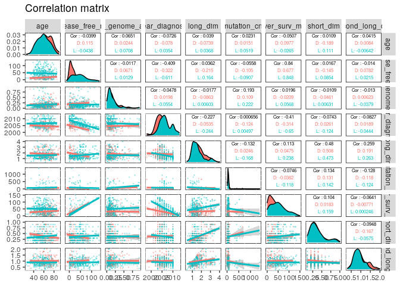
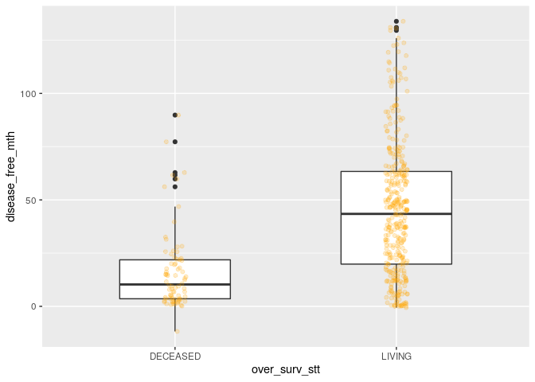
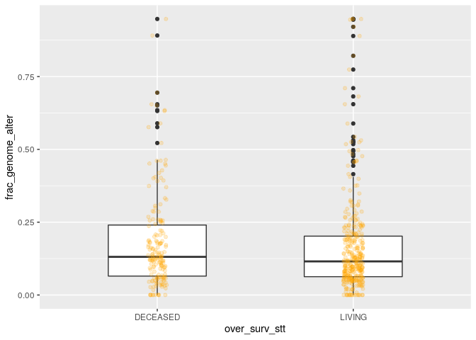
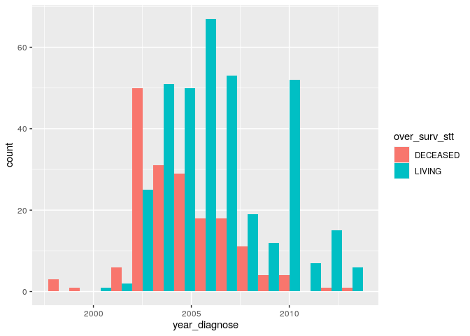
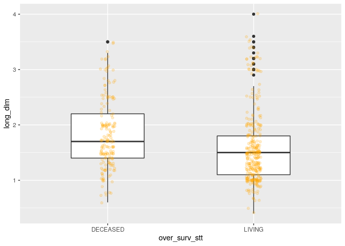
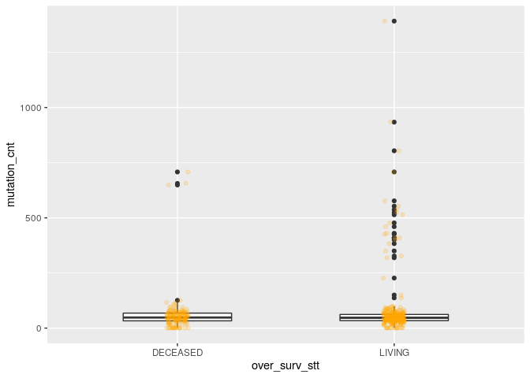
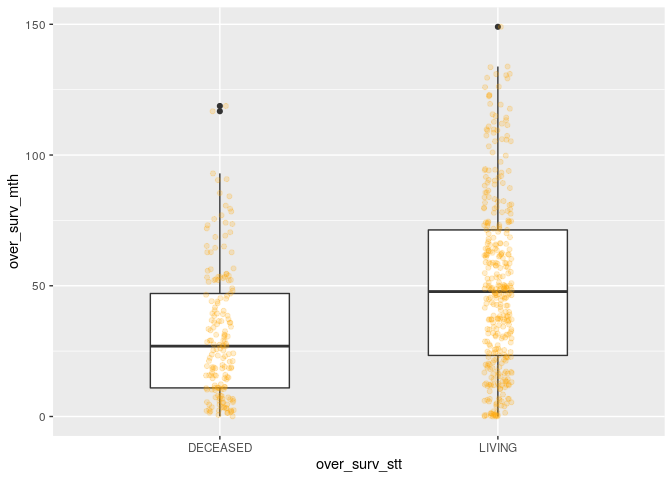
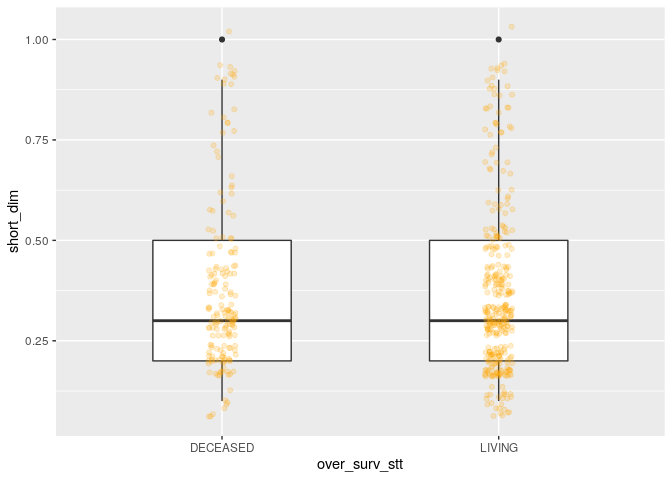
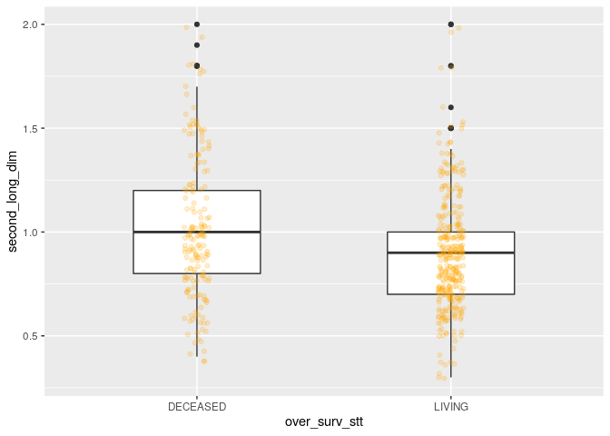

A correlation analysis of clinical variables of TCGA-KIRC patients
================

This project contains a pipeline of clinical analysis of the Cancer
Genome Atlas Kidney Renal Clear Cell Carcinoma (TCGA-KIRC) data of
patients from [Genomic Data Commons Data
Portal](https://portal.gdc.cancer.gov/exploration?filters=%7B%22op%22%3A%22and%22%2C%22content%22%3A%5B%7B%22op%22%3A%22in%22%2C%22content%22%3A%7B%22field%22%3A%22cases.project.project_id%22%2C%22value%22%3A%5B%22TCGA-KIRC%22%5D%7D%7D%5D%7D)
and [cBioPortal](https://www.cbioportal.org/study/summary?id=kirp_tcga).

Previously, we presented [an exploratory preprocessing
analysis](1.preprocessing.md). In this section, we present a correlation
analysis with t-test and ANOVA test to investigate significative
distinctions between clinical variables according to their vital status.

## 1\. Importing data

## 2\. Taming data

``` r
kirc_clinic <- kirc_clinic %>%
  mutate_if(is.character, as.factor) %>%
  mutate(patient_id = as.character(patient_id))
```

## 3\. Checking categorical variables

check frequency, lables and levels

``` r
kirc_clinic %>%
  select_if(is.factor) %>%
  summary() 
```

    ##  metastasis_stg neoplasm_ln_stg    neoplasm_stg   tumor_stg  
    ##  M0  :426       N0:240          Stage I  :269   T1a    :142  
    ##  M1  : 79       N1: 17          Stage II : 57   T3a    :122  
    ##  MX  : 30       NX:280          Stage III:125   T1b    :111  
    ##  NA's:  2                       Stage IV : 83   T2     : 55  
    ##                                 NA's     :  3   T3b    : 53  
    ##                                                 T1     : 22  
    ##                                                 (Other): 32  
    ##             disease_free_stt                  ethnicity   histology_grd
    ##  DiseaseFree        :311     HISPANIC OR LATINO    : 26   G1  : 14     
    ##  Recurred/Progressed:127     NOT HISPANIC OR LATINO:359   G2  :230     
    ##  NA's               : 99     NA's                  :152   G3  :207     
    ##                                                           G4  : 78     
    ##                                                           GX  :  5     
    ##                                                           NA's:  3     
    ##                                                                        
    ##     hemoglobin  neoadj_therapy
    ##  Elevated:  5   No :519       
    ##  Low     :263   Yes: 18       
    ##  Normal  :186                 
    ##  NA's    : 83                 
    ##                               
    ##                               
    ##                               
    ##                                            prior_cancer   tumor_lateral
    ##  No                                              :459   Bilateral:  1  
    ##  Yes                                             : 72   Left     :253  
    ##  Yes, History of Prior Malignancy                :  2   Right    :283  
    ##  Yes, History of Synchronous/Bilateral Malignancy:  4                  
    ##                                                                        
    ##                                                                        
    ##                                                                        
    ##  primer_ln_ind3  over_surv_stt     platelet   tissue_prospect
    ##  NO  :395       DECEASED:177   Elevated: 38   NO  :465       
    ##  YES :135       LIVING  :360   Low     : 46   YES : 52       
    ##  NA's:  7                      Normal  :360   NA's: 20       
    ##                                NA's    : 93                  
    ##                                                              
    ##                                                              
    ##                                                              
    ##                         race     tissue_retrospect     serum_ca       sex     
    ##  ASIAN                    :  8   NO  : 53          Elevated: 10   Female:191  
    ##  BLACK OR AFRICAN AMERICAN: 56   YES :466          Low     :204   Male  :345  
    ##  WHITE                    :466   NA's: 18          Normal  :151   MALE  :  1  
    ##  NA's                     :  7                     NA's    :172               
    ##                                                                               
    ##                                                                               
    ##                                                                               
    ##   tissue_site  person_neoplasm_stt       wbc     
    ##  BP     :142   TUMOR FREE:361      Elevated:164  
    ##  B0     :107   WITH TUMOR:141      Low     :  9  
    ##  CJ     : 71   NA's      : 35      Normal  :268  
    ##  A3     : 52                       NA's    : 96  
    ##  CZ     : 40                                     
    ##  (Other):106                                     
    ##  NA's   : 19

``` r
# agregating levels
kirc_clinic <- kirc_clinic %>%
  mutate(tumor_stg = fct_collapse(tumor_stg,
                                  T1 = c('T1', 'T1a', 'T1b'),
                                  T2 = c('T2', 'T2a', 'T2b'),
                                  T3 = c('T3', 'T3a', 'T3b', 'T3c')))

kirc_clinic <- kirc_clinic %>%
  mutate(prior_cancer = fct_collapse(prior_cancer, 
                                     Yes = c('Yes', 'Yes, History of Prior Malignancy', 'Yes, History of Synchronous/Bilateral Malignancy')))

kirc_clinic <- kirc_clinic %>%
  mutate(sex = fct_collapse(sex, Male = c('MALE', 'Male')))

kirc_clinic <- kirc_clinic %>%
  mutate(tissue_site = fct_collapse(tissue_site,
                                    A = c('A3', 'AK', 'AS'),
                                    B = c('B0', 'B2', 'B4', 'B8', 'BP'),
                                    C = c('CJ', 'CW', 'CZ'),
                                    G = c('G6', 'GK'),
                                    M = c('MM', 'MW')))

# droping levels
kirc_clinic <- kirc_clinic %>%
  mutate(race = fct_recode(race, NULL = 'ASIAN'))

kirc_clinic <- kirc_clinic %>%
  mutate(tissue_site = fct_recode(tissue_site, NULL = '3Z', NULL='6D', NULL='DV', NULL='EU', NULL='G', NULL='M', NULL='T7'))
```

## 4\. Checking variables

``` r
glimpse(kirc_clinic)
```

    ## Rows: 537
    ## Columns: 32
    ## $ patient_id          <chr> "TCGA-3Z-A93Z", "TCGA-6D-AA2E", "TCGA-A3-3306", "…
    ## $ age                 <dbl> 69, 68, 67, 66, 77, 57, 59, 57, 67, 70, 52, 51, 5…
    ## $ metastasis_stg      <fct> M0, MX, M0, M0, M0, M0, M0, M0, M0, M0, M0, M0, M…
    ## $ neoplasm_ln_stg     <fct> N0, NX, N0, N0, N0, NX, N0, NX, N0, NX, NX, NX, N…
    ## $ neoplasm_stg        <fct> Stage I, Stage I, Stage I, Stage III, Stage III, …
    ## $ tumor_stg           <fct> T1, T1, T1, T3, T3, T1, T1, T2, T2, T1, T1, T1, T…
    ## $ disease_free_mth    <dbl> 12.65, 11.89, 36.79, 47.17, 0.53, NA, NA, 49.05, …
    ## $ disease_free_stt    <fct> DiseaseFree, DiseaseFree, DiseaseFree, DiseaseFre…
    ## $ ethnicity           <fct> NOT HISPANIC OR LATINO, NOT HISPANIC OR LATINO, N…
    ## $ frac_genome_alter   <dbl> 0.2240, 0.0000, 0.2316, 0.0494, 0.0844, 0.0883, 0…
    ## $ histology_grd       <fct> G2, G2, G3, G3, G2, G2, G3, G3, G2, G2, G1, G2, G…
    ## $ hemoglobin          <fct> Normal, NA, NA, NA, Normal, Low, Low, NA, NA, NA,…
    ## $ neoadj_therapy      <fct> No, No, No, No, No, No, No, No, No, No, No, No, N…
    ## $ prior_cancer        <fct> No, No, No, Yes, No, No, No, No, No, No, No, No, …
    ## $ year_diagnose       <dbl> 2013, 2013, 2005, 2005, 2006, 2005, 2005, 2005, 2…
    ## $ tumor_lateral       <fct> Right, Right, Left, Right, Right, Right, Right, L…
    ## $ long_dim            <dbl> NA, NA, 0.9, 1.0, 1.2, 1.7, 2.0, 1.7, 1.5, 1.5, 1…
    ## $ primer_ln_ind3      <fct> NO, NO, NO, YES, NO, NO, NA, NO, NO, NO, NO, NO, …
    ## $ mutation_cnt        <dbl> NA, NA, NA, NA, 514, 56, 656, 577, 62, 537, 477, …
    ## $ over_surv_mth       <dbl> 12.65, 11.89, 36.79, 47.17, 0.53, 39.13, 24.15, 4…
    ## $ over_surv_stt       <fct> LIVING, LIVING, LIVING, LIVING, LIVING, DECEASED,…
    ## $ platelet            <fct> Normal, NA, NA, NA, Normal, NA, NA, NA, NA, NA, N…
    ## $ tissue_prospect     <fct> YES, YES, NO, NO, NO, NO, NO, NO, NO, NO, NO, NO,…
    ## $ race                <fct> BLACK OR AFRICAN AMERICAN, BLACK OR AFRICAN AMERI…
    ## $ tissue_retrospect   <fct> NO, NO, YES, YES, YES, YES, YES, YES, YES, YES, Y…
    ## $ serum_ca            <fct> Normal, NA, NA, NA, Normal, NA, NA, NA, NA, NA, N…
    ## $ sex                 <fct> Male, Female, Male, Male, Female, Male, Male, Mal…
    ## $ short_dim           <dbl> NA, NA, 0.4, 0.6, 0.4, 0.4, 0.8, 0.8, 0.3, 0.4, 0…
    ## $ second_long_dim     <dbl> NA, NA, 0.7, 0.8, 1.0, 1.0, 0.9, 0.8, 1.0, 1.1, 0…
    ## $ tissue_site         <fct> NA, NA, A, A, A, A, A, A, A, A, A, A, A, A, A, A,…
    ## $ person_neoplasm_stt <fct> TUMOR FREE, TUMOR FREE, NA, WITH TUMOR, TUMOR FRE…
    ## $ wbc                 <fct> Normal, NA, NA, NA, Normal, NA, NA, NA, NA, NA, N…

``` r
skim(kirc_clinic) 
```

|                                                  |              |
| :----------------------------------------------- | :----------- |
| Name                                             | kirc\_clinic |
| Number of rows                                   | 537          |
| Number of columns                                | 32           |
| \_\_\_\_\_\_\_\_\_\_\_\_\_\_\_\_\_\_\_\_\_\_\_   |              |
| Column type frequency:                           |              |
| character                                        | 1            |
| factor                                           | 22           |
| numeric                                          | 9            |
| \_\_\_\_\_\_\_\_\_\_\_\_\_\_\_\_\_\_\_\_\_\_\_\_ |              |
| Group variables                                  | None         |

Data summary

**Variable type:
character**

| skim\_variable | n\_missing | complete\_rate | min | max | empty | n\_unique | whitespace |
| :------------- | ---------: | -------------: | --: | --: | ----: | --------: | ---------: |
| patient\_id    |          0 |              1 |  12 |  12 |     0 |       537 |          0 |

**Variable type:
factor**

| skim\_variable        | n\_missing | complete\_rate | ordered | n\_unique | top\_counts                          |
| :-------------------- | ---------: | -------------: | :------ | --------: | :----------------------------------- |
| metastasis\_stg       |          2 |           1.00 | FALSE   |         3 | M0: 426, M1: 79, MX: 30              |
| neoplasm\_ln\_stg     |          0 |           1.00 | FALSE   |         3 | NX: 280, N0: 240, N1: 17             |
| neoplasm\_stg         |          3 |           0.99 | FALSE   |         4 | Sta: 269, Sta: 125, Sta: 83, Sta: 57 |
| tumor\_stg            |          0 |           1.00 | FALSE   |         4 | T1: 275, T3: 182, T2: 69, T4: 11     |
| disease\_free\_stt    |         99 |           0.82 | FALSE   |         2 | Dis: 311, Rec: 127                   |
| ethnicity             |        152 |           0.72 | FALSE   |         2 | NOT: 359, HIS: 26                    |
| histology\_grd        |          3 |           0.99 | FALSE   |         5 | G2: 230, G3: 207, G4: 78, G1: 14     |
| hemoglobin            |         83 |           0.85 | FALSE   |         3 | Low: 263, Nor: 186, Ele: 5           |
| neoadj\_therapy       |          0 |           1.00 | FALSE   |         2 | No: 519, Yes: 18                     |
| prior\_cancer         |          0 |           1.00 | FALSE   |         2 | No: 459, Yes: 78                     |
| tumor\_lateral        |          0 |           1.00 | FALSE   |         3 | Rig: 283, Lef: 253, Bil: 1           |
| primer\_ln\_ind3      |          7 |           0.99 | FALSE   |         2 | NO: 395, YES: 135                    |
| over\_surv\_stt       |          0 |           1.00 | FALSE   |         2 | LIV: 360, DEC: 177                   |
| platelet              |         93 |           0.83 | FALSE   |         3 | Nor: 360, Low: 46, Ele: 38           |
| tissue\_prospect      |         20 |           0.96 | FALSE   |         2 | NO: 465, YES: 52                     |
| race                  |         15 |           0.97 | FALSE   |         2 | WHI: 466, BLA: 56                    |
| tissue\_retrospect    |         18 |           0.97 | FALSE   |         2 | YES: 466, NO: 53                     |
| serum\_ca             |        172 |           0.68 | FALSE   |         3 | Low: 204, Nor: 151, Ele: 10          |
| sex                   |          0 |           1.00 | FALSE   |         2 | Mal: 346, Fem: 191                   |
| tissue\_site          |         28 |           0.95 | FALSE   |         3 | B: 303, C: 127, A: 79                |
| person\_neoplasm\_stt |         35 |           0.93 | FALSE   |         2 | TUM: 361, WIT: 141                   |
| wbc                   |         96 |           0.82 | FALSE   |         3 | Nor: 268, Ele: 164, Low: 9           |

**Variable type:
numeric**

| skim\_variable      | n\_missing | complete\_rate |    mean |     sd |      p0 |     p25 |     p50 |     p75 |    p100 | hist  |
| :------------------ | ---------: | -------------: | ------: | -----: | ------: | ------: | ------: | ------: | ------: | :---- |
| age                 |          0 |           1.00 |   60.59 |  12.15 |   26.00 |   52.00 |   61.00 |   70.00 |   90.00 | ▁▅▇▆▂ |
| disease\_free\_mth  |         99 |           0.82 |   40.24 |  31.66 | \-11.79 |   13.43 |   36.20 |   60.51 |  133.84 | ▇▇▇▂▂ |
| frac\_genome\_alter |          9 |           0.98 |    0.17 |   0.17 |    0.00 |    0.06 |    0.12 |    0.21 |    0.95 | ▇▂▁▁▁ |
| year\_diagnose      |          0 |           1.00 | 2006.02 |   2.76 | 1998.00 | 2004.00 | 2006.00 | 2007.00 | 2013.00 | ▁▆▇▃▁ |
| long\_dim           |         35 |           0.93 |    1.66 |   0.66 |    0.40 |    1.20 |    1.50 |    2.00 |    4.00 | ▃▇▃▂▁ |
| mutation\_cnt       |         86 |           0.84 |   73.85 | 127.76 |    1.00 |   34.00 |   48.00 |   65.50 | 1392.00 | ▇▁▁▁▁ |
| over\_surv\_mth     |          0 |           1.00 |   44.26 |  32.25 |    0.00 |   18.10 |   38.96 |   63.21 |  149.05 | ▇▇▃▂▁ |
| short\_dim          |         35 |           0.93 |    0.38 |   0.21 |    0.10 |    0.20 |    0.30 |    0.50 |    1.00 | ▆▇▂▁▁ |
| second\_long\_dim   |         35 |           0.93 |    0.94 |   0.31 |    0.30 |    0.70 |    0.90 |    1.10 |    2.00 | ▃▇▆▂▁ |

``` r
#View(kirc_clinic)
```

## 5\. Numeric variables vs. over\_surv\_stt

graphic visualization and t-test

``` r
# PATRICK: codigo para analizar todas as variaveis numericas?
kirc_clinic %>%
  select_if(is.numeric) %>%
  summary()
```

    ##       age        disease_free_mth frac_genome_alter year_diagnose 
    ##  Min.   :26.00   Min.   :-11.79   Min.   :0.00000   Min.   :1998  
    ##  1st Qu.:52.00   1st Qu.: 13.43   1st Qu.:0.06295   1st Qu.:2004  
    ##  Median :61.00   Median : 36.20   Median :0.12065   Median :2006  
    ##  Mean   :60.59   Mean   : 40.24   Mean   :0.17016   Mean   :2006  
    ##  3rd Qu.:70.00   3rd Qu.: 60.51   3rd Qu.:0.20885   3rd Qu.:2007  
    ##  Max.   :90.00   Max.   :133.84   Max.   :0.94770   Max.   :2013  
    ##                  NA's   :99       NA's   :9                       
    ##     long_dim      mutation_cnt     over_surv_mth      short_dim     
    ##  Min.   :0.400   Min.   :   1.00   Min.   :  0.00   Min.   :0.1000  
    ##  1st Qu.:1.200   1st Qu.:  34.00   1st Qu.: 18.10   1st Qu.:0.2000  
    ##  Median :1.500   Median :  48.00   Median : 38.96   Median :0.3000  
    ##  Mean   :1.662   Mean   :  73.85   Mean   : 44.26   Mean   :0.3759  
    ##  3rd Qu.:2.000   3rd Qu.:  65.50   3rd Qu.: 63.21   3rd Qu.:0.5000  
    ##  Max.   :4.000   Max.   :1392.00   Max.   :149.05   Max.   :1.0000  
    ##  NA's   :35      NA's   :86                         NA's   :35      
    ##  second_long_dim 
    ##  Min.   :0.3000  
    ##  1st Qu.:0.7000  
    ##  Median :0.9000  
    ##  Mean   :0.9368  
    ##  3rd Qu.:1.1000  
    ##  Max.   :2.0000  
    ##  NA's   :35

``` r
ggplot(kirc_clinic, aes(age, fill= over_surv_stt)) +
  geom_histogram(bins = 15, position = "dodge")
```

<!-- -->

``` r
t.test(kirc_clinic$age ~ kirc_clinic$over_surv_stt) 
```

    ## 
    ##  Welch Two Sample t-test
    ## 
    ## data:  kirc_clinic$age by kirc_clinic$over_surv_stt
    ## t = 4.887, df = 348.17, p-value = 1.565e-06
    ## alternative hypothesis: true difference in means is not equal to 0
    ## 95 percent confidence interval:
    ##  3.196986 7.503485
    ## sample estimates:
    ## mean in group DECEASED   mean in group LIVING 
    ##               64.18079               58.83056

``` r
ggplot(kirc_clinic, aes(x=over_surv_stt, y=disease_free_mth)) +
  geom_boxplot(width = .5) +
  geom_jitter(width = 0.05, alpha = 0.2, color = "orange")
```

    ## Warning: Removed 99 rows containing non-finite values (stat_boxplot).

    ## Warning: Removed 99 rows containing missing values (geom_point).

<!-- -->

``` r
t.test(kirc_clinic$disease_free_mth ~ kirc_clinic$over_surv_stt) 
```

    ## 
    ##  Welch Two Sample t-test
    ## 
    ## data:  kirc_clinic$disease_free_mth by kirc_clinic$over_surv_stt
    ## t = -10.985, df = 188.22, p-value < 2.2e-16
    ## alternative hypothesis: true difference in means is not equal to 0
    ## 95 percent confidence interval:
    ##  -34.63580 -24.08972
    ## sample estimates:
    ## mean in group DECEASED   mean in group LIVING 
    ##               16.10846               45.47122

``` r
ggplot(kirc_clinic, aes(x=over_surv_stt, y=frac_genome_alter)) +
  geom_boxplot(width = .5) +
  geom_jitter(width = 0.05, alpha = 0.2, color = "orange")
```

    ## Warning: Removed 9 rows containing non-finite values (stat_boxplot).

    ## Warning: Removed 9 rows containing missing values (geom_point).

<!-- -->

``` r
t.test(kirc_clinic$frac_genome_alter ~ kirc_clinic$over_surv_stt)
```

    ## 
    ##  Welch Two Sample t-test
    ## 
    ## data:  kirc_clinic$frac_genome_alter by kirc_clinic$over_surv_stt
    ## t = 1.196, df = 343.6, p-value = 0.2325
    ## alternative hypothesis: true difference in means is not equal to 0
    ## 95 percent confidence interval:
    ##  -0.01199882  0.04923234
    ## sample estimates:
    ## mean in group DECEASED   mean in group LIVING 
    ##              0.1826051              0.1639884

``` r
ggplot(kirc_clinic, aes(year_diagnose, fill= over_surv_stt)) +
  geom_histogram(bins = 15, position = "dodge")
```

<!-- -->

``` r
t.test(kirc_clinic$year_diagnose ~ kirc_clinic$over_surv_stt) 
```

    ## 
    ##  Welch Two Sample t-test
    ## 
    ## data:  kirc_clinic$year_diagnose by kirc_clinic$over_surv_stt
    ## t = -8.898, df = 377.09, p-value < 2.2e-16
    ## alternative hypothesis: true difference in means is not equal to 0
    ## 95 percent confidence interval:
    ##  -2.510367 -1.601685
    ## sample estimates:
    ## mean in group DECEASED   mean in group LIVING 
    ##               2004.638               2006.694

``` r
ggplot(kirc_clinic, aes(x=over_surv_stt, y=long_dim)) +
  geom_boxplot(width = .5) +
  geom_jitter(width = 0.05, alpha = 0.2, color = "orange")
```

    ## Warning: Removed 35 rows containing non-finite values (stat_boxplot).

    ## Warning: Removed 35 rows containing missing values (geom_point).

<!-- -->

``` r
t.test(kirc_clinic$long_dim ~ kirc_clinic$over_surv_stt)
```

    ## 
    ##  Welch Two Sample t-test
    ## 
    ## data:  kirc_clinic$long_dim by kirc_clinic$over_surv_stt
    ## t = 4.1297, df = 363.45, p-value = 4.51e-05
    ## alternative hypothesis: true difference in means is not equal to 0
    ## 95 percent confidence interval:
    ##  0.1295804 0.3651751
    ## sample estimates:
    ## mean in group DECEASED   mean in group LIVING 
    ##               1.824277               1.576900

``` r
ggplot(kirc_clinic, aes(x=over_surv_stt, y=mutation_cnt)) +
  geom_boxplot(width = .5) +
  geom_jitter(width = 0.05, alpha = 0.2, color = "orange")
```

    ## Warning: Removed 86 rows containing non-finite values (stat_boxplot).

    ## Warning: Removed 86 rows containing missing values (geom_point).

<!-- -->

``` r
t.test(kirc_clinic$mutation_cnt ~ kirc_clinic$over_surv_stt)
```

    ## 
    ##  Welch Two Sample t-test
    ## 
    ## data:  kirc_clinic$mutation_cnt by kirc_clinic$over_surv_stt
    ## t = -1.8306, df = 428.83, p-value = 0.06786
    ## alternative hypothesis: true difference in means is not equal to 0
    ## 95 percent confidence interval:
    ##  -41.980661   1.492307
    ## sample estimates:
    ## mean in group DECEASED   mean in group LIVING 
    ##               60.47059               80.71477

``` r
ggplot(kirc_clinic, aes(x=over_surv_stt, y=over_surv_mth)) +
  geom_boxplot(width = .5) +
  geom_jitter(width = 0.05, alpha = 0.2, color = "orange")
```

<!-- -->

``` r
t.test(kirc_clinic$over_surv_mth ~ kirc_clinic$over_surv_stt)
```

    ## 
    ##  Welch Two Sample t-test
    ## 
    ## data:  kirc_clinic$over_surv_mth by kirc_clinic$over_surv_stt
    ## t = -7.3172, df = 450.92, p-value = 1.169e-12
    ## alternative hypothesis: true difference in means is not equal to 0
    ## 95 percent confidence interval:
    ##  -23.99320 -13.83372
    ## sample estimates:
    ## mean in group DECEASED   mean in group LIVING 
    ##               31.57734               50.49081

``` r
ggplot(kirc_clinic, aes(x=over_surv_stt, y=short_dim)) +
  geom_boxplot(width = .5) +
  geom_jitter(width = 0.05, alpha = 0.2, color = "orange")
```

    ## Warning: Removed 35 rows containing non-finite values (stat_boxplot).

    ## Warning: Removed 35 rows containing missing values (geom_point).

<!-- -->

``` r
t.test(kirc_clinic$short_dim ~ kirc_clinic$over_surv_stt)
```

    ## 
    ##  Welch Two Sample t-test
    ## 
    ## data:  kirc_clinic$short_dim by kirc_clinic$over_surv_stt
    ## t = 0.47841, df = 344.68, p-value = 0.6327
    ## alternative hypothesis: true difference in means is not equal to 0
    ## 95 percent confidence interval:
    ##  -0.02935985  0.04823295
    ## sample estimates:
    ## mean in group DECEASED   mean in group LIVING 
    ##              0.3820809              0.3726444

``` r
ggplot(kirc_clinic, aes(x=over_surv_stt, y=second_long_dim)) +
  geom_boxplot(width = .5) +
  geom_jitter(width = 0.05, alpha = 0.2, color = "orange")
```

    ## Warning: Removed 35 rows containing non-finite values (stat_boxplot).
    
    ## Warning: Removed 35 rows containing missing values (geom_point).

<!-- -->

``` r
t.test(kirc_clinic$second_long_dim ~ kirc_clinic$over_surv_stt)
```

    ## 
    ##  Welch Two Sample t-test
    ## 
    ## data:  kirc_clinic$second_long_dim by kirc_clinic$over_surv_stt
    ## t = 4.0639, df = 287.92, p-value = 6.231e-05
    ## alternative hypothesis: true difference in means is not equal to 0
    ## 95 percent confidence interval:
    ##  0.06333111 0.18229322
    ## sample estimates:
    ## mean in group DECEASED   mean in group LIVING 
    ##              1.0173410              0.8945289

``` r
# fazer uma table com as variaveis dependentes, indpendente e p-valores
```

## 4\. Categorical variables vs. over\_surv\_stt

Tabulation and chi-square test

``` r
# talvez isso possa sair uma vez que ja tem a mesma analise com tablefit
kirc_clinic %>%
  select_if(is.factor) %>%
  summary() 
```

    ##  metastasis_stg neoplasm_ln_stg    neoplasm_stg tumor_stg
    ##  M0  :426       N0:240          Stage I  :269   T1:275   
    ##  M1  : 79       N1: 17          Stage II : 57   T2: 69   
    ##  MX  : 30       NX:280          Stage III:125   T3:182   
    ##  NA's:  2                       Stage IV : 83   T4: 11   
    ##                                 NA's     :  3            
    ##                                                          
    ##             disease_free_stt                  ethnicity   histology_grd
    ##  DiseaseFree        :311     HISPANIC OR LATINO    : 26   G1  : 14     
    ##  Recurred/Progressed:127     NOT HISPANIC OR LATINO:359   G2  :230     
    ##  NA's               : 99     NA's                  :152   G3  :207     
    ##                                                           G4  : 78     
    ##                                                           GX  :  5     
    ##                                                           NA's:  3     
    ##     hemoglobin  neoadj_therapy prior_cancer   tumor_lateral primer_ln_ind3
    ##  Elevated:  5   No :519        No :459      Bilateral:  1   NO  :395      
    ##  Low     :263   Yes: 18        Yes: 78      Left     :253   YES :135      
    ##  Normal  :186                               Right    :283   NA's:  7      
    ##  NA's    : 83                                                             
    ##                                                                           
    ##                                                                           
    ##   over_surv_stt     platelet   tissue_prospect                        race    
    ##  DECEASED:177   Elevated: 38   NO  :465        BLACK OR AFRICAN AMERICAN: 56  
    ##  LIVING  :360   Low     : 46   YES : 52        WHITE                    :466  
    ##                 Normal  :360   NA's: 20        NA's                     : 15  
    ##                 NA's    : 93                                                  
    ##                                                                               
    ##                                                                               
    ##  tissue_retrospect     serum_ca       sex      tissue_site person_neoplasm_stt
    ##  NO  : 53          Elevated: 10   Female:191   A   : 79    TUMOR FREE:361     
    ##  YES :466          Low     :204   Male  :346   B   :303    WITH TUMOR:141     
    ##  NA's: 18          Normal  :151                C   :127    NA's      : 35     
    ##                    NA's    :172                NA's: 28                       
    ##                                                                               
    ##                                                                               
    ##        wbc     
    ##  Elevated:164  
    ##  Low     :  9  
    ##  Normal  :268  
    ##  NA's    : 96  
    ##                
    ## 

``` r
t_metas_stg <- table(kirc_clinic$metastasis_stg, kirc_clinic$over_surv_stt, exclude = NULL)
t_metas_stg <- addmargins(round(100*prop.table(t_metas_stg)))
t_metas_stg
```

    ##       
    ##        DECEASED LIVING Sum
    ##   M0         20     59  79
    ##   M1         12      3  15
    ##   MX          1      5   6
    ##   <NA>        0      0   0
    ##   Sum        33     67 100

``` r
chisq.test(x = kirc_clinic$metastasis_stg, y = kirc_clinic$over_surv_stt) 
```

    ## 
    ##  Pearson's Chi-squared test
    ## 
    ## data:  kirc_clinic$metastasis_stg and kirc_clinic$over_surv_stt
    ## X-squared = 99.343, df = 2, p-value < 2.2e-16

``` r
t_lynph <- table(kirc_clinic$neoplasm_ln_stg, kirc_clinic$over_surv_stt, exclude = NULL)
t_lynph <- addmargins(round(100*prop.table(t_lynph)))
t_lynph
```

    ##      
    ##       DECEASED LIVING Sum
    ##   N0        16     29  45
    ##   N1         2      1   3
    ##   NX        15     37  52
    ##   Sum       33     67 100

``` r
chisq.test(x = kirc_clinic$neoplasm_ln_stg, y = kirc_clinic$over_surv_stt) 
```

    ## 
    ##  Pearson's Chi-squared test
    ## 
    ## data:  kirc_clinic$neoplasm_ln_stg and kirc_clinic$over_surv_stt
    ## X-squared = 13.989, df = 2, p-value = 0.0009169

``` r
t_neop <- table(kirc_clinic$neoplasm_stg, kirc_clinic$over_surv_stt, exclude = NULL)
t_neop <- addmargins(round(100*prop.table(t_neop)))
t_neop
```

    ##            
    ##             DECEASED LIVING Sum
    ##   Stage I          8     42  50
    ##   Stage II         2      8  10
    ##   Stage III        9     14  23
    ##   Stage IV        12      3  15
    ##   <NA>             0      0   0
    ##   Sum             31     67  98

``` r
chisq.test(x = kirc_clinic$neoplasm_stg, y = kirc_clinic$over_surv_stt) 
```

    ## 
    ##  Pearson's Chi-squared test
    ## 
    ## data:  kirc_clinic$neoplasm_stg and kirc_clinic$over_surv_stt
    ## X-squared = 123.9, df = 3, p-value < 2.2e-16

``` r
t_tumor <- table(kirc_clinic$tumor_stg, kirc_clinic$over_surv_stt, exclude = NULL)
t_tumor <- addmargins(round(100*prop.table(t_tumor)))
t_tumor
```

    ##      
    ##       DECEASED LIVING Sum
    ##   T1         9     42  51
    ##   T2         4      9  13
    ##   T3        18     16  34
    ##   T4         2      0   2
    ##   Sum       33     67 100

``` r
chisq.test(x = kirc_clinic$tumor_stg, y = kirc_clinic$over_surv_stt) 
```

    ## Warning in chisq.test(x = kirc_clinic$tumor_stg, y = kirc_clinic$over_surv_stt):
    ## Chi-squared approximation may be incorrect

    ## 
    ##  Pearson's Chi-squared test
    ## 
    ## data:  kirc_clinic$tumor_stg and kirc_clinic$over_surv_stt
    ## X-squared = 76.345, df = 3, p-value < 2.2e-16

``` r
t_free <- table(kirc_clinic$disease_free_stt, kirc_clinic$over_surv_stt, exclude = NULL)
t_free <- addmargins(round(100*prop.table(t_free)))
t_free
```

    ##                      
    ##                       DECEASED LIVING Sum
    ##   DiseaseFree                0     58  58
    ##   Recurred/Progressed       15      9  24
    ##   <NA>                      18      0  18
    ##   Sum                       33     67 100

``` r
chisq.test(x = kirc_clinic$disease_free_stt, y = kirc_clinic$over_surv_stt) 
```

    ## 
    ##  Pearson's Chi-squared test with Yates' continuity correction
    ## 
    ## data:  kirc_clinic$disease_free_stt and kirc_clinic$over_surv_stt
    ## X-squared = 228.22, df = 1, p-value < 2.2e-16

``` r
t_prior <- table(kirc_clinic$prior_cancer, kirc_clinic$over_surv_stt, exclude = NULL)
t_prior <- addmargins(round(100*prop.table(t_prior)))
t_prior
```

    ##      
    ##       DECEASED LIVING Sum
    ##   No        28     57  85
    ##   Yes        4     10  14
    ##   Sum       32     67  99

``` r
chisq.test(x = kirc_clinic$prior_cancer, y = kirc_clinic$over_surv_stt) 
```

    ## 
    ##  Pearson's Chi-squared test with Yates' continuity correction
    ## 
    ## data:  kirc_clinic$prior_cancer and kirc_clinic$over_surv_stt
    ## X-squared = 0.0993, df = 1, p-value = 0.7527

``` r
t_neo <- table(kirc_clinic$neoadj_therapy, kirc_clinic$over_surv_stt, exclude = NULL)
t_neo <- addmargins(round(100*prop.table(t_neo)))
t_neo
```

    ##      
    ##       DECEASED LIVING Sum
    ##   No        31     66  97
    ##   Yes        2      1   3
    ##   Sum       33     67 100

``` r
chisq.test(x = kirc_clinic$neoadj_therapy, y = kirc_clinic$over_surv_stt) 
```

    ## 
    ##  Pearson's Chi-squared test with Yates' continuity correction
    ## 
    ## data:  kirc_clinic$neoadj_therapy and kirc_clinic$over_surv_stt
    ## X-squared = 3.31, df = 1, p-value = 0.06886

``` r
t_platelet <- table(kirc_clinic$platelet, kirc_clinic$over_surv_stt, exclude = NULL)
t_platelet <- addmargins(round(100*prop.table(t_platelet)))
t_platelet
```

    ##           
    ##            DECEASED LIVING Sum
    ##   Elevated        6      1   7
    ##   Low             4      5   9
    ##   Normal         20     47  67
    ##   <NA>            4     14  18
    ##   Sum            34     67 101

``` r
chisq.test(x = kirc_clinic$platelet, y = kirc_clinic$over_surv_stt)
```

    ## 
    ##  Pearson's Chi-squared test
    ## 
    ## data:  kirc_clinic$platelet and kirc_clinic$over_surv_stt
    ## X-squared = 37.32, df = 2, p-value = 7.871e-09

``` r
t_prospect <- table(kirc_clinic$tissue_prospect, kirc_clinic$over_surv_stt, exclude = NULL)
t_prospect <- addmargins(round(100*prop.table(t_prospect)))
t_prospect
```

    ##       
    ##        DECEASED LIVING Sum
    ##   NO         31     55  86
    ##   YES         0      9   9
    ##   <NA>        1      3   4
    ##   Sum        32     67  99

``` r
chisq.test(x = kirc_clinic$tissue_prospect, y = kirc_clinic$over_surv_stt)
```

    ## 
    ##  Pearson's Chi-squared test with Yates' continuity correction
    ## 
    ## data:  kirc_clinic$tissue_prospect and kirc_clinic$over_surv_stt
    ## X-squared = 20.87, df = 1, p-value = 4.914e-06

``` r
t_race <- table(kirc_clinic$race, kirc_clinic$over_surv_stt, exclude = NULL)
t_race <- addmargins(round(100*prop.table(t_race)))
t_race
```

    ##                            
    ##                             DECEASED LIVING Sum
    ##   BLACK OR AFRICAN AMERICAN        2      8  10
    ##   WHITE                           30     56  86
    ##   <NA>                             1      2   3
    ##   Sum                             33     66  99

``` r
chisq.test(x = kirc_clinic$race, y = kirc_clinic$over_surv_stt) 
```

    ## 
    ##  Pearson's Chi-squared test with Yates' continuity correction
    ## 
    ## data:  kirc_clinic$race and kirc_clinic$over_surv_stt
    ## X-squared = 4.6232, df = 1, p-value = 0.03154

``` r
t_retros <- table(kirc_clinic$tissue_retrospect, kirc_clinic$over_surv_stt, exclude = NULL)
t_retros <- addmargins(round(100*prop.table(t_retros)))
t_retros
```

    ##       
    ##        DECEASED LIVING Sum
    ##   NO          0      9   9
    ##   YES        31     55  86
    ##   <NA>        1      2   3
    ##   Sum        32     66  98

``` r
chisq.test(x = kirc_clinic$tissue_retrospect, y = kirc_clinic$over_surv_stt)
```

    ## 
    ##  Pearson's Chi-squared test with Yates' continuity correction
    ## 
    ## data:  kirc_clinic$tissue_retrospect and kirc_clinic$over_surv_stt
    ## X-squared = 21.295, df = 1, p-value = 3.938e-06

``` r
t_ca <- table(kirc_clinic$serum_ca, kirc_clinic$over_surv_stt, exclude = NULL)
t_ca <- addmargins(round(100*prop.table(t_ca)))
t_ca
```

    ##           
    ##            DECEASED LIVING Sum
    ##   Elevated        2      0   2
    ##   Low            12     26  38
    ##   Normal         12     17  29
    ##   <NA>            7     25  32
    ##   Sum            33     68 101

``` r
chisq.test(x = kirc_clinic$serum_ca, y = kirc_clinic$over_surv_stt) 
```

    ## Warning in chisq.test(x = kirc_clinic$serum_ca, y = kirc_clinic$over_surv_stt):
    ## Chi-squared approximation may be incorrect

    ## 
    ##  Pearson's Chi-squared test
    ## 
    ## data:  kirc_clinic$serum_ca and kirc_clinic$over_surv_stt
    ## X-squared = 14.877, df = 2, p-value = 0.0005883

``` r
t_sex <- table(kirc_clinic$sex, kirc_clinic$over_surv_stt, exclude = NULL)
t_sex <- addmargins(round(100*prop.table(t_sex)))
t_sex
```

    ##         
    ##          DECEASED LIVING Sum
    ##   Female       12     23  35
    ##   Male         21     44  65
    ##   Sum          33     67 100

``` r
chisq.test(x = kirc_clinic$sex, y = kirc_clinic$over_surv_stt) 
```

    ## 
    ##  Pearson's Chi-squared test with Yates' continuity correction
    ## 
    ## data:  kirc_clinic$sex and kirc_clinic$over_surv_stt
    ## X-squared = 0.087745, df = 1, p-value = 0.7671

``` r
t_site <- table(kirc_clinic$tissue_site, kirc_clinic$over_surv_stt, exclude = NULL)
t_site <- addmargins(round(100*prop.table(t_site)))
t_site
```

    ##       
    ##        DECEASED LIVING Sum
    ##   A           2     13  15
    ##   B          21     36  57
    ##   C           9     15  24
    ##   <NA>        1      4   5
    ##   Sum        33     68 101

``` r
chisq.test(x = kirc_clinic$tissue_site, y = kirc_clinic$over_surv_stt) 
```

    ## 
    ##  Pearson's Chi-squared test
    ## 
    ## data:  kirc_clinic$tissue_site and kirc_clinic$over_surv_stt
    ## X-squared = 16.604, df = 2, p-value = 0.0002481

``` r
t_neop_st <- table(kirc_clinic$person_neoplasm_stt, kirc_clinic$over_surv_stt, exclude = NULL)
t_neop_st <- addmargins(round(100*prop.table(t_neop_st)))
t_neop_st
```

    ##             
    ##              DECEASED LIVING Sum
    ##   TUMOR FREE       11     57  68
    ##   WITH TUMOR       20      7  27
    ##   <NA>              3      4   7
    ##   Sum              34     68 102

``` r
chisq.test(x = kirc_clinic$person_neoplasm_stt, y = kirc_clinic$over_surv_stt) 
```

    ## 
    ##  Pearson's Chi-squared test with Yates' continuity correction
    ## 
    ## data:  kirc_clinic$person_neoplasm_stt and kirc_clinic$over_surv_stt
    ## X-squared = 157.06, df = 1, p-value < 2.2e-16

``` r
t_wbc <- table(kirc_clinic$wbc, kirc_clinic$over_surv_stt, exclude = NULL)
t_wbc <- addmargins(round(100*prop.table(t_wbc)))
t_wbc
```

    ##           
    ##            DECEASED LIVING Sum
    ##   Elevated        9     22  31
    ##   Low             1      1   2
    ##   Normal         19     31  50
    ##   <NA>            4     14  18
    ##   Sum            33     68 101

``` r
chisq.test(x = kirc_clinic$wbc, y = kirc_clinic$over_surv_stt) 
```

    ## Warning in chisq.test(x = kirc_clinic$wbc, y = kirc_clinic$over_surv_stt): Chi-
    ## squared approximation may be incorrect

    ## 
    ##  Pearson's Chi-squared test
    ## 
    ## data:  kirc_clinic$wbc and kirc_clinic$over_surv_stt
    ## X-squared = 9.0853, df = 2, p-value = 0.01065

## 7\. FinalFit

summarise variables/factors by a categorical variable

``` r
explanatory <- names(kirc_clinic %>%
              select(-over_surv_stt) %>%
              select_if(is.factor))
dependent <-  'over_surv_stt'

table_fit <- kirc_clinic %>%
  summary_factorlist(dependent, explanatory, p=TRUE, add_dependent_label=TRUE)
```

    ## Warning in chisq.test(tumor_stg, over_surv_stt): Chi-squared approximation may
    ## be incorrect

    ## Warning in chisq.test(histology_grd, over_surv_stt): Chi-squared approximation
    ## may be incorrect

    ## Warning in chisq.test(hemoglobin, over_surv_stt): Chi-squared approximation may
    ## be incorrect

    ## Warning in chisq.test(tumor_lateral, over_surv_stt): Chi-squared approximation
    ## may be incorrect

    ## Warning in chisq.test(serum_ca, over_surv_stt): Chi-squared approximation may be
    ## incorrect

    ## Warning in chisq.test(wbc, over_surv_stt): Chi-squared approximation may be
    ## incorrect

    ## Warning: Factor `metastasis_stg` contains implicit NA, consider using
    ## `forcats::fct_explicit_na`

    ## Warning: Factor `neoplasm_stg` contains implicit NA, consider using
    ## `forcats::fct_explicit_na`

    ## Warning: Factor `disease_free_stt` contains implicit NA, consider using
    ## `forcats::fct_explicit_na`

    ## Warning: Factor `ethnicity` contains implicit NA, consider using
    ## `forcats::fct_explicit_na`

    ## Warning: Factor `histology_grd` contains implicit NA, consider using
    ## `forcats::fct_explicit_na`

    ## Warning: Factor `hemoglobin` contains implicit NA, consider using
    ## `forcats::fct_explicit_na`

    ## Warning: Factor `primer_ln_ind3` contains implicit NA, consider using
    ## `forcats::fct_explicit_na`

    ## Warning: Factor `platelet` contains implicit NA, consider using
    ## `forcats::fct_explicit_na`

    ## Warning: Factor `tissue_prospect` contains implicit NA, consider using
    ## `forcats::fct_explicit_na`

    ## Warning: Factor `race` contains implicit NA, consider using
    ## `forcats::fct_explicit_na`

    ## Warning: Factor `tissue_retrospect` contains implicit NA, consider using
    ## `forcats::fct_explicit_na`

    ## Warning: Factor `serum_ca` contains implicit NA, consider using
    ## `forcats::fct_explicit_na`

    ## Warning: Factor `tissue_site` contains implicit NA, consider using
    ## `forcats::fct_explicit_na`

    ## Warning: Factor `person_neoplasm_stt` contains implicit NA, consider using
    ## `forcats::fct_explicit_na`

    ## Warning: Factor `wbc` contains implicit NA, consider using
    ## `forcats::fct_explicit_na`

``` r
table_fit
```

<div data-pagedtable="false">

<script data-pagedtable-source type="application/json">
{"columns":[{"label":["Dependent: over_surv_stt"],"name":[1],"type":["chr"],"align":["left"]},{"label":[" "],"name":[2],"type":["chr"],"align":["left"]},{"label":["DECEASED"],"name":[3],"type":["chr"],"align":["left"]},{"label":["LIVING"],"name":[4],"type":["chr"],"align":["left"]},{"label":["p"],"name":[5],"type":["chr"],"align":["left"]}],"data":[{"1":"metastasis_stg","2":"M0","3":"110 (62.1)","4":"316 (88.3)","5":"<0.001"},{"1":"","2":"M1","3":"64 (36.2)","4":"15 (4.2)","5":""},{"1":"","2":"MX","3":"3 (1.7)","4":"27 (7.5)","5":""},{"1":"neoplasm_ln_stg","2":"N0","3":"85 (48.0)","4":"155 (43.1)","5":"0.001"},{"1":"","2":"N1","3":"12 (6.8)","4":"5 (1.4)","5":""},{"1":"","2":"NX","3":"80 (45.2)","4":"200 (55.6)","5":""},{"1":"neoplasm_stg","2":"Stage I","3":"45 (25.6)","4":"224 (62.6)","5":"<0.001"},{"1":"","2":"Stage II","3":"13 (7.4)","4":"44 (12.3)","5":""},{"1":"","2":"Stage III","3":"51 (29.0)","4":"74 (20.7)","5":""},{"1":"","2":"Stage IV","3":"67 (38.1)","4":"16 (4.5)","5":""},{"1":"tumor_stg","2":"T1","3":"50 (28.2)","4":"225 (62.5)","5":"<0.001"},{"1":"","2":"T2","3":"21 (11.9)","4":"48 (13.3)","5":""},{"1":"","2":"T3","3":"96 (54.2)","4":"86 (23.9)","5":""},{"1":"","2":"T4","3":"10 (5.6)","4":"1 (0.3)","5":""},{"1":"disease_free_stt","2":"Recurred/Progressed","3":"78 (100.0)","4":"49 (13.6)","5":"<0.001"},{"1":"","2":"DiseaseFree","3":"","4":"311 (86.4)","5":""},{"1":"ethnicity","2":"HISPANIC OR LATINO","3":"3 (2.2)","4":"23 (9.2)","5":"0.017"},{"1":"","2":"NOT HISPANIC OR LATINO","3":"132 (97.8)","4":"227 (90.8)","5":""},{"1":"histology_grd","2":"G2","3":"45 (25.4)","4":"185 (51.8)","5":"<0.001"},{"1":"","2":"G3","3":"74 (41.8)","4":"133 (37.3)","5":""},{"1":"","2":"G4","3":"57 (32.2)","4":"21 (5.9)","5":""},{"1":"","2":"GX","3":"1 (0.6)","4":"4 (1.1)","5":""},{"1":"","2":"G1","3":"","4":"14 (3.9)","5":""},{"1":"hemoglobin","2":"Elevated","3":"3 (1.8)","4":"2 (0.7)","5":"<0.001"},{"1":"","2":"Low","3":"118 (72.0)","4":"145 (50.0)","5":""},{"1":"","2":"Normal","3":"43 (26.2)","4":"143 (49.3)","5":""},{"1":"neoadj_therapy","2":"No","3":"167 (94.4)","4":"352 (97.8)","5":"0.069"},{"1":"","2":"Yes","3":"10 (5.6)","4":"8 (2.2)","5":""},{"1":"prior_cancer","2":"No","3":"153 (86.4)","4":"306 (85.0)","5":"0.753"},{"1":"","2":"Yes","3":"24 (13.6)","4":"54 (15.0)","5":""},{"1":"tumor_lateral","2":"Left","3":"98 (55.4)","4":"155 (43.1)","5":"0.023"},{"1":"","2":"Right","3":"79 (44.6)","4":"204 (56.7)","5":""},{"1":"","2":"Bilateral","3":"","4":"1 (0.3)","5":""},{"1":"primer_ln_ind3","2":"NO","3":"120 (68.2)","4":"275 (77.7)","5":"0.024"},{"1":"","2":"YES","3":"56 (31.8)","4":"79 (22.3)","5":""},{"1":"platelet","2":"Elevated","3":"30 (19.0)","4":"8 (2.8)","5":"<0.001"},{"1":"","2":"Low","3":"20 (12.7)","4":"26 (9.1)","5":""},{"1":"","2":"Normal","3":"108 (68.4)","4":"252 (88.1)","5":""},{"1":"tissue_prospect","2":"NO","3":"169 (98.8)","4":"296 (85.5)","5":"<0.001"},{"1":"","2":"YES","3":"2 (1.2)","4":"50 (14.5)","5":""},{"1":"race","2":"BLACK OR AFRICAN AMERICAN","3":"11 (6.3)","4":"45 (12.9)","5":"0.032"},{"1":"","2":"WHITE","3":"163 (93.7)","4":"303 (87.1)","5":""},{"1":"tissue_retrospect","2":"NO","3":"2 (1.2)","4":"51 (14.7)","5":"<0.001"},{"1":"","2":"YES","3":"169 (98.8)","4":"297 (85.3)","5":""},{"1":"serum_ca","2":"Elevated","3":"9 (6.6)","4":"1 (0.4)","5":"0.001"},{"1":"","2":"Low","3":"66 (48.2)","4":"138 (60.5)","5":""},{"1":"","2":"Normal","3":"62 (45.3)","4":"89 (39.0)","5":""},{"1":"sex","2":"Female","3":"65 (36.7)","4":"126 (35.0)","5":"0.767"},{"1":"","2":"Male","3":"112 (63.3)","4":"234 (65.0)","5":""},{"1":"tissue_site","2":"A","3":"11 (6.4)","4":"68 (20.2)","5":"<0.001"},{"1":"","2":"B","3":"112 (65.1)","4":"191 (56.7)","5":""},{"1":"","2":"C","3":"49 (28.5)","4":"78 (23.1)","5":""},{"1":"person_neoplasm_stt","2":"TUMOR FREE","3":"57 (35.2)","4":"304 (89.4)","5":"<0.001"},{"1":"","2":"WITH TUMOR","3":"105 (64.8)","4":"36 (10.6)","5":""},{"1":"wbc","2":"Elevated","3":"46 (29.5)","4":"118 (41.4)","5":"0.011"},{"1":"","2":"Low","3":"6 (3.8)","4":"3 (1.1)","5":""},{"1":"","2":"Normal","3":"104 (66.7)","4":"164 (57.5)","5":""}],"options":{"columns":{"min":{},"max":[10]},"rows":{"min":[10],"max":[10]},"pages":{}}}
  </script>

</div>

``` r
warnings()

#knitr::kable(table_fit, row.names=FALSE, align=c("l", "l", "r", "r", "r"))
```

## Further analysis

  - [A logistic regression analysis](3.logistic_regression.md) of each
    clinical variable weight.

<!-- end list -->

``` r
sessionInfo()
```

    ## R version 3.6.3 (2020-02-29)
    ## Platform: x86_64-pc-linux-gnu (64-bit)
    ## Running under: Ubuntu 18.04.4 LTS
    ## 
    ## Matrix products: default
    ## BLAS:   /usr/lib/x86_64-linux-gnu/openblas/libblas.so.3
    ## LAPACK: /usr/lib/x86_64-linux-gnu/libopenblasp-r0.2.20.so
    ## 
    ## locale:
    ##  [1] LC_CTYPE=pt_BR.UTF-8       LC_NUMERIC=C              
    ##  [3] LC_TIME=pt_BR.UTF-8        LC_COLLATE=en_US.UTF-8    
    ##  [5] LC_MONETARY=pt_BR.UTF-8    LC_MESSAGES=en_US.UTF-8   
    ##  [7] LC_PAPER=pt_BR.UTF-8       LC_NAME=C                 
    ##  [9] LC_ADDRESS=C               LC_TELEPHONE=C            
    ## [11] LC_MEASUREMENT=pt_BR.UTF-8 LC_IDENTIFICATION=C       
    ## 
    ## attached base packages:
    ## [1] stats     graphics  grDevices utils     datasets  methods   base     
    ## 
    ## other attached packages:
    ##  [1] finalfit_1.0.1  skimr_2.1.1     forcats_0.5.0   stringr_1.4.0  
    ##  [5] dplyr_0.8.5     purrr_0.3.4     readr_1.3.1     tidyr_1.0.3    
    ##  [9] tibble_3.0.1    ggplot2_3.3.0   tidyverse_1.3.0
    ## 
    ## loaded via a namespace (and not attached):
    ##  [1] Rcpp_1.0.4.6     lubridate_1.7.8  lattice_0.20-41  assertthat_0.2.1
    ##  [5] digest_0.6.25    utf8_1.1.4       R6_2.4.1         cellranger_1.1.0
    ##  [9] repr_1.1.0       backports_1.1.6  reprex_0.3.0     evaluate_0.14   
    ## [13] httr_1.4.1       highr_0.8        pillar_1.4.4     rlang_0.4.6     
    ## [17] readxl_1.3.1     rstudioapi_0.11  Matrix_1.2-18    rmarkdown_2.1   
    ## [21] labeling_0.3     splines_3.6.3    munsell_0.5.0    broom_0.5.6     
    ## [25] compiler_3.6.3   modelr_0.1.7     xfun_0.13        pkgconfig_2.0.3 
    ## [29] base64enc_0.1-3  htmltools_0.4.0  tidyselect_1.1.0 fansi_0.4.1     
    ## [33] crayon_1.3.4     dbplyr_1.4.3     withr_2.2.0      grid_3.6.3      
    ## [37] nlme_3.1-147     jsonlite_1.6.1   gtable_0.3.0     lifecycle_0.2.0 
    ## [41] DBI_1.1.0        magrittr_1.5     scales_1.1.1     cli_2.0.2       
    ## [45] stringi_1.4.6    farver_2.0.3     fs_1.4.1         mice_3.8.0      
    ## [49] xml2_1.3.2       ellipsis_0.3.0   generics_0.0.2   vctrs_0.3.0     
    ## [53] boot_1.3-25      tools_3.6.3      glue_1.4.0       hms_0.5.3       
    ## [57] survival_3.1-12  yaml_2.2.1       colorspace_1.4-1 rvest_0.3.5     
    ## [61] knitr_1.28       haven_2.2.0
