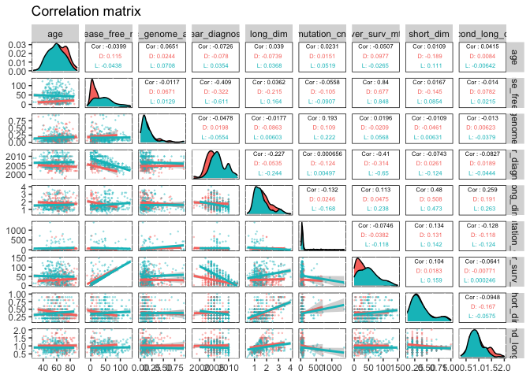
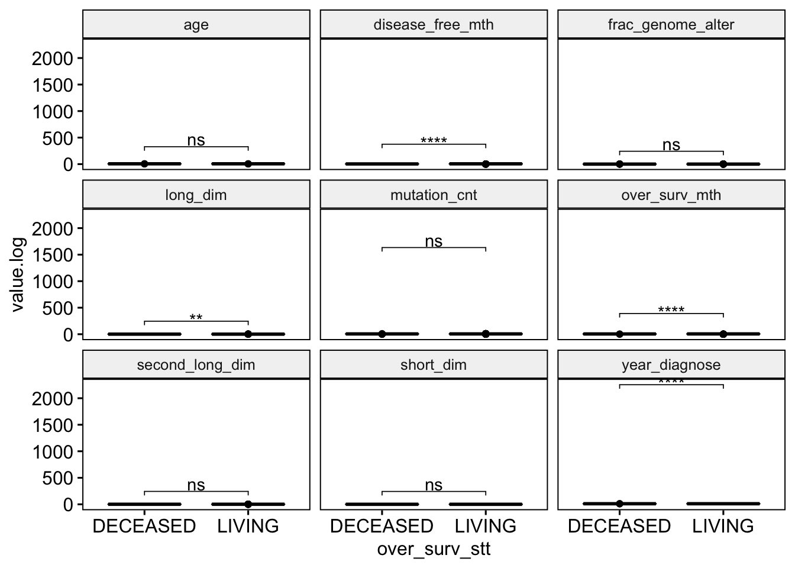

A correlation analysis of clinical variables of TCGA-KIRC patients
================

This project contains a pipeline of clinical analysis of the Cancer Genome Atlas Kidney Renal Clear Cell Carcinoma (TCGA-KIRC) data of patients, from [Genomic Data Commons Data Portal](https://portal.gdc.cancer.gov/exploration?filters=%7B%22op%22%3A%22and%22%2C%22content%22%3A%5B%7B%22op%22%3A%22in%22%2C%22content%22%3A%7B%22field%22%3A%22cases.project.project_id%22%2C%22value%22%3A%5B%22TCGA-KIRC%22%5D%7D%7D%5D%7D) and [cBioPortal](https://www.cbioportal.org/study/summary?id=kirp_tcga).

Previously, we presented [an exploratory preprocessing analysis](1.preprocessing.md). In this section, Chi-squared test is applied to compare two or more proportions of categorical variables and T-student test to compare the means of numeric ones regardind the levels of 'Overall\_Survival\_Status'. The Hypoteis test is performed and p-value indicates the strength of evidence in supportting the null hypothesis.

``` r
# Set the packages of interest
packages = c("tidyverse","skimr","finalfit","rstatix", "ggpubr","GGally", "plotly")

# if a package is installed, it will be loaded
# otherwise, the missing package(s) will be installed and loaded
package.check <- lapply(packages, FUN = function(x) {
  if (!require(x, character.only = TRUE)) {
    install.packages(x, dependencies = TRUE)
    library(x, character.only = TRUE)
  }
})

suppressMessages(library("tidyverse"))
rm(packages)
setwd(".")
```

1. Importing data
-----------------

``` r
kirc_clin <- read_csv("data/kirc_clin.csv")
```

2. Taming data
--------------

``` r
kirc_clin <- kirc_clin %>%
  mutate_if(is.character, as.factor) %>%
  mutate(patient_id = as.character(patient_id),
         age = as.integer(age),
         year_diagnose = as.integer(year_diagnose))

# check 
glimpse(kirc_clin)
```

    ## Rows: 537
    ## Columns: 32
    ## $ patient_id          <chr> "TCGA-3Z-A93Z", "TCGA-6D-AA2E", "TCGA-A3-3306", "…
    ## $ age                 <int> 69, 68, 67, 66, 77, 57, 59, 57, 67, 70, 52, 51, 5…
    ## $ metastasis_stg      <fct> M0, MX, M0, M0, M0, M0, M0, M0, M0, M0, M0, M0, M…
    ## $ neoplasm_ln_stg     <fct> N0, NX, N0, N0, N0, NX, N0, NX, N0, NX, NX, NX, N…
    ## $ neoplasm_stg        <fct> Stage I, Stage I, Stage I, Stage III, Stage III, …
    ## $ tumor_stg           <fct> T1, T1, T1, T3, T3, T1, T1, T2, T2, T1, T1, T1, T…
    ## $ disease_free_mth    <dbl> 12.65, 11.89, 36.79, 47.17, 0.53, NA, NA, 49.05, …
    ## $ disease_free_stt    <fct> DiseaseFree, DiseaseFree, DiseaseFree, DiseaseFre…
    ## $ ethnicity           <fct> not hispanic/latino, not hispanic/latino, not his…
    ## $ frac_genome_alter   <dbl> 0.2240, 0.0000, 0.2316, 0.0494, 0.0844, 0.0883, 0…
    ## $ histology_grd       <fct> G2, G2, G3, G3, G2, G2, G3, G3, G2, G2, G1, G2, G…
    ## $ hemoglobin          <fct> Normal, NA, NA, NA, Normal, Low, Low, NA, NA, NA,…
    ## $ neoadj_therapy      <fct> No, No, No, No, No, No, No, No, No, No, No, No, N…
    ## $ prior_cancer        <fct> No, No, No, Yes, No, No, No, No, No, No, No, No, …
    ## $ year_diagnose       <int> 2013, 2013, 2005, 2005, 2006, 2005, 2005, 2005, 2…
    ## $ tumor_lateral       <fct> Right, Right, Left, Right, Right, Right, Right, L…
    ## $ long_dim            <dbl> NA, NA, 0.9, 1.0, 1.2, 1.7, 2.0, 1.7, 1.5, 1.5, 1…
    ## $ primer_ln_ind3      <fct> NO, NO, NO, YES, NO, NO, NA, NO, NO, NO, NO, NO, …
    ## $ mutation_cnt        <dbl> NA, NA, NA, NA, 514, 56, 656, 577, 62, 537, 477, …
    ## $ over_surv_mth       <dbl> 12.65, 11.89, 36.79, 47.17, 0.53, 39.13, 24.15, 4…
    ## $ over_surv_stt       <fct> LIVING, LIVING, LIVING, LIVING, LIVING, DECEASED,…
    ## $ platelet            <fct> Normal, NA, NA, NA, Normal, NA, NA, NA, NA, NA, N…
    ## $ tissue_prospect     <fct> YES, YES, NO, NO, NO, NO, NO, NO, NO, NO, NO, NO,…
    ## $ race                <fct> Black/African.american, Black/African.american, W…
    ## $ tissue_retrospect   <fct> NO, NO, YES, YES, YES, YES, YES, YES, YES, YES, Y…
    ## $ serum_ca            <fct> Normal, NA, NA, NA, Normal, NA, NA, NA, NA, NA, N…
    ## $ gender              <fct> Male, Female, Male, Male, Female, Male, Male, Mal…
    ## $ short_dim           <dbl> NA, NA, 0.4, 0.6, 0.4, 0.4, 0.8, 0.8, 0.3, 0.4, 0…
    ## $ second_long_dim     <dbl> NA, NA, 0.7, 0.8, 1.0, 1.0, 0.9, 0.8, 1.0, 1.1, 0…
    ## $ tissue_site         <fct> OTHERS, OTHERS, A, A, A, A, A, A, A, A, A, A, A, …
    ## $ person_neoplasm_stt <fct> Tumor.Free, Tumor.Free, NA, With.Tumor, Tumor.Fre…
    ## $ wbc                 <fct> Normal, NA, NA, NA, Normal, NA, NA, NA, NA, NA, N…

3.The dependent variable
------------------------

``` r
# Check the number of levels. If greater than 2, it thas to run a ordinal logistic regression presents only two levels (otherwise, it has to run a ordinal logistic regression)
table(kirc_clin$over_surv_stt, exclude = NULL)
```

    ## 
    ## DECEASED   LIVING 
    ##      177      360

4. Numeric variables vs. over\_surv\_stt
----------------------------------------

Correlation matrix - graphic visualization

``` r
cols_numeric <- kirc_clin %>% 
  select_if(is.numeric) %>%
  names

kirc_clin_numeric <- kirc_clin %>%
                      select(one_of(c(cols_numeric, "over_surv_stt")))  

levels(kirc_clin_numeric$over_surv_stt) <- c("D","L")

ggpairs(kirc_clin_numeric, columns = cols_numeric, 
        title="Correlation matrix",               
        mapping= aes(colour = over_surv_stt), 
        upper = list(combo = wrap("box_no_facet", alpha=0.1), 
                     continuous = wrap("cor", size = 2, alignPercent = 0.8)),
        lower = list(continuous = wrap("smooth", alpha = 0.3, size=0.2) )) +
        theme(panel.background = element_rect(color = "black", size=0.5, fill="white"),
          panel.grid.major = element_blank()) 
```



Run multiple T-tests on over\_surv\_stt

Transform the data into long format

``` r
# Put all variables in the same column except `over_surv_stt`, the grouping variable

levels(kirc_clin_numeric$over_surv_stt) <- c("DECEASED","LIVING")

# Convert to Tidyverse
kirc_clin_numeric.long <- kirc_clin_numeric %>%
  pivot_longer(-over_surv_stt, names_to = "variables", values_to = "value")
kirc_clin_numeric.long <- kirc_clin_numeric.long[!is.na(kirc_clin_numeric.long$value), ]
kirc_clin_numeric.long$value.log <- log2(kirc_clin_numeric.long$value+1)

# OR
# kirc_clin_numeric.long <- kirc_clin_numeric %>% 
#   gather(key = 'variables', value = 'value', -over_surv_stt, na.rm = TRUE) %>%
#     mutate(value.log = log2(kirc_clin_numeric.long$value+1))

kirc_clin_numeric.long %>% sample_n(6)
```

<script data-pagedtable-source type="application/json">
{"columns":[{"label":["over_surv_stt"],"name":[1],"type":["fctr"],"align":["left"]},{"label":["variables"],"name":[2],"type":["chr"],"align":["left"]},{"label":["value"],"name":[3],"type":["dbl"],"align":["right"]},{"label":["value.log"],"name":[4],"type":["dbl"],"align":["right"]}],"data":[{"1":"LIVING","2":"long_dim","3":"1.6000","4":"1.37851162"},{"1":"DECEASED","2":"over_surv_mth","3":"28.8400","4":"4.89917563"},{"1":"LIVING","2":"second_long_dim","3":"1.0000","4":"1.00000000"},{"1":"DECEASED","2":"over_surv_mth","3":"18.5000","4":"4.28540222"},{"1":"LIVING","2":"second_long_dim","3":"0.7000","4":"0.76553475"},{"1":"LIVING","2":"frac_genome_alter","3":"0.0342","4":"0.04851521"}],"options":{"columns":{"min":{},"max":[10]},"rows":{"min":[10],"max":[10]},"pages":{}}}
  </script>

Group the data by variables and compare over\_surv\_stt groups

Adjust the p-values and add significance levels

``` r
stat.test <- kirc_clin_numeric.long %>%
  group_by(variables) %>%
  t_test(value ~ over_surv_stt) %>%
  adjust_pvalue(method = "BH") %>%
  add_significance()
stat.test
```

<script data-pagedtable-source type="application/json">
{"columns":[{"label":["variables"],"name":[1],"type":["chr"],"align":["left"]},{"label":[".y."],"name":[2],"type":["chr"],"align":["left"]},{"label":["group1"],"name":[3],"type":["chr"],"align":["left"]},{"label":["group2"],"name":[4],"type":["chr"],"align":["left"]},{"label":["n1"],"name":[5],"type":["int"],"align":["right"]},{"label":["n2"],"name":[6],"type":["int"],"align":["right"]},{"label":["statistic"],"name":[7],"type":["dbl"],"align":["right"]},{"label":["df"],"name":[8],"type":["dbl"],"align":["right"]},{"label":["p"],"name":[9],"type":["dbl"],"align":["right"]},{"label":["p.adj"],"name":[10],"type":["dbl"],"align":["right"]},{"label":["p.adj.signif"],"name":[11],"type":["chr"],"align":["left"]}],"data":[{"1":"age","2":"value","3":"DECEASED","4":"LIVING","5":"177","6":"360","7":"4.8869626","8":"348.1670","9":"1.57e-06","10":"3.53250e-06","11":"****"},{"1":"disease_free_mth","2":"value","3":"DECEASED","4":"LIVING","5":"78","6":"360","7":"-10.9719698","8":"191.6452","9":"4.76e-22","10":"4.28400e-21","11":"****"},{"1":"frac_genome_alter","2":"value","3":"DECEASED","4":"LIVING","5":"175","6":"353","7":"1.1960301","8":"343.6013","9":"2.33e-01","10":"2.62125e-01","11":"ns"},{"1":"long_dim","2":"value","3":"DECEASED","4":"LIVING","5":"173","6":"329","7":"4.1297313","8":"363.4507","9":"4.51e-05","10":"8.11800e-05","11":"****"},{"1":"mutation_cnt","2":"value","3":"DECEASED","4":"LIVING","5":"153","6":"298","7":"-1.8305701","8":"428.8339","9":"6.79e-02","10":"8.73000e-02","11":"ns"},{"1":"over_surv_mth","2":"value","3":"DECEASED","4":"LIVING","5":"177","6":"360","7":"-7.3171956","8":"450.9227","9":"1.17e-12","10":"3.51000e-12","11":"****"},{"1":"second_long_dim","2":"value","3":"DECEASED","4":"LIVING","5":"173","6":"329","7":"4.0638742","8":"287.9183","9":"6.23e-05","10":"9.34500e-05","11":"****"},{"1":"short_dim","2":"value","3":"DECEASED","4":"LIVING","5":"173","6":"329","7":"0.4784069","8":"344.6781","9":"6.33e-01","10":"6.33000e-01","11":"ns"},{"1":"year_diagnose","2":"value","3":"DECEASED","4":"LIVING","5":"177","6":"360","7":"-8.8979681","8":"377.0943","9":"2.41e-17","10":"1.08450e-16","11":"****"}],"options":{"columns":{"min":{},"max":[10]},"rows":{"min":[10],"max":[10]},"pages":{}}}
  </script>

``` r
# Create the plot on logscale
myplot <- ggboxplot(
  kirc_clin_numeric.long, x = "over_surv_stt", y = "value.log",
  fill = "over_surv_stt", palette = "npg", legend = "none", 
  ggtheme = theme_pubr(border = TRUE)
  ) +
  facet_wrap(~variables)

# Add statistical test p-values
# OBS: different p-values over vaule vs. log.value!! 
stat.test <- stat.test %>% add_xy_position(x = "over_surv_stt")
myplot + stat_pvalue_manual(stat.test, label = "p.adj.signif")
```



``` r
# Group the data by variables and do a graph for each variable
graphs <- kirc_clin_numeric.long %>%
  group_by(variables) %>%
  doo(
    ~ggboxplot(
      data =., x = "over_surv_stt", y = "value",
      fill = "over_surv_stt", palette = "npg", legend = "none",
      ggtheme = theme_pubr()
      )  +
      geom_jitter(width = 0.05, alpha = 0.2, color = "orange"), 
    result = "plots"
  )
graphs
```

<script data-pagedtable-source type="application/json">
{"columns":[{"label":["variables"],"name":[1],"type":["chr"],"align":["left"]},{"label":["plots"],"name":[2],"type":["list"],"align":["right"]}],"data":[{"1":"age","2":"<S3: gg>"},{"1":"disease_free_mth","2":"<S3: gg>"},{"1":"frac_genome_alter","2":"<S3: gg>"},{"1":"long_dim","2":"<S3: gg>"},{"1":"mutation_cnt","2":"<S3: gg>"},{"1":"over_surv_mth","2":"<S3: gg>"},{"1":"second_long_dim","2":"<S3: gg>"},{"1":"short_dim","2":"<S3: gg>"},{"1":"year_diagnose","2":"<S3: gg>"}],"options":{"columns":{"min":{},"max":[10]},"rows":{"min":[10],"max":[10]},"pages":{}}}
  </script>

``` r
# Add statitistical tests to each corresponding plot
# variables <- graphs$variables
# for(i in 1:length(variables)){
#   graph.i <- graphs$plots[[i]] + 
#     labs(title = variables[i]) +
#     #stat_pvalue_manual(stat.test[i, ], label = "p.adj.signif")
#   print(graph.i)
# }
# Error in print(graph.i) : objeto 'graph.i' não encontrado
```

``` r
# ggplot(kirc_clin, aes(age, fill= over_surv_stt)) +
#   geom_histogram(bins = 15, position = "dodge")
# t.test(kirc_clin$age ~ kirc_clin$over_surv_stt) 
# 
# ggplot(kirc_clin, aes(year_diagnose, fill= over_surv_stt)) +
#   geom_histogram(bins = 15, position = "dodge")
# t.test(kirc_clin$year_diagnose ~ kirc_clin$over_surv_stt) 
# 
# ggplot(kirc_clin, aes(x=over_surv_stt, y=disease_free_mth)) +
#   geom_boxplot(width = .5) +
#   geom_jitter(width = 0.05, alpha = 0.2, color = "orange")
# t.test(kirc_clin$disease_free_mth ~ kirc_clin$over_surv_stt)
# 
# ggplot(kirc_clin, aes(x=over_surv_stt, y=frac_genome_alter)) +
#   geom_boxplot(width = .5) +
#   geom_jitter(width = 0.05, alpha = 0.2, color = "orange")
# t.test(kirc_clin$frac_genome_alter ~ kirc_clin$over_surv_stt)
# 
# ggplot(kirc_clin, aes(x=over_surv_stt, y=long_dim)) +
#   geom_boxplot(width = .5) +
#   geom_jitter(width = 0.05, alpha = 0.2, color = "orange")
# t.test(kirc_clin$long_dim ~ kirc_clin$over_surv_stt)
# 
# ggplot(kirc_clin, aes(x=over_surv_stt, y=mutation_cnt)) +
#   geom_boxplot(width = .5) +
#   geom_jitter(width = 0.05, alpha = 0.2, color = "orange")
# t.test(kirc_clin$mutation_cnt ~ kirc_clin$over_surv_stt)
# 
# ggplot(kirc_clin, aes(x=over_surv_stt, y=over_surv_mth)) +
#   geom_boxplot(width = .5) +
#   geom_jitter(width = 0.05, alpha = 0.2, color = "orange")
# t.test(kirc_clin$over_surv_mth ~ kirc_clin$over_surv_stt)
# 
# ggplot(kirc_clin, aes(x=over_surv_stt, y=short_dim)) +
#   geom_boxplot(width = .5) +
#   geom_jitter(width = 0.05, alpha = 0.2, color = "orange")
# t.test(kirc_clin$short_dim ~ kirc_clin$over_surv_stt)
# 
# ggplot(kirc_clin, aes(x=over_surv_stt, y=second_long_dim)) +
#   geom_boxplot(width = .5) +
#   geom_jitter(width = 0.05, alpha = 0.2, color = "orange")
# t.test(kirc_clin$second_long_dim ~ kirc_clin$over_surv_stt)
```

Summary for continuous explanatory variables use a parametric or non-parametric test??

``` r
explanatory_num <- kirc_clin %>%
  select(-over_surv_stt) %>%
  select_if(is.numeric) %>%
  names
dependent <- 'over_surv_stt'

table_num <- kirc_clin %>%
  summary_factorlist(dependent, explanatory_num, p=TRUE, 
                     add_dependent_label=TRUE,  na_include = TRUE)

knitr::kable(table_num, row.names=FALSE, align=c("l", "l", "r", "r", "r"))
```

| Dependent: over\_surv\_stt |           |      DECEASED|        LIVING|          p|
|:---------------------------|-----------|-------------:|-------------:|----------:|
| age                        | Mean (SD) |   64.2 (12.0)|   58.8 (11.9)|  &lt;0.001|
| disease\_free\_mth         | Mean (SD) |   16.4 (18.2)|   45.5 (31.5)|  &lt;0.001|
| frac\_genome\_alter        | Mean (SD) |     0.2 (0.2)|     0.2 (0.2)|      0.230|
| year\_diagnose             | Mean (SD) |  2004.6 (2.4)|  2006.7 (2.7)|  &lt;0.001|
| long\_dim                  | Mean (SD) |     1.8 (0.6)|     1.6 (0.7)|  &lt;0.001|
| mutation\_cnt              | Mean (SD) |   60.5 (90.9)|  80.7 (142.7)|      0.111|
| over\_surv\_mth            | Mean (SD) |   31.6 (25.1)|   50.5 (33.6)|  &lt;0.001|
| short\_dim                 | Mean (SD) |     0.4 (0.2)|     0.4 (0.2)|      0.631|
| second\_long\_dim          | Mean (SD) |     1.0 (0.3)|     0.9 (0.3)|  &lt;0.001|

``` r
# Correlation Matrix
# Pearson's (normal distribution) or Spearman (not-normal) correlations
corr_num <- kirc_clin %>%
     select_if(is.numeric) %>%
     drop_na()

# Check the correlation between variables to exclude the higly correlated
cor_matrix <- cor(corr_num, method = "spearman")
cor_matrix <- round(cor_matrix, 2)
cor_matrix
```

    ##                     age disease_free_mth frac_genome_alter year_diagnose
    ## age                1.00            -0.06              0.17         -0.03
    ## disease_free_mth  -0.06             1.00             -0.05         -0.32
    ## frac_genome_alter  0.17            -0.05              1.00         -0.04
    ## year_diagnose     -0.03            -0.32             -0.04          1.00
    ## long_dim           0.03             0.02              0.05         -0.29
    ## mutation_cnt       0.26            -0.03              0.23          0.04
    ## over_surv_mth     -0.02             0.83             -0.02         -0.45
    ## short_dim          0.06             0.06             -0.03         -0.19
    ## second_long_dim    0.02            -0.02             -0.02         -0.06
    ##                   long_dim mutation_cnt over_surv_mth short_dim second_long_dim
    ## age                   0.03         0.26         -0.02      0.06            0.02
    ## disease_free_mth      0.02        -0.03          0.83      0.06           -0.02
    ## frac_genome_alter     0.05         0.23         -0.02     -0.03           -0.02
    ## year_diagnose        -0.29         0.04         -0.45     -0.19           -0.06
    ## long_dim              1.00        -0.05          0.14      0.37            0.34
    ## mutation_cnt         -0.05         1.00         -0.02      0.11           -0.10
    ## over_surv_mth         0.14        -0.02          1.00      0.14           -0.01
    ## short_dim             0.37         0.11          0.14      1.00           -0.07
    ## second_long_dim       0.34        -0.10         -0.01     -0.07            1.00

5. Categorical variables vs. over\_surv\_stt
--------------------------------------------

Tabulation and chi-square test

``` r
# t_metas_stg <- table(kirc_clin$metastasis_stg, kirc_clin$over_surv_stt, exclude = NULL)
# t_metas_stg <- addmargins(round(100*prop.table(t_metas_stg)))
# t_metas_stg
# chisq.test(x = kirc_clin$metastasis_stg, y = kirc_clin$over_surv_stt) 
```

Summary for chategorical explanatory variables Chi-squared warnings will be generated when the expected count in any cell is less than 5.

``` r
explanatory_char <- kirc_clin %>%
  select(-over_surv_stt) %>%
  select_if(is.factor) %>%
  names

dependent <-  'over_surv_stt'

table_char <- kirc_clin %>%
  summary_factorlist(dependent, explanatory_char, p=TRUE, 
                     add_dependent_label=TRUE,  na_include = TRUE)
```

    ## Warning in chisq.test(tumor_stg, over_surv_stt): Chi-squared approximation may
    ## be incorrect

    ## Warning in chisq.test(histology_grd, over_surv_stt): Chi-squared approximation
    ## may be incorrect

    ## Warning in chisq.test(hemoglobin, over_surv_stt): Chi-squared approximation may
    ## be incorrect

    ## Warning in chisq.test(tumor_lateral, over_surv_stt): Chi-squared approximation
    ## may be incorrect

    ## Warning in chisq.test(race, over_surv_stt): Chi-squared approximation may be
    ## incorrect

    ## Warning in chisq.test(serum_ca, over_surv_stt): Chi-squared approximation may be
    ## incorrect

    ## Warning in chisq.test(wbc, over_surv_stt): Chi-squared approximation may be
    ## incorrect

``` r
knitr::kable(table_char, row.names=FALSE, align=c("l", "l", "r", "r", "r"))
```

| Dependent: over\_surv\_stt |                        |    DECEASED|      LIVING|          p|
|:---------------------------|------------------------|-----------:|-----------:|----------:|
| metastasis\_stg            | M0                     |  110 (62.1)|  316 (87.8)|  &lt;0.001|
|                            | M1                     |   64 (36.2)|    15 (4.2)|           |
|                            | MX                     |     3 (1.7)|    27 (7.5)|           |
|                            | (Missing)              |     0 (0.0)|     2 (0.6)|           |
| neoplasm\_ln\_stg          | N0                     |   85 (48.0)|  155 (43.1)|      0.001|
|                            | N1                     |    12 (6.8)|     5 (1.4)|           |
|                            | NX                     |   80 (45.2)|  200 (55.6)|           |
| neoplasm\_stg              | Stage I                |   45 (25.4)|  224 (62.2)|  &lt;0.001|
|                            | Stage II               |    13 (7.3)|   44 (12.2)|           |
|                            | Stage III              |   51 (28.8)|   74 (20.6)|           |
|                            | Stage IV               |   67 (37.9)|    16 (4.4)|           |
|                            | (Missing)              |     1 (0.6)|     2 (0.6)|           |
| tumor\_stg                 | T1                     |   50 (28.2)|  225 (62.5)|  &lt;0.001|
|                            | T2                     |   21 (11.9)|   48 (13.3)|           |
|                            | T3                     |   96 (54.2)|   86 (23.9)|           |
|                            | T4                     |    10 (5.6)|     1 (0.3)|           |
| disease\_free\_stt         | DiseaseFree            |     0 (0.0)|  311 (86.4)|  &lt;0.001|
|                            | Recurred/Progressed    |   78 (44.1)|   49 (13.6)|           |
|                            | (Missing)              |   99 (55.9)|     0 (0.0)|           |
| ethnicity                  | hispanic/latino        |     3 (1.7)|    23 (6.4)|      0.017|
|                            | not hispanic/latino    |  132 (74.6)|  227 (63.1)|           |
|                            | (Missing)              |   42 (23.7)|  110 (30.6)|           |
| histology\_grd             | G1                     |     0 (0.0)|    14 (3.9)|  &lt;0.001|
|                            | G2                     |   45 (25.4)|  185 (51.4)|           |
|                            | G3                     |   74 (41.8)|  133 (36.9)|           |
|                            | G4                     |   57 (32.2)|    21 (5.8)|           |
|                            | GX                     |     1 (0.6)|     4 (1.1)|           |
|                            | (Missing)              |     0 (0.0)|     3 (0.8)|           |
| hemoglobin                 | Elevated               |     3 (1.7)|     2 (0.6)|  &lt;0.001|
|                            | Low                    |  118 (66.7)|  145 (40.3)|           |
|                            | Normal                 |   43 (24.3)|  143 (39.7)|           |
|                            | (Missing)              |    13 (7.3)|   70 (19.4)|           |
| neoadj\_therapy            | No                     |  167 (94.4)|  352 (97.8)|      0.069|
|                            | Yes                    |    10 (5.6)|     8 (2.2)|           |
| prior\_cancer              | No                     |  153 (86.4)|  306 (85.0)|      0.753|
|                            | Yes                    |   24 (13.6)|   54 (15.0)|           |
| tumor\_lateral             | Bilateral              |     0 (0.0)|     1 (0.3)|      0.023|
|                            | Left                   |   98 (55.4)|  155 (43.1)|           |
|                            | Right                  |   79 (44.6)|  204 (56.7)|           |
| primer\_ln\_ind3           | NO                     |  120 (67.8)|  275 (76.4)|      0.024|
|                            | YES                    |   56 (31.6)|   79 (21.9)|           |
|                            | (Missing)              |     1 (0.6)|     6 (1.7)|           |
| platelet                   | Elevated               |   30 (16.9)|     8 (2.2)|  &lt;0.001|
|                            | Low                    |   20 (11.3)|    26 (7.2)|           |
|                            | Normal                 |  108 (61.0)|  252 (70.0)|           |
|                            | (Missing)              |   19 (10.7)|   74 (20.6)|           |
| tissue\_prospect           | NO                     |  169 (95.5)|  296 (82.2)|  &lt;0.001|
|                            | YES                    |     2 (1.1)|   50 (13.9)|           |
|                            | (Missing)              |     6 (3.4)|    14 (3.9)|           |
| race                       | Asian                  |     1 (0.6)|     7 (1.9)|      0.032|
|                            | Black/African.american |    11 (6.2)|   45 (12.5)|           |
|                            | White                  |  163 (92.1)|  303 (84.2)|           |
|                            | (Missing)              |     2 (1.1)|     5 (1.4)|           |
| tissue\_retrospect         | NO                     |     2 (1.1)|   51 (14.2)|  &lt;0.001|
|                            | YES                    |  169 (95.5)|  297 (82.5)|           |
|                            | (Missing)              |     6 (3.4)|    12 (3.3)|           |
| serum\_ca                  | Elevated               |     9 (5.1)|     1 (0.3)|      0.001|
|                            | Low                    |   66 (37.3)|  138 (38.3)|           |
|                            | Normal                 |   62 (35.0)|   89 (24.7)|           |
|                            | (Missing)              |   40 (22.6)|  132 (36.7)|           |
| gender                     | Female                 |   65 (36.7)|  126 (35.0)|      0.767|
|                            | Male                   |  112 (63.3)|  234 (65.0)|           |
| tissue\_site               | A                      |    11 (6.2)|   68 (18.9)|  &lt;0.001|
|                            | B                      |  112 (63.3)|  191 (53.1)|           |
|                            | C                      |   49 (27.7)|   78 (21.7)|           |
|                            | OTHERS                 |     5 (2.8)|    23 (6.4)|           |
| person\_neoplasm\_stt      | Tumor.Free             |   57 (32.2)|  304 (84.4)|  &lt;0.001|
|                            | With.Tumor             |  105 (59.3)|   36 (10.0)|           |
|                            | (Missing)              |    15 (8.5)|    20 (5.6)|           |
| wbc                        | Elevated               |   46 (26.0)|  118 (32.8)|      0.011|
|                            | Low                    |     6 (3.4)|     3 (0.8)|           |
|                            | Normal                 |  104 (58.8)|  164 (45.6)|           |
|                            | (Missing)              |   21 (11.9)|   75 (20.8)|           |

``` r
# Droping levels with narrow distributions -> check warnings ()
# Group some levels or drop one (NULL = 'level') when grouping is not possible 

kirc_clin2 <- kirc_clin %>%
     mutate(neoplasm_stg = fct_collapse(neoplasm_stg, 'Stage I-II' = c('Stage I','Stage II'), 'Stage III-IV' = c('Stage III','Stage IV')),
            tumor_stg = fct_collapse(tumor_stg, 'T1-T2' = c('T1','T2'), 'T3-T4' = c('T3','T4')),
            histology_grd = fct_collapse(histology_grd, 'G1-G2' = c('G1','G2'), 'G3-G4' = c('G3','G4')),
            hemoglobin = fct_collapse(hemoglobin, 'Not.Low' = c('Normal', 'Elevated')),
            serum_ca = fct_collapse(serum_ca, 'Not.Low' = c('Normal', 'Elevated')),
            wbc = fct_collapse(wbc, 'Not.Elevated' = c('Low', 'Normal')))
                                                       
kirc_clin2 <- kirc_clin2 %>%
     mutate(histology_grd = fct_recode(histology_grd,  NULL = 'GX'),
            tumor_lateral = fct_recode(tumor_lateral, NULL = 'Bilateral'),
            race = fct_recode(race, NULL = 'Asian'))


table_char2 <- kirc_clin2 %>%
  summary_factorlist(dependent, explanatory_char, p=TRUE, 
                     add_dependent_label=TRUE,  na_include = TRUE)

knitr::kable(table_char2, row.names=FALSE, align=c("l", "l", "r", "r", "r"))
```

| Dependent: over\_surv\_stt |                        |    DECEASED|      LIVING|          p|
|:---------------------------|------------------------|-----------:|-----------:|----------:|
| metastasis\_stg            | M0                     |  110 (62.1)|  316 (87.8)|  &lt;0.001|
|                            | M1                     |   64 (36.2)|    15 (4.2)|           |
|                            | MX                     |     3 (1.7)|    27 (7.5)|           |
|                            | (Missing)              |     0 (0.0)|     2 (0.6)|           |
| neoplasm\_ln\_stg          | N0                     |   85 (48.0)|  155 (43.1)|      0.001|
|                            | N1                     |    12 (6.8)|     5 (1.4)|           |
|                            | NX                     |   80 (45.2)|  200 (55.6)|           |
| neoplasm\_stg              | Stage I-II             |   58 (32.8)|  268 (74.4)|  &lt;0.001|
|                            | Stage III-IV           |  118 (66.7)|   90 (25.0)|           |
|                            | (Missing)              |     1 (0.6)|     2 (0.6)|           |
| tumor\_stg                 | T1-T2                  |   71 (40.1)|  273 (75.8)|  &lt;0.001|
|                            | T3-T4                  |  106 (59.9)|   87 (24.2)|           |
| disease\_free\_stt         | DiseaseFree            |     0 (0.0)|  311 (86.4)|  &lt;0.001|
|                            | Recurred/Progressed    |   78 (44.1)|   49 (13.6)|           |
|                            | (Missing)              |   99 (55.9)|     0 (0.0)|           |
| ethnicity                  | hispanic/latino        |     3 (1.7)|    23 (6.4)|      0.017|
|                            | not hispanic/latino    |  132 (74.6)|  227 (63.1)|           |
|                            | (Missing)              |   42 (23.7)|  110 (30.6)|           |
| histology\_grd             | G1-G2                  |   45 (25.4)|  199 (55.3)|  &lt;0.001|
|                            | G3-G4                  |  131 (74.0)|  154 (42.8)|           |
|                            | (Missing)              |     1 (0.6)|     7 (1.9)|           |
| hemoglobin                 | Not.Low                |   46 (26.0)|  145 (40.3)|  &lt;0.001|
|                            | Low                    |  118 (66.7)|  145 (40.3)|           |
|                            | (Missing)              |    13 (7.3)|   70 (19.4)|           |
| neoadj\_therapy            | No                     |  167 (94.4)|  352 (97.8)|      0.069|
|                            | Yes                    |    10 (5.6)|     8 (2.2)|           |
| prior\_cancer              | No                     |  153 (86.4)|  306 (85.0)|      0.753|
|                            | Yes                    |   24 (13.6)|   54 (15.0)|           |
| tumor\_lateral             | Left                   |   98 (55.4)|  155 (43.1)|      0.010|
|                            | Right                  |   79 (44.6)|  204 (56.7)|           |
|                            | (Missing)              |     0 (0.0)|     1 (0.3)|           |
| primer\_ln\_ind3           | NO                     |  120 (67.8)|  275 (76.4)|      0.024|
|                            | YES                    |   56 (31.6)|   79 (21.9)|           |
|                            | (Missing)              |     1 (0.6)|     6 (1.7)|           |
| platelet                   | Elevated               |   30 (16.9)|     8 (2.2)|  &lt;0.001|
|                            | Low                    |   20 (11.3)|    26 (7.2)|           |
|                            | Normal                 |  108 (61.0)|  252 (70.0)|           |
|                            | (Missing)              |   19 (10.7)|   74 (20.6)|           |
| tissue\_prospect           | NO                     |  169 (95.5)|  296 (82.2)|  &lt;0.001|
|                            | YES                    |     2 (1.1)|   50 (13.9)|           |
|                            | (Missing)              |     6 (3.4)|    14 (3.9)|           |
| race                       | Black/African.american |    11 (6.2)|   45 (12.5)|      0.032|
|                            | White                  |  163 (92.1)|  303 (84.2)|           |
|                            | (Missing)              |     3 (1.7)|    12 (3.3)|           |
| tissue\_retrospect         | NO                     |     2 (1.1)|   51 (14.2)|  &lt;0.001|
|                            | YES                    |  169 (95.5)|  297 (82.5)|           |
|                            | (Missing)              |     6 (3.4)|    12 (3.3)|           |
| serum\_ca                  | Not.Low                |   71 (40.1)|   90 (25.0)|      0.028|
|                            | Low                    |   66 (37.3)|  138 (38.3)|           |
|                            | (Missing)              |   40 (22.6)|  132 (36.7)|           |
| gender                     | Female                 |   65 (36.7)|  126 (35.0)|      0.767|
|                            | Male                   |  112 (63.3)|  234 (65.0)|           |
| tissue\_site               | A                      |    11 (6.2)|   68 (18.9)|  &lt;0.001|
|                            | B                      |  112 (63.3)|  191 (53.1)|           |
|                            | C                      |   49 (27.7)|   78 (21.7)|           |
|                            | OTHERS                 |     5 (2.8)|    23 (6.4)|           |
| person\_neoplasm\_stt      | Tumor.Free             |   57 (32.2)|  304 (84.4)|  &lt;0.001|
|                            | With.Tumor             |  105 (59.3)|   36 (10.0)|           |
|                            | (Missing)              |    15 (8.5)|    20 (5.6)|           |
| wbc                        | Elevated               |   46 (26.0)|  118 (32.8)|      0.018|
|                            | Not.Elevated           |  110 (62.1)|  167 (46.4)|           |
|                            | (Missing)              |   21 (11.9)|   75 (20.8)|           |

6. saving dataset for regression model
--------------------------------------

``` r
kirc_glm <- kirc_clin2 
write_csv(kirc_glm, path = "~/Google Drive/ClinicalDataAnalysis/kirc_glm.csv")
```

Further analysis
----------------

-   [A logistic regression analysis](3.logistic_regression.md) of each clinical variable weight.

``` r
sessionInfo()
```

    ## R version 3.6.3 (2020-02-29)
    ## Platform: x86_64-apple-darwin15.6.0 (64-bit)
    ## Running under: macOS Mojave 10.14.6
    ## 
    ## Matrix products: default
    ## BLAS:   /Library/Frameworks/R.framework/Versions/3.6/Resources/lib/libRblas.0.dylib
    ## LAPACK: /Library/Frameworks/R.framework/Versions/3.6/Resources/lib/libRlapack.dylib
    ## 
    ## locale:
    ## [1] pt_BR.UTF-8/pt_BR.UTF-8/pt_BR.UTF-8/C/pt_BR.UTF-8/pt_BR.UTF-8
    ## 
    ## attached base packages:
    ## [1] stats     graphics  grDevices utils     datasets  methods   base     
    ## 
    ## other attached packages:
    ##  [1] plotly_4.9.2.1  GGally_1.5.0    ggpubr_0.2.5    magrittr_1.5   
    ##  [5] rstatix_0.6.0   finalfit_1.0.2  skimr_2.1.1     forcats_0.5.0  
    ##  [9] stringr_1.4.0   dplyr_0.8.5     purrr_0.3.3     readr_1.3.1    
    ## [13] tidyr_1.0.2     tibble_3.0.0    ggplot2_3.3.0   tidyverse_1.3.0
    ## 
    ## loaded via a namespace (and not attached):
    ##  [1] nlme_3.1-145       fs_1.4.1           lubridate_1.7.8    RColorBrewer_1.1-2
    ##  [5] httr_1.4.1         ggsci_2.9          repr_1.1.0         tools_3.6.3       
    ##  [9] backports_1.1.6    utf8_1.1.4         R6_2.4.1           mgcv_1.8-31       
    ## [13] DBI_1.1.0          lazyeval_0.2.2     colorspace_1.4-1   withr_2.1.2       
    ## [17] tidyselect_1.0.0   curl_4.3           compiler_3.6.3     cli_2.0.2         
    ## [21] rvest_0.3.5        mice_3.8.0         xml2_1.3.0         labeling_0.3      
    ## [25] scales_1.1.0       digest_0.6.25      foreign_0.8-76     rmarkdown_2.1     
    ## [29] rio_0.5.16         base64enc_0.1-3    pkgconfig_2.0.3    htmltools_0.4.0   
    ## [33] highr_0.8          dbplyr_1.4.2       htmlwidgets_1.5.1  rlang_0.4.5       
    ## [37] readxl_1.3.1       rstudioapi_0.11    generics_0.0.2     farver_2.0.3      
    ## [41] jsonlite_1.6.1     zip_2.0.4          car_3.0-7          Matrix_1.2-18     
    ## [45] Rcpp_1.0.4         munsell_0.5.0      fansi_0.4.1        abind_1.4-5       
    ## [49] lifecycle_0.2.0    stringi_1.4.6      yaml_2.2.1         carData_3.0-3     
    ## [53] plyr_1.8.6         grid_3.6.3         crayon_1.3.4       lattice_0.20-41   
    ## [57] haven_2.2.0        splines_3.6.3      hms_0.5.3          knitr_1.28        
    ## [61] pillar_1.4.3       boot_1.3-24        ggsignif_0.6.0     reprex_0.3.0      
    ## [65] glue_1.4.0         evaluate_0.14      data.table_1.12.8  modelr_0.1.6      
    ## [69] vctrs_0.2.4        cellranger_1.1.0   gtable_0.3.0       reshape_0.8.8     
    ## [73] assertthat_0.2.1   xfun_0.12          openxlsx_4.1.4     broom_0.7.0       
    ## [77] survival_3.2-3     viridisLite_0.3.0  ellipsis_0.3.0
