A correlation analysis of clinical variables of TCGA-KIRC patients
================

This project contains a pipeline of clinical analysis of the Cancer
Genome Atlas Kidney Renal Clear Cell Carcinoma (TCGA-KIRC) data of
patients from [Genomic Data Commons Data
Portal](https://portal.gdc.cancer.gov/exploration?filters=%7B%22op%22%3A%22and%22%2C%22content%22%3A%5B%7B%22op%22%3A%22in%22%2C%22content%22%3A%7B%22field%22%3A%22cases.project.project_id%22%2C%22value%22%3A%5B%22TCGA-KIRC%22%5D%7D%7D%5D%7D)
and [cBioPortal](https://www.cbioportal.org/study/summary?id=kirp_tcga).

Previously, we presented [an exploratory preprocessing
analysis](1.preprocessing.md). In this section, we present a correlation
analysis with t-test and ANOVA test to investigate significative
distinctions between clinical variables according to their vital status.

``` r
# Set the packages of interest
packages = c("tidyverse","skimr","finalfit","rstatix","ggpubr","GGally")

# if a package is installed, it will be loaded
# otherwise, the missing package(s) will be installed and loaded
package.check <- lapply(packages, FUN = function(x) {
  if (!require(x, character.only = TRUE)) {
    install.packages(x, dependencies = TRUE)
    library(x, character.only = TRUE)
  }
})

suppressMessages(library("tidyverse"))
setwd(".")
```

## 1\. Importing data

``` r
kirc_clinic <- read_csv("data/kirc_clinic.csv")
```

## 2\. Taming data

``` r
kirc_clinic <- kirc_clinic %>%
  mutate_if(is.character, as.factor) %>%
  mutate(patient_id = as.character(patient_id))
```

## 3\. Checking categorical variables

check frequency, lables and levels

    ##  metastasis_stg neoplasm_ln_stg    neoplasm_stg tumor_stg
    ##  M0  :426       N0:240          Stage I  :269   T1:275   
    ##  M1  : 79       N1: 17          Stage II : 57   T2: 69   
    ##  MX  : 30       NX:280          Stage III:125   T3:182   
    ##  NA's:  2                       Stage IV : 83   T4: 11   
    ##                                 NA's     :  3            
    ##                                                          
    ##             disease_free_stt                  ethnicity   histology_grd
    ##  DiseaseFree        :311     HISPANIC OR LATINO    : 26   G1  : 14     
    ##  Recurred/Progressed:127     NOT HISPANIC OR LATINO:359   G2  :230     
    ##  NA's               : 99     NA's                  :152   G3  :207     
    ##                                                           G4  : 78     
    ##                                                           GX  :  5     
    ##                                                           NA's:  3     
    ##     hemoglobin  neoadj_therapy prior_cancer   tumor_lateral primer_ln_ind3
    ##  Elevated:  5   No :519        No :459      Bilateral:  1   NO  :395      
    ##  Low     :263   Yes: 18        Yes: 78      Left     :253   YES :135      
    ##  Normal  :186                               Right    :283   NA's:  7      
    ##  NA's    : 83                                                             
    ##                                                                           
    ##                                                                           
    ##   over_surv_stt     platelet   tissue_prospect                        race    
    ##  DECEASED:177   Elevated: 38   NO  :465        BLACK OR AFRICAN AMERICAN: 56  
    ##  LIVING  :360   Low     : 46   YES : 52        WHITE                    :466  
    ##                 Normal  :360   NA's: 20        NA's                     : 15  
    ##                 NA's    : 93                                                  
    ##                                                                               
    ##                                                                               
    ##  tissue_retrospect     serum_ca      gender    tissue_site  person_neoplasm_stt
    ##  NO  : 53          Elevated: 10   Female:191   A     : 79   TUMOR FREE:361     
    ##  YES :466          Low     :204   Male  :346   B     :303   WITH TUMOR:141     
    ##  NA's: 18          Normal  :151                C     :127   NA's      : 35     
    ##                    NA's    :172                OTHERS: 28                      
    ##                                                                                
    ##                                                                                
    ##        wbc     
    ##  Elevated:164  
    ##  Low     :  9  
    ##  Normal  :268  
    ##  NA's    : 96  
    ##                
    ## 

## 4\. Checking variables

``` r
glimpse(kirc_clinic)
```

    ## Rows: 537
    ## Columns: 32
    ## $ patient_id          <chr> "TCGA-3Z-A93Z", "TCGA-6D-AA2E", "TCGA-A3-3306", "…
    ## $ age                 <dbl> 69, 68, 67, 66, 77, 57, 59, 57, 67, 70, 52, 51, 5…
    ## $ metastasis_stg      <fct> M0, MX, M0, M0, M0, M0, M0, M0, M0, M0, M0, M0, M…
    ## $ neoplasm_ln_stg     <fct> N0, NX, N0, N0, N0, NX, N0, NX, N0, NX, NX, NX, N…
    ## $ neoplasm_stg        <fct> Stage I, Stage I, Stage I, Stage III, Stage III, …
    ## $ tumor_stg           <fct> T1, T1, T1, T3, T3, T1, T1, T2, T2, T1, T1, T1, T…
    ## $ disease_free_mth    <dbl> 12.65, 11.89, 36.79, 47.17, 0.53, NA, NA, 49.05, …
    ## $ disease_free_stt    <fct> DiseaseFree, DiseaseFree, DiseaseFree, DiseaseFre…
    ## $ ethnicity           <fct> NOT HISPANIC OR LATINO, NOT HISPANIC OR LATINO, N…
    ## $ frac_genome_alter   <dbl> 0.2240, 0.0000, 0.2316, 0.0494, 0.0844, 0.0883, 0…
    ## $ histology_grd       <fct> G2, G2, G3, G3, G2, G2, G3, G3, G2, G2, G1, G2, G…
    ## $ hemoglobin          <fct> Normal, NA, NA, NA, Normal, Low, Low, NA, NA, NA,…
    ## $ neoadj_therapy      <fct> No, No, No, No, No, No, No, No, No, No, No, No, N…
    ## $ prior_cancer        <fct> No, No, No, Yes, No, No, No, No, No, No, No, No, …
    ## $ year_diagnose       <dbl> 2013, 2013, 2005, 2005, 2006, 2005, 2005, 2005, 2…
    ## $ tumor_lateral       <fct> Right, Right, Left, Right, Right, Right, Right, L…
    ## $ long_dim            <dbl> NA, NA, 0.9, 1.0, 1.2, 1.7, 2.0, 1.7, 1.5, 1.5, 1…
    ## $ primer_ln_ind3      <fct> NO, NO, NO, YES, NO, NO, NA, NO, NO, NO, NO, NO, …
    ## $ mutation_cnt        <dbl> NA, NA, NA, NA, 514, 56, 656, 577, 62, 537, 477, …
    ## $ over_surv_mth       <dbl> 12.65, 11.89, 36.79, 47.17, 0.53, 39.13, 24.15, 4…
    ## $ over_surv_stt       <fct> LIVING, LIVING, LIVING, LIVING, LIVING, DECEASED,…
    ## $ platelet            <fct> Normal, NA, NA, NA, Normal, NA, NA, NA, NA, NA, N…
    ## $ tissue_prospect     <fct> YES, YES, NO, NO, NO, NO, NO, NO, NO, NO, NO, NO,…
    ## $ race                <fct> BLACK OR AFRICAN AMERICAN, BLACK OR AFRICAN AMERI…
    ## $ tissue_retrospect   <fct> NO, NO, YES, YES, YES, YES, YES, YES, YES, YES, Y…
    ## $ serum_ca            <fct> Normal, NA, NA, NA, Normal, NA, NA, NA, NA, NA, N…
    ## $ gender              <fct> Male, Female, Male, Male, Female, Male, Male, Mal…
    ## $ short_dim           <dbl> NA, NA, 0.4, 0.6, 0.4, 0.4, 0.8, 0.8, 0.3, 0.4, 0…
    ## $ second_long_dim     <dbl> NA, NA, 0.7, 0.8, 1.0, 1.0, 0.9, 0.8, 1.0, 1.1, 0…
    ## $ tissue_site         <fct> OTHERS, OTHERS, A, A, A, A, A, A, A, A, A, A, A, …
    ## $ person_neoplasm_stt <fct> TUMOR FREE, TUMOR FREE, NA, WITH TUMOR, TUMOR FRE…
    ## $ wbc                 <fct> Normal, NA, NA, NA, Normal, NA, NA, NA, NA, NA, N…

``` r
skim(kirc_clinic) 
```

|                                                  |              |
| :----------------------------------------------- | :----------- |
| Name                                             | kirc\_clinic |
| Number of rows                                   | 537          |
| Number of columns                                | 32           |
| \_\_\_\_\_\_\_\_\_\_\_\_\_\_\_\_\_\_\_\_\_\_\_   |              |
| Column type frequency:                           |              |
| character                                        | 1            |
| factor                                           | 22           |
| numeric                                          | 9            |
| \_\_\_\_\_\_\_\_\_\_\_\_\_\_\_\_\_\_\_\_\_\_\_\_ |              |
| Group variables                                  | None         |

Data summary

**Variable type:
character**

| skim\_variable | n\_missing | complete\_rate | min | max | empty | n\_unique | whitespace |
| :------------- | ---------: | -------------: | --: | --: | ----: | --------: | ---------: |
| patient\_id    |          0 |              1 |  12 |  12 |     0 |       537 |          0 |

**Variable type:
factor**

| skim\_variable        | n\_missing | complete\_rate | ordered | n\_unique | top\_counts                          |
| :-------------------- | ---------: | -------------: | :------ | --------: | :----------------------------------- |
| metastasis\_stg       |          2 |           1.00 | FALSE   |         3 | M0: 426, M1: 79, MX: 30              |
| neoplasm\_ln\_stg     |          0 |           1.00 | FALSE   |         3 | NX: 280, N0: 240, N1: 17             |
| neoplasm\_stg         |          3 |           0.99 | FALSE   |         4 | Sta: 269, Sta: 125, Sta: 83, Sta: 57 |
| tumor\_stg            |          0 |           1.00 | FALSE   |         4 | T1: 275, T3: 182, T2: 69, T4: 11     |
| disease\_free\_stt    |         99 |           0.82 | FALSE   |         2 | Dis: 311, Rec: 127                   |
| ethnicity             |        152 |           0.72 | FALSE   |         2 | NOT: 359, HIS: 26                    |
| histology\_grd        |          3 |           0.99 | FALSE   |         5 | G2: 230, G3: 207, G4: 78, G1: 14     |
| hemoglobin            |         83 |           0.85 | FALSE   |         3 | Low: 263, Nor: 186, Ele: 5           |
| neoadj\_therapy       |          0 |           1.00 | FALSE   |         2 | No: 519, Yes: 18                     |
| prior\_cancer         |          0 |           1.00 | FALSE   |         2 | No: 459, Yes: 78                     |
| tumor\_lateral        |          0 |           1.00 | FALSE   |         3 | Rig: 283, Lef: 253, Bil: 1           |
| primer\_ln\_ind3      |          7 |           0.99 | FALSE   |         2 | NO: 395, YES: 135                    |
| over\_surv\_stt       |          0 |           1.00 | FALSE   |         2 | LIV: 360, DEC: 177                   |
| platelet              |         93 |           0.83 | FALSE   |         3 | Nor: 360, Low: 46, Ele: 38           |
| tissue\_prospect      |         20 |           0.96 | FALSE   |         2 | NO: 465, YES: 52                     |
| race                  |         15 |           0.97 | FALSE   |         2 | WHI: 466, BLA: 56                    |
| tissue\_retrospect    |         18 |           0.97 | FALSE   |         2 | YES: 466, NO: 53                     |
| serum\_ca             |        172 |           0.68 | FALSE   |         3 | Low: 204, Nor: 151, Ele: 10          |
| gender                |          0 |           1.00 | FALSE   |         2 | Mal: 346, Fem: 191                   |
| tissue\_site          |          0 |           1.00 | FALSE   |         4 | B: 303, C: 127, A: 79, OTH: 28       |
| person\_neoplasm\_stt |         35 |           0.93 | FALSE   |         2 | TUM: 361, WIT: 141                   |
| wbc                   |         96 |           0.82 | FALSE   |         3 | Nor: 268, Ele: 164, Low: 9           |

**Variable type:
numeric**

| skim\_variable      | n\_missing | complete\_rate |    mean |     sd |      p0 |     p25 |     p50 |     p75 |    p100 | hist  |
| :------------------ | ---------: | -------------: | ------: | -----: | ------: | ------: | ------: | ------: | ------: | :---- |
| age                 |          0 |           1.00 |   60.59 |  12.15 |   26.00 |   52.00 |   61.00 |   70.00 |   90.00 | ▁▅▇▆▂ |
| disease\_free\_mth  |         99 |           0.82 |   40.24 |  31.66 | \-11.79 |   13.43 |   36.20 |   60.51 |  133.84 | ▇▇▇▂▂ |
| frac\_genome\_alter |          9 |           0.98 |    0.17 |   0.17 |    0.00 |    0.06 |    0.12 |    0.21 |    0.95 | ▇▂▁▁▁ |
| year\_diagnose      |          0 |           1.00 | 2006.02 |   2.76 | 1998.00 | 2004.00 | 2006.00 | 2007.00 | 2013.00 | ▁▆▇▃▁ |
| long\_dim           |         35 |           0.93 |    1.66 |   0.66 |    0.40 |    1.20 |    1.50 |    2.00 |    4.00 | ▃▇▃▂▁ |
| mutation\_cnt       |         86 |           0.84 |   73.85 | 127.76 |    1.00 |   34.00 |   48.00 |   65.50 | 1392.00 | ▇▁▁▁▁ |
| over\_surv\_mth     |          0 |           1.00 |   44.26 |  32.25 |    0.00 |   18.10 |   38.96 |   63.21 |  149.05 | ▇▇▃▂▁ |
| short\_dim          |         35 |           0.93 |    0.38 |   0.21 |    0.10 |    0.20 |    0.30 |    0.50 |    1.00 | ▆▇▂▁▁ |
| second\_long\_dim   |         35 |           0.93 |    0.94 |   0.31 |    0.30 |    0.70 |    0.90 |    1.10 |    2.00 | ▃▇▆▂▁ |

``` r
#View(kirc_clinic)
```

## 5\. Numeric variables vs. over\_surv\_stt

graphic visualization and t-test

``` r
cols_numeric <- kirc_clinic %>% select_if(is.numeric) %>% names

kirc_clinic_numeric <- kirc_clinic %>%
                      select(one_of(c(cols_numeric, "over_surv_stt")))  

levels(kirc_clinic_numeric$over_surv_stt) <- c("D","L")

ggpairs(kirc_clinic_numeric, columns = cols_numeric, 
        title="Correlation matrix",               
        mapping= aes(colour = over_surv_stt), 
        upper = list(combo = wrap("box_no_facet", alpha=0.1), 
                     continuous = wrap("cor", size = 2, alignPercent = 0.8)),
        lower = list(continuous = wrap("smooth", alpha = 0.3, size=0.2) )) +
        theme(panel.background = element_rect(color = "black", size=0.5, fill="white"),
          panel.grid.major = element_blank()) 
```

<!-- -->

### 5.1 Run multiple T-tests on over\_surv\_stt

Transform the data into long
format

``` r
# Put all variables in the same column except `over_surv_stt`, the grouping variable

levels(kirc_clinic_numeric$over_surv_stt) <- c("DECEASED","LIVING")

kirc_clinic_numeric.long <- kirc_clinic_numeric %>%
  pivot_longer(-over_surv_stt, names_to = "variables", values_to = "value")

# Convert to Tidyverse
kirc_clinic_numeric.long <- kirc_clinic_numeric.long[!is.na(kirc_clinic_numeric.long$value), ]

kirc_clinic_numeric.long$value.log <- log2(kirc_clinic_numeric.long$value+1)
```

    ## Warning: NaNs produced

``` r
kirc_clinic_numeric.long %>% sample_n(6)
```

<div data-pagedtable="false">

<script data-pagedtable-source type="application/json">
{"columns":[{"label":["over_surv_stt"],"name":[1],"type":["fctr"],"align":["left"]},{"label":["variables"],"name":[2],"type":["chr"],"align":["left"]},{"label":["value"],"name":[3],"type":["dbl"],"align":["right"]},{"label":["value.log"],"name":[4],"type":["dbl"],"align":["right"]}],"data":[{"1":"DECEASED","2":"long_dim","3":"1.7","4":"1.4329594"},{"1":"LIVING","2":"year_diagnose","3":"2007.0","4":"10.9715436"},{"1":"DECEASED","2":"second_long_dim","3":"1.5","4":"1.3219281"},{"1":"DECEASED","2":"year_diagnose","3":"2002.0","4":"10.9679467"},{"1":"LIVING","2":"short_dim","3":"0.3","4":"0.3785116"},{"1":"LIVING","2":"mutation_cnt","3":"17.0","4":"4.1699250"}],"options":{"columns":{"min":{},"max":[10]},"rows":{"min":[10],"max":[10]},"pages":{}}}
  </script>

</div>

Group the data by variables and compare over\_surv\_stt groups

Adjust the p-values and add significance levels

``` r
stat.test <- kirc_clinic_numeric.long %>%
  group_by(variables) %>%
  t_test(value ~ over_surv_stt) %>%
  adjust_pvalue(method = "BH") %>%
  add_significance()
stat.test
```

<div data-pagedtable="false">

<script data-pagedtable-source type="application/json">
{"columns":[{"label":["variables"],"name":[1],"type":["chr"],"align":["left"]},{"label":[".y."],"name":[2],"type":["chr"],"align":["left"]},{"label":["group1"],"name":[3],"type":["chr"],"align":["left"]},{"label":["group2"],"name":[4],"type":["chr"],"align":["left"]},{"label":["n1"],"name":[5],"type":["int"],"align":["right"]},{"label":["n2"],"name":[6],"type":["int"],"align":["right"]},{"label":["statistic"],"name":[7],"type":["dbl"],"align":["right"]},{"label":["df"],"name":[8],"type":["dbl"],"align":["right"]},{"label":["p"],"name":[9],"type":["dbl"],"align":["right"]},{"label":["p.adj"],"name":[10],"type":["dbl"],"align":["right"]},{"label":["p.adj.signif"],"name":[11],"type":["chr"],"align":["left"]}],"data":[{"1":"age","2":"value","3":"DECEASED","4":"LIVING","5":"177","6":"360","7":"4.8869626","8":"348.1670","9":"1.57e-06","10":"3.53250e-06","11":"****"},{"1":"disease_free_mth","2":"value","3":"DECEASED","4":"LIVING","5":"78","6":"360","7":"-10.9846333","8":"188.2153","9":"5.24e-22","10":"4.71600e-21","11":"****"},{"1":"frac_genome_alter","2":"value","3":"DECEASED","4":"LIVING","5":"175","6":"353","7":"1.1960301","8":"343.6013","9":"2.33e-01","10":"2.62125e-01","11":"ns"},{"1":"long_dim","2":"value","3":"DECEASED","4":"LIVING","5":"173","6":"329","7":"4.1297313","8":"363.4507","9":"4.51e-05","10":"8.11800e-05","11":"****"},{"1":"mutation_cnt","2":"value","3":"DECEASED","4":"LIVING","5":"153","6":"298","7":"-1.8305701","8":"428.8339","9":"6.79e-02","10":"8.73000e-02","11":"ns"},{"1":"over_surv_mth","2":"value","3":"DECEASED","4":"LIVING","5":"177","6":"360","7":"-7.3171956","8":"450.9227","9":"1.17e-12","10":"3.51000e-12","11":"****"},{"1":"second_long_dim","2":"value","3":"DECEASED","4":"LIVING","5":"173","6":"329","7":"4.0638742","8":"287.9183","9":"6.23e-05","10":"9.34500e-05","11":"****"},{"1":"short_dim","2":"value","3":"DECEASED","4":"LIVING","5":"173","6":"329","7":"0.4784069","8":"344.6781","9":"6.33e-01","10":"6.33000e-01","11":"ns"},{"1":"year_diagnose","2":"value","3":"DECEASED","4":"LIVING","5":"177","6":"360","7":"-8.8979681","8":"377.0943","9":"2.41e-17","10":"1.08450e-16","11":"****"}],"options":{"columns":{"min":{},"max":[10]},"rows":{"min":[10],"max":[10]},"pages":{}}}
  </script>

</div>

``` r
# Create the plot on logscale
myplot <- ggboxplot(
  kirc_clinic_numeric.long, x = "over_surv_stt", y = "value.log",
  fill = "over_surv_stt", palette = "npg", legend = "none", 
  ggtheme = theme_pubr(border = TRUE)
  ) +
  facet_wrap(~variables)
# Add statistical test p-values
stat.test <- stat.test %>% add_xy_position(x = "over_surv_stt")
myplot + stat_pvalue_manual(stat.test, label = "p.adj.signif")
```

    ## Warning: Removed 1 rows containing non-finite values (stat_boxplot).

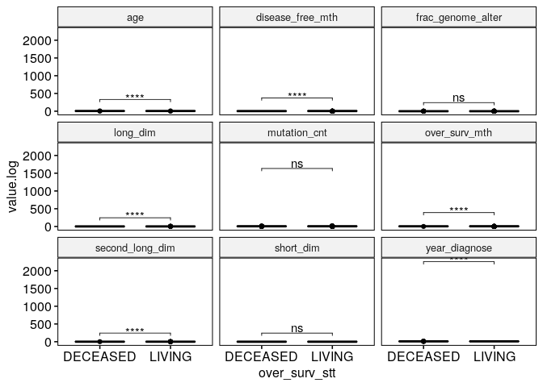<!-- -->

``` r
# Group the data by variables and do a graph for each variable
graphs <- kirc_clinic_numeric.long %>%
  group_by(variables) %>%
  doo(
    ~ggboxplot(
      data =., x = "over_surv_stt", y = "value",
      fill = "over_surv_stt", palette = "npg", legend = "none",
      ggtheme = theme_pubr()
      )  +
      geom_jitter(width = 0.05, alpha = 0.2, color = "orange"), 
    result = "plots"
  )
graphs
```

<div data-pagedtable="false">

<script data-pagedtable-source type="application/json">
{"columns":[{"label":["variables"],"name":[1],"type":["chr"],"align":["left"]},{"label":["plots"],"name":[2],"type":["list"],"align":["right"]}],"data":[{"1":"age","2":"<S3: gg>"},{"1":"disease_free_mth","2":"<S3: gg>"},{"1":"frac_genome_alter","2":"<S3: gg>"},{"1":"long_dim","2":"<S3: gg>"},{"1":"mutation_cnt","2":"<S3: gg>"},{"1":"over_surv_mth","2":"<S3: gg>"},{"1":"second_long_dim","2":"<S3: gg>"},{"1":"short_dim","2":"<S3: gg>"},{"1":"year_diagnose","2":"<S3: gg>"}],"options":{"columns":{"min":{},"max":[10]},"rows":{"min":[10],"max":[10]},"pages":{}}}
  </script>

</div>

``` r
# Add statitistical tests to each corresponding plot
variables <- graphs$variables
for(i in 1:length(variables)){
  graph.i <- graphs$plots[[i]] + 
    labs(title = variables[i]) +
    stat_pvalue_manual(stat.test[i, ], label = "p.adj.signif")
  print(graph.i)
}
```

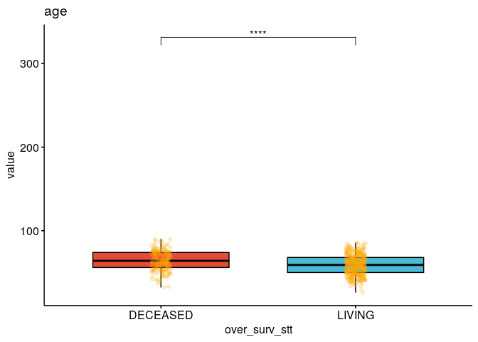<!-- -->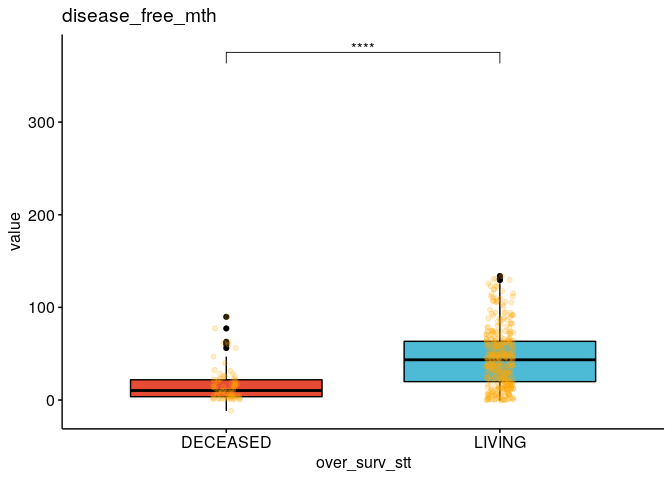<!-- -->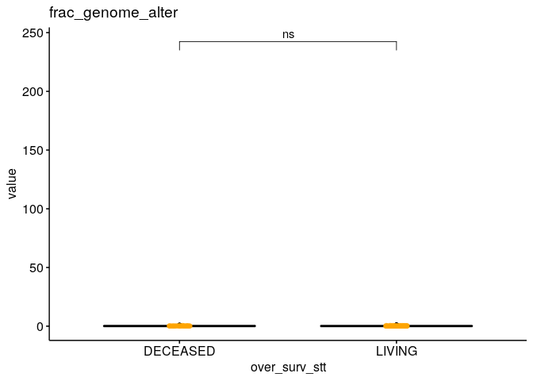<!-- --><!-- -->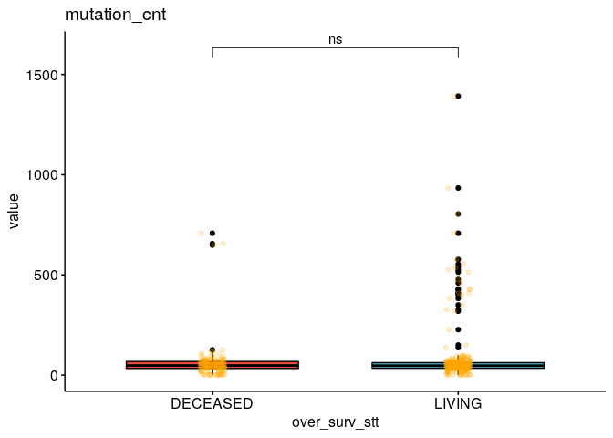<!-- -->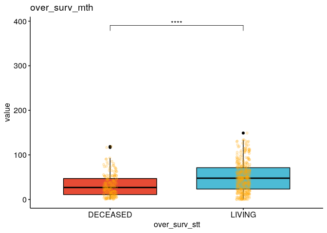<!-- -->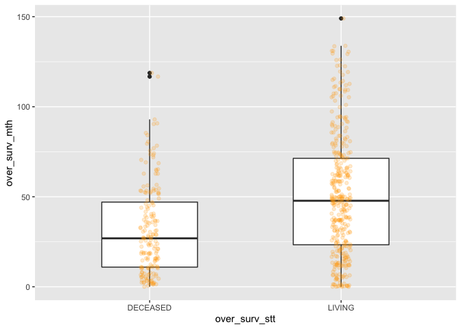<!-- --><!-- -->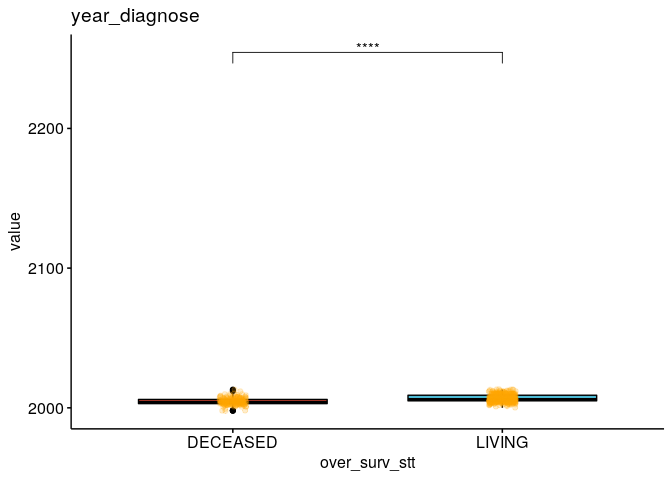<!-- -->

``` r
ggplot(kirc_clinic, aes(age, fill= over_surv_stt)) +
  geom_histogram(bins = 15, position = "dodge")
```

<!-- -->

``` r
t.test(kirc_clinic$age ~ kirc_clinic$over_surv_stt) 
```

    ## 
    ##  Welch Two Sample t-test
    ## 
    ## data:  kirc_clinic$age by kirc_clinic$over_surv_stt
    ## t = 4.887, df = 348.17, p-value = 1.565e-06
    ## alternative hypothesis: true difference in means is not equal to 0
    ## 95 percent confidence interval:
    ##  3.196986 7.503485
    ## sample estimates:
    ## mean in group DECEASED   mean in group LIVING 
    ##               64.18079               58.83056

``` r
ggplot(kirc_clinic, aes(year_diagnose, fill= over_surv_stt)) +
  geom_histogram(bins = 15, position = "dodge")
```

<!-- -->

``` r
t.test(kirc_clinic$year_diagnose ~ kirc_clinic$over_surv_stt) 
```

    ## 
    ##  Welch Two Sample t-test
    ## 
    ## data:  kirc_clinic$year_diagnose by kirc_clinic$over_surv_stt
    ## t = -8.898, df = 377.09, p-value < 2.2e-16
    ## alternative hypothesis: true difference in means is not equal to 0
    ## 95 percent confidence interval:
    ##  -2.510367 -1.601685
    ## sample estimates:
    ## mean in group DECEASED   mean in group LIVING 
    ##               2004.638               2006.694

``` r
ggplot(kirc_clinic, aes(x=over_surv_stt, y=disease_free_mth)) +
  geom_boxplot(width = .5) +
  geom_jitter(width = 0.05, alpha = 0.2, color = "orange")
```

    ## Warning: Removed 99 rows containing non-finite values (stat_boxplot).

    ## Warning: Removed 99 rows containing missing values (geom_point).

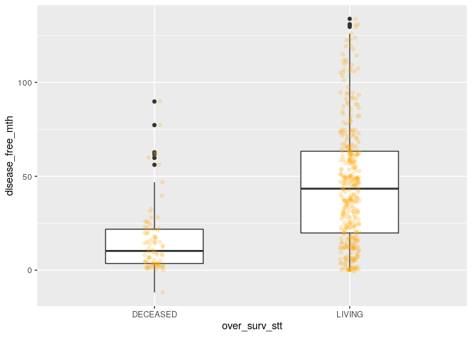<!-- -->

``` r
t.test(kirc_clinic$disease_free_mth ~ kirc_clinic$over_surv_stt) 
```

    ## 
    ##  Welch Two Sample t-test
    ## 
    ## data:  kirc_clinic$disease_free_mth by kirc_clinic$over_surv_stt
    ## t = -10.985, df = 188.22, p-value < 2.2e-16
    ## alternative hypothesis: true difference in means is not equal to 0
    ## 95 percent confidence interval:
    ##  -34.63580 -24.08972
    ## sample estimates:
    ## mean in group DECEASED   mean in group LIVING 
    ##               16.10846               45.47122

``` r
ggplot(kirc_clinic, aes(x=over_surv_stt, y=frac_genome_alter)) +
  geom_boxplot(width = .5) +
  geom_jitter(width = 0.05, alpha = 0.2, color = "orange")
```

    ## Warning: Removed 9 rows containing non-finite values (stat_boxplot).

    ## Warning: Removed 9 rows containing missing values (geom_point).

<!-- -->

``` r
t.test(kirc_clinic$frac_genome_alter ~ kirc_clinic$over_surv_stt)
```

    ## 
    ##  Welch Two Sample t-test
    ## 
    ## data:  kirc_clinic$frac_genome_alter by kirc_clinic$over_surv_stt
    ## t = 1.196, df = 343.6, p-value = 0.2325
    ## alternative hypothesis: true difference in means is not equal to 0
    ## 95 percent confidence interval:
    ##  -0.01199882  0.04923234
    ## sample estimates:
    ## mean in group DECEASED   mean in group LIVING 
    ##              0.1826051              0.1639884

``` r
ggplot(kirc_clinic, aes(x=over_surv_stt, y=long_dim)) +
  geom_boxplot(width = .5) +
  geom_jitter(width = 0.05, alpha = 0.2, color = "orange")
```

    ## Warning: Removed 35 rows containing non-finite values (stat_boxplot).

    ## Warning: Removed 35 rows containing missing values (geom_point).

<!-- -->

``` r
t.test(kirc_clinic$long_dim ~ kirc_clinic$over_surv_stt)
```

    ## 
    ##  Welch Two Sample t-test
    ## 
    ## data:  kirc_clinic$long_dim by kirc_clinic$over_surv_stt
    ## t = 4.1297, df = 363.45, p-value = 4.51e-05
    ## alternative hypothesis: true difference in means is not equal to 0
    ## 95 percent confidence interval:
    ##  0.1295804 0.3651751
    ## sample estimates:
    ## mean in group DECEASED   mean in group LIVING 
    ##               1.824277               1.576900

``` r
ggplot(kirc_clinic, aes(x=over_surv_stt, y=mutation_cnt)) +
  geom_boxplot(width = .5) +
  geom_jitter(width = 0.05, alpha = 0.2, color = "orange")
```

    ## Warning: Removed 86 rows containing non-finite values (stat_boxplot).

    ## Warning: Removed 86 rows containing missing values (geom_point).

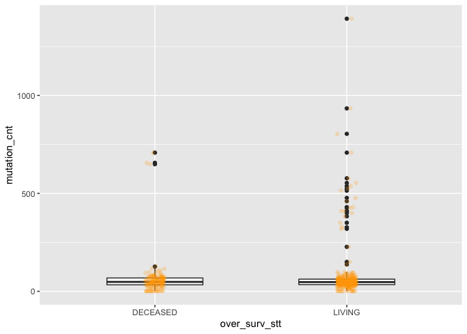<!-- -->

``` r
t.test(kirc_clinic$mutation_cnt ~ kirc_clinic$over_surv_stt)
```

    ## 
    ##  Welch Two Sample t-test
    ## 
    ## data:  kirc_clinic$mutation_cnt by kirc_clinic$over_surv_stt
    ## t = -1.8306, df = 428.83, p-value = 0.06786
    ## alternative hypothesis: true difference in means is not equal to 0
    ## 95 percent confidence interval:
    ##  -41.980661   1.492307
    ## sample estimates:
    ## mean in group DECEASED   mean in group LIVING 
    ##               60.47059               80.71477

``` r
ggplot(kirc_clinic, aes(x=over_surv_stt, y=over_surv_mth)) +
  geom_boxplot(width = .5) +
  geom_jitter(width = 0.05, alpha = 0.2, color = "orange")
```

<!-- -->

``` r
t.test(kirc_clinic$over_surv_mth ~ kirc_clinic$over_surv_stt)
```

    ## 
    ##  Welch Two Sample t-test
    ## 
    ## data:  kirc_clinic$over_surv_mth by kirc_clinic$over_surv_stt
    ## t = -7.3172, df = 450.92, p-value = 1.169e-12
    ## alternative hypothesis: true difference in means is not equal to 0
    ## 95 percent confidence interval:
    ##  -23.99320 -13.83372
    ## sample estimates:
    ## mean in group DECEASED   mean in group LIVING 
    ##               31.57734               50.49081

``` r
ggplot(kirc_clinic, aes(x=over_surv_stt, y=short_dim)) +
  geom_boxplot(width = .5) +
  geom_jitter(width = 0.05, alpha = 0.2, color = "orange")
```

    ## Warning: Removed 35 rows containing non-finite values (stat_boxplot).

    ## Warning: Removed 35 rows containing missing values (geom_point).

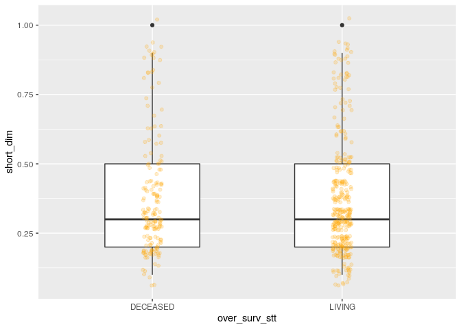<!-- -->

``` r
t.test(kirc_clinic$short_dim ~ kirc_clinic$over_surv_stt)
```

    ## 
    ##  Welch Two Sample t-test
    ## 
    ## data:  kirc_clinic$short_dim by kirc_clinic$over_surv_stt
    ## t = 0.47841, df = 344.68, p-value = 0.6327
    ## alternative hypothesis: true difference in means is not equal to 0
    ## 95 percent confidence interval:
    ##  -0.02935985  0.04823295
    ## sample estimates:
    ## mean in group DECEASED   mean in group LIVING 
    ##              0.3820809              0.3726444

``` r
ggplot(kirc_clinic, aes(x=over_surv_stt, y=second_long_dim)) +
  geom_boxplot(width = .5) +
  geom_jitter(width = 0.05, alpha = 0.2, color = "orange")
```

    ## Warning: Removed 35 rows containing non-finite values (stat_boxplot).
    
    ## Warning: Removed 35 rows containing missing values (geom_point).

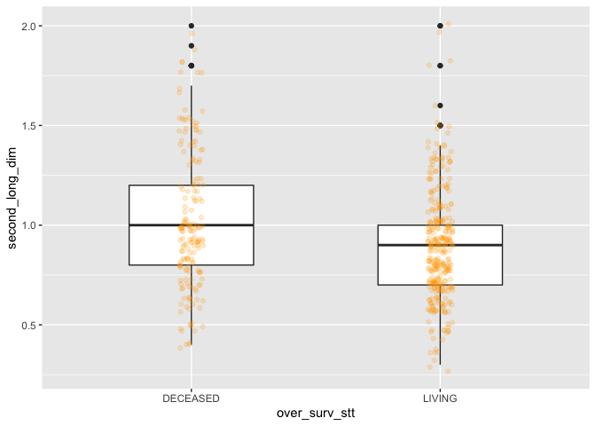<!-- -->

``` r
t.test(kirc_clinic$second_long_dim ~ kirc_clinic$over_surv_stt)
```

    ## 
    ##  Welch Two Sample t-test
    ## 
    ## data:  kirc_clinic$second_long_dim by kirc_clinic$over_surv_stt
    ## t = 4.0639, df = 287.92, p-value = 6.231e-05
    ## alternative hypothesis: true difference in means is not equal to 0
    ## 95 percent confidence interval:
    ##  0.06333111 0.18229322
    ## sample estimates:
    ## mean in group DECEASED   mean in group LIVING 
    ##              1.0173410              0.8945289

``` r
# fazer uma table com as variaveis dependentes, indpendente e p-valores
```

## 4\. Categorical variables vs. over\_surv\_stt

Tabulation and chi-square test

``` r
# talvez isso possa sair uma vez que ja tem a mesma analise com tablefit
kirc_clinic %>%
  select_if(is.factor) %>%
  summary() 
```

    ##  metastasis_stg neoplasm_ln_stg    neoplasm_stg tumor_stg
    ##  M0  :426       N0:240          Stage I  :269   T1:275   
    ##  M1  : 79       N1: 17          Stage II : 57   T2: 69   
    ##  MX  : 30       NX:280          Stage III:125   T3:182   
    ##  NA's:  2                       Stage IV : 83   T4: 11   
    ##                                 NA's     :  3            
    ##                                                          
    ##             disease_free_stt                  ethnicity   histology_grd
    ##  DiseaseFree        :311     HISPANIC OR LATINO    : 26   G1  : 14     
    ##  Recurred/Progressed:127     NOT HISPANIC OR LATINO:359   G2  :230     
    ##  NA's               : 99     NA's                  :152   G3  :207     
    ##                                                           G4  : 78     
    ##                                                           GX  :  5     
    ##                                                           NA's:  3     
    ##     hemoglobin  neoadj_therapy prior_cancer   tumor_lateral primer_ln_ind3
    ##  Elevated:  5   No :519        No :459      Bilateral:  1   NO  :395      
    ##  Low     :263   Yes: 18        Yes: 78      Left     :253   YES :135      
    ##  Normal  :186                               Right    :283   NA's:  7      
    ##  NA's    : 83                                                             
    ##                                                                           
    ##                                                                           
    ##   over_surv_stt     platelet   tissue_prospect                        race    
    ##  DECEASED:177   Elevated: 38   NO  :465        BLACK OR AFRICAN AMERICAN: 56  
    ##  LIVING  :360   Low     : 46   YES : 52        WHITE                    :466  
    ##                 Normal  :360   NA's: 20        NA's                     : 15  
    ##                 NA's    : 93                                                  
    ##                                                                               
    ##                                                                               
    ##  tissue_retrospect     serum_ca      gender    tissue_site  person_neoplasm_stt
    ##  NO  : 53          Elevated: 10   Female:191   A     : 79   TUMOR FREE:361     
    ##  YES :466          Low     :204   Male  :346   B     :303   WITH TUMOR:141     
    ##  NA's: 18          Normal  :151                C     :127   NA's      : 35     
    ##                    NA's    :172                OTHERS: 28                      
    ##                                                                                
    ##                                                                                
    ##        wbc     
    ##  Elevated:164  
    ##  Low     :  9  
    ##  Normal  :268  
    ##  NA's    : 96  
    ##                
    ## 

``` r
t_metas_stg <- table(kirc_clinic$metastasis_stg, kirc_clinic$over_surv_stt, exclude = NULL)
t_metas_stg <- addmargins(round(100*prop.table(t_metas_stg)))
t_metas_stg
```

    ##       
    ##        DECEASED LIVING Sum
    ##   M0         20     59  79
    ##   M1         12      3  15
    ##   MX          1      5   6
    ##   <NA>        0      0   0
    ##   Sum        33     67 100

``` r
chisq.test(x = kirc_clinic$metastasis_stg, y = kirc_clinic$over_surv_stt) 
```

    ## 
    ##  Pearson's Chi-squared test
    ## 
    ## data:  kirc_clinic$metastasis_stg and kirc_clinic$over_surv_stt
    ## X-squared = 99.343, df = 2, p-value < 2.2e-16

``` r
t_lynph <- table(kirc_clinic$neoplasm_ln_stg, kirc_clinic$over_surv_stt, exclude = NULL)
t_lynph <- addmargins(round(100*prop.table(t_lynph)))
t_lynph
```

    ##      
    ##       DECEASED LIVING Sum
    ##   N0        16     29  45
    ##   N1         2      1   3
    ##   NX        15     37  52
    ##   Sum       33     67 100

``` r
chisq.test(x = kirc_clinic$neoplasm_ln_stg, y = kirc_clinic$over_surv_stt) 
```

    ## 
    ##  Pearson's Chi-squared test
    ## 
    ## data:  kirc_clinic$neoplasm_ln_stg and kirc_clinic$over_surv_stt
    ## X-squared = 13.989, df = 2, p-value = 0.0009169

``` r
t_neop <- table(kirc_clinic$neoplasm_stg, kirc_clinic$over_surv_stt, exclude = NULL)
t_neop <- addmargins(round(100*prop.table(t_neop)))
t_neop
```

    ##            
    ##             DECEASED LIVING Sum
    ##   Stage I          8     42  50
    ##   Stage II         2      8  10
    ##   Stage III        9     14  23
    ##   Stage IV        12      3  15
    ##   <NA>             0      0   0
    ##   Sum             31     67  98

``` r
chisq.test(x = kirc_clinic$neoplasm_stg, y = kirc_clinic$over_surv_stt) 
```

    ## 
    ##  Pearson's Chi-squared test
    ## 
    ## data:  kirc_clinic$neoplasm_stg and kirc_clinic$over_surv_stt
    ## X-squared = 123.9, df = 3, p-value < 2.2e-16

``` r
t_tumor <- table(kirc_clinic$tumor_stg, kirc_clinic$over_surv_stt, exclude = NULL)
t_tumor <- addmargins(round(100*prop.table(t_tumor)))
t_tumor
```

    ##      
    ##       DECEASED LIVING Sum
    ##   T1         9     42  51
    ##   T2         4      9  13
    ##   T3        18     16  34
    ##   T4         2      0   2
    ##   Sum       33     67 100

``` r
chisq.test(x = kirc_clinic$tumor_stg, y = kirc_clinic$over_surv_stt) 
```

    ## 
    ##  Pearson's Chi-squared test
    ## 
    ## data:  kirc_clinic$tumor_stg and kirc_clinic$over_surv_stt
    ## X-squared = 76.345, df = 3, p-value < 2.2e-16

``` r
t_free <- table(kirc_clinic$disease_free_stt, kirc_clinic$over_surv_stt, exclude = NULL)
t_free <- addmargins(round(100*prop.table(t_free)))
t_free
```

    ##                      
    ##                       DECEASED LIVING Sum
    ##   DiseaseFree                0     58  58
    ##   Recurred/Progressed       15      9  24
    ##   <NA>                      18      0  18
    ##   Sum                       33     67 100

``` r
chisq.test(x = kirc_clinic$disease_free_stt, y = kirc_clinic$over_surv_stt) 
```

    ## 
    ##  Pearson's Chi-squared test with Yates' continuity correction
    ## 
    ## data:  kirc_clinic$disease_free_stt and kirc_clinic$over_surv_stt
    ## X-squared = 228.22, df = 1, p-value < 2.2e-16

``` r
t_prior <- table(kirc_clinic$prior_cancer, kirc_clinic$over_surv_stt, exclude = NULL)
t_prior <- addmargins(round(100*prop.table(t_prior)))
t_prior
```

    ##      
    ##       DECEASED LIVING Sum
    ##   No        28     57  85
    ##   Yes        4     10  14
    ##   Sum       32     67  99

``` r
chisq.test(x = kirc_clinic$prior_cancer, y = kirc_clinic$over_surv_stt) 
```

    ## 
    ##  Pearson's Chi-squared test with Yates' continuity correction
    ## 
    ## data:  kirc_clinic$prior_cancer and kirc_clinic$over_surv_stt
    ## X-squared = 0.0993, df = 1, p-value = 0.7527

``` r
t_neo <- table(kirc_clinic$neoadj_therapy, kirc_clinic$over_surv_stt, exclude = NULL)
t_neo <- addmargins(round(100*prop.table(t_neo)))
t_neo
```

    ##      
    ##       DECEASED LIVING Sum
    ##   No        31     66  97
    ##   Yes        2      1   3
    ##   Sum       33     67 100

``` r
chisq.test(x = kirc_clinic$neoadj_therapy, y = kirc_clinic$over_surv_stt) 
```

    ## 
    ##  Pearson's Chi-squared test with Yates' continuity correction
    ## 
    ## data:  kirc_clinic$neoadj_therapy and kirc_clinic$over_surv_stt
    ## X-squared = 3.31, df = 1, p-value = 0.06886

``` r
t_platelet <- table(kirc_clinic$platelet, kirc_clinic$over_surv_stt, exclude = NULL)
t_platelet <- addmargins(round(100*prop.table(t_platelet)))
t_platelet
```

    ##           
    ##            DECEASED LIVING Sum
    ##   Elevated        6      1   7
    ##   Low             4      5   9
    ##   Normal         20     47  67
    ##   <NA>            4     14  18
    ##   Sum            34     67 101

``` r
chisq.test(x = kirc_clinic$platelet, y = kirc_clinic$over_surv_stt)
```

    ## 
    ##  Pearson's Chi-squared test
    ## 
    ## data:  kirc_clinic$platelet and kirc_clinic$over_surv_stt
    ## X-squared = 37.32, df = 2, p-value = 7.871e-09

``` r
t_prospect <- table(kirc_clinic$tissue_prospect, kirc_clinic$over_surv_stt, exclude = NULL)
t_prospect <- addmargins(round(100*prop.table(t_prospect)))
t_prospect
```

    ##       
    ##        DECEASED LIVING Sum
    ##   NO         31     55  86
    ##   YES         0      9   9
    ##   <NA>        1      3   4
    ##   Sum        32     67  99

``` r
chisq.test(x = kirc_clinic$tissue_prospect, y = kirc_clinic$over_surv_stt)
```

    ## 
    ##  Pearson's Chi-squared test with Yates' continuity correction
    ## 
    ## data:  kirc_clinic$tissue_prospect and kirc_clinic$over_surv_stt
    ## X-squared = 20.87, df = 1, p-value = 4.914e-06

``` r
t_race <- table(kirc_clinic$race, kirc_clinic$over_surv_stt, exclude = NULL)
t_race <- addmargins(round(100*prop.table(t_race)))
t_race
```

    ##                            
    ##                             DECEASED LIVING Sum
    ##   BLACK OR AFRICAN AMERICAN        2      8  10
    ##   WHITE                           30     56  86
    ##   <NA>                             1      2   3
    ##   Sum                             33     66  99

``` r
chisq.test(x = kirc_clinic$race, y = kirc_clinic$over_surv_stt) 
```

    ## 
    ##  Pearson's Chi-squared test with Yates' continuity correction
    ## 
    ## data:  kirc_clinic$race and kirc_clinic$over_surv_stt
    ## X-squared = 4.6232, df = 1, p-value = 0.03154

``` r
t_retros <- table(kirc_clinic$tissue_retrospect, kirc_clinic$over_surv_stt, exclude = NULL)
t_retros <- addmargins(round(100*prop.table(t_retros)))
t_retros
```

    ##       
    ##        DECEASED LIVING Sum
    ##   NO          0      9   9
    ##   YES        31     55  86
    ##   <NA>        1      2   3
    ##   Sum        32     66  98

``` r
chisq.test(x = kirc_clinic$tissue_retrospect, y = kirc_clinic$over_surv_stt)
```

    ## 
    ##  Pearson's Chi-squared test with Yates' continuity correction
    ## 
    ## data:  kirc_clinic$tissue_retrospect and kirc_clinic$over_surv_stt
    ## X-squared = 21.295, df = 1, p-value = 3.938e-06

``` r
t_ca <- table(kirc_clinic$serum_ca, kirc_clinic$over_surv_stt, exclude = NULL)
t_ca <- addmargins(round(100*prop.table(t_ca)))
t_ca
```

    ##           
    ##            DECEASED LIVING Sum
    ##   Elevated        2      0   2
    ##   Low            12     26  38
    ##   Normal         12     17  29
    ##   <NA>            7     25  32
    ##   Sum            33     68 101

``` r
chisq.test(x = kirc_clinic$serum_ca, y = kirc_clinic$over_surv_stt) 
```

    ## 
    ##  Pearson's Chi-squared test
    ## 
    ## data:  kirc_clinic$serum_ca and kirc_clinic$over_surv_stt
    ## X-squared = 14.877, df = 2, p-value = 0.0005883

``` r
t_gender <- table(kirc_clinic$gender, kirc_clinic$over_surv_stt, exclude = NULL)
t_gender <- addmargins(round(100*prop.table(t_gender)))
t_gender
```

    ##         
    ##          DECEASED LIVING Sum
    ##   Female       12     23  35
    ##   Male         21     44  65
    ##   Sum          33     67 100

``` r
chisq.test(x = kirc_clinic$gender, y = kirc_clinic$over_surv_stt) 
```

    ## 
    ##  Pearson's Chi-squared test with Yates' continuity correction
    ## 
    ## data:  kirc_clinic$gender and kirc_clinic$over_surv_stt
    ## X-squared = 0.087745, df = 1, p-value = 0.7671

``` r
t_site <- table(kirc_clinic$tissue_site, kirc_clinic$over_surv_stt, exclude = NULL)
t_site <- addmargins(round(100*prop.table(t_site)))
t_site
```

    ##         
    ##          DECEASED LIVING Sum
    ##   A             2     13  15
    ##   B            21     36  57
    ##   C             9     15  24
    ##   OTHERS        1      4   5
    ##   Sum          33     68 101

``` r
chisq.test(x = kirc_clinic$tissue_site, y = kirc_clinic$over_surv_stt) 
```

    ## 
    ##  Pearson's Chi-squared test
    ## 
    ## data:  kirc_clinic$tissue_site and kirc_clinic$over_surv_stt
    ## X-squared = 19.861, df = 3, p-value = 0.0001814

``` r
t_neop_st <- table(kirc_clinic$person_neoplasm_stt, kirc_clinic$over_surv_stt, exclude = NULL)
t_neop_st <- addmargins(round(100*prop.table(t_neop_st)))
t_neop_st
```

    ##             
    ##              DECEASED LIVING Sum
    ##   TUMOR FREE       11     57  68
    ##   WITH TUMOR       20      7  27
    ##   <NA>              3      4   7
    ##   Sum              34     68 102

``` r
chisq.test(x = kirc_clinic$person_neoplasm_stt, y = kirc_clinic$over_surv_stt) 
```

    ## 
    ##  Pearson's Chi-squared test with Yates' continuity correction
    ## 
    ## data:  kirc_clinic$person_neoplasm_stt and kirc_clinic$over_surv_stt
    ## X-squared = 157.06, df = 1, p-value < 2.2e-16

``` r
t_wbc <- table(kirc_clinic$wbc, kirc_clinic$over_surv_stt, exclude = NULL)
t_wbc <- addmargins(round(100*prop.table(t_wbc)))
t_wbc
```

    ##           
    ##            DECEASED LIVING Sum
    ##   Elevated        9     22  31
    ##   Low             1      1   2
    ##   Normal         19     31  50
    ##   <NA>            4     14  18
    ##   Sum            33     68 101

``` r
chisq.test(x = kirc_clinic$wbc, y = kirc_clinic$over_surv_stt) 
```

    ## 
    ##  Pearson's Chi-squared test
    ## 
    ## data:  kirc_clinic$wbc and kirc_clinic$over_surv_stt
    ## X-squared = 9.0853, df = 2, p-value = 0.01065

## 7\. FinalFit

summarise variables/factors by a categorical variable

``` r
#  warning=FALSE
explanatory <- names(kirc_clinic %>%
              select(-over_surv_stt) %>%
              select_if(is.factor))
dependent <-  'over_surv_stt'

table_fit <- kirc_clinic %>%
  summary_factorlist(dependent, explanatory, p=TRUE, add_dependent_label=TRUE,  na_include = TRUE)
```

    ## Warning in chisq.test(tumor_stg, over_surv_stt): Chi-squared approximation may
    ## be incorrect

    ## Warning in chisq.test(histology_grd, over_surv_stt): Chi-squared approximation
    ## may be incorrect

    ## Warning in chisq.test(hemoglobin, over_surv_stt): Chi-squared approximation may
    ## be incorrect

    ## Warning in chisq.test(tumor_lateral, over_surv_stt): Chi-squared approximation
    ## may be incorrect

    ## Warning in chisq.test(serum_ca, over_surv_stt): Chi-squared approximation may be
    ## incorrect

    ## Warning in chisq.test(wbc, over_surv_stt): Chi-squared approximation may be
    ## incorrect

``` r
knitr::kable(table_fit, row.names=FALSE, align=c("l", "l", "r", "r", "r"))
```

| Dependent: over\_surv\_stt |                           |   DECEASED |     LIVING |       p |
| :------------------------- | ------------------------- | ---------: | ---------: | ------: |
| metastasis\_stg            | M0                        | 110 (62.1) | 316 (87.8) | \<0.001 |
|                            | M1                        |  64 (36.2) |   15 (4.2) |         |
|                            | MX                        |    3 (1.7) |   27 (7.5) |         |
|                            | (Missing)                 |            |    2 (0.6) |         |
| neoplasm\_ln\_stg          | N0                        |  85 (48.0) | 155 (43.1) |   0.001 |
|                            | N1                        |   12 (6.8) |    5 (1.4) |         |
|                            | NX                        |  80 (45.2) | 200 (55.6) |         |
| neoplasm\_stg              | Stage I                   |  45 (25.4) | 224 (62.2) | \<0.001 |
|                            | Stage II                  |   13 (7.3) |  44 (12.2) |         |
|                            | Stage III                 |  51 (28.8) |  74 (20.6) |         |
|                            | Stage IV                  |  67 (37.9) |   16 (4.4) |         |
|                            | (Missing)                 |    1 (0.6) |    2 (0.6) |         |
| tumor\_stg                 | T1                        |  50 (28.2) | 225 (62.5) | \<0.001 |
|                            | T2                        |  21 (11.9) |  48 (13.3) |         |
|                            | T3                        |  96 (54.2) |  86 (23.9) |         |
|                            | T4                        |   10 (5.6) |    1 (0.3) |         |
| disease\_free\_stt         | Recurred/Progressed       |  78 (44.1) |  49 (13.6) | \<0.001 |
|                            | (Missing)                 |  99 (55.9) |            |         |
|                            | DiseaseFree               |            | 311 (86.4) |         |
| ethnicity                  | HISPANIC OR LATINO        |    3 (1.7) |   23 (6.4) |   0.017 |
|                            | NOT HISPANIC OR LATINO    | 132 (74.6) | 227 (63.1) |         |
|                            | (Missing)                 |  42 (23.7) | 110 (30.6) |         |
| histology\_grd             | G2                        |  45 (25.4) | 185 (51.4) | \<0.001 |
|                            | G3                        |  74 (41.8) | 133 (36.9) |         |
|                            | G4                        |  57 (32.2) |   21 (5.8) |         |
|                            | GX                        |    1 (0.6) |    4 (1.1) |         |
|                            | G1                        |            |   14 (3.9) |         |
|                            | (Missing)                 |            |    3 (0.8) |         |
| hemoglobin                 | Elevated                  |    3 (1.7) |    2 (0.6) | \<0.001 |
|                            | Low                       | 118 (66.7) | 145 (40.3) |         |
|                            | Normal                    |  43 (24.3) | 143 (39.7) |         |
|                            | (Missing)                 |   13 (7.3) |  70 (19.4) |         |
| neoadj\_therapy            | No                        | 167 (94.4) | 352 (97.8) |   0.069 |
|                            | Yes                       |   10 (5.6) |    8 (2.2) |         |
| prior\_cancer              | No                        | 153 (86.4) | 306 (85.0) |   0.753 |
|                            | Yes                       |  24 (13.6) |  54 (15.0) |         |
| tumor\_lateral             | Left                      |  98 (55.4) | 155 (43.1) |   0.023 |
|                            | Right                     |  79 (44.6) | 204 (56.7) |         |
|                            | Bilateral                 |            |    1 (0.3) |         |
| primer\_ln\_ind3           | NO                        | 120 (67.8) | 275 (76.4) |   0.024 |
|                            | YES                       |  56 (31.6) |  79 (21.9) |         |
|                            | (Missing)                 |    1 (0.6) |    6 (1.7) |         |
| platelet                   | Elevated                  |  30 (16.9) |    8 (2.2) | \<0.001 |
|                            | Low                       |  20 (11.3) |   26 (7.2) |         |
|                            | Normal                    | 108 (61.0) | 252 (70.0) |         |
|                            | (Missing)                 |  19 (10.7) |  74 (20.6) |         |
| tissue\_prospect           | NO                        | 169 (95.5) | 296 (82.2) | \<0.001 |
|                            | YES                       |    2 (1.1) |  50 (13.9) |         |
|                            | (Missing)                 |    6 (3.4) |   14 (3.9) |         |
| race                       | BLACK OR AFRICAN AMERICAN |   11 (6.2) |  45 (12.5) |   0.032 |
|                            | WHITE                     | 163 (92.1) | 303 (84.2) |         |
|                            | (Missing)                 |    3 (1.7) |   12 (3.3) |         |
| tissue\_retrospect         | NO                        |    2 (1.1) |  51 (14.2) | \<0.001 |
|                            | YES                       | 169 (95.5) | 297 (82.5) |         |
|                            | (Missing)                 |    6 (3.4) |   12 (3.3) |         |
| serum\_ca                  | Elevated                  |    9 (5.1) |    1 (0.3) |   0.001 |
|                            | Low                       |  66 (37.3) | 138 (38.3) |         |
|                            | Normal                    |  62 (35.0) |  89 (24.7) |         |
|                            | (Missing)                 |  40 (22.6) | 132 (36.7) |         |
| gender                     | Female                    |  65 (36.7) | 126 (35.0) |   0.767 |
|                            | Male                      | 112 (63.3) | 234 (65.0) |         |
| tissue\_site               | A                         |   11 (6.2) |  68 (18.9) | \<0.001 |
|                            | B                         | 112 (63.3) | 191 (53.1) |         |
|                            | C                         |  49 (27.7) |  78 (21.7) |         |
|                            | OTHERS                    |    5 (2.8) |   23 (6.4) |         |
| person\_neoplasm\_stt      | TUMOR FREE                |  57 (32.2) | 304 (84.4) | \<0.001 |
|                            | WITH TUMOR                | 105 (59.3) |  36 (10.0) |         |
|                            | (Missing)                 |   15 (8.5) |   20 (5.6) |         |
| wbc                        | Elevated                  |  46 (26.0) | 118 (32.8) |   0.011 |
|                            | Low                       |    6 (3.4) |    3 (0.8) |         |
|                            | Normal                    | 104 (58.8) | 164 (45.6) |         |
|                            | (Missing)                 |  21 (11.9) |  75 (20.8) |         |

Summarise numerical variables by a categorical variable

``` r
explanatory <- cols_numeric

dependent <-  'over_surv_stt'

table_fit <- kirc_clinic %>%
  summary_factorlist(dependent, explanatory, p=TRUE, add_dependent_label=TRUE,  na_include = TRUE, na_include_dependent = TRUE)

knitr::kable(table_fit, row.names=FALSE, align=c("l", "l", "r", "r", "r"))
```

| Dependent: over\_surv\_stt |           |     DECEASED |       LIVING |       p |
| :------------------------- | --------- | -----------: | -----------: | ------: |
| age                        | Mean (SD) |  64.2 (12.0) |  58.8 (11.9) | \<0.001 |
| disease\_free\_mth         | Mean (SD) |  16.1 (18.5) |  45.5 (31.5) | \<0.001 |
| frac\_genome\_alter        | Mean (SD) |    0.2 (0.2) |    0.2 (0.2) |   0.230 |
| year\_diagnose             | Mean (SD) | 2004.6 (2.4) | 2006.7 (2.7) | \<0.001 |
| long\_dim                  | Mean (SD) |    1.8 (0.6) |    1.6 (0.7) | \<0.001 |
| mutation\_cnt              | Mean (SD) |  60.5 (90.9) | 80.7 (142.7) |   0.111 |
| over\_surv\_mth            | Mean (SD) |  31.6 (25.1) |  50.5 (33.6) | \<0.001 |
| short\_dim                 | Mean (SD) |    0.4 (0.2) |    0.4 (0.2) |   0.631 |
| second\_long\_dim          | Mean (SD) |    1.0 (0.3) |    0.9 (0.3) | \<0.001 |

## Further analysis

  - [A logistic regression analysis](3.logistic_regression.md) of each
    clinical variable weight.

<!-- end list -->

``` r
sessionInfo()
```

    ## R version 3.6.3 (2020-02-29)
    ## Platform: x86_64-pc-linux-gnu (64-bit)
    ## Running under: Ubuntu 18.04.4 LTS
    ## 
    ## Matrix products: default
    ## BLAS:   /usr/lib/x86_64-linux-gnu/openblas/libblas.so.3
    ## LAPACK: /usr/lib/x86_64-linux-gnu/libopenblasp-r0.2.20.so
    ## 
    ## locale:
    ##  [1] LC_CTYPE=pt_BR.UTF-8       LC_NUMERIC=C              
    ##  [3] LC_TIME=pt_BR.UTF-8        LC_COLLATE=en_US.UTF-8    
    ##  [5] LC_MONETARY=pt_BR.UTF-8    LC_MESSAGES=en_US.UTF-8   
    ##  [7] LC_PAPER=pt_BR.UTF-8       LC_NAME=C                 
    ##  [9] LC_ADDRESS=C               LC_TELEPHONE=C            
    ## [11] LC_MEASUREMENT=pt_BR.UTF-8 LC_IDENTIFICATION=C       
    ## 
    ## attached base packages:
    ## [1] stats     graphics  grDevices utils     datasets  methods   base     
    ## 
    ## other attached packages:
    ##  [1] GGally_1.5.0    ggpubr_0.3.0    rstatix_0.5.0   finalfit_1.0.1 
    ##  [5] skimr_2.1.1     forcats_0.5.0   stringr_1.4.0   dplyr_0.8.5    
    ##  [9] purrr_0.3.4     readr_1.3.1     tidyr_1.0.3     tibble_3.0.1   
    ## [13] ggplot2_3.3.0   tidyverse_1.3.0
    ## 
    ## loaded via a namespace (and not attached):
    ##  [1] nlme_3.1-147       fs_1.4.1           lubridate_1.7.8    RColorBrewer_1.1-2
    ##  [5] httr_1.4.1         ggsci_2.9          repr_1.1.0         tools_3.6.3       
    ##  [9] backports_1.1.6    utf8_1.1.4         R6_2.4.1           DBI_1.1.0         
    ## [13] mgcv_1.8-31        colorspace_1.4-1   withr_2.2.0        tidyselect_1.1.0  
    ## [17] curl_4.3           compiler_3.6.3     cli_2.0.2          rvest_0.3.5       
    ## [21] mice_3.8.0         xml2_1.3.2         labeling_0.3       scales_1.1.1      
    ## [25] digest_0.6.25      foreign_0.8-76     rmarkdown_2.1      rio_0.5.16        
    ## [29] base64enc_0.1-3    pkgconfig_2.0.3    htmltools_0.4.0    dbplyr_1.4.3      
    ## [33] highr_0.8          rlang_0.4.6        readxl_1.3.1       rstudioapi_0.11   
    ## [37] generics_0.0.2     farver_2.0.3       jsonlite_1.6.1     zip_2.0.4         
    ## [41] car_3.0-7          magrittr_1.5       Matrix_1.2-18      Rcpp_1.0.4.6      
    ## [45] munsell_0.5.0      fansi_0.4.1        abind_1.4-5        lifecycle_0.2.0   
    ## [49] stringi_1.4.6      yaml_2.2.1         carData_3.0-3      plyr_1.8.6        
    ## [53] grid_3.6.3         crayon_1.3.4       lattice_0.20-41    haven_2.2.0       
    ## [57] splines_3.6.3      hms_0.5.3          knitr_1.28         pillar_1.4.4      
    ## [61] boot_1.3-25        ggsignif_0.6.0     reprex_0.3.0       glue_1.4.0        
    ## [65] evaluate_0.14      data.table_1.12.8  modelr_0.1.7       vctrs_0.3.0       
    ## [69] cellranger_1.1.0   gtable_0.3.0       reshape_0.8.8      assertthat_0.2.1  
    ## [73] xfun_0.13          openxlsx_4.1.5     broom_0.5.6        survival_3.1-12   
    ## [77] ellipsis_0.3.0
