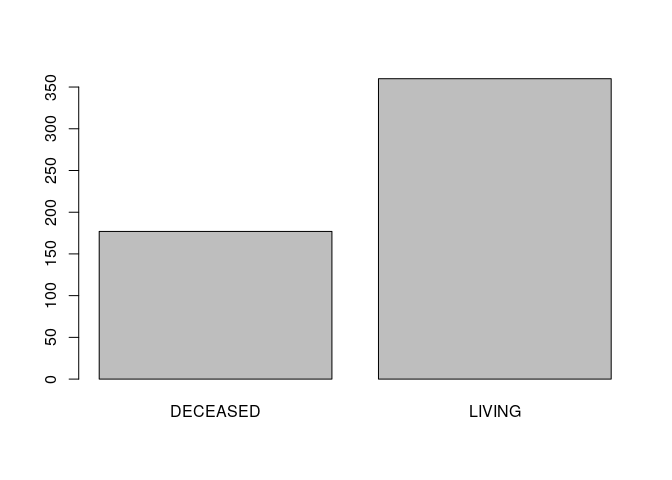
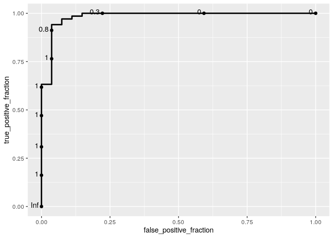

A logistic regression analysis of TCGA-KIRC
================

This project contains a pipeline of clinical analysis of the Cancer
Genome Atlas Kidney Renal Clear Cell Carcinoma (TCGA-KIRC) data of
patients from [Genomic Data Commons Data
Portal](https://portal.gdc.cancer.gov/exploration?filters=%7B%22op%22%3A%22and%22%2C%22content%22%3A%5B%7B%22op%22%3A%22in%22%2C%22content%22%3A%7B%22field%22%3A%22cases.project.project_id%22%2C%22value%22%3A%5B%22TCGA-KIRC%22%5D%7D%7D%5D%7D)
and [cBioPortal](https://www.cbioportal.org/study/summary?id=kirp_tcga).

Previously, we presented a [An exploratory preprocessing
analysis](1.preprocessing.md), and [a correlation
analysis](2.correlation.md).

In this final section, we present a logistic regression analysis of each
clinical variable weight for TCGA-KIRC.

``` r
# Set the packages of interest
packages = c("tidyverse","skimr","finalfit", "caret", "ggplot2", "plotROC")

# if a package is installed, it will be loaded
# otherwise, the missing package(s) will be installed and loaded
package.check <- lapply(packages, FUN = function(x) {
  if (!require(x, character.only = TRUE)) {
    install.packages(x, dependencies = TRUE)
    library(x, character.only = TRUE)
  }
})

suppressMessages(library("tidyverse"))
rm(packages)
setwd(".")
```

## 1\. Importing data

## 2\. Taming data and selecting numeric and categorical columns

``` r
kirc_clinic <- kirc_clinic %>%
  mutate_if(is.character, as.factor) %>%
  mutate(patient_id = as.character(patient_id))

cols_numeric <- kirc_clinic %>% select_if(is.numeric) %>% names

cols_categorical <- kirc_clinic %>% select_if(is.factor) %>% names
cols_categorical <- setdiff(cols_categorical,  "over_surv_stt") 
```

``` r
plot(kirc_clinic$over_surv_stt)
```

<!-- -->

## 3\. Creating training and test data 70-30 split

``` r
set.seed(123)

df <- data.frame(kirc_clinic)

trainIndex <- createDataPartition(df$over_surv_stt, p = .7, 
                                  list = FALSE, 
                                  times = 1)
dtrain<-df[trainIndex,]
dtest<-df[-trainIndex,]
```

## 4\. Modeling: Logistic regression for numerical values with 10 fold cross validation

``` r
fitControl <- trainControl(## 10-fold CV
  method = "cv",
  number = 10,
  savePredictions = TRUE
)

## Logistic regression
lreg<-train(x = dtrain[,c(cols_numeric)],
            y = dtrain[,"over_surv_stt"], 
            method="glm",
            family=binomial(),
            trControl=fitControl)
lreg
```

    ## Generalized Linear Model 
    ## 
    ## 376 samples
    ##   9 predictor
    ##   2 classes: 'DECEASED', 'LIVING' 
    ## 
    ## No pre-processing
    ## Resampling: Cross-Validated (10 fold) 
    ## Summary of sample sizes: 339, 338, 339, 338, 339, 338, ... 
    ## Resampling results:
    ## 
    ##   Accuracy   Kappa    
    ##   0.8743637  0.4844045

``` r
varImp(lreg)
```

    ## glm variable importance
    ## 
    ##                   Overall
    ## year_diagnose     100.000
    ## disease_free_mth   89.284
    ## mutation_cnt       18.522
    ## over_surv_mth      15.943
    ## second_long_dim    12.658
    ## long_dim            8.956
    ## age                 5.925
    ## frac_genome_alter   1.636
    ## short_dim           0.000

``` r
lreg_pred<-predict(lreg,dtest)
confusionMatrix(lreg_pred,dtest$over_surv_stt)
```

    ## Confusion Matrix and Statistics
    ## 
    ##           Reference
    ## Prediction DECEASED LIVING
    ##   DECEASED       15      5
    ##   LIVING          9     78
    ##                                           
    ##                Accuracy : 0.8692          
    ##                  95% CI : (0.7902, 0.9266)
    ##     No Information Rate : 0.7757          
    ##     P-Value [Acc > NIR] : 0.01054         
    ##                                           
    ##                   Kappa : 0.6003          
    ##                                           
    ##  Mcnemar's Test P-Value : 0.42268         
    ##                                           
    ##             Sensitivity : 0.6250          
    ##             Specificity : 0.9398          
    ##          Pos Pred Value : 0.7500          
    ##          Neg Pred Value : 0.8966          
    ##              Prevalence : 0.2243          
    ##          Detection Rate : 0.1402          
    ##    Detection Prevalence : 0.1869          
    ##       Balanced Accuracy : 0.7824          
    ##                                           
    ##        'Positive' Class : DECEASED        
    ## 

## 5\. Removing all nas of dataset

``` r
set.seed(123)

df <- data.frame(kirc_clinic %>% drop_na() )


trainIndex <- createDataPartition(df$over_surv_stt, p = .7, 
                                  list = FALSE, 
                                  times = 1)
dtrain<-df[trainIndex,]
dtest<-df[-trainIndex,]
```

``` r
fitControl <- trainControl(## 10-fold CV
  method = "cv",
  number = 10,
  savePredictions = FALSE
)

## Logistic regression
lreg<-train(over_surv_stt ~.,
        data = df[ , c(cols_numeric,  cols_categorical,  "over_surv_stt")],
            method="glm",
            family=binomial(),
            trControl=fitControl)
```

    ## Warning: glm.fit: algorithm did not converge

    ## Warning: glm.fit: fitted probabilities numerically 0 or 1 occurred

    ## Warning in predict.lm(object, newdata, se.fit, scale = 1, type = if (type == :
    ## prediction from a rank-deficient fit may be misleading

    ## Warning: glm.fit: algorithm did not converge

    ## Warning: glm.fit: fitted probabilities numerically 0 or 1 occurred

    ## Warning in predict.lm(object, newdata, se.fit, scale = 1, type = if (type == :
    ## prediction from a rank-deficient fit may be misleading

    ## Warning: glm.fit: algorithm did not converge

    ## Warning: glm.fit: fitted probabilities numerically 0 or 1 occurred

    ## Warning in predict.lm(object, newdata, se.fit, scale = 1, type = if (type == :
    ## prediction from a rank-deficient fit may be misleading

    ## Warning: glm.fit: algorithm did not converge

    ## Warning: glm.fit: fitted probabilities numerically 0 or 1 occurred

    ## Warning in predict.lm(object, newdata, se.fit, scale = 1, type = if (type == :
    ## prediction from a rank-deficient fit may be misleading

    ## Warning: glm.fit: algorithm did not converge

    ## Warning: glm.fit: fitted probabilities numerically 0 or 1 occurred

    ## Warning in predict.lm(object, newdata, se.fit, scale = 1, type = if (type == :
    ## prediction from a rank-deficient fit may be misleading

    ## Warning: glm.fit: algorithm did not converge

    ## Warning: glm.fit: fitted probabilities numerically 0 or 1 occurred

    ## Warning in predict.lm(object, newdata, se.fit, scale = 1, type = if (type == :
    ## prediction from a rank-deficient fit may be misleading

    ## Warning: glm.fit: algorithm did not converge

    ## Warning: glm.fit: fitted probabilities numerically 0 or 1 occurred

    ## Warning in predict.lm(object, newdata, se.fit, scale = 1, type = if (type == :
    ## prediction from a rank-deficient fit may be misleading

    ## Warning: glm.fit: algorithm did not converge

    ## Warning: glm.fit: fitted probabilities numerically 0 or 1 occurred

    ## Warning in predict.lm(object, newdata, se.fit, scale = 1, type = if (type == :
    ## prediction from a rank-deficient fit may be misleading

    ## Warning: glm.fit: algorithm did not converge

    ## Warning: glm.fit: fitted probabilities numerically 0 or 1 occurred

    ## Warning in predict.lm(object, newdata, se.fit, scale = 1, type = if (type == :
    ## prediction from a rank-deficient fit may be misleading

    ## Warning: glm.fit: algorithm did not converge

    ## Warning: glm.fit: fitted probabilities numerically 0 or 1 occurred

    ## Warning in predict.lm(object, newdata, se.fit, scale = 1, type = if (type == :
    ## prediction from a rank-deficient fit may be misleading

    ## Warning: glm.fit: algorithm did not converge

    ## Warning: glm.fit: fitted probabilities numerically 0 or 1 occurred

``` r
lreg
```

    ## Generalized Linear Model 
    ## 
    ## 135 samples
    ##  30 predictor
    ##   2 classes: 'DECEASED', 'LIVING' 
    ## 
    ## No pre-processing
    ## Resampling: Cross-Validated (10 fold) 
    ## Summary of sample sizes: 122, 121, 121, 122, 123, 121, ... 
    ## Resampling results:
    ## 
    ##   Accuracy   Kappa    
    ##   0.8966117  0.7602927

``` r
varImp(lreg)
```

    ## glm variable importance
    ## 
    ##   only 20 most important variables shown (out of 40)
    ## 
    ##                                       Overall
    ## over_surv_mth                          100.00
    ## year_diagnose                           61.64
    ## plateletLow                             26.28
    ## hemoglobinNormal                        24.50
    ## `disease_free_sttRecurred/Progressed`   22.96
    ## plateletNormal                          22.93
    ## hemoglobinLow                           21.58
    ## tumor_stgT2                             20.62
    ## long_dim                                18.69
    ## metastasis_stgM1                        18.25
    ## primer_ln_ind3YES                       17.55
    ## `neoplasm_stgStage II`                  17.29
    ## tissue_siteC                            17.06
    ## disease_free_mth                        16.88
    ## short_dim                               16.48
    ## serum_caLow                             15.21
    ## wbcLow                                  14.48
    ## `ethnicityNOT HISPANIC OR LATINO`       13.98
    ## neoplasm_ln_stgNX                       13.71
    ## tumor_stgT3                             11.98

``` r
lreg_pred<-predict(lreg,dtest)
```

    ## Warning in predict.lm(object, newdata, se.fit, scale = 1, type = if (type == :
    ## prediction from a rank-deficient fit may be misleading

``` r
confusionMatrix(lreg_pred,dtest$over_surv_stt)
```

    ## Confusion Matrix and Statistics
    ## 
    ##           Reference
    ## Prediction DECEASED LIVING
    ##   DECEASED       11      0
    ##   LIVING          0     29
    ##                                      
    ##                Accuracy : 1          
    ##                  95% CI : (0.9119, 1)
    ##     No Information Rate : 0.725      
    ##     P-Value [Acc > NIR] : 2.591e-06  
    ##                                      
    ##                   Kappa : 1          
    ##                                      
    ##  Mcnemar's Test P-Value : NA         
    ##                                      
    ##             Sensitivity : 1.000      
    ##             Specificity : 1.000      
    ##          Pos Pred Value : 1.000      
    ##          Neg Pred Value : 1.000      
    ##              Prevalence : 0.275      
    ##          Detection Rate : 0.275      
    ##    Detection Prevalence : 0.275      
    ##       Balanced Accuracy : 1.000      
    ##                                      
    ##        'Positive' Class : DECEASED   
    ## 

``` r
df_no.na <- dtrain %>% drop_na()

fit<-glm(over_surv_stt ~.,
        data = df_no.na[ , c(cols_numeric, "over_surv_stt")],
        family = "binomial")

df_roc <- data.frame(Survival = df_no.na$over_surv_stt, Prob = fit$fitted.values)
ggplot(df_roc, aes(d = Survival, m = Prob)) + geom_roc()
```

    ## Warning in verify_d(data$d): D not labeled 0/1, assuming DECEASED = 0 and LIVING
    ## = 1!

<!-- -->

``` r
sessionInfo()
```

    ## R version 3.6.3 (2020-02-29)
    ## Platform: x86_64-pc-linux-gnu (64-bit)
    ## Running under: Ubuntu 18.04.4 LTS
    ## 
    ## Matrix products: default
    ## BLAS:   /usr/lib/x86_64-linux-gnu/openblas/libblas.so.3
    ## LAPACK: /usr/lib/x86_64-linux-gnu/libopenblasp-r0.2.20.so
    ## 
    ## locale:
    ##  [1] LC_CTYPE=pt_BR.UTF-8       LC_NUMERIC=C              
    ##  [3] LC_TIME=pt_BR.UTF-8        LC_COLLATE=en_US.UTF-8    
    ##  [5] LC_MONETARY=pt_BR.UTF-8    LC_MESSAGES=en_US.UTF-8   
    ##  [7] LC_PAPER=pt_BR.UTF-8       LC_NAME=C                 
    ##  [9] LC_ADDRESS=C               LC_TELEPHONE=C            
    ## [11] LC_MEASUREMENT=pt_BR.UTF-8 LC_IDENTIFICATION=C       
    ## 
    ## attached base packages:
    ## [1] stats     graphics  grDevices utils     datasets  methods   base     
    ## 
    ## other attached packages:
    ##  [1] plotROC_2.2.1   caret_6.0-86    lattice_0.20-41 finalfit_1.0.1 
    ##  [5] skimr_2.1.1     forcats_0.5.0   stringr_1.4.0   dplyr_1.0.0    
    ##  [9] purrr_0.3.4     readr_1.3.1     tidyr_1.0.3     tibble_3.0.2   
    ## [13] ggplot2_3.3.0   tidyverse_1.3.0
    ## 
    ## loaded via a namespace (and not attached):
    ##  [1] httr_1.4.1           jsonlite_1.7.0       splines_3.6.3       
    ##  [4] foreach_1.5.0        prodlim_2019.11.13   modelr_0.1.7        
    ##  [7] assertthat_0.2.1     stats4_3.6.3         cellranger_1.1.0    
    ## [10] yaml_2.2.1           ipred_0.9-9          pillar_1.4.4        
    ## [13] backports_1.1.6      glue_1.4.1           pROC_1.16.2         
    ## [16] digest_0.6.25        rvest_0.3.5          colorspace_1.4-1    
    ## [19] recipes_0.1.12       htmltools_0.5.0      Matrix_1.2-18       
    ## [22] plyr_1.8.6           timeDate_3043.102    pkgconfig_2.0.3     
    ## [25] broom_0.5.6          haven_2.2.0          scales_1.1.1        
    ## [28] gower_0.2.1          lava_1.6.7           farver_2.0.3        
    ## [31] generics_0.0.2       ellipsis_0.3.1       withr_2.2.0         
    ## [34] repr_1.1.0           nnet_7.3-14          cli_2.0.2           
    ## [37] survival_3.1-12      magrittr_1.5         crayon_1.3.4        
    ## [40] readxl_1.3.1         evaluate_0.14        mice_3.8.0          
    ## [43] fs_1.4.1             fansi_0.4.1          nlme_3.1-147        
    ## [46] MASS_7.3-51.6        xml2_1.3.2           class_7.3-17        
    ## [49] data.table_1.12.8    tools_3.6.3          hms_0.5.3           
    ## [52] lifecycle_0.2.0      munsell_0.5.0        reprex_0.3.0        
    ## [55] e1071_1.7-3          compiler_3.6.3       rlang_0.4.6         
    ## [58] grid_3.6.3           iterators_1.0.12     rstudioapi_0.11     
    ## [61] labeling_0.3         base64enc_0.1-3      rmarkdown_2.1       
    ## [64] boot_1.3-25          ModelMetrics_1.2.2.2 gtable_0.3.0        
    ## [67] codetools_0.2-16     DBI_1.1.0            reshape2_1.4.4      
    ## [70] R6_2.4.1             lubridate_1.7.8      knitr_1.28          
    ## [73] stringi_1.4.6        Rcpp_1.0.5           vctrs_0.3.1         
    ## [76] rpart_4.1-15         dbplyr_1.4.3         tidyselect_1.1.0    
    ## [79] xfun_0.13
