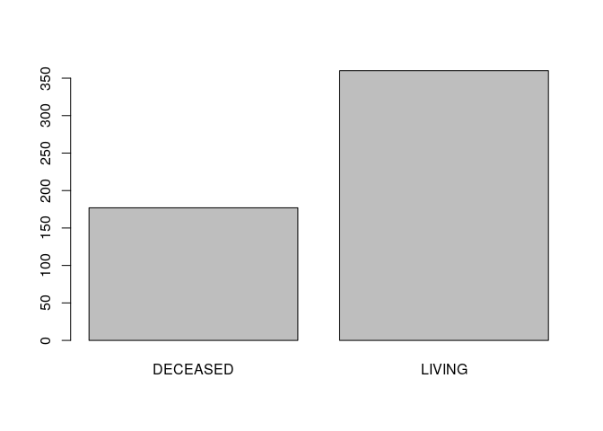
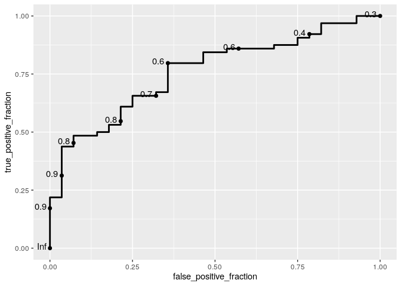

A logistic regression analysis of TCGA-KIRC
================

This project contains a pipeline of clinical analysis of the Cancer
Genome Atlas Kidney Renal Clear Cell Carcinoma (TCGA-KIRC) data of
patients from [Genomic Data Commons Data
Portal](https://portal.gdc.cancer.gov/exploration?filters=%7B%22op%22%3A%22and%22%2C%22content%22%3A%5B%7B%22op%22%3A%22in%22%2C%22content%22%3A%7B%22field%22%3A%22cases.project.project_id%22%2C%22value%22%3A%5B%22TCGA-KIRC%22%5D%7D%7D%5D%7D)
and [cBioPortal](https://www.cbioportal.org/study/summary?id=kirp_tcga).

Previously, we presented a [An exploratory preprocessing
analysis](1.preprocessing.md), and [a correlation
analysis](2.correlation.md).

In this final section, we present a logistic regression analysis of each
clinical variable weight for TCGA-KIRC.

    # Set the packages of interest
    packages = c("tidyverse","skimr","finalfit", "caret", "ggplot2", "plotROC",  "gapminder", "ggstatsplot")

    # if a package is installed, it will be loaded
    # otherwise, the missing package(s) will be installed and loaded
    package.check <- lapply(packages, FUN = function(x) {
      if (!require(x, character.only = TRUE)) {
        install.packages(x, dependencies = TRUE)
        library(x, character.only = TRUE)
      }
    })

    suppressMessages(library("tidyverse"))
    rm(packages)
    setwd(".")

1. Importing data
-----------------

2. Taming data and selecting numeric and categorical columns
------------------------------------------------------------

    kirc_clin <- kirc_clin %>%
      mutate_if(is.character, as.factor) %>%
      mutate(patient_id = as.character(patient_id),
             age = as.integer(age),
             year_diagnose = as.integer(year_diagnose))

    cols_numeric <- kirc_clin %>% select_if(is.numeric) %>% names

    # Removing dependent variable with high correlation: over_surv_mth, disease_free_mth and year_diagnose
    cols_numeric <- setdiff(cols_numeric,  c("over_surv_mth", "disease_free_mth"))
     
    cols_categorical <- kirc_clin %>% select_if(is.factor) %>% names
    cols_categorical <- setdiff(cols_categorical,  "over_surv_stt") 

    plot(kirc_clin$over_surv_stt)

<!-- -->

3. Creating training and test data 70-30 split
----------------------------------------------

    set.seed(123)

    df <- data.frame(kirc_clin)

    trainIndex <- createDataPartition(df$over_surv_stt, p = .7, 
                                      list = FALSE, 
                                      times = 1)
    dtrain<-df[trainIndex,]
    dtest<-df[-trainIndex,]

4. Modeling: Logistic regression for numerical values with 10 fold cross validation
-----------------------------------------------------------------------------------

    fitControl <- trainControl(## 10-fold CV
      method = "cv",
      number = 10,
      savePredictions = TRUE
    )

    ## Logistic regression
    lreg<-train(x = dtrain[,c(cols_numeric)],
                y = dtrain[,"over_surv_stt"], 
                method="glm",
                family=binomial(),
                trControl=fitControl)
    lreg

    ## Generalized Linear Model 
    ## 
    ## 376 samples
    ##   7 predictor
    ##   2 classes: 'DECEASED', 'LIVING' 
    ## 
    ## No pre-processing
    ## Resampling: Cross-Validated (10 fold) 
    ## Summary of sample sizes: 339, 338, 339, 338, 339, 338, ... 
    ## Resampling results:
    ## 
    ##   Accuracy   Kappa    
    ##   0.7263719  0.3214904

    varImp(lreg)

    ## glm variable importance
    ## 
    ##                   Overall
    ## year_diagnose     100.000
    ## age                77.971
    ## second_long_dim    45.325
    ## long_dim           15.954
    ## mutation_cnt       14.574
    ## short_dim           4.194
    ## frac_genome_alter   0.000

    lreg_pred<-predict(lreg,dtest)
    confusionMatrix(lreg_pred,dtest$over_surv_stt)

    ## Confusion Matrix and Statistics
    ## 
    ##           Reference
    ## Prediction DECEASED LIVING
    ##   DECEASED       14      9
    ##   LIVING         34     74
    ##                                           
    ##                Accuracy : 0.6718          
    ##                  95% CI : (0.5843, 0.7512)
    ##     No Information Rate : 0.6336          
    ##     P-Value [Acc > NIR] : 0.2080726       
    ##                                           
    ##                   Kappa : 0.2058          
    ##                                           
    ##  Mcnemar's Test P-Value : 0.0002522       
    ##                                           
    ##             Sensitivity : 0.2917          
    ##             Specificity : 0.8916          
    ##          Pos Pred Value : 0.6087          
    ##          Neg Pred Value : 0.6852          
    ##              Prevalence : 0.3664          
    ##          Detection Rate : 0.1069          
    ##    Detection Prevalence : 0.1756          
    ##       Balanced Accuracy : 0.5916          
    ##                                           
    ##        'Positive' Class : DECEASED        
    ## 

5. Removing all nas of dataset
------------------------------

    set.seed(123)

    kirc_clin.nona <- data.frame(kirc_clin %>% drop_na() )


    trainIndex <- createDataPartition(df$over_surv_stt, p = .7, 
                                      list = FALSE, 
                                      times = 1)
    dtrain<-kirc_clin.nona[trainIndex,]
    dtest<-kirc_clin.nona[-trainIndex,]

    fitControl <- trainControl(## 10-fold CV
      method = "cv",
      number = 10,
      savePredictions = FALSE
    )

    ## Logistic regression
    lreg <- train(over_surv_stt ~.,
            data = kirc_clin.nona[ , c(cols_numeric,  cols_categorical,  "over_surv_stt")],
                method="glm",
                family=binomial(),
                trControl=fitControl)

    ## Warning: glm.fit: algorithm did not converge

    ## Warning: glm.fit: fitted probabilities numerically 0 or 1 occurred

    ## Warning in predict.lm(object, newdata, se.fit, scale = 1, type = if (type == :
    ## prediction from a rank-deficient fit may be misleading

    ## Warning: glm.fit: algorithm did not converge

    ## Warning: glm.fit: fitted probabilities numerically 0 or 1 occurred

    ## Warning in predict.lm(object, newdata, se.fit, scale = 1, type = if (type == :
    ## prediction from a rank-deficient fit may be misleading

    ## Warning: glm.fit: algorithm did not converge

    ## Warning: glm.fit: fitted probabilities numerically 0 or 1 occurred

    ## Warning in predict.lm(object, newdata, se.fit, scale = 1, type = if (type == :
    ## prediction from a rank-deficient fit may be misleading

    ## Warning: glm.fit: algorithm did not converge

    ## Warning: glm.fit: fitted probabilities numerically 0 or 1 occurred

    ## Warning in predict.lm(object, newdata, se.fit, scale = 1, type = if (type == :
    ## prediction from a rank-deficient fit may be misleading

    ## Warning: glm.fit: algorithm did not converge

    ## Warning: glm.fit: fitted probabilities numerically 0 or 1 occurred

    ## Warning in predict.lm(object, newdata, se.fit, scale = 1, type = if (type == :
    ## prediction from a rank-deficient fit may be misleading

    ## Warning: glm.fit: algorithm did not converge

    ## Warning: glm.fit: fitted probabilities numerically 0 or 1 occurred

    ## Warning in predict.lm(object, newdata, se.fit, scale = 1, type = if (type == :
    ## prediction from a rank-deficient fit may be misleading

    ## Warning: glm.fit: algorithm did not converge

    ## Warning: glm.fit: fitted probabilities numerically 0 or 1 occurred

    ## Warning in predict.lm(object, newdata, se.fit, scale = 1, type = if (type == :
    ## prediction from a rank-deficient fit may be misleading

    ## Warning: glm.fit: algorithm did not converge

    ## Warning: glm.fit: fitted probabilities numerically 0 or 1 occurred

    ## Warning in predict.lm(object, newdata, se.fit, scale = 1, type = if (type == :
    ## prediction from a rank-deficient fit may be misleading

    ## Warning: glm.fit: algorithm did not converge

    ## Warning: glm.fit: fitted probabilities numerically 0 or 1 occurred

    ## Warning in predict.lm(object, newdata, se.fit, scale = 1, type = if (type == :
    ## prediction from a rank-deficient fit may be misleading

    ## Warning: glm.fit: algorithm did not converge

    ## Warning: glm.fit: fitted probabilities numerically 0 or 1 occurred

    ## Warning in predict.lm(object, newdata, se.fit, scale = 1, type = if (type == :
    ## prediction from a rank-deficient fit may be misleading

    ## Warning: glm.fit: algorithm did not converge

    ## Warning: glm.fit: fitted probabilities numerically 0 or 1 occurred

    lreg

    ## Generalized Linear Model 
    ## 
    ## 136 samples
    ##  25 predictor
    ##   2 classes: 'DECEASED', 'LIVING' 
    ## 
    ## No pre-processing
    ## Resampling: Cross-Validated (10 fold) 
    ## Summary of sample sizes: 122, 122, 123, 122, 122, 122, ... 
    ## Resampling results:
    ## 
    ##   Accuracy   Kappa    
    ##   0.8093407  0.5263482

    varImp(lreg)

    ## glm variable importance
    ## 
    ##   only 20 most important variables shown (out of 36)
    ## 
    ##                                       Overall
    ## serum_caLow                            100.00
    ## `raceBlack/African.american`            50.55
    ## serum_caNormal                          44.38
    ## person_neoplasm_sttWith.Tumor           44.33
    ## genderMale                              42.34
    ## `ethnicitynot hispanic/latino`          37.62
    ## second_long_dim                         37.60
    ## hemoglobinLow                           35.28
    ## wbcLow                                  33.71
    ## age                                     32.22
    ## `disease_free_sttRecurred/Progressed`   31.06
    ## plateletLow                             30.17
    ## year_diagnose                           29.69
    ## long_dim                                20.92
    ## `neoplasm_stgStage II`                  20.77
    ## short_dim                               18.71
    ## prior_cancerYes                         18.23
    ## tumor_lateralLeft                       17.88
    ## histology_grdG2                         16.94
    ## plateletNormal                          13.90

    fit<-glm(over_surv_stt ~.,
            data = kirc_clin[ , c(cols_numeric, cols_categorical, "over_surv_stt")],
            family = "binomial")

    ## Warning: glm.fit: algorithm did not converge

    ## Warning: glm.fit: fitted probabilities numerically 0 or 1 occurred

    varImp(fit)

<div data-pagedtable="false">

<script data-pagedtable-source type="application/json">
{"columns":[{"label":[""],"name":["_rn_"],"type":[""],"align":["left"]},{"label":["Overall"],"name":[1],"type":["dbl"],"align":["right"]}],"data":[{"1":"3.310492e-04","_rn_":"age"},{"1":"1.202168e-05","_rn_":"frac_genome_alter"},{"1":"3.052589e-04","_rn_":"year_diagnose"},{"1":"2.155237e-04","_rn_":"long_dim"},{"1":"9.540010e-05","_rn_":"mutation_cnt"},{"1":"1.928965e-04","_rn_":"short_dim"},{"1":"3.861203e-04","_rn_":"second_long_dim"},{"1":"3.912355e-05","_rn_":"metastasis_stgM1"},{"1":"5.507757e-05","_rn_":"lymph_stgN1"},{"1":"1.287786e-04","_rn_":"lymph_stgNX"},{"1":"2.139504e-04","_rn_":"neoplasm_stgStage II"},{"1":"1.474251e-06","_rn_":"neoplasm_stgStage III"},{"1":"8.480976e-05","_rn_":"tumor_stgT2"},{"1":"3.883395e-05","_rn_":"tumor_stgT3"},{"1":"3.191804e-04","_rn_":"disease_free_sttRecurred/Progressed"},{"1":"3.862977e-04","_rn_":"ethnicitynot hispanic/latino"},{"1":"1.747827e-04","_rn_":"histology_grdG2"},{"1":"1.085665e-04","_rn_":"histology_grdG3"},{"1":"1.369716e-04","_rn_":"histology_grdG4"},{"1":"3.623548e-04","_rn_":"hemoglobinLow"},{"1":"9.789188e-05","_rn_":"hemoglobinNormal"},{"1":"1.297521e-04","_rn_":"neoadj_therapyYes"},{"1":"1.879775e-04","_rn_":"prior_cancerYes"},{"1":"1.844274e-04","_rn_":"tumor_lateralRight"},{"1":"3.101140e-04","_rn_":"plateletLow"},{"1":"1.436674e-04","_rn_":"plateletNormal"},{"1":"5.185653e-04","_rn_":"raceWhite"},{"1":"1.024504e-03","_rn_":"serum_caLow"},{"1":"4.554816e-04","_rn_":"serum_caNormal"},{"1":"4.345742e-04","_rn_":"genderMale"},{"1":"1.277753e-04","_rn_":"tissue_siteB"},{"1":"5.735315e-05","_rn_":"tissue_siteC"},{"1":"2.913930e-05","_rn_":"tissue_siteOTHERS"},{"1":"4.549633e-04","_rn_":"person_neoplasm_sttWith.Tumor"},{"1":"3.463557e-04","_rn_":"wbcLow"},{"1":"6.086377e-05","_rn_":"wbcNormal"}],"options":{"columns":{"min":{},"max":[10]},"rows":{"min":[10],"max":[10]},"pages":{}}}
  </script>

</div>

    lreg_pred<-predict(lreg,dtest)

    ## Warning in predict.lm(object, newdata, se.fit, scale = 1, type = if (type == :
    ## prediction from a rank-deficient fit may be misleading

    confusionMatrix(lreg_pred,dtest$over_surv_stt)

    ## Confusion Matrix and Statistics
    ## 
    ##           Reference
    ## Prediction DECEASED LIVING
    ##   DECEASED       10      0
    ##   LIVING          0     34
    ##                                      
    ##                Accuracy : 1          
    ##                  95% CI : (0.9196, 1)
    ##     No Information Rate : 0.7727     
    ##     P-Value [Acc > NIR] : 1.183e-05  
    ##                                      
    ##                   Kappa : 1          
    ##                                      
    ##  Mcnemar's Test P-Value : NA         
    ##                                      
    ##             Sensitivity : 1.0000     
    ##             Specificity : 1.0000     
    ##          Pos Pred Value : 1.0000     
    ##          Neg Pred Value : 1.0000     
    ##              Prevalence : 0.2273     
    ##          Detection Rate : 0.2273     
    ##    Detection Prevalence : 0.2273     
    ##       Balanced Accuracy : 1.0000     
    ##                                      
    ##        'Positive' Class : DECEASED   
    ## 

    df.nona <- dtrain %>% drop_na()

    fit<-glm(over_surv_stt ~.,
            data = df.nona[ , c(cols_numeric, "over_surv_stt")],
            family = "binomial")

    df_roc <- data.frame(Survival = df.nona$over_surv_stt, Prob = fit$fitted.values)
    ggplot(df_roc, aes(d = Survival, m = Prob)) + geom_roc()

    ## Warning in verify_d(data$d): D not labeled 0/1, assuming DECEASED = 0 and LIVING
    ## = 1!

<!-- -->

<!-- # Regression plots with finalfit -->
<!-- ```{r} -->
<!-- explanatory = c(cols_numeric, cols_categorical) -->
<!-- dependent = 'over_surv_stt' -->
<!-- kirc_clin %>% -->
<!--   or_plot(dependent, explanatory) -->
<!-- ``` -->
<!-- ```{r} -->
<!-- explanatory = c(cols_numeric, cols_categorical) -->
<!-- dependent = 'over_surv_stt' -->
<!-- kirc_clin.nona %>% -->
<!--   or_plot(dependent, explanatory) -->
<!-- ``` -->
<!-- ```{r} -->
<!-- mod <- stats::lm(formula = over_surv_stt ~ ., data = kirc_clin[ , c(cols_numeric, "over_surv_stt")]) -->
<!-- # plot -->
<!-- ggstatsplot::ggcoefstats(mod) -->
<!-- ``` -->
<!-- ```{r} -->
<!-- fit<-glm(over_surv_stt ~., -->
<!--         data = kirc_clin[ , c(cols_numeric, "over_surv_stt")], -->
<!--         family = "binomial") -->
<!-- ggstatsplot::ggcoefstats( -->
<!--   x = fit, -->
<!--   #point.args = list(color = "red", size = 3, shape = 15), -->
<!--   #vline.args = list(size = 1, color = "#CC79A7", linetype = "dotdash"), -->
<!--   #stats.label.color = c("#0072B2", "#D55E00", "darkgreen"), -->
<!--   title = "Regression model", -->
<!--   #ggtheme = hrbrthemes::theme_ipsum_ps(), -->
<!--   #ggstatsplot.layer = FALSE -->
<!-- ) #+ # note the order in which the labels are entered -->
<!--   #ggplot2::scale_y_discrete(labels = c("DECEASED", "LIVING")) + -->
<!--   #ggplot2::labs(x = "regression coefficient", y = NULL) -->
<!-- ``` -->
<!-- ```{r} -->
<!-- dependent_os = "Surv(over_surv_mth, over_surv_stt)" -->
<!-- explanatory = c("tumor_stg") -->
<!-- kirc_clin %>%  -->
<!--     surv_plot(kirc_clin.nona, explanatory, pval = TRUE) -->
<!-- #> Warning: Vectorized input to `element_text()` is not officially supported. -->
<!-- #> Results may be unexpected or may change in future versions of ggplot2. -->
<!-- ``` -->

    sessionInfo()

    ## R version 4.0.3 (2020-10-10)
    ## Platform: x86_64-pc-linux-gnu (64-bit)
    ## Running under: Ubuntu 18.04.5 LTS
    ## 
    ## Matrix products: default
    ## BLAS:   /usr/lib/x86_64-linux-gnu/openblas/libblas.so.3
    ## LAPACK: /usr/lib/x86_64-linux-gnu/libopenblasp-r0.2.20.so
    ## 
    ## locale:
    ##  [1] LC_CTYPE=pt_BR.UTF-8       LC_NUMERIC=C              
    ##  [3] LC_TIME=pt_BR.UTF-8        LC_COLLATE=en_US.UTF-8    
    ##  [5] LC_MONETARY=pt_BR.UTF-8    LC_MESSAGES=en_US.UTF-8   
    ##  [7] LC_PAPER=pt_BR.UTF-8       LC_NAME=C                 
    ##  [9] LC_ADDRESS=C               LC_TELEPHONE=C            
    ## [11] LC_MEASUREMENT=pt_BR.UTF-8 LC_IDENTIFICATION=C       
    ## 
    ## attached base packages:
    ## [1] stats     graphics  grDevices utils     datasets  methods   base     
    ## 
    ## other attached packages:
    ##  [1] ggstatsplot_0.6.1 gapminder_0.3.0   plotROC_2.2.1     caret_6.0-86     
    ##  [5] lattice_0.20-41   finalfit_1.0.2    skimr_2.1.2       forcats_0.5.0    
    ##  [9] stringr_1.4.0     dplyr_1.0.2       purrr_0.3.4       readr_1.4.0      
    ## [13] tidyr_1.1.2       tibble_3.0.3      ggplot2_3.3.2     tidyverse_1.3.0  
    ## 
    ## loaded via a namespace (and not attached):
    ##   [1] tidyselect_1.1.0          lme4_1.1-23              
    ##   [3] grid_4.0.3                gmp_0.6-1                
    ##   [5] pROC_1.16.2               munsell_0.5.0            
    ##   [7] codetools_0.2-16          effectsize_0.3.3         
    ##   [9] statmod_1.4.34            miniUI_0.1.1.1           
    ##  [11] withr_2.3.0               Brobdingnag_1.2-6        
    ##  [13] metaBMA_0.6.3             colorspace_1.4-1         
    ##  [15] knitr_1.30                rstudioapi_0.11          
    ##  [17] stats4_4.0.3              DescTools_0.99.38        
    ##  [19] ipmisc_4.0.0              ggsignif_0.6.0           
    ##  [21] rcompanion_2.3.25         labeling_0.3             
    ##  [23] rstan_2.21.2              repr_1.1.0               
    ##  [25] bbmle_1.0.23.1            farver_2.0.3             
    ##  [27] bridgesampling_1.0-0      TH.data_1.0-10           
    ##  [29] coda_0.19-4               vctrs_0.3.4              
    ##  [31] generics_0.0.2            tidyBF_0.3.0             
    ##  [33] metafor_2.4-0             ipred_0.9-9              
    ##  [35] xfun_0.18                 BWStest_0.2.2            
    ##  [37] R6_2.4.1                  BayesFactor_0.9.12-4.2   
    ##  [39] logspline_2.1.16          reshape_0.8.8            
    ##  [41] assertthat_0.2.1          promises_1.1.1           
    ##  [43] scales_1.1.1              multcomp_1.4-14          
    ##  [45] nnet_7.3-14               ggExtra_0.9              
    ##  [47] rootSolve_1.8.2.1         gtable_0.3.0             
    ##  [49] multcompView_0.1-8        processx_3.4.4           
    ##  [51] lmom_2.8                  sandwich_3.0-0           
    ##  [53] timeDate_3043.102         rlang_0.4.7              
    ##  [55] MatrixModels_0.4-1        EMT_1.1                  
    ##  [57] zeallot_0.1.0             PMCMRplus_1.5.1          
    ##  [59] splines_4.0.3             TMB_1.7.18               
    ##  [61] ModelMetrics_1.2.2.2      inline_0.3.16            
    ##  [63] broom_0.7.1               yaml_2.2.1               
    ##  [65] reshape2_1.4.4            abind_1.4-5              
    ##  [67] modelr_0.1.8              backports_1.1.10         
    ##  [69] httpuv_1.5.4              tools_4.0.3              
    ##  [71] lava_1.6.8                ellipsis_0.3.1           
    ##  [73] WRS2_1.1-0                ez_4.4-0                 
    ##  [75] Rcpp_1.0.5                plyr_1.8.6               
    ##  [77] base64enc_0.1-3           prettyunits_1.1.1        
    ##  [79] ps_1.3.4                  rpart_4.1-15             
    ##  [81] pbapply_1.4-3             cowplot_1.1.0            
    ##  [83] correlation_0.4.0         zoo_1.8-8                
    ##  [85] LaplacesDemon_16.1.4      haven_2.3.1              
    ##  [87] ggrepel_0.8.2             fs_1.5.0                 
    ##  [89] magrittr_1.5              data.table_1.13.0        
    ##  [91] openxlsx_4.2.2            lmtest_0.9-38            
    ##  [93] reprex_0.3.0              mvtnorm_1.1-1            
    ##  [95] broomExtra_4.0.6          matrixStats_0.57.0       
    ##  [97] hms_0.5.3                 mime_0.9                 
    ##  [99] evaluate_0.14             xtable_1.8-4             
    ## [101] rio_0.5.16                pairwiseComparisons_3.0.0
    ## [103] broom.mixed_0.2.6         readxl_1.3.1             
    ## [105] rstantools_2.1.1          gridExtra_2.3            
    ## [107] compiler_4.0.3            bdsmatrix_1.3-4          
    ## [109] mice_3.11.0               V8_3.2.0                 
    ## [111] crayon_1.3.4              StanHeaders_2.21.0-6     
    ## [113] minqa_1.2.4               htmltools_0.5.0          
    ## [115] mgcv_1.8-33               mc2d_0.1-18              
    ## [117] later_1.1.0.1             libcoin_1.0-6            
    ## [119] expm_0.999-5              RcppParallel_5.0.2       
    ## [121] Exact_2.1                 lubridate_1.7.9          
    ## [123] DBI_1.1.0                 SuppDists_1.1-9.5        
    ## [125] kSamples_1.2-9            dbplyr_1.4.4             
    ## [127] MASS_7.3-53               boot_1.3-25              
    ## [129] Matrix_1.2-18             car_3.0-10               
    ## [131] cli_2.0.2                 parallel_4.0.3           
    ## [133] insight_0.9.6             gower_0.2.2              
    ## [135] pkgconfig_2.0.3           metaplus_0.7-11          
    ## [137] statsExpressions_0.5.1    numDeriv_2016.8-1.1      
    ## [139] coin_1.3-1                foreign_0.8-79           
    ## [141] recipes_0.1.14            xml2_1.3.2               
    ## [143] paletteer_1.2.0           foreach_1.5.0            
    ## [145] ggcorrplot_0.1.3          prodlim_2019.11.13       
    ## [147] rvest_0.3.6               callr_3.4.4              
    ## [149] digest_0.6.25             parameters_0.8.6         
    ## [151] fastGHQuad_1.0            rmarkdown_2.4            
    ## [153] cellranger_1.1.0          nortest_1.0-4            
    ## [155] gld_2.6.2                 curl_4.3                 
    ## [157] modeltools_0.2-23         shiny_1.5.0              
    ## [159] gtools_3.8.2              nloptr_1.2.2.2           
    ## [161] lifecycle_0.2.0           nlme_3.1-149             
    ## [163] jsonlite_1.7.1            carData_3.0-4            
    ## [165] fansi_0.4.1               pillar_1.4.6             
    ## [167] loo_2.3.1                 pkgbuild_1.1.0           
    ## [169] fastmap_1.0.1             httr_1.4.2               
    ## [171] survival_3.2-7            glue_1.4.2               
    ## [173] bayestestR_0.7.2          zip_2.1.1                
    ## [175] iterators_1.0.12          class_7.3-17             
    ## [177] stringi_1.5.3             performance_0.5.0        
    ## [179] rematch2_2.1.2            blob_1.2.1               
    ## [181] memoise_1.1.0             Rmpfr_0.8-1              
    ## [183] e1071_1.7-3
